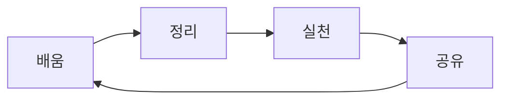

# 📚 나만의 지식 놀이터 🎪

<div align="center">


**"배운 것을 나누면 기쁨이 두 배!"**  
제가 공부한 다양한 지식들과 깨달음을 재미있게 공유하는 공간입니다 🎯

[🌱 공부 기록](#-공부-기록-보관함) • [🎪 체험관](#-지식-체험관) • [🤝 함께하기](#-함께-성장하기) • [📊 학습통계](#-학습-통계)

</div>

---

## 🎉 안녕하세요, 지식 탐험가님!

```javascript
const aboutMe = {
  name: "지식 공유자",
  motto: "배움 → 공유 → 성장",
  currentStatus: "🌱 꾸준히 성장하는 중",
  favoriteTopics: ["개발", "디자인", "사고력", "창의성"],
  learningStyle: "이해한 것을 재미있게 설명하기",
}
```

---

## 🌈 공부 기록 보관함

### 🎯 최근에 공부한 주제들

| 카테고리  | 주제               | 재미지수   | 난이도   |
| --------- | ------------------ | ---------- | -------- |
| 🐍 Python | 알고리즘 최적화    | ⭐⭐⭐⭐   | 🟡🟡⚪   |
| 🎨 UI/UX  | 사용자 경험 디자인 | ⭐⭐⭐⭐⭐ | 🟡🟡🟡   |
| 🧠 심리학 | 학습 동기 부여     | ⭐⭐⭐⭐   | 🟡⚪⚪   |
| 🌐 Web    | PWA 개발           | ⭐⭐⭐     | 🟡🟡🟡🟡 |

### 📂 주제별 보관함

```
📦 knowledge-base
├── 🗂️ programming/
│   ├── 🐍 python/
│   ├── ☕ java/
│   └── 🌐 web/
├── 🗂️ design/
│   ├── 🎨 ui-ux/
│   ├── 🎯 branding/
│   └── 🎮 interaction/
├── 🗂️ thinking/
│   ├── 🧠 problem-solving/
│   ├── 💡 creativity/
│   └── 📊 decision-making/
└── 🗂️ life/
    ├── 🌱 self-development/
    ├── ⏰ productivity/
    └── 💬 communication/
```

---

## 🎪 지식 체험관

### 🎮 인터랙티브 학습 경험

````markdown
# 오늘의 미니 퀴즈! 🎯

**Q: 파이썬에서 리스트를 뒤집는 방법은?**

- [ ] list.reverse()
- [ ] list.flip()
- [ ] list.backwards()

<details>
<summary>정답 보기</summary>
  
**답: list.reverse()** ✅
  
```python
my_list = [1, 2, 3]
my_list.reverse()
print(my_list)  # [3, 2, 1]
````

</details>
```

### 🎨 시각적으로 이해하기


**제 학습 법칙:**  
"가르치는 만큼 더 깊이 이해한다"

---

## 📖 인기 있는 학습 노트

### 🏆 가장 많이 읽은 글

1. **[[Python] 파이썬 꿀팁 10가지](programming/python/python-tips.md)** 👑
2. **[[UI/UX] 사용자를 사로잡는 디자인 원리](design/ui-ux/design-principles.md)**
3. **[[생각] 문제 해결을 위한 5단계 접근법](thinking/problem-solving/5-steps.md)**

### ✨ 특별 시리즈

- **"하루에 하나씩"** - 매일 작은 지식 공유
- **"왜 이렇게 했을까?"** - 기술적 결정 과정 분석
- **"실패 일지"** - 배운 점이 많은 실패 경험 공유

---

## 🎯 학습 방법론

### 🔁 나만의 학습 사이클



### 📝 노작 필기법

1. **들어보기** - 처음 접하는 개념 수용
2. **적어보기** - 내 방식으로 재해석
3. **말해보기** - 다른 사람에게 설명
4. **고쳐보기** - 피드백 반영하여 개선

---

## 🤝 함께 성장하기

### 💬 여러분도 참여해보세요!

```
💡 아이디어가 있나요? → Issue 생성
📝 내용을 추가하고 싶나요? → Pull Request
🐛 오류를 발견했나요? → Issue 보고
🎉 그냥 응원하고 싶나요? → ⭐ Star 눌러주기
```

### 🏆 기여자 명예의 전당

| 이름          | 기여 내용      | 보상 |
| ------------- | -------------- | ---- |
| @friend1      | 오타 수정 10건 | 🥇   |
| @collaborator | 새 섹션 추가   | 🎨   |
| @reviewer     | 유용한 피드백  | 👏   |

---

## 📊 학습 통계

### 📈 지식 성장 그래프

```bash
지식 공유 현황:
- 총 게시글: 127개
- 평균 주간 학습 시간: 15시간
- 가장 많이 공부한 시간대: 🦉 오후 10시-12시
- 선호 학습 환경: ☕ 카페 + 🎧 재즈

이번 달 목표:
- [x] Python 심화 내용 정리
- [ ] React Native 학습 시작
- [ ] Design System 연구
- [ ] 3명과 지식 교환
```

### 🎯 학습 로드맵

```mermaid
timeline
    title 2024 학습 여정
    section 1분기 : 기초 다지기
        Python 심화 : 2월
        알고리즘 마스터 : 3월
    section 2분기 : 확장하기
        React 심화 : 4월
        DB 설계 : 5월
    section 3분기 : 적용하기
        사이드 프로젝트 : 7월
        오픈소스 기여 : 8월
    section 4분기 : 나누기
        기술 블로그 : 10월
        멘토링 시작 : 11월
```

---

## 🎁 특별 선물

### 🎊 보물상자 오픈!

여기까지 오신 여러분을 위한 특별 선물입니다:

```python
# 나만의 학습 파이프라인
def learning_pipeline(topic):
    print(f"🎯 {topic} 학습 시작!")
    resources = find_best_resources(topic)
    notes = create_visual_notes(resources)
    share_with_community(notes)
    return "성장! 🚀"

learning_pipeline("새로운 기술")
```

---

<div align="center">


**함께 배우고, 함께 성장해요!**  
여러분의 학습 여정도 응원합니다 ✨

[📬 연락하기](mailto:learner@example.com) • [🌐 블로그](https://blog.example.com) • [💼 포트폴리오](https://portfolio.example.com)

</div>

---

> **💡 마지막 팁:** 배운 것을 정리하고 공유하는 습관이  
> **가장 강력한 학습 무기**가 될 거예요! 함께해요 🚀
