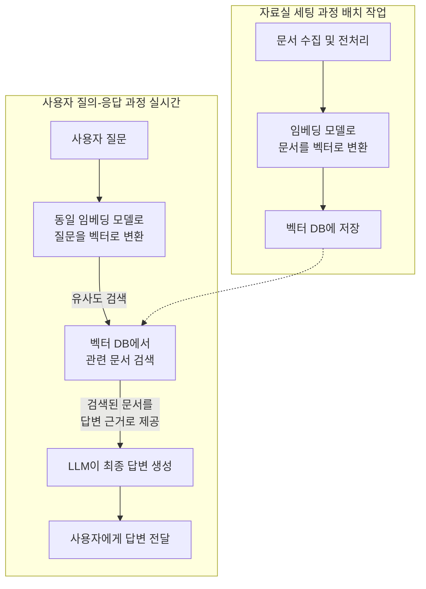

## **RAG(랙) 구축 완벽 가이드: 초보자를 위한 친절한 설명서**

### **목차**

1.  [RAG가 뭔가요? 쉬운 비유로 이해하기](#1-rag가-뭔가요-쉬운-비유로-이해하기)
2.  [왜 RAG가 필요할까요?](#2-왜-rag가-필요할까요)
3.  [RAG를 구축하려면 무엇이 필요할까요? (준비물)](#3-rag를-구축하려면-무엇이-필요할까요-준비물)
4.  [RAG 구축 5단계: 따라만 하면 됩니다!](#4-rag-구축-5단계-따라만-하면-됩니다)
5.  [어떤 도구들을 사용하면 좋을까요?](#5-어떤-도구들을-사용하면-좋을까요)

---

### **1. RAG가 뭔가요? 쉬운 비유로 이해하기**

**RAG(Retrieval-Augmented Generation)** 는 **"정보 검색(Retrieval) + 답변 생성(Generation)"** 을 합친 기술입니다.

- **`R`(Retrieval - 검색)**: 방대한 문서 더미에서 **질문과 관련된 정보를 찾아오는** 단계
- **`AG`(Augmented Generation - 향상된 생성)**: 찾아온 정보를 바탕으로 **LLM이 정확한 답변을 생성하는** 단계

#### **🛎️ 쉬운 비유: 열심히 하는 비서님**

여러분에게 **`A`** 와 **`B`** , 두 명의 비서가 있다고 상상해보세요.

- **비서 A (일반적인 LLM)**: 머리가 엄청 좋아서 수많은 책을 읽었습니다. 하지만 가끔 **잊어버리거나, 최신 정보를 모를 때가 있습니다.** 그리고 가끔 **"있어 보이는" 말을 지어내기도(Hallucination) 합니다.**
- _"2024년 한국 축구 국가대표팀 감독이 누구예요?"_
- _"음... 클린스만... 인가? 아니면 홍명보...? (확신 없음 또는 잘못된 답변)"_

- **비서 B (RAG를 사용하는 LLM)**: 비서 A만큼 머리는 좋지만, **옆에 완벽한 자료실이 있습니다.** 여러분이 질문하면,

1.  먼저 **자료실(DB)로 뛰어가서** 최신 뉴스, 회사 문서, 보고서 등 **관련 자료를 찾아옵니다. (Retrieval)**
2.  찾아온 자료를 비서 A에게 건네주면서 **"자, 이 자료 보면서 답변해"** 라고 합니다.
3.  비서 A는 **정확한 자료를 바탕으로** 자신있게 답변합니다. **(Augmented Generation)**

- _"2024년 한국 축구 국가대표팀 감독이 누구예요?"_
- _"(자료실에서 '2024년 3월, 대한축구협회, 황선홍 감독 선임' 기사를 찾아옴)"_
- _"네, 2024년 현재 한국 축구 국가대표팀 감독은 황선홍 감독입니다. 관련 기사 내용은 다음과 같습니다..."_

**결론: RAG는 LLM에게 '정확한 자료'를 먼저 찾아주어 더 신뢰할 수 있는 답변을 만들게 해주는 '똑똑한 비서 시스템'입니다.**

---

### **2. 왜 RAG가 필요할까요?**

일반적인 LLM(예: ChatGPT)의 **단점을 해결**해 줍니다.

1.  **최신 정보 부족**: LLM은 학습이 끊긴 시점의 데이터만 알고 있습니다. RAG는 실시간 문서를 제공해 최신 정보로 답변하게 합니다.
2.  **망상(Hallucination)**: 없는 사실을 지어낼 때가 있습니다. RAG는 **'근거 자료'** 를 제공해 이를 방지합니다.
3.  **내부 정보 활용 불가**: 회사의 매뉴얼, 계약서, 메일 등 **비공개 문서를 LLM이 알지 못합니다.** RAG는 이 내부 문서들을 자료실에 넣어 활용하게 합니다.
4.  **투명성과 신뢰성**: 답변의 출처(어떤 문서의 몇 페이지)를 제공해 **"왜 그렇게 답변했는지"** 확인이 가능합니다.

---

### **3. RAG를 구축하려면 무엇이 필요할까요? (준비물)**

크게 4가지 구성 요소가 필요합니다.

1.  **지식(Knowledge) / 문서 데이터**: 답변의 근거가 될 **내부 문서들** (PDF, HWP, Word, Excel, PPT, 웹페이지, DB 등)
2.  **임베딩 모델(Embedding Model)**: 문서의 **'의미'를 숫자로 변환**해주는 AI. 비유하자면 **'문서를 컴퓨터가 이해할 수 있는 바코드(벡터)로 만들어주는 스캐너'** 입니다.
3.  **벡터 데이터베이스(Vector DB)**: 그 '바코드(벡터)'들을 **저장하고, 빠르게 검색할 수 있는** 특별한 DB. **'초고속 정리된 자료실'** 이라고 생각하세요.
4.  **LLM(Large Language Model)**: 최종적으로 **답변을 생성하는** AI. (예: GPT-4, Claude, Llama2 등)

---

### **4. RAG 구축 5단계: 따라만 하면 됩니다!**

전체 과정은 **'자료실 세팅'** 과 **'질문-답변'** 두 파트로 나눌 수 있습니다.



#### **파트 1: 자료실 세팅 (한번 해두면 계속 사용)**

**1단계: 문서 수집 및 전처리**

- **하는 일**: PDF, Word 등 다양한 형식의 문서를 **텍스트만 뽑아내서** 정리합니다.
- **세부 작업**:
- **텍스트 추출**: 문서에서 글자만 뽑아냅니다.
- **쪼개기(Chunking)**: 100페이지짜리 문서를 통째로 넣으면 효율이 나쁩니다. **의미가 통하는 단위(예: 3~5문단씩)** 로 잘라줍니다. 이게 **자료실의 한 장 한 장**이 됩니다.
- **정제**: 불필요한 공백, 특수문자를 정리합니다.

**2단계: 문서를 숫자(벡터)로 변환 (임베딩)**

- **하는 일**: 쪼개놓은 텍스트 조각들을 **임베딩 모델**에 넣어 **숫자 나열(벡터)** 로 변환합니다. 의미가 비슷한 문서들은 비슷한 숫자 값을 가집니다.

**3단계: 벡터 데이터베이스에 저장**

- **하는 일**: 변환된 숫자들(벡터)과 원본 텍스트를 **벡터 DB**에 짝지어 저장합니다. 이제 **'의미 기반'으로 검색할 수 있는 자료실**이 완성되었습니다.

#### **파트 2: 질문-답변 (사용자가 질문할 때마다 진행)**

**4단계: 질문을 숫자(벡터)로 변환 및 검색**

- **하는 일**: 사용자의 질문도 **똑같은 임베딩 모델**을 이용해 숫자(벡터)로 변환합니다.
- 그런 다음, **벡터 DB에서** 이 질문의 벡터와 **가장 유사한 벡터(즉, 가장 관련성 높은 문서)** 를 찾아서 그 **원본 텍스트를 꺼내옵니다.**

**5단계: LLM이 최종 답변 생성**

- **하는 일**: 다음과 같은 **'설명서(프롬프트)'** 와 함께 찾아온 문서들을 LLM에게 건넵니다.
- _"당신은 유용한 Assistant입니다. 아래 [참고 문서] 내용만을 정확히 참고하여 사용자의 질문에 답변하세요. 모르는 건 모른다고 하세요."_
- `[참고 문서]:` (4단계에서 찾아온 텍스트들)
- `[사용자 질문]:` "우리 회사 휴가 규정은 어떻게 되나요?"
- LLM은 **주어진 문서를 참조해서** 정확하고 신뢰할 수 있는 답변을 생성합니다.

---

### **5. 어떤 도구들을 사용하면 좋을까요?**

코딩 없이도 GUI로 쉽게 시작할 수 있는 도구들과, 본격적으로 개발할 때用的인 오픈소스 도구들을 소개합니다.

#### **초보자/비개발자 친화적 도구 (Low-Code/No-Code)**

- **ChatPDF, AskYourPDF**: 그냐 PDF 파일을 업로드하면 바로 질문할 수 있는 서비스. RAG의 가장 간단한 형태입니다.
- **Microsoft Copilot Studio**: 마이크로소프트 365 제품군 사용한다면, SharePoint나 Word 파일에 기반한 RAG 챗봇을 쉽게 만들 수 있습니다.
- **Notion AI**: 노션 workspace 내의 문서를 기반으로 답변.

#### **본격적으로 개발하기 위한 오픈소스 도구들**

- **임베딩 모델**: `all-MiniLM-L6-v2` (가볍고 좋음), `BGE`, `OpenAI의 text-embedding-3` (성능 좋음)
- **벡터 DB**: `Chroma` (가장 쉬움), `Weaviate`, `Qdrant`, `Pinecone` (클라우드 서비스)
- **LLM**: `OpenAI API (GPT-4)`, `Anthropic API (Claude)`, `Llama 3` (오픈소스)
- **프레임워크**: `LangChain`, `LlamaIndex` - RAG 시스템의 **접착제** 같은 역할. 위의 모든 요소들을 쉽게 연결하게 도와주는 파이썬 라이브러리입니다.

**시작 추천 조합:** `LangChain` + `Chroma DB` + `all-MiniLM-L6-v2` + `GPT-4 API` 조합이 학습하기에 좋습니다.

# RAG(Retrieval-Augmented Generation) 구축 가이드: Java 개발자 샘플

## 목차

1. [RAG란 무엇인가?](#1-rag란-무엇인가)
2. [RAG의 필요성](#2-rag의-필요성)
3. [RAG 시스템 구성 요소](#3-rag-시스템-구성-요소)
4. [Java 기반 RAG 구현 단계](#4-java-기반-rag-구현-단계)
5. [간단한 Java 구현 예제](#5-간단한-java-구현-예제)
6. [향후 발전 방향](#6-향후-발전-방향)

---

## 1. RAG란 무엇인가?

RAG(Retrieval-Augmented Generation)는 **정보 검색(Retrieval)** 과 **답변 생성(Generation)** 을 결합한 기술로, 대형 언어 모델(LLM)이 외부 지식 소스를 활용하여 더 정확하고 신뢰할 수 있는 답변을 생성할 수 있게 합니다.

### 🎯 쉬운 비유: 도서관 사서

- **일반 LLM**: 백과사전을 통째로 외운 천재 (但, 최신 정보 없고 가끔 틀림)
- **RAG LLM**: 도서관에서 관련 자료 찾아와 참고하며 답변하는 사서 (정확하고 최신 정보 제공)

---

## 2. RAG의 필요성

| 문제점              | 일반 LLM                | RAG 적용 시         |
| ------------------- | ----------------------- | ------------------- |
| 최신 정보 부족      | ❌ 학습 데이터에만 의존 | ✅ 실시간 정보 활용 |
| 망상(Hallucination) | ❌ 가끔 지어냄          | ✅ 근거 자료 기반   |
| 내부 정보 활용      | ❌ 불가능               | ✅ 가능             |
| 투명성 부족         | ❌ 답변 근거 불명확     | ✅ 출처 명시 가능   |

---

## 3. RAG 시스템 구성 요소

1. **문서 저장소**: PDF, Word, 내부 문서 등 원본 자료
2. **임베딩 모델**: 텍스트 → 숫자 벡터 변환
3. **벡터 데이터베이스**: 벡터 저장 및 유사도 검색
4. **LLM**: 최종 답변 생성

---

## 4. Java 기반 RAG 구현 단계

### 단계 1: 환경 설정 (의존성 추가)

```xml
<!-- pom.xml -->
<dependencies>
    <dependency>
        <groupId>org.springframework.ai</groupId>
        <artifactId>spring-ai-openai-spring-boot-starter</artifactId>
        <version>0.8.1</version>
    </dependency>
    <dependency>
        <groupId>org.springframework.boot</groupId>
        <artifactId>spring-boot-starter-web</artifactId>
    </dependency>
    <!-- 벡터 DB 의존성 (선택 사항) -->
</dependencies>
```

### 단계 2: 문서 로드 및 분할

```java
public class DocumentLoader {
    public List<String> loadAndSplitDocuments(String filePath, int chunkSize) throws IOException {
        String content = new String(Files.readAllBytes(Paths.get(filePath)));
        return splitTextIntoChunks(content, chunkSize);
    }

    private List<String> splitTextIntoChunks(String text, int chunkSize) {
        List<String> chunks = new ArrayList<>();
        for (int i = 0; i < text.length(); i += chunkSize) {
            chunks.add(text.substring(i, Math.min(i + chunkSize, text.length())));
        }
        return chunks;
    }
}
```

### 단계 3: 텍스트 임베딩 생성

```java
@Service
public class EmbeddingService {
    private final OpenAiEmbeddingClient embeddingClient;

    public EmbeddingService(OpenAiEmbeddingClient embeddingClient) {
        this.embeddingClient = embeddingClient;
    }

    public List<Double> generateEmbedding(String text) {
        return embeddingClient.embed(text);
    }
}
```

### 단계 4: 벡터 저장 및 검색 (간단한 구현)

```java
public class SimpleVectorStore {
    private Map<String, List<Double>> vectorMap = new HashMap<>();
    private Map<String, String> textMap = new HashMap<>();

    public void storeVector(String id, String text, List<Double> vector) {
        vectorMap.put(id, vector);
        textMap.put(id, text);
    }

    public String findMostSimilar(List<Double> queryVector) {
        String mostSimilarId = null;
        double maxSimilarity = -1;

        for (Map.Entry<String, List<Double>> entry : vectorMap.entrySet()) {
            double similarity = cosineSimilarity(queryVector, entry.getValue());
            if (similarity > maxSimilarity) {
                maxSimilarity = similarity;
                mostSimilarId = entry.getKey();
            }
        }

        return textMap.get(mostSimilarId);
    }

    private double cosineSimilarity(List<Double> vectorA, List<Double> vectorB) {
        double dotProduct = 0.0;
        double normA = 0.0;
        double normB = 0.0;

        for (int i = 0; i < vectorA.size(); i++) {
            dotProduct += vectorA.get(i) * vectorB.get(i);
            normA += Math.pow(vectorA.get(i), 2);
            normB += Math.pow(vectorB.get(i), 2);
        }

        return dotProduct / (Math.sqrt(normA) * Math.sqrt(normB));
    }
}
```

### 단계 5: RAG 시스템 통합

```java
@Service
public class RagService {
    private final EmbeddingService embeddingService;
    private final SimpleVectorStore vectorStore;
    private final OpenAiChatClient chatClient;

    public RagService(EmbeddingService embeddingService,
                     SimpleVectorStore vectorStore,
                     OpenAiChatClient chatClient) {
        this.embeddingService = embeddingService;
        this.vectorStore = vectorStore;
        this.chatClient = chatClient;
    }

    public String query(String question) {
        // 1. 질문 임베딩 생성
        List<Double> questionEmbedding = embeddingService.generateEmbedding(question);

        // 2. 관련 문서 검색
        String relevantText = vectorStore.findMostSimilar(questionEmbedding);

        // 3. LLM에 컨텍스트와 함께 질문
        String prompt = "다음 문서 내용을 참고하여 질문에 답변하세요:\n\n" +
                       "문서: " + relevantText + "\n\n" +
                       "질문: " + question + "\n\n" +
                       "답변:";

        return chatClient.call(prompt);
    }
}
```

---

## 5. 간단한 Java 구현 예제

### 전체 애플리케이션 코드

```java
@SpringBootApplication
public class SimpleRagApplication implements CommandLineRunner {
    @Autowired
    private RagService ragService;

    @Autowired
    private DocumentLoader documentLoader;

    @Autowired
    private EmbeddingService embeddingService;

    @Autowired
    private SimpleVectorStore vectorStore;

    public static void main(String[] args) {
        SpringApplication.run(SimpleRagApplication.class, args);
    }

    @Override
    public void run(String... args) throws Exception {
        // 문서 로드 및 처리
        List<String> chunks = documentLoader.loadAndSplitDocuments("data/company_policy.txt", 500);

        // 벡터 저장소에 문서 저장
        for (int i = 0; i < chunks.size(); i++) {
            List<Double> embedding = embeddingService.generateEmbedding(chunks.get(i));
            vectorStore.storeVector("doc_" + i, chunks.get(i), embedding);
        }

        // 간단한 쿼리 인터페이스
        Scanner scanner = new Scanner(System.in);
        System.out.println("RAG 시스템이 준비되었습니다. 질문을 입력하세요 (종료: exit):");

        while (true) {
            System.out.print("> ");
            String question = scanner.nextLine();

            if ("exit".equalsIgnoreCase(question)) {
                break;
            }

            String answer = ragService.query(question);
            System.out.println("답변: " + answer);
        }

        scanner.close();
    }
}
```

### application.properties 설정

```properties
# OpenAI API 설정
spring.ai.openai.api-key=your-openai-api-key
spring.ai.openai.chat.model=gpt-3.5-turbo
spring.ai.openai.embedding.model=text-embedding-ada-002
```

---

## 6. 고급 기능

1. **고급 벡터 데이터베이스 도입**: Chroma, Pinecone, Weaviate 등
2. **성능 최적화**: 임베딩 캐싱, 비동기 처리
3. **정확도 향상**: 다양한 검색 알고리즘, 재순위화
4. **보안 강화**: 접근 제어, 데이터 암호화
