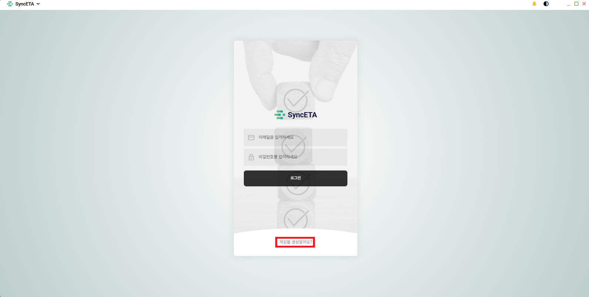
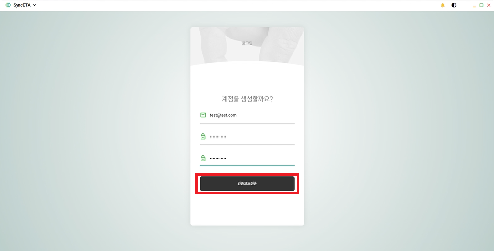
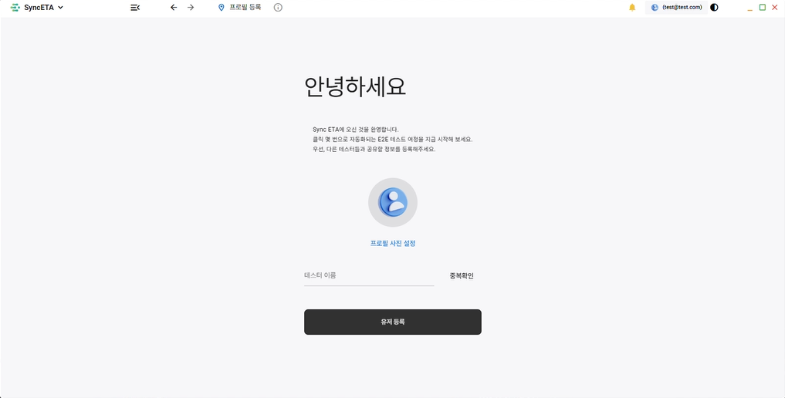

# 계정

## 회원가입

1. **SyncETA 솔루션 시작 화면** 하단의 **'계정을 생성할까요?'** 를 클릭합니다.

   

2. **계정 정보 입력** 후 **이메일 인증**을 진행하시면 회원가입이 완료됩니다.

   

## 프로필 설정

1. **회원가입 후 첫 로그인 시 프로필 정보를 설정**합니다.

   

## 계정 설정

1. 우측 상단의 **'프로필' → '사용자 설정'** 을 클릭하여 계정 정보를 변경할 수 있습니다.

   
