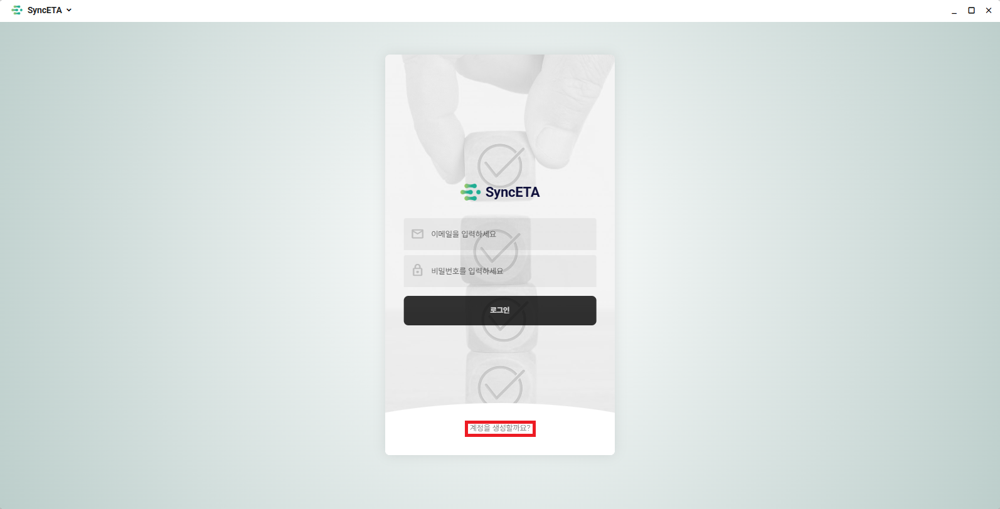
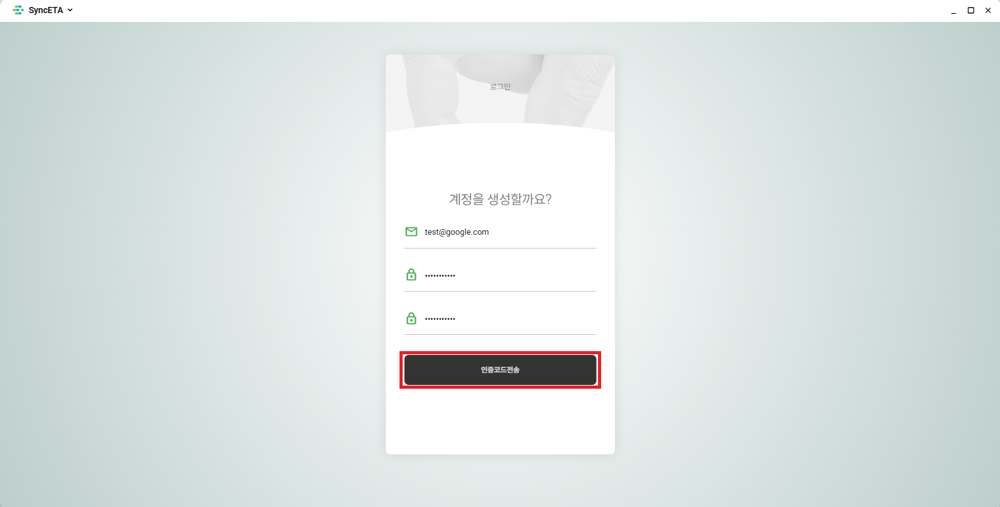
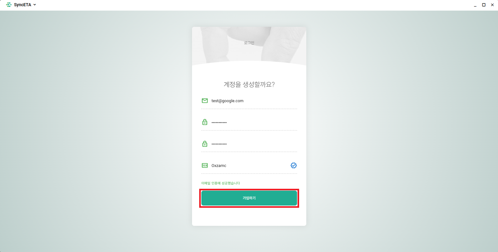
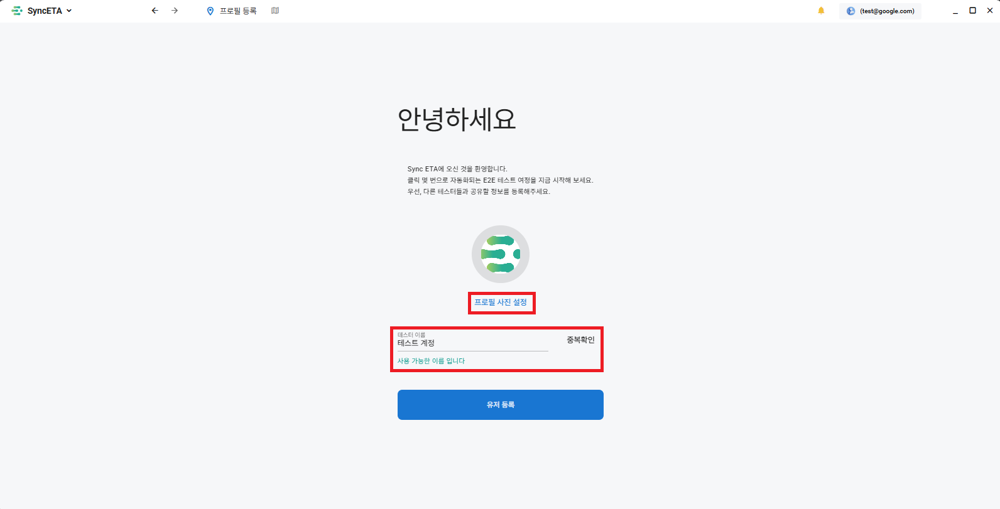
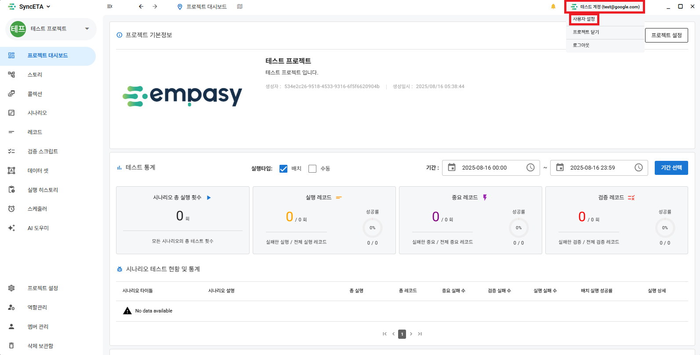
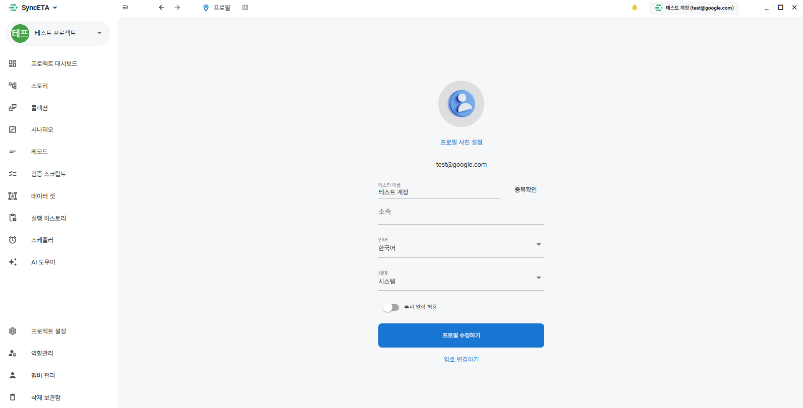

# 계정

## 회원가입

#### 1. SyncETA 시작 화면 하단의 **_'계정을 생성할까요?'_** 를 클릭합니다.

#### 2. 이메일과 비밀번호를 입력 후 **_'인증코드전송'_** 버튼을 클릭합니다.

::: info
입력한 이메일로 인증코드를 전송합니다.
:::

#### 3. 이메일 인증코드를 입력후 **_'가입하기'_** 버튼을 클릭합니다.

::: info
정상정으로 회원가입이 완료되면 로그인 화면으로 이동합니다.
:::

#### 4. 가입한 계정으로 첫 로그인 시 **_'프로필 설정'_** 화면으로 이동합니다.

::: info
프로필 사진과 이름을 설정해주세요.
:::

## 프로필 수정

#### 1. 메인 대시보드 우측 상단의 **_'내 프로필'_** 을 클릭합니다.

::: info
사용자 설정 클릭시 계정 설정 화면으로 이동합니다.
:::

#### 2. 내 프로필을 수정할 수 있습니다.

::: info
지원 기능

- 프로필 수정
- 언어
- 테마(다크 모드)
- 암호 변경
- 푸쉬 알림 설정
  :::
  

## 개발중인 기능

::: info

- 계정 삭제
  :::
