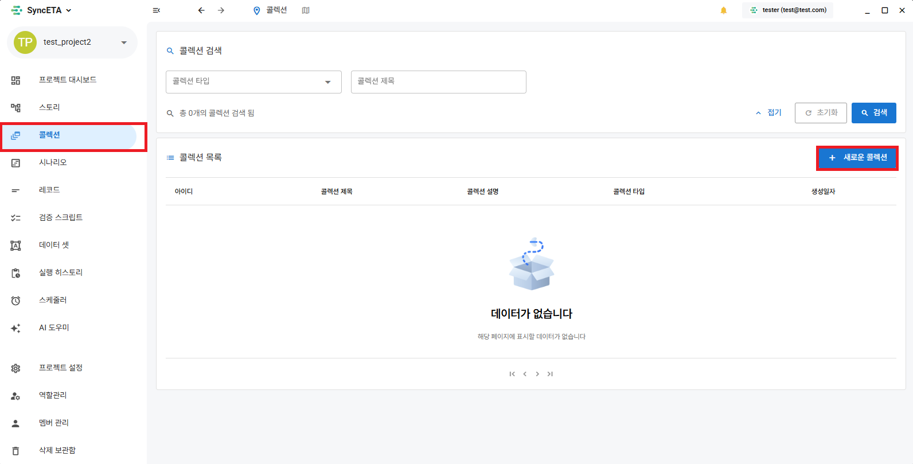
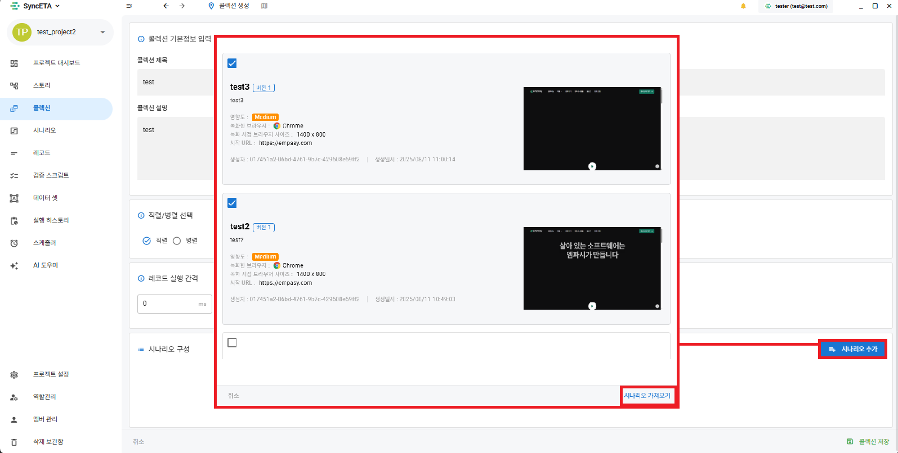

# 콜렉션

## 콜렉션의 기능

#### 여러 시나리오를 직 병렬로 실행

::: tip 콜렉션 주요 기능
**1. 크로스 브라우징 테스트**

- 다양한 브라우저 환경에서 동시에 테스트를 수행하여, 웹사이트가 Chrome, Safari, Edge 등 여러 브라우저에서 일관되게 동작하는지 확인할 수 있습니다

**2. 순차적 시나리오 실행**

- 여러 테스트 시나리오를 통합 관리하고, 실행 순서를 최적화하여 테스트 효율성을 극대화할 수 있습니다.
  :::

## 콜렉션 생성

#### 콜렉션 메뉴로 이동

#### 시나리오 선택

## 콜렉션 실행

<iframe width="100%" height="400" src="https://www.youtube.com/embed/dsb0XpGy7A0" frameborder="0" allowfullscreen allow="autoplay; encrypted-media"></iframe>
