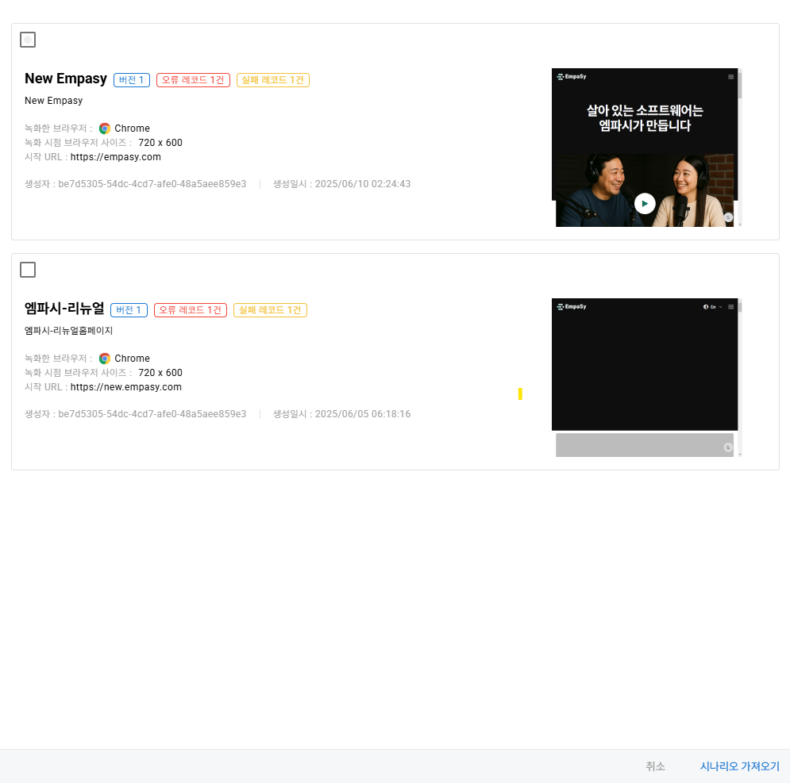
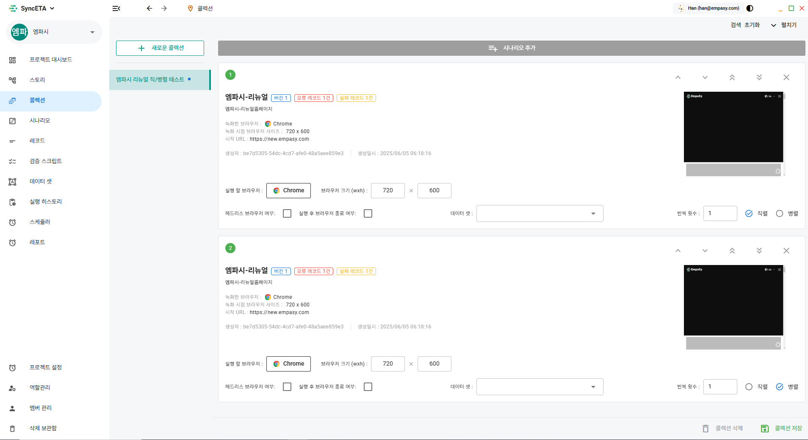

# 콜렉션

## 콜렉션의 기능

콜렉션은 여러 시나리오를 선택하여 한 번에 실행할 수 있도록 구성하는 기능입니다.
하나의 시나리오를 다양한 환경에서 직렬 또는 병렬로 실행할 수 있으며, 여러 시나리오를 모아 하나의 대형 시나리오처럼 실행할 수 있는 SyncETA의 강력한 기능 중 하나입니다.

::: tip 콜렉션 주요 기능
**1. 크로스 브라우징 테스트**

- 다양한 브라우저 환경에서 동시에 테스트를 수행하여, 웹사이트가 Chrome, Safari, Edge 등 여러 브라우저에서 일관되게 동작하는지 확인할 수 있습니다

**2. 순차적 시나리오 실행**

- 여러 테스트 시나리오를 통합 관리하고, 실행 순서를 최적화하여 테스트 효율성을 극대화할 수 있습니다.
  :::

## 콜렉션 생성

시나리오를 선택한 후 다양한 옵션을 부여하고 조합함으로써, 더욱 강력하고 유연한 테스트 케이스를 생성할 수 있습니다.  
콜렉션은 순차대로 실행되며 드래그, 혹은 우측 상단 버튼을 클릭하여 이동/삭제 가능합니다

1. 콜렉션 선택하기
   

---

2. 선택한 시나리오 옵션 설정하기.
   
