# 대시보드

## 테스트 결과

#### 실행 타입 / 기간을 설정하여 결과를 조회할 수 있습니다.

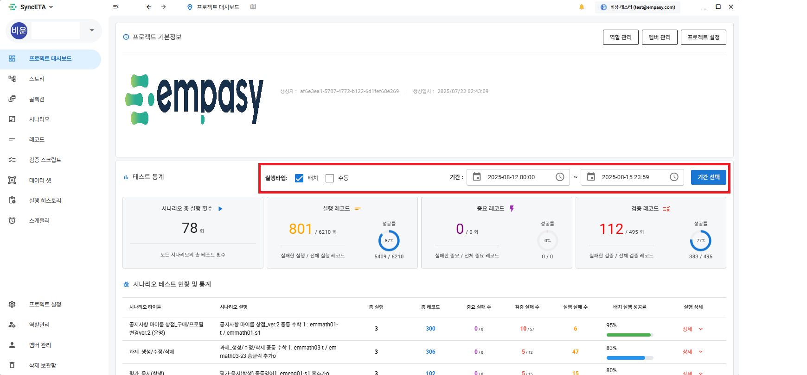

#### 조회 기간 내 테스트 결과에 대한 통계를 표시합니다.

::: info

1. 시나리오의 총 실행 횟수
2. 레코드의 총 실행 횟수
3. 중요도가 '높음'으로 설정된 레코드의 실행 성공률 (중요도 설정은 아래)
4. 검증 레코드의 검증 성공률
   :::

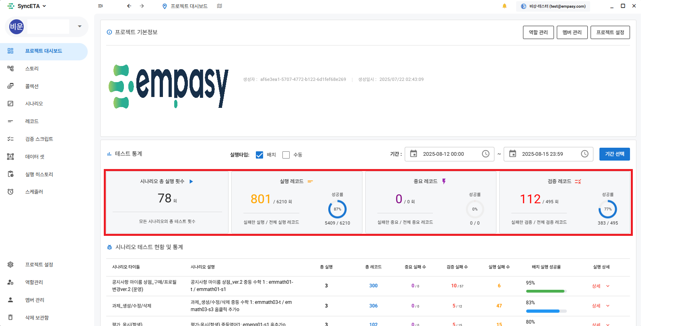

#### 시나리오 실행 결과 상세 내역을 확인하는 방법

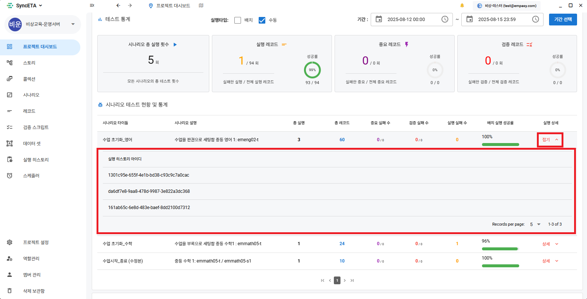

#### 자동 재생

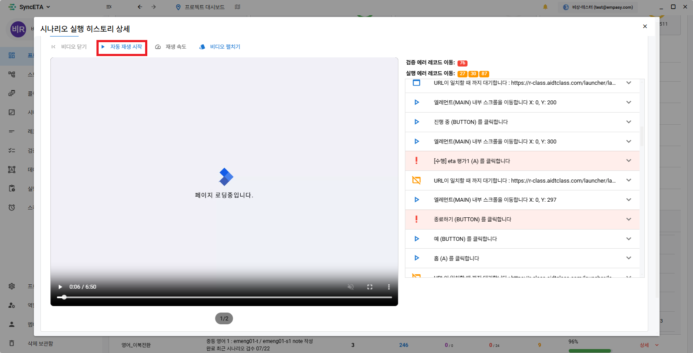

#### 영상 시점의 레코드에 포커스를 주어 실행 결과를 쉽게 확인 할 수 있습니다.

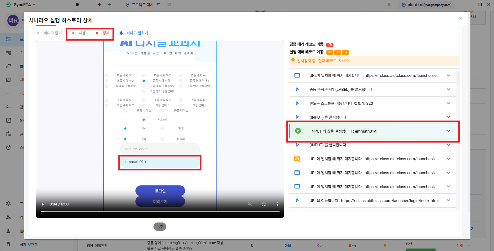

#### 여러 탭의 영상을 한번에 확인할 수 있습니다.

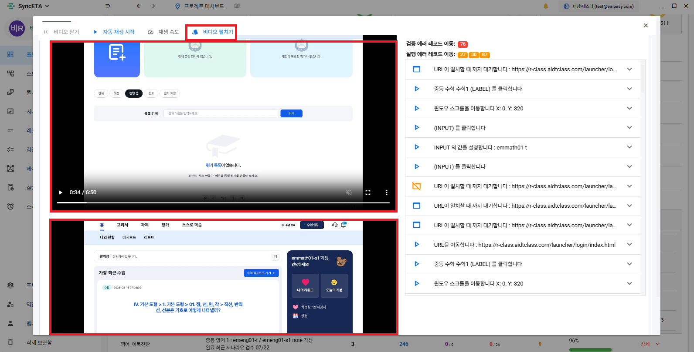

#### 클릭시 해당 에러 레코드로 스크롤 이동합니다.

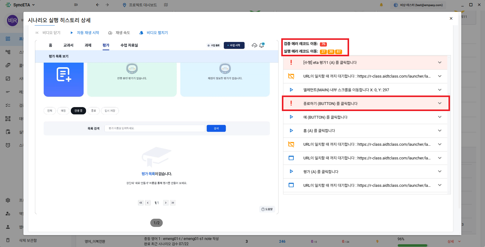

#### 레코드 실행 시점의 영상으로 이동합니다.

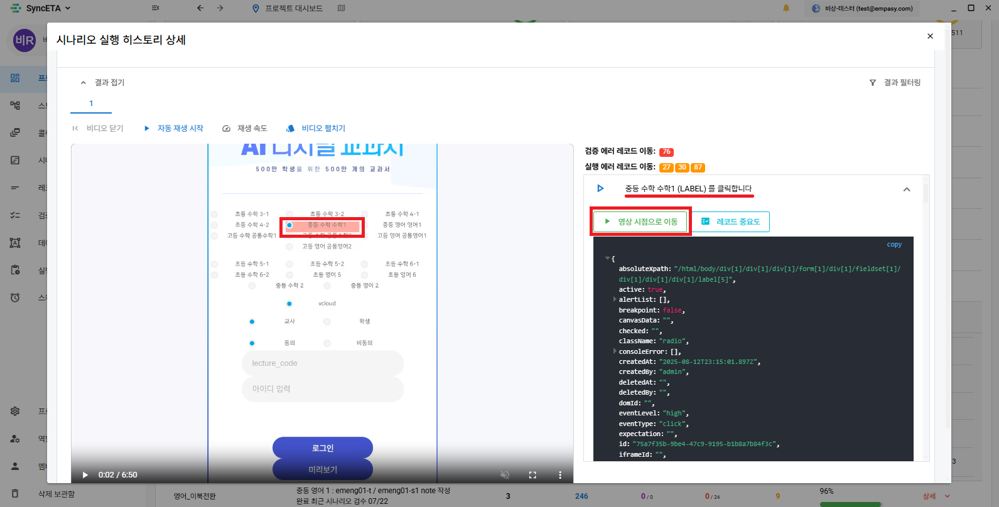

#### 레코드의 중요도를 설정합니다.

::: info

- 해당 레코드의 실행 실패가 이후 레코드에 어떤 영향을 미치는지를 고려하여 중요도를 설정해주세요
  :::

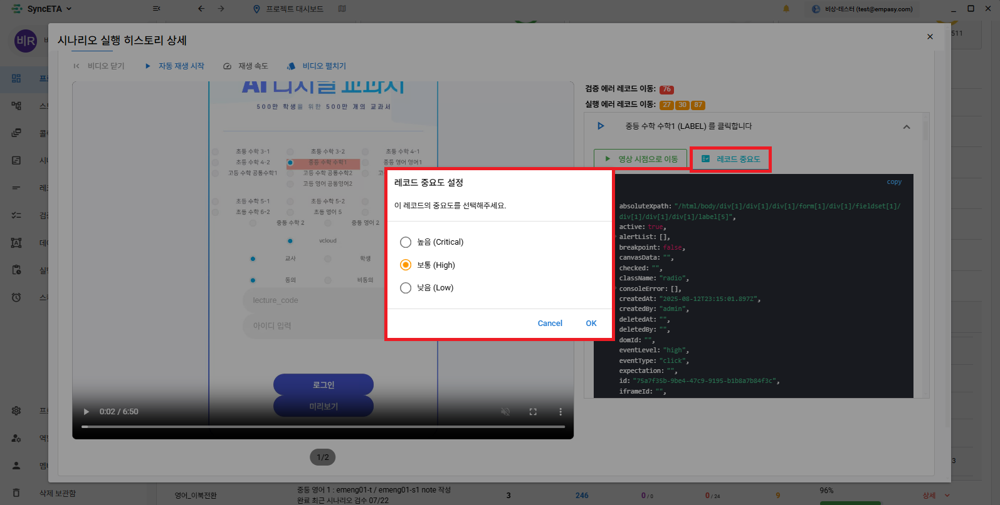

#### 테스트 결과에 코멘트를 작성할 수 있습니다.

::: info

- @ 를 통해 팀원 태그 가능
  :::

#### 태그된 댓글을 확인할 수 있습니다.

## 수집 정보

1. **자체 정보 수집**  
    SyncETA는 녹화 시점에 수집한 정보를 바탕으로 회귀 테스트 시 관련 정보를 자동으로 수집하여 제공합니다.
   ::: info
   사용자의 행위를 기반으로 이벤트가 발생한 dom의 여러 정보를 수집합니다.
   :::
   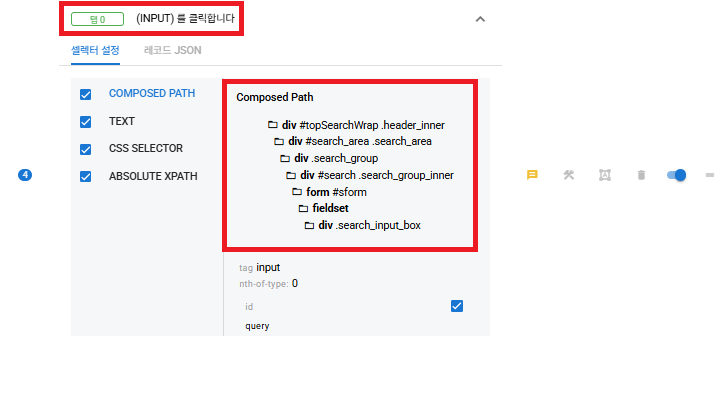
2. **ConsoleError 수집**  
    테스트 대상 페이지에서 발생하는 ConsoleError를 자동으로 감지 및 수집하여 확인할 수 있습니다.
   ::: info
   테스트시 발생한 console Error 를 수집하여 제공합니다.
   :::
   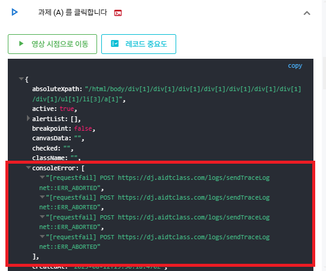

3. **HTML5 유효성 검사 (기능 추가중)**  
   회귀 테스트 시 W3C 기반 HTML5 유효성 검사를 자동으로 진행하고, 그 결과를 수집하여 사용자 경험 개선에 활용할 수 있습니다.

4. **SSL 인증서 체크**  
    테스트가 진행된 페이지의 SSL 인증서 만료일을 자동으로 확인 및 수집하며, 만료가 임박한 경우 메일링 서비스를 통해 안내합니다.
   ::: info
   테스트를 진행한 서비스의 ssl인증서 만료일을 수집하여 제공합니다.

- ssl 인증서 자동 갱신 기능 추가중
  :::
  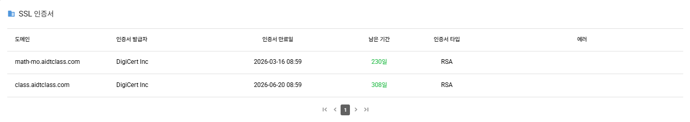
