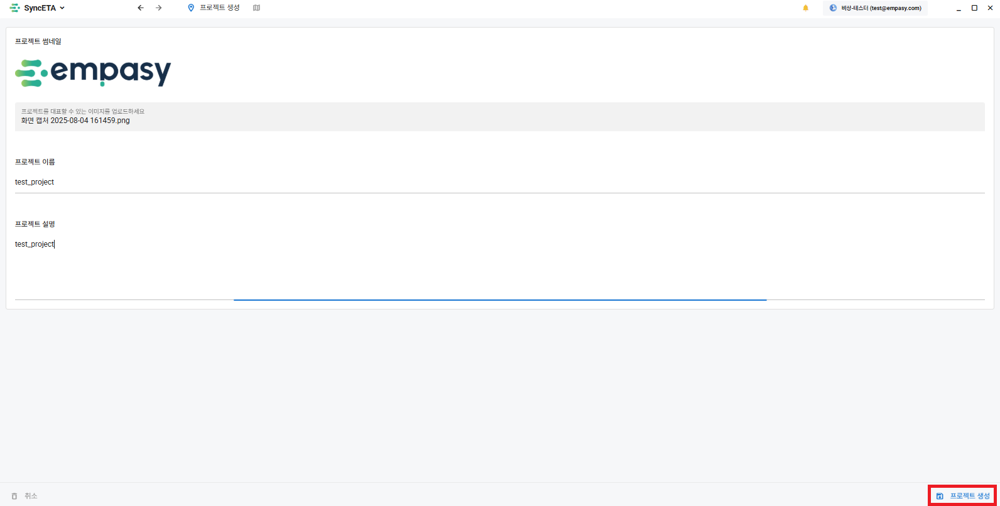
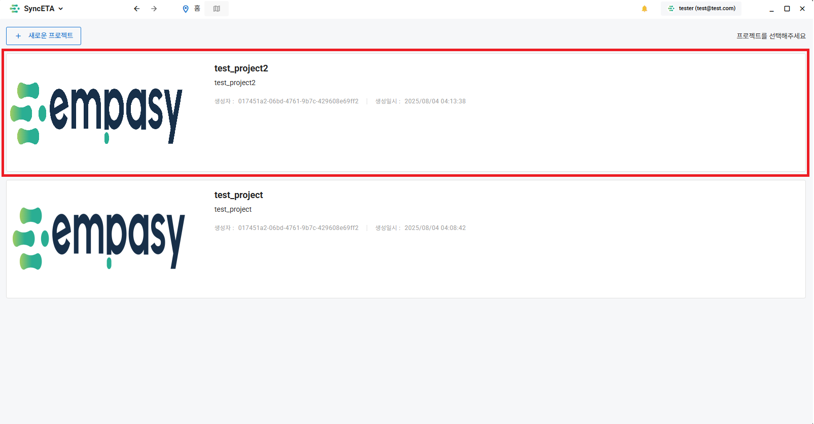
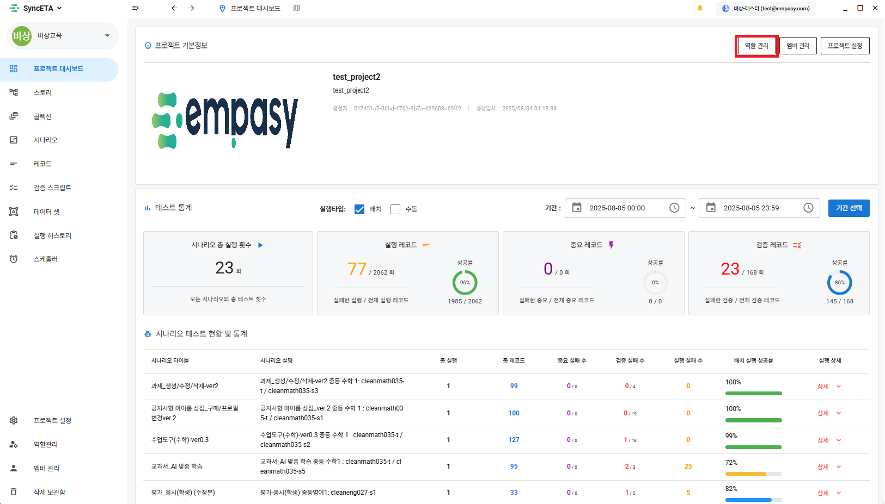
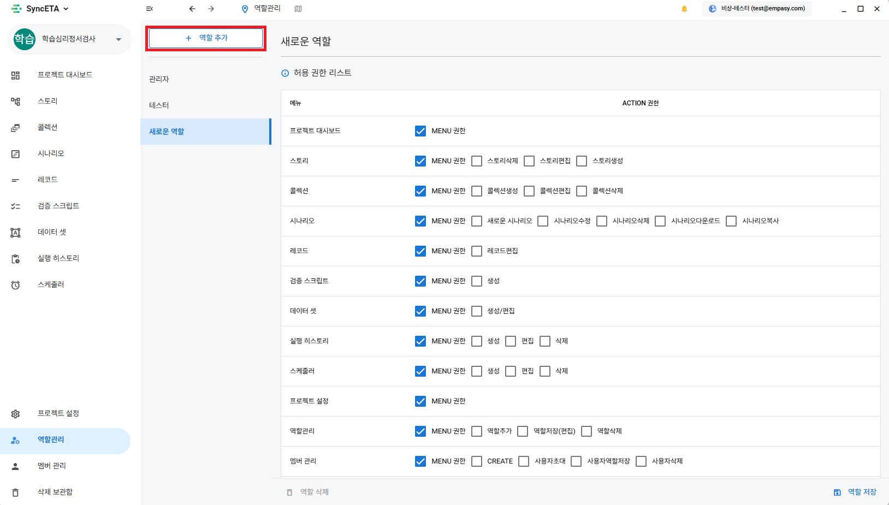
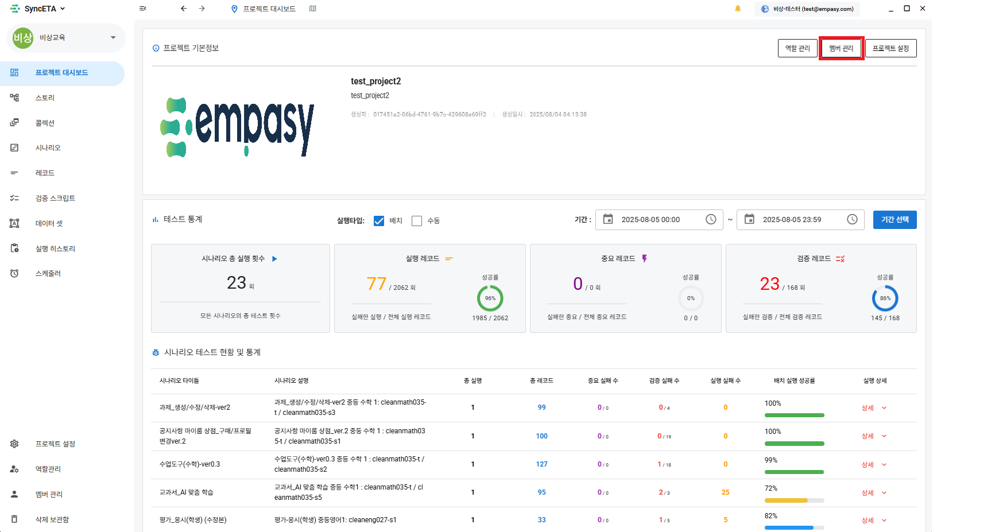
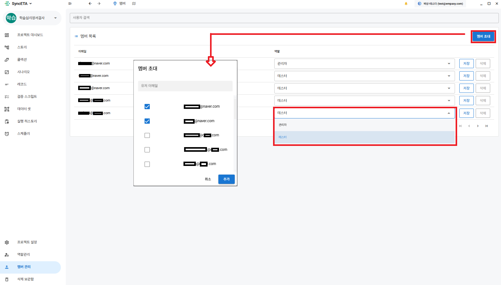

# 프로젝트

SyncETA를 통해 여러 **_'단위 테스트'_** 와 **_'통합 테스트'_** 를 관리하게 됩니다.

**_'프로젝트'_** 는 여러 테스트를 관리하는 가장 큰 분류 단위입니다.  
유저들은 프로젝트에 **_'멤버'_** 로 등록되어 syncETA 솔루션을 사용하게 됩니다.  
프로젝트에 멤버를 초대하고, 멤버별로 작업 권한을 부여하는 방법을 설명하겠습니다.

## 프로젝트 생성

#### 1-1. 소속된 프로젝트가 없는 경우

#### 1-2. 소속된 프로젝트가 존재하는 경우

#### 1-3. 다른 프로젝트에서 작업 중인 경우

#### 2. **_'대표 이미지'_**, **_'이름'_**, **_'내용'_** 을 설정하고 프로젝트를 생성합니다.

## 프로젝트 **_역할(권한)_**

#### 3-1. 프로젝트를 선택하여 내부로 진입합니다.

#### 3-2. 프로젝트 대시보드 우측 상단의 **_'역할(role)관리'_** 를 클릭합니다.

#### 3-3. **_'역할 추가'_** 를 클릭하여 새로운 역할을 생성하고, 역할이 가질 수 있는 **_역할_** 을 설정합니다.

::: info

- 프로젝트 생성자에게는 기본적으로 관리자 역할이 부여됩니다.
- 생성한 **_역할_** 을 프로젝트 멤버에게 부여할 수 있습니다.
- 역할은 해당 프로젝트 내에서만 적용됩니다.  
  A프로젝트에서 **_'관리자'_** **_역할_** 인 유저가 B프로젝트에서 **_'테스터(예시)'_** 권한일 수 있습니다.
  :::

## 프로젝트 **_멤버_**

#### 4-1. 프로젝트 대시보드 우측 상단의 **_'멤버 관리'_** 를 클릭합니다.

#### 4-1. 멤버 관리

::: info

- 현재 프로젝트에 참여중인 멤버 목록과 **_역할_** 을 확인할 수 있습니다.
- 위 화면에서 프로젝트 멤버의 역할을 수정할 수 있습니다.
- **_'멤버 초대'_** 를 클릭하여 멤버를 초대할 수 있습니다.
  :::

