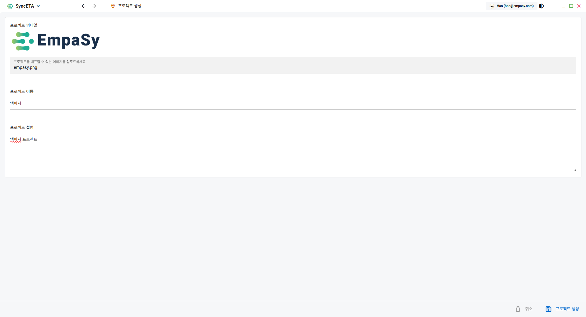

## 프로젝트란?

프로젝트는 SyncETA에서 제일 큰 단위로 시나리오, 콜렉션, 스토리 등 통합적으로 관리를 위한 단위입니다.  
프로젝트를 생성한 테스터는 자동으로 관리자 권한이 부여되며, 다른 테스터를 초대하고 권한을 설정하여  
유연하게 프로젝트를 관리할 수 있습니다.

## 프로젝트 생성하기

프로젝트를 쉽게 식별할 수 있도록, 썸네일 이미지와 제목, 설명을 입력한 후 프로젝트를 생성하세요.

::: tip
역할 및 권한, 맴버 초대의 경우 프로젝트 생성 후 진행이 가능합니다.
:::

## 프로젝트 대시보드

해당 프로젝트의 정보 및 다양한 통계 정보를 보여주는 화면 입니다.

## 수집 및 검증 데이터 목록

1. **자체 정보 수집** : SyncETA 녹화 당시 수집한 정보를 바탕으로 회기테스트 시 정보를 수집하여 보여줍니다.

2. **ConsoleError 수집** : 테스트 대상 페이지에서 발생한 ConsoleError를 자동으로 감지 및 수집하여 보여줍니다.

3. **HTML5 유효성 검사** : 회기테스트 시 W3C기반 HTML5 유효성 검사 진행, 수집하여 사용자 경험 개선에 활용.

4. **SSL 인증서 체크** : 테스트가 진행된 페이지의 SSL 인증서 만료일을 자동으로 확인 및 수집하며, 만료가 임박한 경우 메일링 서비스를 통해 안내합니다.
