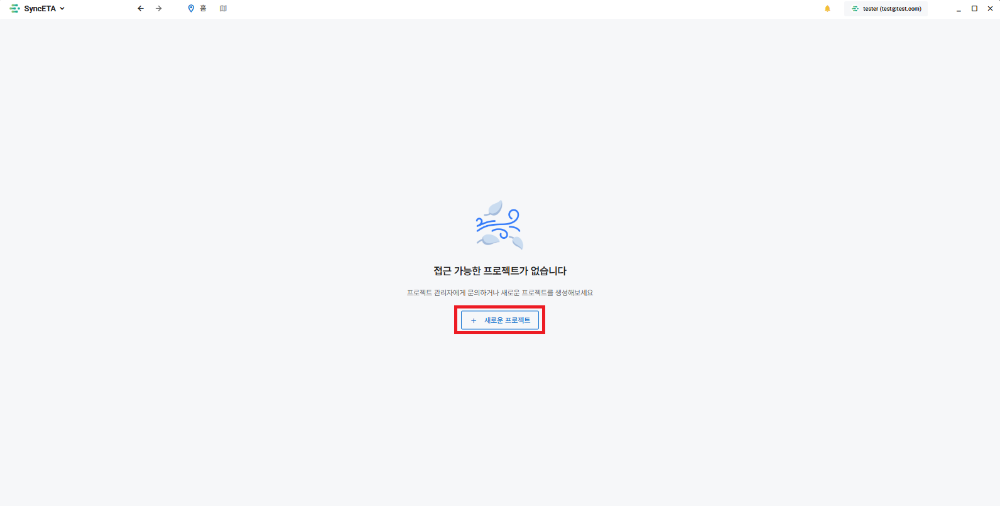
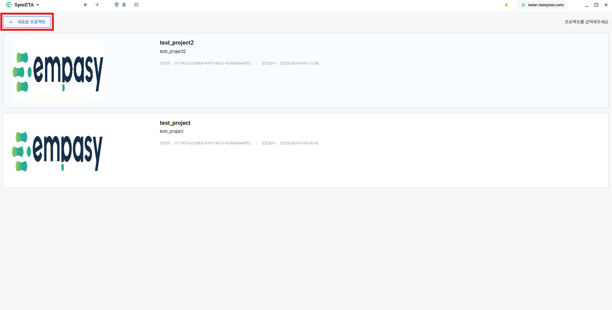
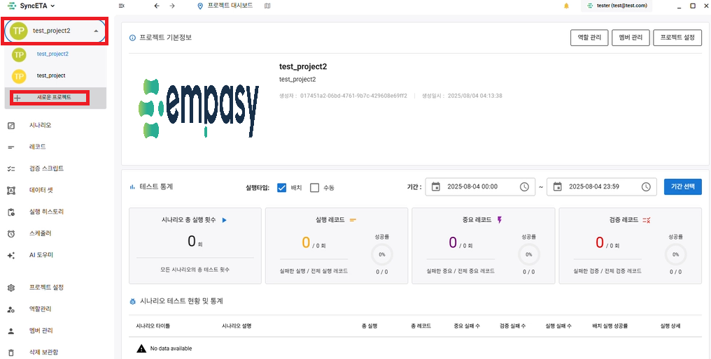
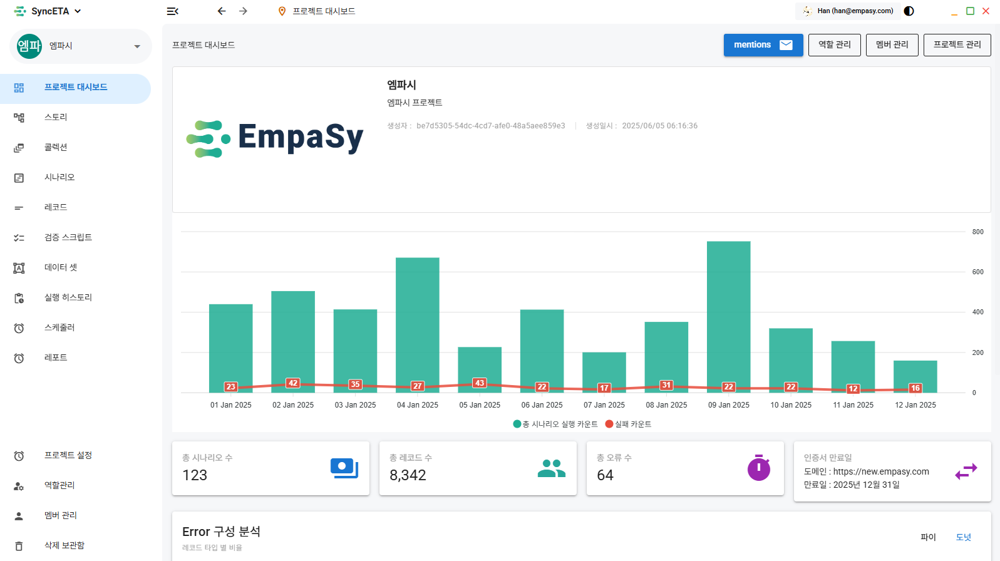

# 프로젝트

## 생성 가이드

SyncETA를 통해 여러 **'단위 테스트'** 와 **'통합 테스트'** 를 관리하게 됩니다.

**'프로젝트'** 는 해당 테스트들을 관리하는 가장 큰 단위입니다.

규모에 맞게 프로젝트를 생성하여 테스트 시나리오를 관리하는 것을 권장드립니다.

**_예시 1)_** 테스트 케이스 개수가 적고 서로 유기적으로 연관된 경우

- **커뮤니티 사이트**

**테스트 케이스 예시:**

1. 게시글 작성 시나리오
2. 게시글 수정 시나리오
3. 게시글 삭제 시나리오
4. 게시글 조회 시나리오

➡ 하나의 프로젝트에서 모든 테스트 케이스를 관리합니다.

---

**_예시 2)_** 테스트 케이스 개수가 많고 기능별로 테스트가 필요한 경우

- **온라인 강의 플랫폼**

**테스트 케이스 예시:**

1. 커뮤니티 메뉴의 게시글 CRUD 기능
2. 강의 시청 기능
3. 강의 생성 기능
4. 결제 기능

➡ 기능 단위로 프로젝트를 생성하고 각 기능별 테스트 케이스를 관리합니다.

---

## 프로젝트 생성하기

### 1-1. 소속된 프로젝트가 없는 경우

### 1-2. 소속된 프로젝트가 존재하는 경우

### 1-3. 다른 프로젝트에서 작업 중인 경우

---

## 프로젝트 멤버 관리

::: tip
역할 및 권한 설정, 멤버 초대는 **프로젝트 생성 후** 진행할 수 있습니다.
:::

---

## 대시보드

해당 프로젝트의 정보 및 다양한 통계 정보를 보여주는 화면입니다.

---

## 수집 및 검증 데이터 목록

1. **자체 정보 수집**  
   SyncETA는 녹화 시점에 수집한 정보를 바탕으로 회귀 테스트 시 관련 정보를 자동으로 수집하여 제공합니다.

2. **ConsoleError 수집**  
   테스트 대상 페이지에서 발생하는 ConsoleError를 자동으로 감지 및 수집하여 확인할 수 있습니다.

3. **HTML5 유효성 검사**  
   회귀 테스트 시 W3C 기반 HTML5 유효성 검사를 자동으로 진행하고, 그 결과를 수집하여 사용자 경험 개선에 활용할 수 있습니다.

4. **SSL 인증서 체크**  
   테스트가 진행된 페이지의 SSL 인증서 만료일을 자동으로 확인 및 수집하며, 만료가 임박한 경우 메일링 서비스를 통해 안내합니다.
