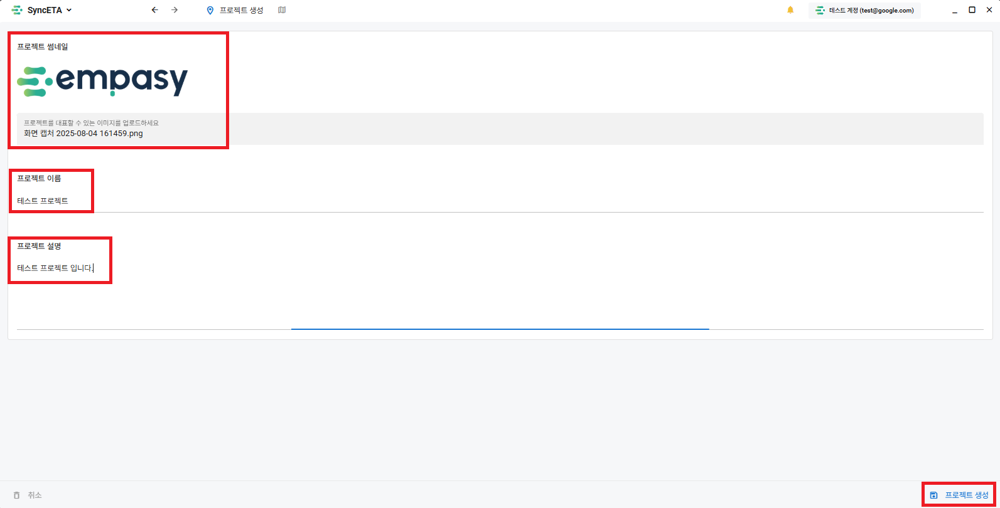

# 프로젝트

SyncETA를 통해 여러 **_'단위 테스트'_** 와 **_'통합 테스트'_** 를 관리하게 됩니다.

**_'프로젝트'_** 는 여러 테스트를 관리하는 가장 큰 분류 단위입니다.  
유저들은 프로젝트에 **_'멤버'_** 로 등록되어 syncETA 솔루션을 사용하게 됩니다.  
프로젝트에 멤버를 초대하고, 멤버별로 작업 권한을 부여하는 방법을 설명하겠습니다.

## 프로젝트 생성

::: info
아래 3가지 경우에서 프로젝트를 생성 하는 방법

1. 소속된 프로젝트가 없는 경우
2. 소속된 프로젝트가 존재하는 경우
3. 다른 프로젝트에서 작업중인 경우
   :::

#### 1. 소속된 프로젝트가 없는 경우 프로젝트를 생성하는 방법.

::: info
소속된 프로젝트가 없는 경우 화면 중앙의 **_'새로운 프로젝트'_** 버튼을 클릭합니다.
:::

#### 2. 소속된 프로젝트가 존재하하는 경우 프로젝트를 추가하는 방법.

::: info
소속된 프로젝트가 있는 경우 프로젝트를 추가하시려면 프로젝트 목록 좌측 상단의 **_'새로운 프로젝트'_** 버튼을 클릭합니다.
:::

#### 3. 다른 프로젝트에서 작업중에 프로젝트를 추가하는 방법.

::: info
화면 좌측 상단 프로젝트 툴바의 **_'새로운 프로젝트'_** 버튼을 클릭합니다.
:::

#### 4. 프로젝트 생성

::: info
위 3가지 방법으로 프로젝트 생성 화면으로 이동할 수 있습니다.  
프로젝트 프로필 이미지, 프로젝트명, 프로젝트 설명을 입력하여 프로젝트를 생성합니다.
:::

## 프로젝트 목록

#### 1. 프로젝트 목록으로 이동

::: info
우측 상단의 **_'프로젝트 닫기'_** 버튼을 클릭하여 현재 속해있는 프로젝트 목록을 확인할 수 있습니다.
:::

#### 2. 프로젝트 목록 조회

::: info
내가 속한 프로젝트 목록을 확인할 수 있습니다.
:::

## 역할 / 권한 설정

::: info
프로젝트별로 역할(role)을 생성하고 권한을 부여할 수 있습니다.
:::

#### 1. 역할 생성

::: info
역할 생성 화면으로 이동
:::

#### 2. 권한 설정

::: info
역할에 부여할 권한을 설정합니다.
:::

## 멤버 관리

::: info
프로젝트에 멤버를 초대하고 작업 권한을 부여합니다.
:::

#### 1. 멤버 초대

::: info
멤버 초대 화면으로 이동
:::

#### 2. 멤버 초대

::: info
프로젝트에 초대할 멤버를 선택합니다.
:::

#### 3. 권한 부여

::: info
초대한 멤버에게 권한을 부여합니다.

- 해당 권한은 프로젝트 내에서만 유효합니다.  
  ex) A 프로젝트에서 관리자 권한인 유저가 B 프로젝트에서 테스터(예시)권한일 수 있음.
  :::
  
