# 시나리오

SyncETA를 사용하여 복잡한 테스트 코드 작성 없이 실제 UI를 통해 테스트 케이스를 생성하고  
관리할 수 있습니다.

## 시나리오란

#### **_'시나리오'_** 는 아래와 같은 기능 테스트 단위를 의미합니다.

##### [ **_'empasy'_** 홈페이지에 접속하여 문의 전송 ]

1. **_'empasy'_** 홈페이지 접속.
2. **_'문의 하기'_** 클릭.
3. 문의 내용 입력.
4. 문의 보내기.
5. 정상 전송 확인.

## 시나리오 생성

#### 1. 시나리오 메뉴 이동

::: info

1. 좌측 사이드바의 **_'시나리오'_** 메뉴 클릭
2. 우측 상단의 **_'새로운 시나리오'_** 클릭
3. 시나리오 녹화시 필요한 설정 모달이 노출됩니다.
   :::
   

#### 2. 녹화 브라우저 설정

::: info

1. 시나리오를 생성할 웹페이지의 url을 입력합니다.
2. 녹화를 진행할 브라우저를 선택합니다.

- 녹화시 크롬 -> 실행시 엣지 선택 가능 (크로스 브라우징 테스트)

3. 녹화를 진행할 브라우저의 크기를 설정합니다.

- 녹화시 1400 x 800 -> 실행시 800 x 600 가능 (반응형 테스트)
  :::
  

#### 3. 수집 이벤트 설정

::: info

- 수집할 이벤트 타입을 선택한 후 모달 우측 하단의 녹화 시작 버튼을 눌러주세요.  
  기본 설정으로 녹화를 진행하는 것을 권장합니다.
  :::
  

#### 4. 녹화 시작

::: info
녹화를 시작하면 브라우저가 화면에 나타납니다.  
해당 브라우저에서 실제 테스트를 진행해주세요.  
EX) 네이버에 **_'주변 맛집'_** 검색

사진과 같이 레코드가 수집된 것을 확인할 수 있습니다.

1. url 이동
2. 검색창 클릭
3. 검색어(**_'주변 맛집'_**) 입력
4. 검색 버튼 클릭
   :::
   

#### 4. 돔 정보 수집

::: info

- 모든 레코드는 이벤트가 발생한 dom의 정보를 가지고 있습니다.  
  EX) 검색어(**_'주변 맛집'_**)를 입력한 input 요소의 속성 수집
  :::
  

#### 5. 녹화중 새 탭이 열릴 경우

::: info
브라우저에서 추가된 모든 탭에서 동일하게 시나리오 녹화를 이어갈 수 있습니다.
:::

## 대기 레코드

::: info
레코드의 실행 간에 특정 조건을 만족할 때까지 대기 시간을 부여하는 기능입니다.

대기 레코드의 종류 3가지

1. 시간 대기 - 설정한 시간만큼 대기합니다.
2. 요소 노출 대기 - 화면에 특정 엘리먼트가 나타날 때까지 대기합니다.
3. 요소 값 일치 대기 - 화면에 특정한 값이 노출될 때까지 대기합니다.

:::

#### 1. 시간 대기 조건 추가

::: info
레코드 실행 전 대기시간을 부여합니다.

1. 대기가 필요한 레코드를 우클릭합니다.
2. 대기 조건 추가를 클릭한 후 대기 시간을 설정합니다. (1000 = 1초)
   :::
   레코드 우클릭
   
   대기 시간 설정
   
   대기 레코드 생성
   
   ::: info
   EX) url 이동 후 화면 로딩(네트워크 상황을 고려하여 약 3초)시간동안 대기 후 검색창을 클릭 하도록 시간 대기 조건을 추가
   :::

#### 2. 요소 노출 대기 조건 추가

::: info
특정 요소가 화면에 노출될 떄까지 대기합니다.

1. 대기가 필요한 레코드를 우클릭합니다.
2. 대기 조건 추가를 클릭한 후 요소 노출 대기를 선택합니다.
   :::
   레코드 우클릭
   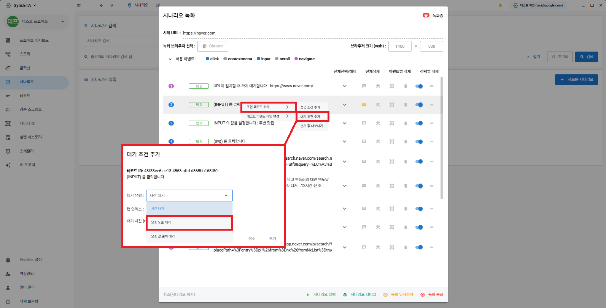
   녹화중인 화면에서 요소 선택을 클릭한 후  
   녹화가 진행중인 브라우저에서 대기할 요소를 선택합니다.
   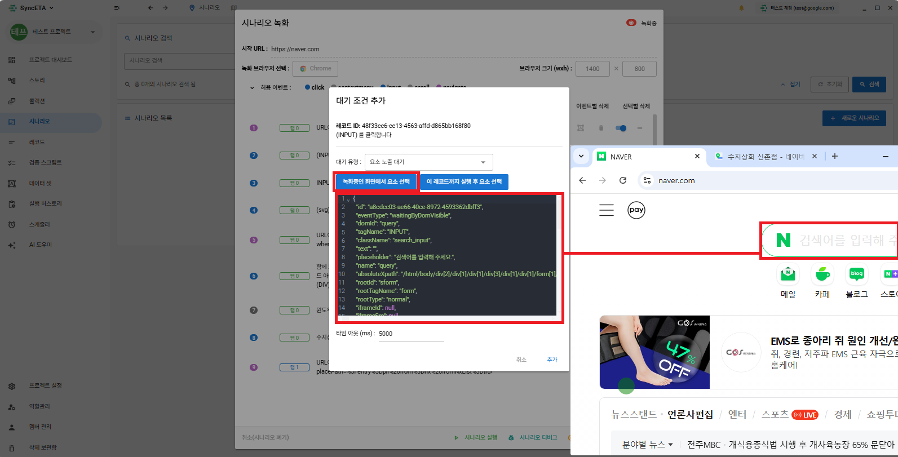
   요소 노출 대기 레코드 생성
   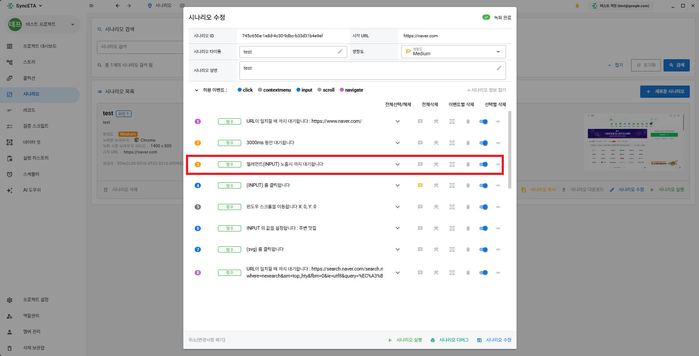
   ::: info
   EX) 검색창을 클릭하기 전 실제로 화면에 검색창(input)이 로딩 될 때까지 대기
   :::

#### 3. 요소 값 일치 대기 조건 추가

::: info
특정 요소에 설정한 값이 노출될 때까지 대기합니다.
:::

레코드 우클릭
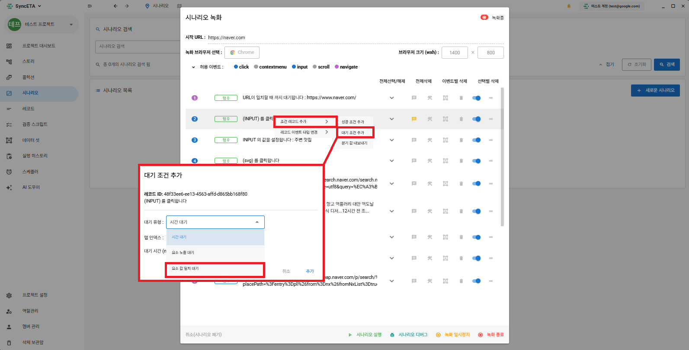
녹화중인 화면에서 요소 선택을 클릭한 후  
 녹화가 진행중인 브라우저에서 대기할 요소를 선택합니다.
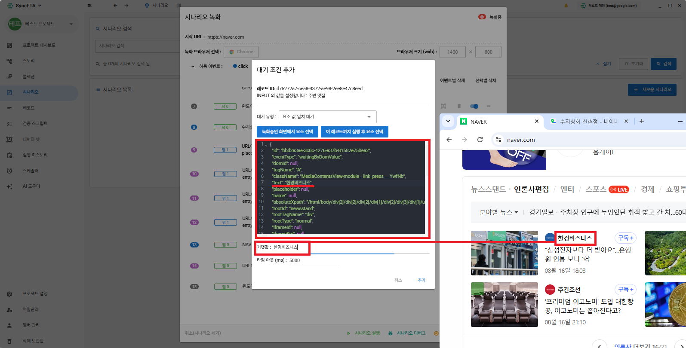
::: info
EX) 뉴스 캐러셀에 **_'한경 비즈니스'_** 가 노출될 때까지 대기합니다
:::

## 검증 레코드

::: info
레코드의 실행 간에 특정 요소가 노출 되는지, 특정 값이 노출 되는지 검증하는 기능입니다.

1. 특정 요소가 화면에 노출되고 있는지 검증  
   EX) 맛집 검색 이후 화면에 **_'맛집 지도'_** 가 노출되고 있는지 확인
2. 특정 값이 화면에 노출되고 있는지 검증  
    EX) **_'플레이스'_** 최상단에 **_'OO 레스토랑'_** 이 노출되는지 확인
   :::

#### 1. 요소 노출 검증 레코드 추가

::: info
특정 요소가 화면에 노출되고 있는지 검증합니다.
:::

레코드 우클릭
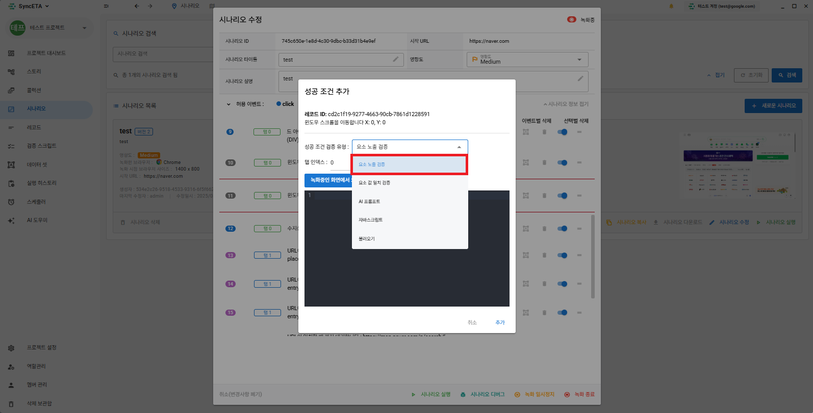
녹화중인 화면에서 요소 선택을 클릭한 후  
녹화가 진행중인 브라우저에서 검증할 요소를 선택합니다.
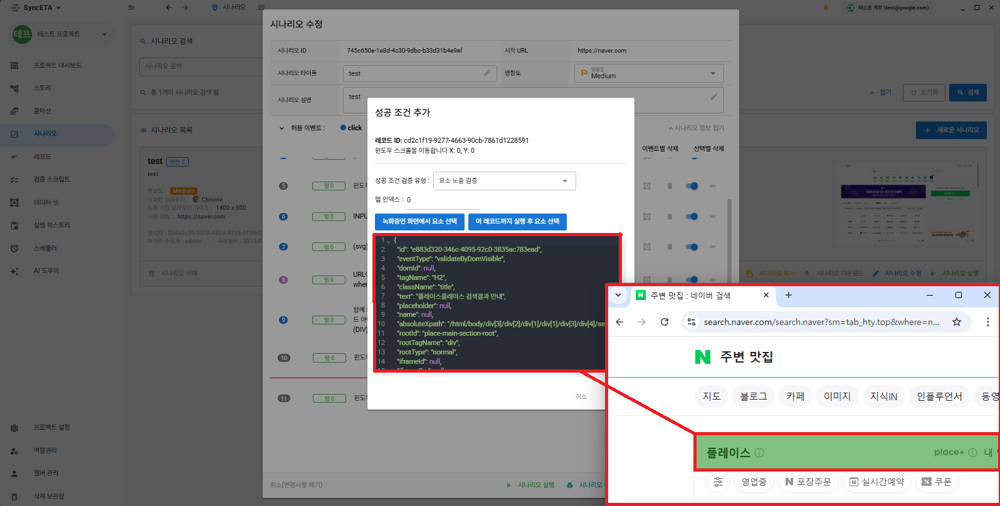
검증 레코드 생성
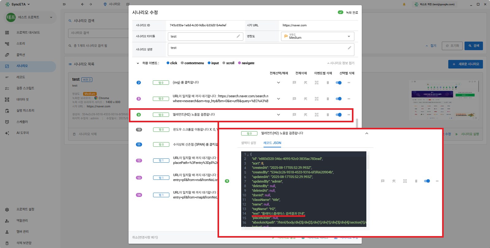
::: info
EX) 네이버에 **_'주변 맛집'_** 검색 후 **_'플레이스'_** 가 노출되는지 검증합니다.
:::

#### 2. 요소 값 검증 레코드 추가

::: info
특정 값이 화면에 노출되고 있는지 검증합니다.
:::

레코드 우클릭
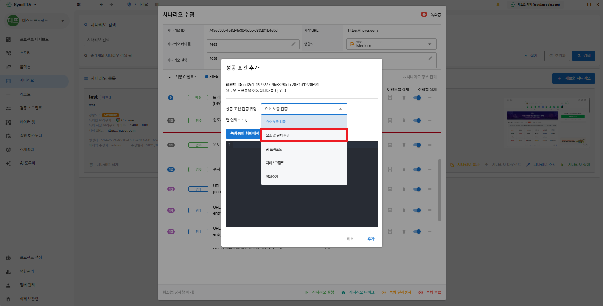
녹화중인 화면에서 요소 선택을 클릭한 후  
녹화가 진행중인 브라우저에서 검증할 요소를 선택합니다.  
EX) 플레이스 최상단에 **_'디어리스트 연남'_** 이 노출되는지 검증
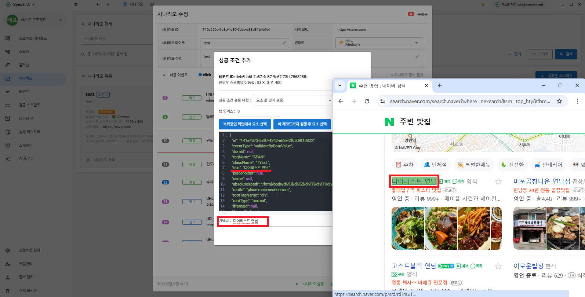
검증 레코드 생성
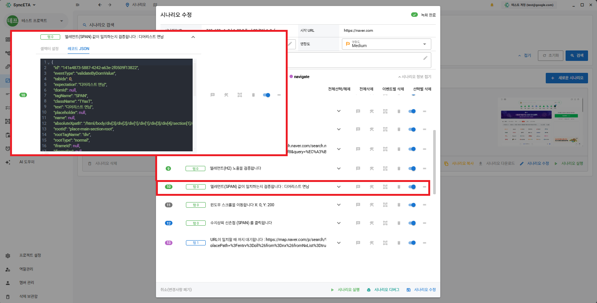
::: info
EX) **_'플레이스'_** 최상단에 **_'디어리스트 연남'_**이 노출되는지 확인
:::

#### 3. AI를 통한 화면 검증

::: info
화면 내의 특정 값이나 요소의 노출이 아닌 이미지 기반의 검증이 필요한 경우 사용합니다.
:::

레코드 우클릭
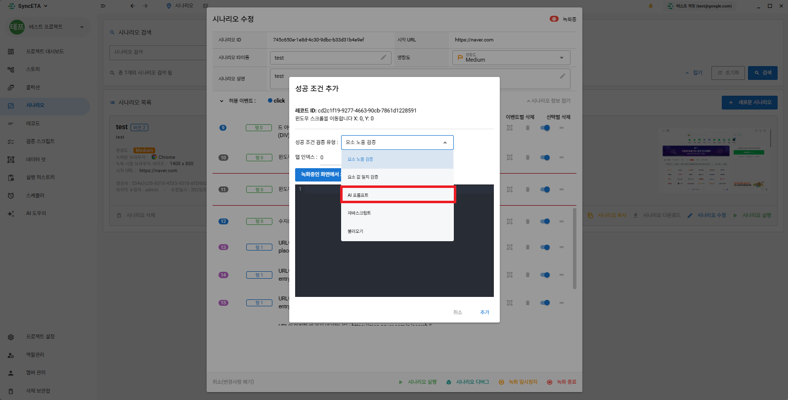
AI 프롬프트를 선택한 후 프롬프트를 입력합니다.  
현재 브라우저의 화면을 Sync-ETA 에이전트가 자동으로 캡쳐하여 AI 로 검증합니다.
::: info
AWS Bedrock - claude-3-haiku 모델 사용중
:::
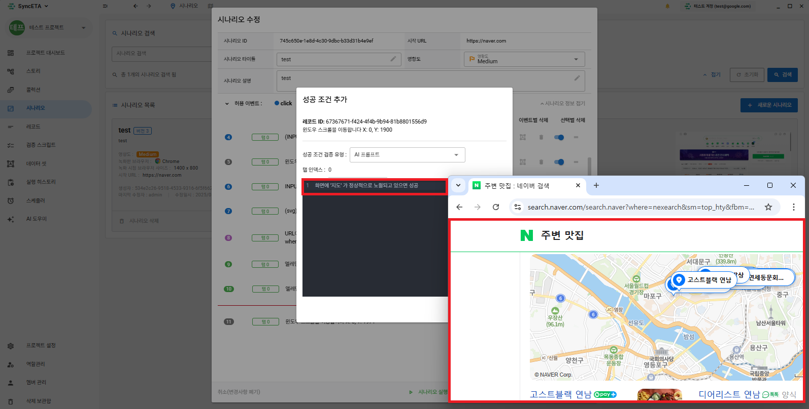
::: info
EX) **_'주변 맛집'_** 검색 후 화면에 **_'지도'_** 가 정상적으로 노출되는지 확인
:::

## 시나리오 수정

::: info
기존 시나리오의 특정 부분에서 이어서 녹화를 진행하는 기능입니다.
:::

#### 1. 수정할 시나리오 선택

시나리오 수정 클릭
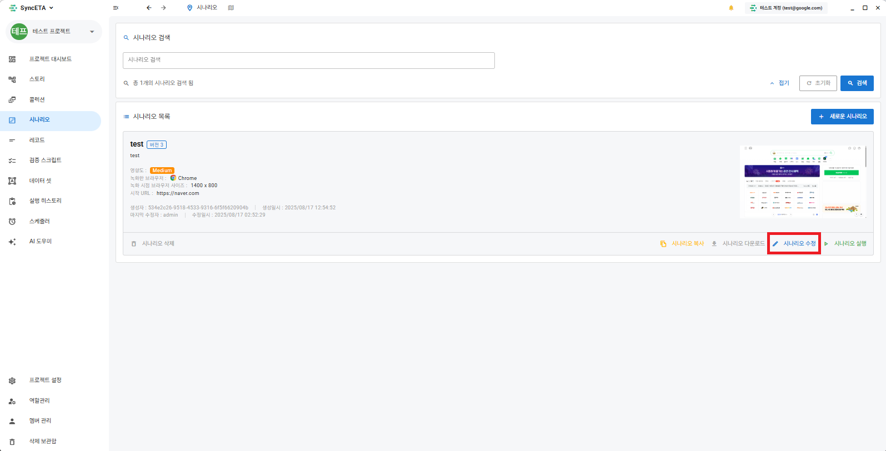
이어서 녹화할 레코드를 선택합니다.
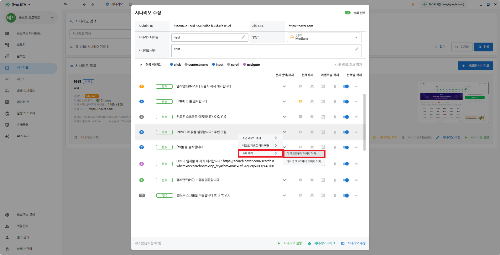
::: info

1. 시나리오 생성과 동일하게 녹화 브라우저가 나타납니다.
2. 이어서 녹화를 희망하는 레코드까지 스크립트가 실행됩니다.
3. 설정한 레코드에 도달하면 해당 시점부터 브라우저에서 발생하는 이벤트를 수집합니다.
   :::
   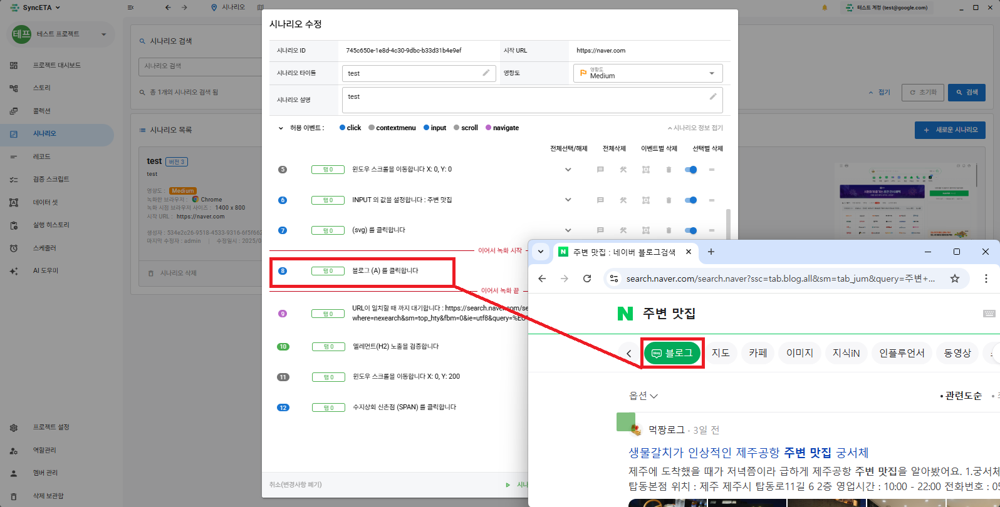

## 부가 기능

#### 1. 노트 기능

::: info
레코드의 내용을 입력합니다.
:::

#### 2. 실패 복구 스크립트

::: info
레코드가 실패했을 경우 복구 스크립트가 실행됩니다.
:::

#### 3. 데이타셋

::: info
입력 값을 지정합니다.  
EX) 검색어(**_'주변 맛집'_**)를 사용자가 지정한 값으로 치환합니다.  
** 상세 설명은 **_'데이타셋'_\*\* 참고
:::

#### 4. 삭제

::: info
수집 레코드를 삭제합니다.  
EX) 녹화중 잘못된 부분을 클릭한 경우 해당 레코드를 삭제합니다.
:::

#### 5. 비활성화

::: info
수집한 정보를 삭제하지 않고 실행시 제외합니다.
:::

