# 시나리오

SyncETA를 사용하여 복잡한 테스트 코드 작성 없이 실제 UI를 통해 테스트 케이스를 생성하고  
관리할 수 있습니다.

## 시나리오란

#### **_'시나리오'_** 는 아래와 같은 기능 테스트 단위를 위미합니다.

##### [ **_'empasy'_** 홈페이지에 접속하여 문의 전송 ]

1. **_'empasy'_** 홈페이지 접속.
2. **_'문의 하기'_** 클릭.
3. 문의 내용 입력.
4. 문의 보내기.
5. 정상 전송 확인.

## 시나리오 생성

#### 1. **_'시나리오'_** 메뉴로 이동합니다.

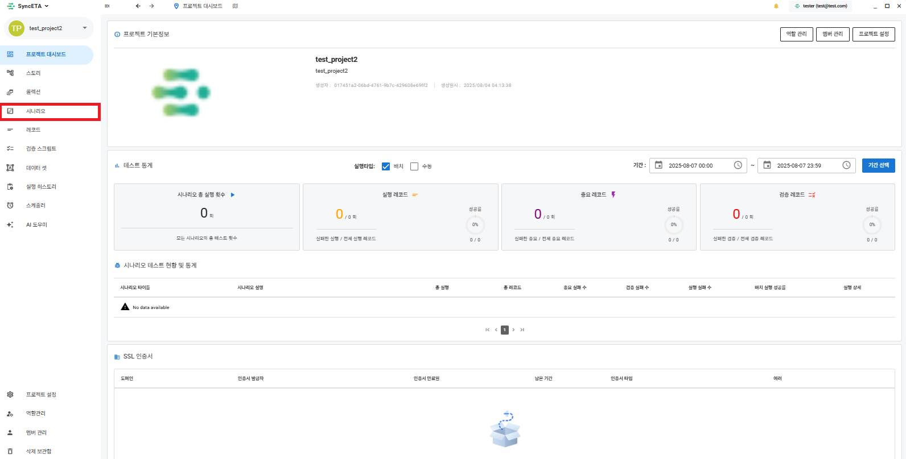

#### 2. **_'새로운 시나리오'_** 를 클릭합니다.

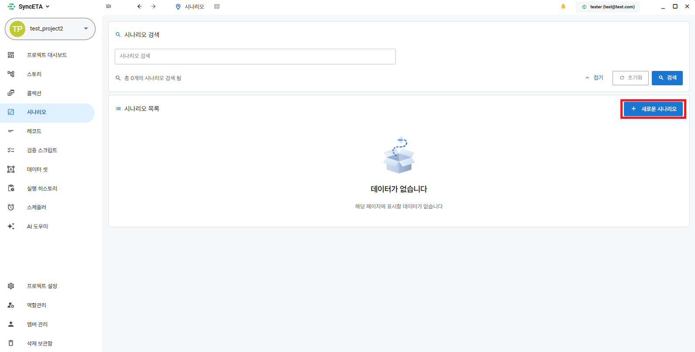

#### 3. 시나리오를 생성할 사이트의 url을 입력합니다.

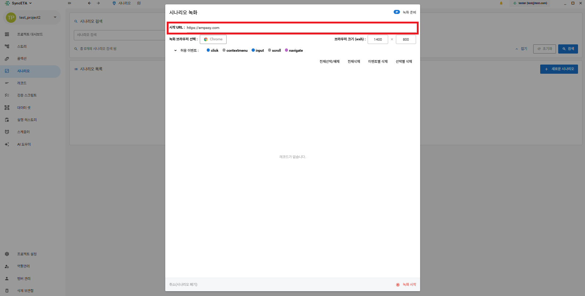

#### 5. 실행시킬 브라우저를 선택합니다.

::: info

- 시나리오 생성시 설정한 브라우저 외의 다른 브라우저로 크로스 브라우징 테스트가 가능합니다.  
  EX) chrome 으로 시나리오 생성 → edge 로 테스트 가능
  :::

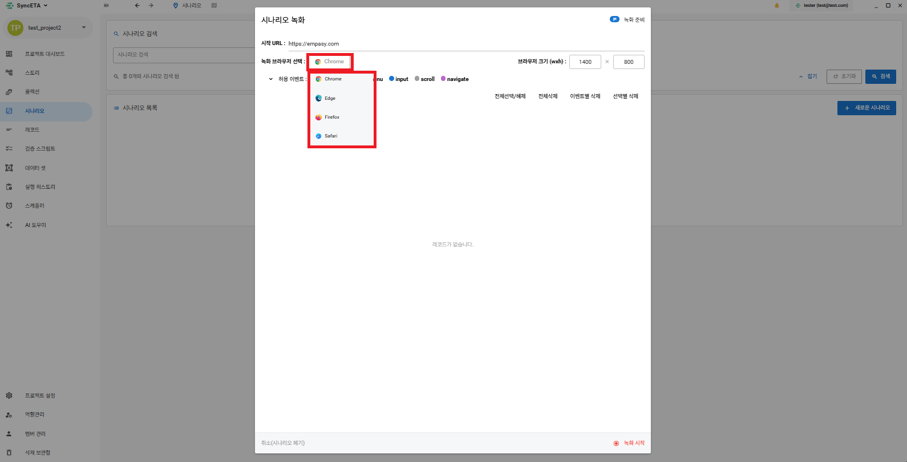

#### 6. 브라우저의 사이즈를 설정합니다.

::: info

- 시나리오 실행시 브라우저 사이즈를 변경할 수 있습니다.  
   EX) 시나리오 생성시 1400 _x_ 800 으로 생성 → 800 _x_ 600 으로 테스트 가능
  :::

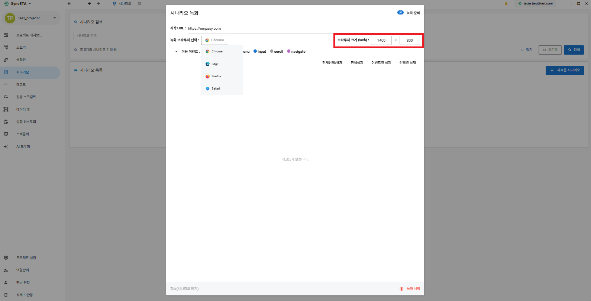

#### 7. 수집 허용 이벤트를 설정합니다.

::: info

- 기본 세팅으로 녹화를 진행하시는 것을 권장드립니다.
- 시나리오 녹화가 진행중인 브라우저에서 수집 허용 이벤트(동작) 가 발생하면  
  이벤트가 발생한 요소의 Dom 정보를 수집하여 저장합니다.
  :::

  1. keydown - 키보드 누름
  2. click - 마우스 클릭
  3. contextmenu - 마우스 우클릭
  4. input - 입력
  5. scroll - 스크롤
  6. navigate - url 이동

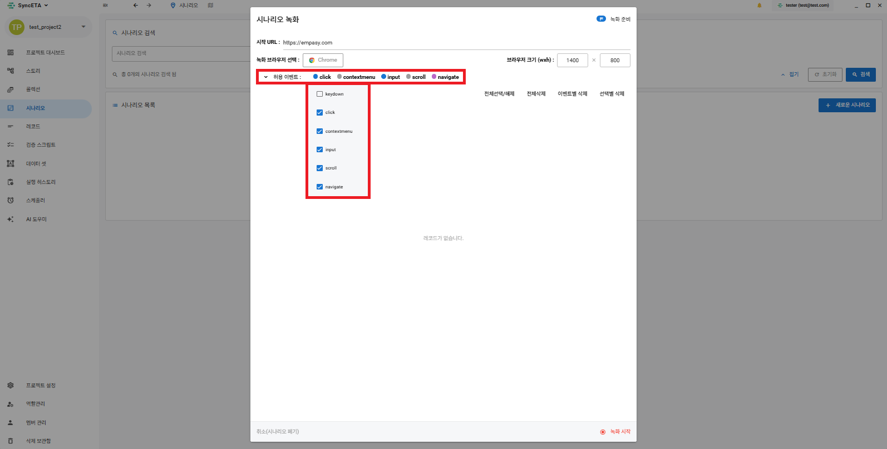

#### 8. 녹화 시작

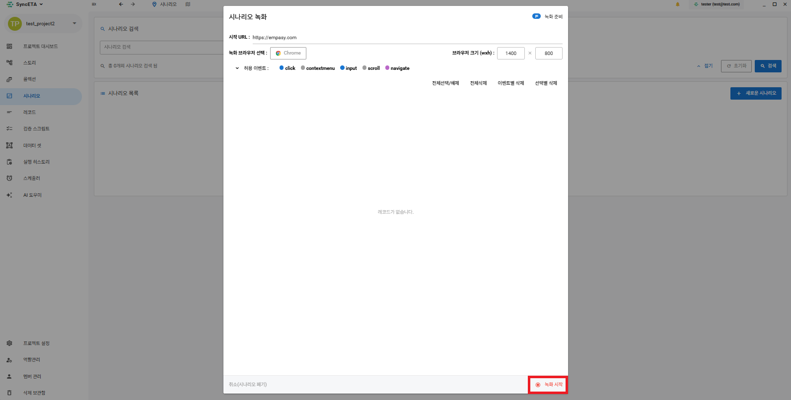

#### 9. 시나리오 녹화

::: info

- 기본 세팅으로 녹화를 진행하시는 것을 권장드립니다.
- 시나리오 녹화가 진행중인 브라우저에서 수집 허용 이벤트(동작) 가 발생하면  
   이벤트가 발생한 요소의 Dom 정보를 수집하여 저장합니다.
  :::

1. 브라우저 설정을 마친 후 녹화 시작 버튼을 클릭합니다.
2. 시나리오 생성용 브라우저가 노출되면 실제 테스트를 진행합니다.
3. 브라우저에서 허용 이벤트가 발생하면, 이벤트가 발생한 요소의 Dom 정보를 수집합니다.
4. 테스트를 완료하면 녹화 종료 버튼을 클릭한 후 시나리오명과 설명을 작성합니다.

<iframe width="100%" height="400" src="https://www.youtube.com/embed/vrd4gT8A10Q" frameborder="0" allowfullscreen allow="autoplay; encrypted-media"></iframe>

#### 10. 여러개의 탭 녹화

::: info

- 새 탭을 연 후 녹화할 url로 이동합니다.
- url 이동 레코드를 직접 이동 레코드로 설정합니다.(우클릭)
:::
<iframe width="100%" height="400" src="https://www.youtube.com/embed/8e5dqQvxMQM" frameborder="0" allowfullscreen allow="autoplay; encrypted-media"></iframe>

## 대기 레코드

#### 대기시간이 필요한 레코드 우클릭 -> 조건 레코드 추가 -> 대기 조건 추가

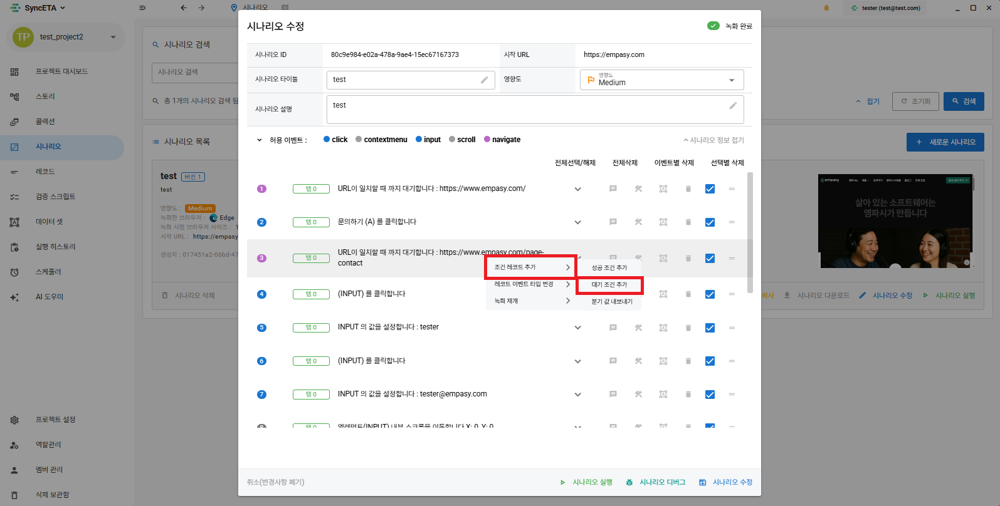

#### 대기 유형: 시간대기 선택

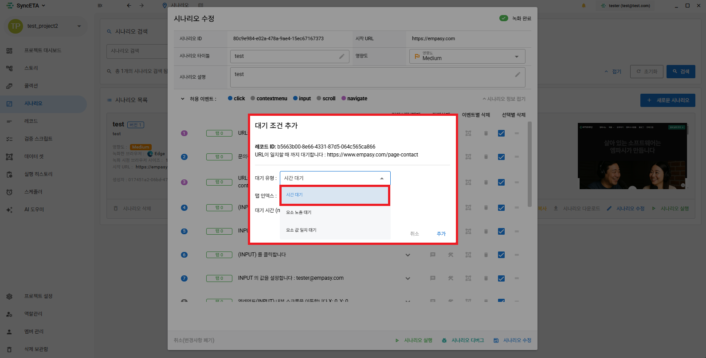

#### (탭 인덱스는 자동으로 설정됩니다.) 대기 시간: 1000 = 1초

::: info

- 시간 대기 레코드는 설정한 시간만큼 레코드 실행 간에 강제적으로 딜레이를 부여합니다.
- 화면에 요소들이 로딩되는 시간을 고려하여 설정해주세요.
:::
<iframe width="100%" height="400" src="https://www.youtube.com/embed/XwzE1Qzl_58" frameborder="0" allowfullscreen allow="autoplay; encrypted-media"></iframe>

## 검증 레코드

#### 요소 노출 검증

::: info

- 1. 특정 요소가 화면에 노출되고 있는지 확인(값 검증 X)
- 2. 요소의 특정한 값이 노출되고 있는지 확인(값 검증 O)
     :::

<iframe width="100%" height="400" src="https://www.youtube.com/embed/kAnZnuy6k78" frameborder="0" allowfullscreen allow="autoplay; encrypted-media"></iframe>

#### AI 검증

::: info

- 현재 화면을 캡쳐하여 AI로 화면 검증
  :::

## 부가 기능

#### [ 코멘트 ]

::: info

- 레코드의 설명을 작성하는 기능입니다.  
  EX) 문의사항 click 이벤트 레코드에 **_'상단 대메뉴의 문의사항 클릭'_** 과 같은 식으로 레코드의 설명을 작성합니다.
  :::

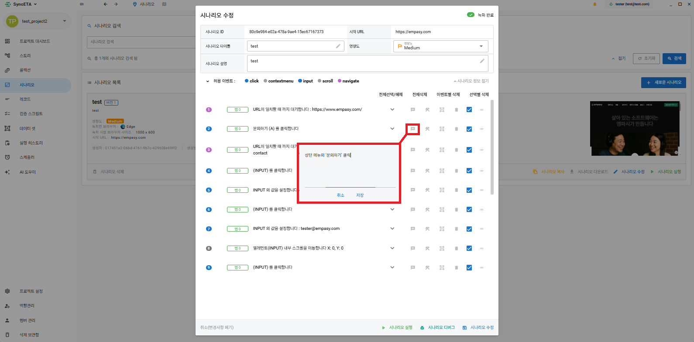

#### [ 실패 복구 스크립트 ]

::: info

- 레코드 실행이 실패했을 경우 실행되는 스크립트 입니다.
  EX) 문의사항 click 을 실패하였을 경우 실행할 스크립트를 입력합니다.
  :::

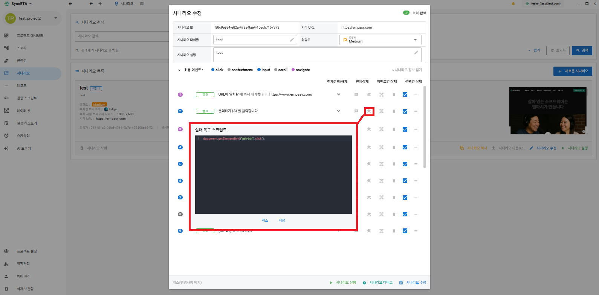

#### [ 데이타셋 ]

::: info

- 변수의 입력 값을 설정합니다.
- 녹화 당시 문의 제목인 **_'test'_** 를 다른 값으로 설정할 수 있습니다.
- 해당 기능은 **_'데이타셋'_** 부분을 참고해주세요.
  :::

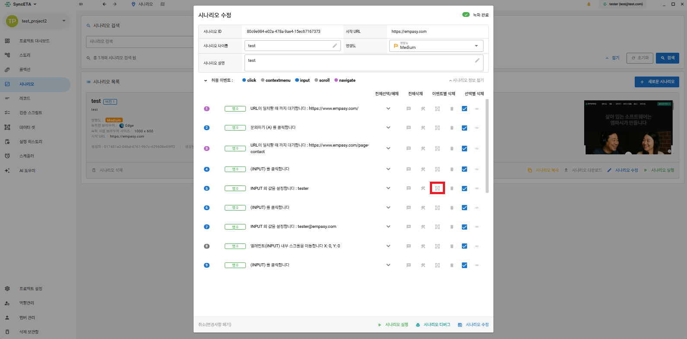

#### [ 삭제 ]

::: info

- 레코드를 삭제합니다.  
  레코드를 바로 삭제하기 보다는 아래의 비활성화 기능을 사용하시는 것을 권장드립니다.
  :::

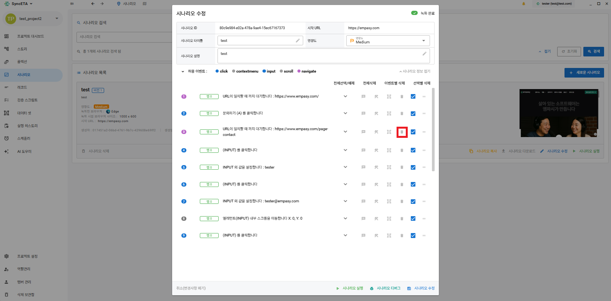

#### [ 비활성화 ]

::: info

- 레코드를 비활성화합니다.
- 시나리오의 실행 과정에서 비활성화 레코드는 제외됩니다.
  :::

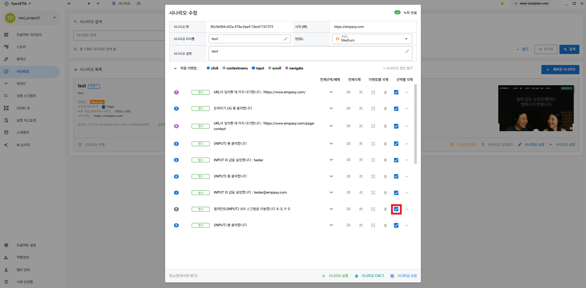
