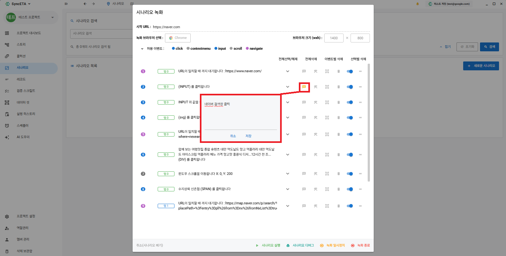

# 시나리오

SyncETA를 사용하여 복잡한 테스트 코드 작성 없이 실제 UI를 통해 테스트 케이스를 생성하고  
관리할 수 있습니다.

## 시나리오란

#### **_'시나리오'_** 는 아래와 같은 기능 테스트 단위를 의미합니다.

##### [ **_'empasy'_** 홈페이지에 접속하여 문의 전송 ]

1. **_'empasy'_** 홈페이지 접속.
2. **_'문의 하기'_** 클릭.
3. 문의 내용 입력.
4. 문의 보내기.
5. 정상 전송 확인.

## 시나리오 생성

#### 1. 시나리오 메뉴 이동

::: info

1. 좌측 사이드바의 **_'시나리오'_** 메뉴 클릭
2. 우측 상단의 **_'새로운 시나리오'_** 클릭
3. 시나리오 녹화시 필요한 설정 모달이 노출됩니다.
   :::
   

#### 2. 녹화 브라우저 설정

::: info

1. 시나리오를 생성할 웹페이지의 url을 입력합니다.
2. 녹화를 진행할 브라우저를 선택합니다.
3. 녹화를 진행할 브라우저의 크기를 설정합니다.
   :::
   

#### 3. 수집 이벤트 설정

::: info

- 수집할 이벤트 타입을 선택한 후 모달 우측 하단의 녹화 시작 버튼을 눌러주세요.  
  기본 설정으로 녹화를 진행하는 것을 권장합니다.
  :::
  

#### 4. 녹화 시작

::: info
녹화를 시작하면 브라우저가 화면에 나타납니다.  
해당 브라우저에서 실제 테스트를 진행해주세요.  
EX) 네이버에 **_'주변 맛집'_** 검색

사진과 같이 레코드가 수집된 것을 확인할 수 있습니다.

1. url 이동
2. 검색창 클릭
3. 검색어(**_'주변 맛집'_**) 입력
4. 검색 버튼 클릭
   :::
   

#### 4. 돔 정보 수집

::: info

- 모든 레코드는 이벤트가 발생한 dom의 정보를 가지고 있습니다.  
  EX) 검색어(**_'주변 맛집'_**)를 입력한 input 요소의 속성 수집
  :::
  

#### 5. 녹화중 새 탭이 열릴 경우

::: info
브라우저에서 추가된 모든 탭에서 동일하게 시나리오 녹화를 이어갈 수 있습니다.
:::

## 대기 레코드

::: info
레코드의 실행 간에 특정 조건을 만족할 때까지 대기 시간을 부여하는 기능입니다.
:::

#### 1. 시간 대기 조건 추가

::: info
레코드 실행 전 대기시간을 부여합니다.

1. 대기가 필요한 요소를 우클릭합니다.
2. 대기 조건 추가를 클릭한 후 대기 시간을 설정합니다. (1000 = 1초)
   :::
   레코드 우클릭
   
   대기 시간 설정
   
   대기 레코드 생성
   
   ::: info
   EX) url 이동 후 화면 로딩(네트워크 상황을 고려하여 약 3초)시간동안 대기 후 검색창을 클릭 하도록 시간 대기 조건을 추가
   :::

## 검증 레코드

## 부가 기능

#### 1. 노트 기능

::: info
레코드의 내용을 입력합니다.
:::

#### 2. 실패 복구 스크립트

::: info
레코드가 실패했을 경우 복구 스크립트가 실행됩니다.
:::

#### 3. 데이타셋

::: info
입력 값을 지정합니다.  
EX) 검색어(**_'주변 맛집'_**)를 사용자가 지정한 값으로 치환합니다.  
** 상세 설명은 **_'데이타셋'_\*\* 참고
:::

#### 4. 삭제

::: info
수집 레코드를 삭제합니다.  
EX) 녹화중 잘못된 부분을 클릭한 경우 해당 레코드를 삭제합니다.
:::

#### 5. 비활성화

::: info
수집한 정보를 삭제하지 않고 실행시 제외합니다.
:::

