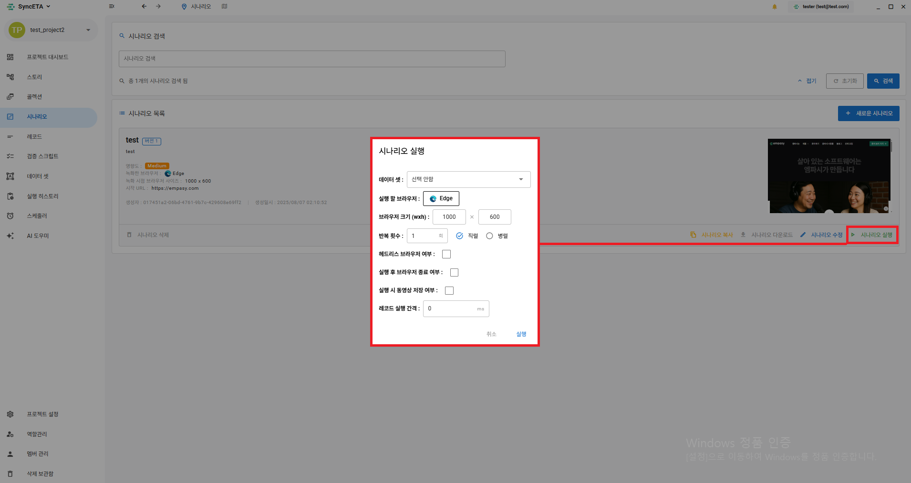
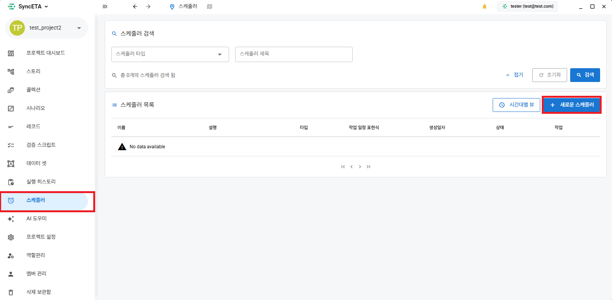
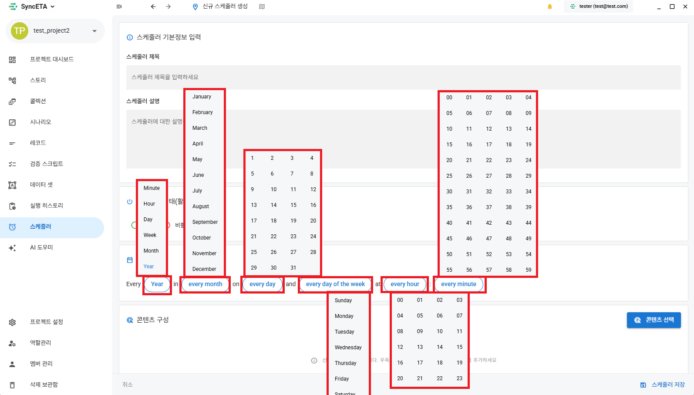
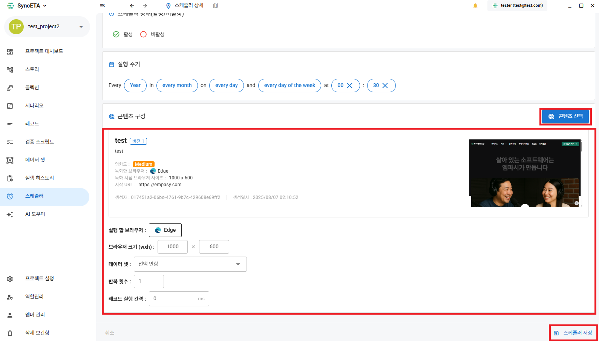
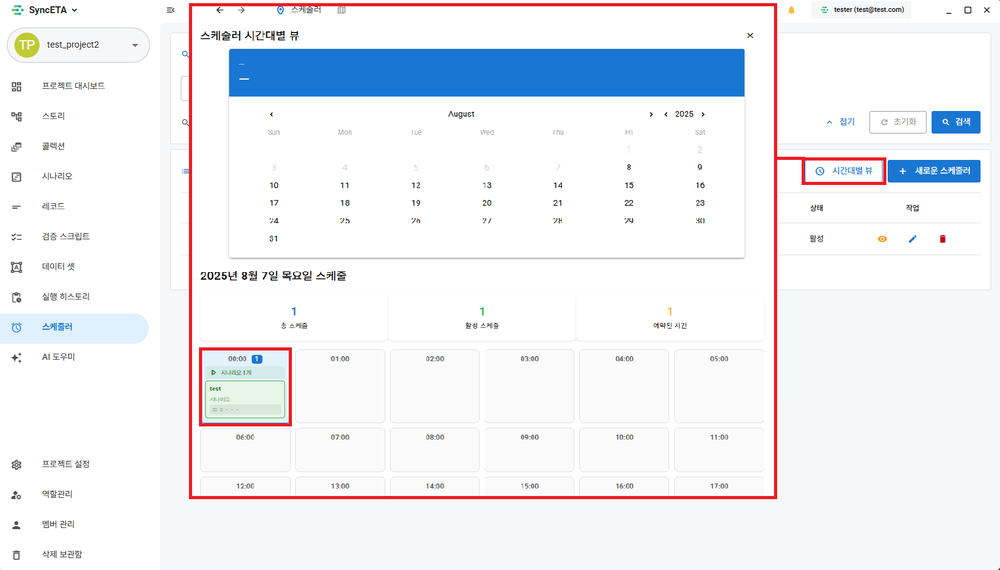

# 실행 방법

#### SyncETA를 통해   E2E 테스트를 자동화 하는 여러가지 방법을 소개합니다.

##### 1. 시나리오 직접 실행

##### 2. 스케줄러를 통한 자동 실행

::: info

- 직접 실행은 SyncETA가 설치된 Pc에서 직접 브라우저를 띄워 시나리오를 실행합니다.
- 스케줄러는 설정된 시간에 맞춰 서버에서 시나리오를 실행하고 그 결과를 영상과 함께 제공합니다.
  :::

##### 3. **_'스토리'_** 기능을 통해 여러 시나리오를 조합하여 통합 테스트 진행

##### 4. **_'컬랙션'_** 기능을 통해 여러 시나리오를 직/병렬로 실행

##### 5. **_'데이타셋'_** 기능을 통해 입력값을 설정하여 시나리오를 실행

::: info

- **_'스토리'_**, **_'컬랙션'_**, **_'데이타셋'_** 기능은 각 메뉴를 참고해주세요.
  :::

## 직접 실행

<iframe width="100%" height="400" src="https://www.youtube.com/embed/ZTwlHnBf3lY" frameborder="0" allowfullscreen allow="autoplay; encrypted-media"></iframe>

::: info

- 시나리오 실행 전 여러가지 설정이 가능합니다.
  :::
  

##### 1. 해당 기능은 **_'데이타셋'_** 부분을 참고해주세요.

##### 2. 실행 할 브라우저 - 시나리오를 실행할 브라우저를 선택합니다.

##### 3. 브라우저 크기 - 브라우저의 크기를 설정합니다.

##### 4. 반복 횟수 - 시나리오의 반복 횟수를 실행합니다.

직렬: 동일한 시나리오를 총 N 번 순차적으로 실행합니다.  
병렬: 총 N개의 브라우저로 동시에 시나리오를 실행합니다.

##### 5. 헤드리스 브라우저 여부 체크시: 실제 브라우저를 띄우지 않고 시나리오를 실행합니다.(백그라운드 실행)

##### 6. 실행 후 브라우저 종료 여부 체크시: 시나리오 종료 후 브라우저를 닫습니다.

##### 7. 실행 시 동영상 저장 여부 체크시: 브라우저 화면을 녹화합니다.

##### 8. 레코드 실행 간격: 각 레코드 실행간 기본 대기 시간을 설정합니다.

## 스케줄러 설정

##### 1-1. **_'스케줄러'_** 메뉴로 이동합니다.

##### 1-2. 스케줄러 실행 시간을 설정합니다.

##### 1-3. 시나리오를 선택합니다.

::: info

- 실행 브라우저 타입, 브라우저 사이즈 등을 설정할 수 있습니다.
  :::
  

##### 1-4. 스케줄링 확인

::: info

- 시간대별로 실행되는 시나리오를 확인할 수 있습니다.
  :::
  
