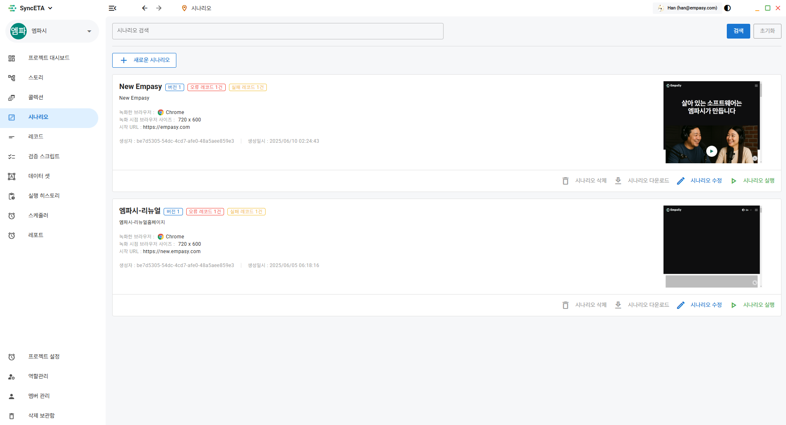
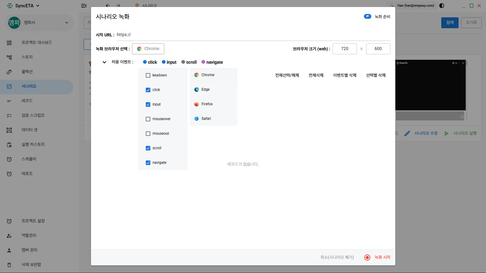
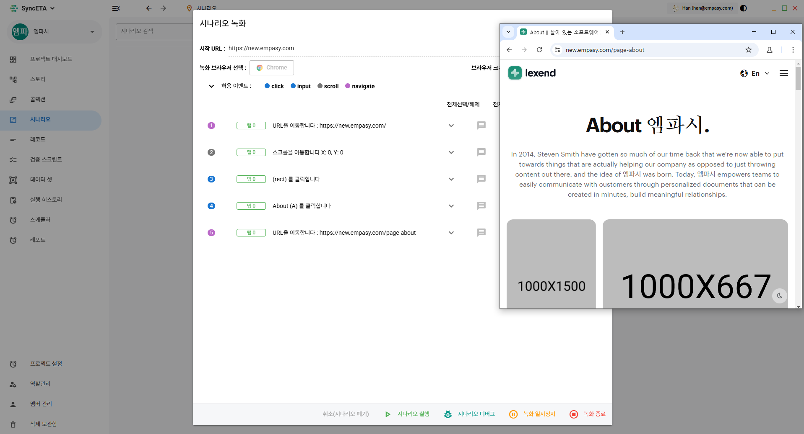
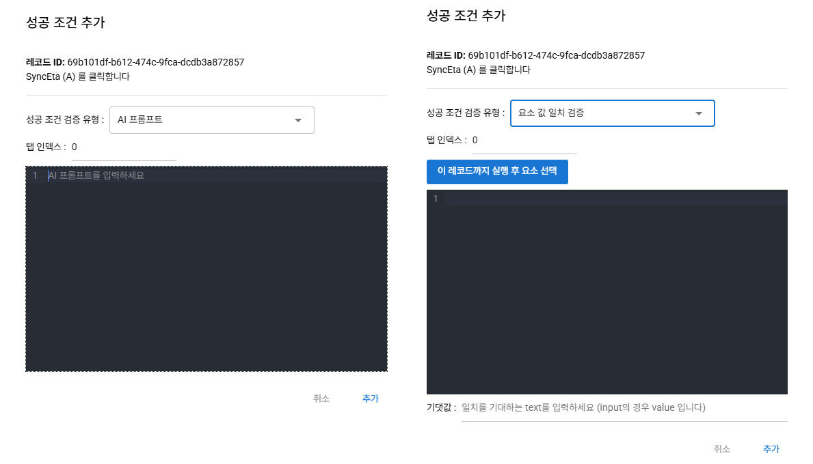
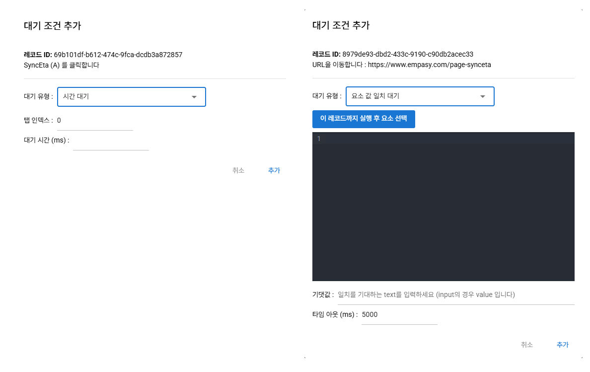
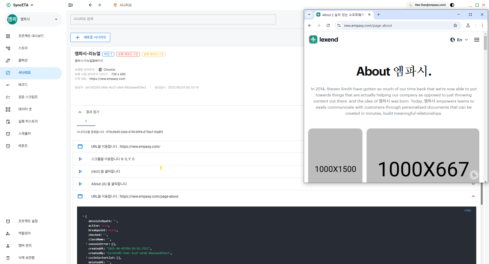

# 시나리오

시나리오는 다양한 사용자 행동(레코드)을 녹화 및 수집하여, 이를 분석하고 재실행함으로써 회귀 테스트를 자동으로 수행하는 기능입니다.

## 목록 조회

시나리오 목록에서는 각 시나리오의 다양한 정보를 한눈에 확인할 수 있습니다. 수정 시에는 버전 관리와
 마지막 실행에 대한 오류 체크가 지원되며, 녹화 당시의 정보와 썸네일 등 다양한 세부 정보를 함께 제공합니다.

## 생성(녹화 하기)

다양한 사용자의 행동을 선택적으로 수집할 수 있으며, 원하는 이벤트만 지정하여 기록할 수 있습니다.  
또한, 자체적으로 브라우저 크기를 설정할 수 있고, Chrome, Edge, Safari 등 여러 브라우저를 지원하여  
크로스브라우징 테스트를 원활하게 수행할 수 있습니다

::: tip 시나리오 녹화 옵션 설명
| 항목 | 설명 |
|---------------|------------------------------------------------------------------------|
| **시작URL** | 녹화할 대상 웹페이지의 URL을 입력합니다. |
| **녹화 브라우저 선택** | 녹화를 진행 할 브라우저를 선택합니다. (실행 시 변경가능) |
| **허용 이벤트** | 녹화 시 입력 받을 이벤트를 설정합니다.   (click, input, scroll, navigate 기본 선택 옵션) |
| **브라우저 크기** | 녹화할 브라우저의 크기를 설정합니다. (PC/Mobile 크기 지원) |
| **녹화 시작** | 녹화시작 버튼 클릭 시 위 옵션들을 기반으로 브라우저가 생성되며 사용자의  이벤트 수집을 시작합니다. |
:::

## 사용자 이벤트 수집

1. Socket 통신을 기반으로 사용자의 이벤트를 실시간으로 수집하여 보여줍니다.

---

2. 수집된 이벤트의 정보를 보여주며 검증기능을 제공합니다.

::: tip 레코드 옵션 설명
| 항목 | 설명 |
|---------------|------------------------------------------------------------------------|
| **댓글** | 사용자 이벤트(레코드) 각각에 댓글로 해당 기능에 대한 질의응답이 가능합니다.|
| **실패복구스크립트** | 레코드 실행 실패 시, 직접 Script 코드를 작성하여 자동으로 복구할 수 있습니다. |
| **변수 설정** | 해당 레코드에는 변수 값을 할당할 수 있으며, Input 항목의 경우 데이터셋을 활용하여  자동으로 데이터를 매핑할 수 있으며, AI를 활용한 다양한 데이터셋 지원 기능도 제공합니다. |
| **삭제** | 잘못 수집된 레코드는 언제든지 삭제하여 관리할 수 있습니다. |
| **체크박스** | 체크된 레코드에 한해서 실행하여 데이터 무결성을 확보합니다 |
| **순서변경** | 각 레코드는 드래그 앤 드롭 등으로 순서를 자유롭게 변경할 수 있어, 원하는 실행 흐름에 맞게   손쉽게 관리할 수 있습니다 |
:::

---

3. 성공 조건 추가

다양한 성공조건 옵션을 제공하여, 추가적인 데이터 검증을 손쉽게 수행할 수 있습니다.

:::tip
요소 값 일치 검증 기능은 특정 이벤트의 변경을 감지하거나 값의 변화를 확인하여, 사용자가 설정한 기대값과 요소의 값이 일치할 경우 성공으로 처리하는 조건입니다.
:::

---

4. 대기 조건 추가

대기 조건을 추가하여, 특정 상황이나 요소가 충족될 때까지 테스트 실행을 지연시킬 수 있습니다.

:::tip
요소 값 일치 대기 기능은 특정 이벤트의 변경을 감지하거나 값의 변화를 확인하여, 사용자가 설정한 기대값과   일치할 때까지 테스트 실행을 대기하는 조건입니다
:::

## 저장하기

녹화 종료 후 각 레코드 별 옵션을 추가로 설정한 후 저장할 수 있습니다.

- 녹화 중
  
- 녹화 종료 후  
  

## 실행하기

실행 기능을 통해 선택한 시나리오를 자동으로 재현하고, 다양한 검증 및 테스트 과정을 거쳐 결과를 손쉽게 확인할 수 있으며, Socket 통신을 활용하여 테스트가 실시간으로 재현되는 과정을 직접 확인할 수 있습니다.

