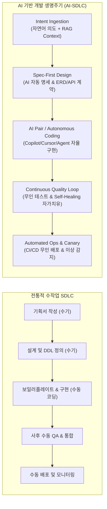
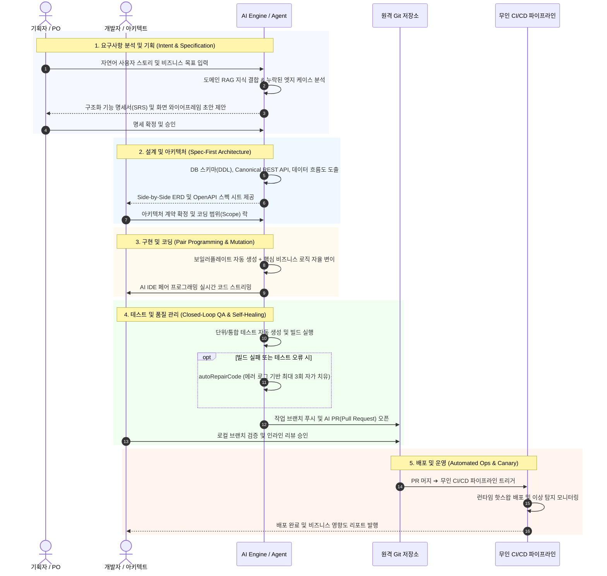
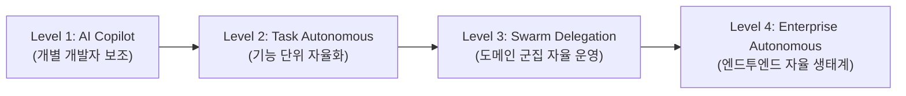

# 🚀 AI 기반 소프트웨어 개발 방법론 (AI-SDLC)

> **요약 한 줄:** AI 기반 소프트웨어 개발(AI-Driven Development)은 비즈니스 요구사항 기획부터 아키텍처 설계, 코드 구현, 자동화 테스트, 무인 배포 및 지속적 운영에 이르는 소프트웨어 개발 생명주기(SDLC) 전 과정에 생성형 AI와 자율 에이전트를 결합하여 **개발 생산성과 소프트웨어 품질을 동시 혁신하는 차세대 엔지니어링 방법론**입니다.

::: tip 📚 실전 프로젝트 단계별 플레이북 바로가기 (Quick Navigation)
프로젝트 진행 시 필요한 단계의 실전 가이드와 복사 가능한 프롬프트 레시피를 바로 확인하세요:
* 📋 **[01단계: 기획 및 요구사항 구체화 플레이북](./ai-sdlc-01-requirements.md)** (PO/기획자용)
* 🏛️ **[02단계: 스펙 퍼스트 아키텍처 및 DDL/API 설계 플레이북](./ai-sdlc-02-architecture.md)** (아키텍트용)
* 💻 **[03단계: AI 페어 코딩 및 자율 구현 플레이북](./ai-sdlc-03-implementation.md)** (개발자용)
* 🧪 **[04단계: 테스트 자동화 및 4-Cycle 자가 치유 플레이북](./ai-sdlc-04-testing.md)** (QA/개발자용)
* 🚢 **[05단계: AI PR 리뷰 및 무인 배포 플레이북](./ai-sdlc-05-review-deploy.md)** (리뷰어/DevOps용)
* 📖 **[부록: 상황별 실전 프롬프트 레시피북 (치트시트)](./ai-sdlc-prompt-recipes.md)** (전체 공통)
:::

---

## 1. 문서 개요 및 정의

### 1.1. AI 기반 개발의 배경 및 필요성

#### 전통적 소프트웨어 개발(Traditional SDLC)의 한계
전통적인 폭포수(Waterfall) 및 애자일(Agile/Scrum) 모델은 **인간 개발자의 수기 타이핑과 인지적 한계**에 전적으로 의존해 왔습니다. 
* **인지적 병목과 반복 노동**: 전체 개발 공수의 50~70%가 DTO/Entity 매핑, CRUD 보일러플레이트, 설정 파일 작성, 반복 단위 테스트 등 정형화된 작업에 소모됩니다.
* **의사소통 비용 및 사양 왜곡**: 비즈니스 기획자의 요구사항이 기획서 ➔ 티켓 ➔ 개발자 해석을 거치며 변질되어 잦은 재작업(Rework)이 발생합니다.
* **지연된 통합 및 사후 품질 검증**: 개발 후반부나 릴리즈 직전에야 인터페이스 불일치, 회귀 결함, 보안 취약점이 발견되어 높은 수정 비용이 발생합니다.
* **문서와 코드의 비동기화(Documentation Drift)**: 일정 압박으로 소스코드는 갱신되지만 API 스펙과 아키텍처 문서는 방치되어 기술 부채가 누적됩니다.

#### AI 도입의 효과 및 패러다임 전환
생성형 AI(LLM)와 자율 에이전트(Autonomous Agent)의 발전은 개발자의 역할을 **단순 '코드 작성자(Typer)'에서 '시스템 아키텍트이자 사양 검증자(Reviewer & Intent Specifier)'**로 전환시킵니다.



| 비교 항목 | 전통적 개발 방식 | AI 기반 개발 방법론 (AI-SDLC) | 기대 효과 |
| :--- | :--- | :--- | :--- |
| **요구사항 정의** | 수십~수백 페이지의 정적 SRS | 대화형 요구사항 구체화 + 구조화 프롬프트 + 명세 자동 생성 | 의사소통 왜곡 80% 감소 |
| **아키텍처/설계** | 수작업 다이어그램 및 수동 ERD 작성 | 스키마 DDL, OpenAPI, 인터페이스 계약 선행 자동 도출 | 설계 일관성 100% 확보 |
| **코드 구현** | 개발자가 IDE에서 모든 파일 수기 작성 | AI 페어 프로그래밍 + 멀티 에이전트 자율 코드 변이 | 개발 속도(Velocity) 2~5배 향상 |
| **테스트 & QA** | 사후 수동 테스트 케이스 작성 및 QA | 엣지 케이스 포함 테스트 자동 생성 + 자가 치유(Self-Healing) | 결함 검출 리드타임 90% 단축 |
| **문서 동기화** | 코드와 문서의 빈번한 불일치 | 코드-명세-테스트 1:1 양방향 실시간 동기화 | 문서 부채 영구 제거 |

---

### 1.2. 목표 및 적용 범위

#### 도입 목표
1. **개발 리드타임 단축**: 아이디어 기획부터 프로덕션 배포까지의 사이클 타임을 70% 이상 단축.
2. **소프트웨어 품질 및 무결성 제고**: 선행 명세(Spec-First) 및 4-Cycle 회귀 검증을 통해 릴리즈 초기 결함률 80% 감소.
3. **개발자 경험(DevEx) 극대화**: 단순 반복 코딩을 제거하고 비즈니스 도메인 로직과 고난도 알고리즘에 집중.

#### 적용 범위
* **레벨 1 (코딩 어시스턴트 단계)**: 개별 개발자의 IDE 내 코드 자동완성, 리팩토링, 단위 테스트 작성 보조.
* **레벨 2 (기능 단위 자율 생성 단계)**: 명세서 기반 단일 기능/모듈의 E2E 자율 코드 생성 및 빌드 검증.
* **레벨 3 (엔터프라이즈 전사 SDLC 단계)**: 기획(User Story), 설계(ERD/API), 구현, 무인 CI/CD 배포 및 장애 관제에 이르는 전 프로세스에 Multi-Agent Swarm 체계 적용.

---

### 1.3. 핵심 용어 정리

* **LLM (Large Language Model, 거대 언어 모델)**: 방대한 코드와 텍스트 데이터를 학습하여 프로그래밍 언어 문법, 아키텍처 패턴, 자연어 맥락을 이해하고 생성하는 기초 모델(예: Claude 3.7 Sonnet, GPT-4o, DeepSeek V3/R1).
* **RAG (Retrieval-Augmented Generation, 검색 증강 생성)**: 모델의 환각(Hallucination)을 방지하고 사내 프레임워크, 도메인 규칙, 레거시 API 문서를 벡터 DB(pgvector 등)에서 실시간 검색하여 컨텍스트로 주입하는 기술.
* **AI 에이전트 (AI Agent)**: 단순 텍스트 생성을 넘어, 자율적으로 목표(Goal)를 분석하고 작업 계획을 수립하며 터미널 명령어, 파일 수정, API 호출 등의 도구(Tools)를 실행하는 자율 소프트웨어 주체.
* **A2A (Agent-to-Agent)**: 에이전트 간 분업을 수행하는 협업 프로토콜(예: Copywriter 에이전트 ➔ SEO 에이전트 ➔ Publisher 에이전트).
* **MCP (Model Context Protocol)**: LLM 에이전트가 로컬 파일, DB, 외부 REST API, 개발 도구와 안전하게 상호작용하기 위해 앤트로픽(Anthropic)이 제정한 표준 통신 프로토콜.
* **Self-Healing (자가 치유)**: 컴파일 에러, 단위 테스트 실패, 런타임 예외 발생 시 에러 로그를 분석하여 AI가 스스로 코드를 수정하고 재빌드하는 무인 복구 루프.
* **HITL (Human-in-the-Loop)**: AI가 모든 작업을 자동 수행하되, DB 스키마 변경, 프로덕션 배포 등 위험 작업에 대해 인간 관리자의 승인(Approval)을 필수 거치도록 하는 안전 거버넌스.

---

## 2. AI 기반 개발 생명주기 (AI-SDLC 5단계)



---

### 2.1. 요구사항 분석 및 기획 (Requirements & Planning)

1. **사용자 스토리 및 인수 조건(Acceptance Criteria) 자동 구체화**:
   * 기획자가 한두 줄의 추상적인 요구사항("회원가입 시 전화번호 인증 추가해줘")을 입력하면, AI가 RAG를 통해 기존 사용자 모델을 참조하여 **Given-When-Then** 형식의 상세 인수 조건을 도출합니다.
   * 누락되기 쉬운 예외 상황(인증번호 5회 초과 오류, 해외 번호 포맷, 타임아웃 처리 등)을 AI가 선제적으로 질문하여 기획 완성도를 높입니다.
2. **기능 명세서(Functional Spec) 및 와이어프레임 자동 생성**:
   * API 입출력 파라미터, 유효성 검증 규칙, 에러 코드 매핑을 포함한 마크다운 기능 명세서를 자동 생성합니다.
   * 프론트엔드 UI 화면의 경우 텍스트 기반 와이어프레임(Markdown Table, Mermaid UI Mockup)을 함께 제시하여 이해관계자 간 시각적 합의를 형성합니다.

---

### 2.2. 설계 및 아키텍처 (Design & Architecture)

1. **Spec-First 설계 원칙**:
   * 코드를 작성하기 전에 **데이터 모델(DB ERD)**과 **인터페이스(REST API)**를 선행 확정합니다.
2. **DB 스키마(DDL) 자동 구상 및 정합성 검증**:
   * PostgreSQL 등 타겟 RDBMS에 맞는 DDL 스크립트를 자동 생성합니다.
   * 인덱스 전략(B-Tree, GiST, GIN, Vector Index), 외래키 제약조건, 데이터 정규화 규칙을 준수하며, 기존 테이블에 미치는 영향도를 'Side-by-Side ERD'로 시각화합니다.
3. **Canonical REST API 계약 선행 정의**:
   * `/api/v1/{domain}/{resource}`와 같은 단일 표준 엔드포인트 명세를 OpenAPI(Swagger) 규격으로 선행 정의합니다.
   * 백엔드와 프론트엔드가 이 명세를 기준으로 병렬(Parallel) 개발을 착수할 수 있도록 인터페이스 계약을 락(Lock)합니다.

---

### 2.3. 구현 및 코딩 (Implementation & Coding)

1. **AI 페어 프로그래밍 (AI Pair Programming)**:
   * **인라인 완성(Inline Completion)**: GitHub Copilot, Cursor Tab 등을 통해 작성 중인 함수의 다음 로직, 예외 처리 블록, 타입 캐스팅을 실시간 예측 자동완성합니다.
   * **대화형 컨텍스트 코딩(Chat & Composer)**: 프로젝트 전체 코드베이스를 `@workspace` 컨텍스트로 참조하여 여러 파일에 걸친 동시 수정(Cross-file Modification)을 수행합니다.
2. **전사 표준 및 보일러플레이트 자동화**:
   * 백엔드 DTO, Entity, Repository, Mapper, Service, Controller 레이어를 프로젝트 코딩 컨벤션(예: Lombok 애너테이션, 생성자 주입, Canonical URL)에 맞춰 무결하게 생성합니다.
   * 프론트엔드는 전사 표준 모달(`BasicModal`), 폼 스키마, DB 동적 메뉴 라우팅 규격을 자동 준수하도록 강제합니다.
3. **자율 코드 변이 (Autonomous Code Mutation)**:
   * 수정 허용 파일 목록(`focusFiles`)을 지정하여, AI 에이전트가 파일 탐색, 구문 분석, 코드 수정을 자율 실행하되 지정된 범위 밖의 사이드 이펙트를 차단합니다.

---

### 2.4. 테스트 및 품질 관리 (Testing & Quality Assurance)

1. **테스트 케이스 자동 생성**:
   * 정상 경로(Happy Path)뿐만 아니라 경계값(Boundary Value), Null 입력, 동시성 충돌 등 가혹한 엣지 케이스 단위 테스트를 JUnit 5 / Vitest 코드로 자동 생성합니다.
2. **Zero-Mock 원칙에 입각한 E2E 통합 검증**:
   * 가짜 더미 리턴(`return null`, 빈 배열)을 배제하고, 실제 DB 컨테이너와 결합된 통합 테스트를 실행합니다.
3. **4-Cycle 폐쇄 루프 및 자가 치유 (Self-Healing Loop)**:
   * **Cycle 1**: `compile` 검증 (문법 및 타입 안정성).
   * **Cycle 2**: API/DTO/Entity 인터페이스 일치성 검증.
   * **Cycle 3**: 비즈니스 로직 단위/통합 테스트 검증.
   * **Cycle 4**: 전체 Clean 패키징 빌드 검증.
   * 빌드 실패 시 에러 스택 트레이스를 분석하여 AI가 `autoRepairCode`를 최대 3회 자동 실행하여 수정합니다.

---

### 2.5. 배포 및 운영 (Deployment & Operations)

1. **AI 기반 PR(Pull Request) 및 변경점 요약**:
   * 작업 브랜치(`feat/xxx`) 푸시 시, AI가 Unified Diff를 분석하여 비즈니스 변경 목적, 영향받는 컴포넌트, 테스트 결과 요약을 마크다운 PR 본문으로 자동 작성합니다.
2. **인간 개발자 인라인 코드 리뷰 (Co-Dev Review)**:
   * 사내 개발자가 PR Diff 화면에서 라인별 인라인 피드백을 남기면, AI가 해당 코멘트를 인식하여 부분 재수정 커밋을 자동 발행합니다.
3. **무인 CI/CD 배포 및 이상 감지**:
   * Multi-Party HITL 승인 완료 시 프로덕션 클러스터에 무인 배포됩니다.
   * 배포 후 APM 및 분산 로그를 AI가 실시간 모니터링하여 평소 대비 에러율 급증 시 즉각 1-클릭 롤백을 수행합니다.

---

## 3. 도구 및 기술 스택 (Toolchain)

### 3.1. 코드 작성 및 보조 도구 비교

| 도구 분류 | 대표 도구 | 주요 강점 | 추천 적용 영역 |
| :--- | :--- | :--- | :--- |
| **IDE 임베디드 AI** | **Cursor** | • 로컬 코드베이스 전체 임베딩 및 인덱싱<br/>• 다중 파일 동시 수정 (Composer)<br/>• 터미널 명령어 연동 및 자율 실행 | 신규 기능 개발, 복수 파일 동시 리팩토링 |
| **인라인 어시스턴트** | **GitHub Copilot** | • VS Code, IntelliJ 완벽 통합<br/>• 빠르고 자연스러운 인라인 자동완성<br/>• GitHub Enterprise 보안 및 엔터프라이즈 관리 | 일상적인 코딩, 단순 반복 보일러플레이트 작성 |
| **자율 코딩 CLI/SDK** | **Claude Code** / **OpenSWE** | • 터미널 기반 자율 파일 수정 및 빌드 실행<br/>• 이슈 티켓 기반 무인 버그 픽스<br/>• Git 브랜치 관리 및 PR 자동 생성 | 대규모 배치 리팩토링, CI 빌드 에러 자가 치유 |
| **엔터프라이즈 에이전트** | **Google Antigravity SDK** / **SyncVerse** | • A2A 멀티 에이전트 오케스트레이션<br/>• 4-Stage Spec-First 위저드 파이프라인<br/>• Multi-HITL 승인 결재선 및 KMS 암호화 통제 | 엔터프라이즈 시스템 구축, 미션 크리티컬 SDLC |

---

### 3.2. 실무 프롬프트 엔지니어링 가이드 (Template)

AI에게 정밀하고 일관된 산출물을 유도하기 위해 **역할(Role) - 컨텍스트(Context) - 제약사항(Constraints) - 출력형식(Output Format)** 4단 구조 프롬프트를 표준화합니다.

#### 템플릿 1: 기능 명세 및 DDL 설계 프롬프트
```markdown
[Role] 당신은 15년 차 시니어 백엔드 아키텍트입니다.
[Context] 전자상거래 시스템의 '장바구니(Cart)' 도메인에 신규 할인 쿠폰 적용 기능을 개발 중입니다. 기존 DB는 PostgreSQL 17을 사용합니다.
[Requirements]
- 사용자는 보유한 쿠폰 중 1개를 장바구니에 적용할 수 있습니다.
- 최소 주문 금액 조건과 최대 할인 금액 한도를 검증해야 합니다.
[Constraints]
- 테이블명은 cart_coupon_history로 생성하세요.
- ON CONFLICT 임시 구문을 사용하지 마세요.
- Lombok 애너테이션(@Getter, @Builder, @RequiredArgsConstructor)을 필수 적용하세요.
- Canonical REST API 엔드포인트는 /api/v1/shop/cart/coupon으로 설계하세요.
[Output Format]
1. 6단계 표준 DDL 스키마 (02_schema_domain.sql)
2. Request/Response DTO Java 클래스 코드
3. Spring Controller 메서드 시그니처
```

#### 템플릿 2: 버그 수정 및 자가 치유(Self-Healing) 프롬프트
```markdown
[Role] 당신은 소프트웨어 디버깅 및 자가 치유 전문 AI 에이전트입니다.
[Context] Maven 빌드 중 아래와 같은 컴파일/테스트 에러가 발생했습니다.
[Error Log]
{{BUILD_ERROR_LOG}}
[Target File]
{{SOURCE_CODE_CONTENT}}
[Instructions]
1. 오류의 근본 원인(Root Cause)을 2문장 이내로 분석하세요.
2. 타겟 파일의 기존 비즈니스 로직을 보존하면서 오류를 수정한 Drop-in 교체 코드를 제시하세요.
3. 수정으로 인한 부작용(Side Effect)이 없는지 확인하세요.
```

---

### 3.3. 보안 및 저작권 가이드라인 (Security & Compliance)

1. **기업 민감 데이터 및 소스코드 보호 (Zero-Data-Retention)**:
   * 상용 퍼블릭 LLM 사용 시, 기업 소스코드가 AI 모델 학습(Training)에 사용되지 않도록 **Zero Data Retention(ZDR)** 계약 또는 엔터프라이즈 라이선스를 체결해야 합니다.
   * API Key, 비밀번호, 고객 개인정보(PII)는 AI 프롬프트에 직접 노출되지 않도록 전송 전 클라이언트/게이트웨이 단에서 정규식 마스킹을 수행합니다.
2. **오픈소스 라이선스 오염 방지**:
   * AI가 제안한 코드가 GPL 등 전염성 높은 라이선스 코드를 무단 복제하지 않도록, IDE 도구의 '공개 코드 참조 차단(Block suggestions matching public code)' 옵션을 활성화합니다.
3. **생성 코드 보안 취약점 감사 (SAST)**:
   * AI가 생성한 코드에 SQL 인젝션, XSS, 취약한 역직렬화, 암호화 알고리즘 오용이 없는지 SonarQube, Snyk 등 정적 분석 도구로 필수 검증합니다.

---

## 4. 도입 절차 및 성공 전략 (Best Practices)

### 4.1. 단계별 도입 로드맵 (Maturity Model)



* **1단계: 파일럿(Pilot) 도입 (1~2개월)**
  * 혁신 의지가 높은 1~2개 개발팀을 선정하여 GitHub Copilot 또는 Cursor 라이선스 지급.
  * 일상 코딩, 단위 테스트 작성, 레거시 코드 주석 달기에 활용하며 초기 정량 지표 측정.
* **2단계: 표준화 및 가이드라인 정립 (3~4개월)**
  * 사내 프롬프트 템플릿 라이브러리 및 보안 가이드라인 배포.
  * Spec-First 및 4-Cycle 자가 치유 검증 프로세스를 CI 파이프라인에 통합.
* **3단계: 도메인 특화 RAG 및 에이전트 도입 (5~6개월)**
  * 사내 프레임워크 문서와 API 사양을 벡터 DB에 임베딩하여 RAG 지식 파이프라인 가동.
  * 복잡한 비즈니스 로직 생성 시 도메인 전문 에이전트(Swarm) 연동.
* **4단계: 전사 확산 및 자율 운영 정착 (7개월 이후)**
  * 비개발자(기획자/운영자)도 자연어로 요구사항을 인입하고 AI가 PR을 발행하는 자율 협업 문화 정착.

---

### 4.2. 조직 문화 및 역량 강화 (Change Management)

1. **개발자 역량의 재정의**:
   * '코드를 빠르게 타이핑하는 능력'보다 **'요구사항을 정밀하게 구조화(Prompting)하고 시스템 구조를 비판적으로 검증(Reviewing)하는 능력'**을 핵심 엔지니어링 역량으로 육성합니다.
2. **사내 프롬프트 해커톤 및 프롬프트 공유 문화**:
   * 개발 단계별(기획, 설계, 코딩, 테스트) 성공적인 프롬프트 사례를 위키에 지속 공유하고 사내 프롬프트 레지스트리를 운영합니다.
3. **안전한 실패와 점진적 자율성(Progressive Autonomy)**:
   * 도입 초기에는 100% 인간 승인(HITL)을 강제하여 신뢰를 축적하고, 성숙도에 따라 단순 반복 업무는 자동 승인으로 전환합니다.

---

### 4.3. 핵심 성과 측정 지표 (KPI)

| 측정 영역 | 핵심 KPI 지표 | 목표 기준선 (Target) | 측정 방법 |
| :--- | :--- | :---: | :--- |
| **개발 생산성** | **Lead Time for Changes** (기획~배포 소요 시간) | 60% 이상 단축 | Jira 티켓 생성부터 배포 완료까지 시간 측정 |
| | **Code Churn & Velocity** (스프린트 완성도) | 스토리 포인트 40% 증가 | 스프린트 번다운 차트 및 완성 포인트 비교 |
| **소프트웨어 품질** | **Change Failure Rate** (배포 후 장애율) | 5% 미만 유지 | 배포 후 24시간 내 롤백/핫픽스 발생 건수 |
| | **Test Coverage** (단위/통합 테스트 커버리지) | 80% 이상 달성 | SonarQube / JaCoCo 코드 커버리지 리포트 |
| **비용 및 DevEx** | **Developer Satisfaction** (개발자 만족도) | 85점 이상 (NPS) | 분기별 사내 DevEx 설문조사 |
| | **Rework Cost** (사양 왜곡으로 인한 재작업 비율) | 50% 감소 | 기획 변경/재작업 태스크 티켓 집계 |

---

## 5. 결론 및 실천 체크리스트

AI 기반 개발 방법론은 단순한 도구의 변경이 아닌, **소프트웨어 엔지니어링의 일하는 방식을 근본적으로 재설계하는 패러다임 전환**입니다.

### 실천 체크리스트 (Action Checklist)
- [ ] 사내 AI 개발 보안 가이드라인(ZDR 계약, PII 마스킹 정책) 수립 완료
- [ ] 파일럿 대상 도메인 선정 및 선도 개발자 그룹 편성
- [ ] IDE 기반 코딩 도구(Cursor, Copilot 등) 환경 구축 및 온보딩 교육
- [ ] 기능 구현 전 명세(ERD, API 스펙) 선행 확정(Spec-First) 프로세스 적용
- [ ] 4-Cycle 무인 회귀 빌드 및 자가 치유(Self-Healing) 파이프라인 연동
- [ ] 주간/월간 개발 속도 및 결함률 KPI 측정 대시보드 운영
