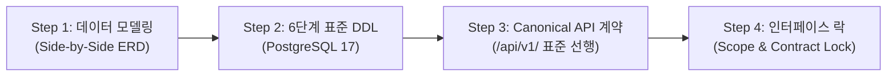

# 🏛️ [02단계] 스펙 퍼스트 아키텍처 및 DDL/API 설계 실전 플레이북

> **단계 요약:** 코딩을 한 줄도 작성하기 전에 **데이터베이스 스키마(PostgreSQL 17 DDL)와 Canonical REST API 규격(OpenAPI/Swagger)**을 100% 선행 확정(Spec-First)함으로써, 백엔드와 프론트엔드가 서로를 기다리지 않고 병렬로 개발할 수 있는 안전한 인터페이스 계약을 수립합니다.

---

## 1. 단계 목적 및 대상 페르소나

* **주요 담당자 (Persona)**: 시스템 아키텍트, 백엔드 수석 개발자, 데이터베이스 관리자(DBA)
* **협업 대상**: 프론트엔드 리드, 보안 담당자
* **목표 소요 시간**: 모듈당 30분 ~ 1시간 이내
* **사용 도구**: Claude 3.7 Sonnet / Cursor Chat / pgAdmin / Swagger Editor

---

## 2. 단계 시작 전제조건 (Definition of Ready - DoR)

본 단계를 시작하기 전에 아래 사항이 준비되어 있어야 합니다:
- [ ] **[01단계] 기능 명세서(SRS)** 및 인수 조건(Acceptance Criteria) 승인 완료
- [ ] 기존 대상 시스템의 ERD 테이블 구조 및 공통 엔티티(BaseEntity, Auditing 필드) 파악
- [ ] 시스템 도메인 접두사(Prefix) 확인 (예: CMS는 `cms_`, Shop은 `pms_`/`oms_`, Core는 `sys_`)

---

## 3. 실전 수행 4단계 워크플로우



### Step 1: 도메인 엔티티 관계(ERD) 도출 및 영향도 분석
요구사항을 충족하는 테이블 구조를 도출하고, 기존 테이블과의 연관관계(1:N, N:M)를 파악합니다. 기존 테이블을 변경해야 하는 경우 'Side-by-Side ERD'를 통해 삭제되거나 수정되는 컬럼의 영향도를 사전 분석합니다.

### Step 2: PostgreSQL 17 6단계 표준 DDL 스크립트 작성
전사 표준인 `<SubProject>/db/` 디렉터리 체계에 맞추어 스크립트를 작성합니다:
* `00_extensions.sql`: `uuid-ossp`, `pg_trgm`, `vector` 확장 선언
* `02_schema_domain.sql`: 업무 테이블 DDL, 기본키(PK), 외래키(FK), 인덱스(INDEX)
* `04_seed_domain.sql`: 업무 메뉴 권한(`sys_permission`) 및 역할 매핑(`sys_role_permission`)
* **절대 원칙**: `ON CONFLICT` 등 임시 회피 구문을 전면 배제하고 고유 ID 기반의 순수 `INSERT INTO` 구문 작성.

### Step 3: Canonical REST API 명세 수립
* **단일 매핑 원칙**: `@RequestMapping({"/a", "/b"})` 등의 다중 매핑을 전면 금지하고 단 하나의 고유 URL만 선언.
* **Canonical 접두사 강제**: 반드시 `/api/v1/{domain}/{resource}` 체계로 정의.
* **OpenAPI 3.0(Swagger) 계약서 도출**: 프론트엔드가 즉시 참조할 수 있도록 Request/Response JSON 스키마 선행 확정.

### Step 4: 인터페이스 계약 잠금 (Contract Lock)
확정된 DDL과 API 명세를 Git 리포지토리 또는 공용 위키에 커밋하여 '인터페이스 계약'을 동결하고, 백엔드와 프론트엔드가 병렬 코딩에 착수합니다.

---

## 4. 즉시 복사 가능한 실전 프롬프트 레시피 (Copy-Paste)

### 📌 프롬프트 1: 엔터프라이즈 PostgreSQL 17 DDL 스키마 생성
```markdown
[Role] 당신은 15년 차 수석 DBA이자 데이터베이스 모델링 전문가입니다.
[Context]
- 데이터베이스: PostgreSQL 17
- 도메인: {{도메인명, 예: shop_coupon}}
- 기능 요구사항:
{{01단계에서 확정된 기능 명세서 내용 입력}}

[Constraints]
1. 테이블명은 소문자 스네이크 케이스({{도메인_엔티티명}})로 명명하세요.
2. 기본키(id)는 BIGSERIAL 또는 UUID 중 시스템 표준(BIGINT)을 적용하세요.
3. created_at, updated_at, created_by, updated_by, del_flag(소프트 딜리트) 표준 감사 컬럼을 포함하세요.
4. 조회 성능을 위해 자주 검색되는 조건(사용자ID, 상태, 날짜)에 인덱스를 명시적으로 생성하세요.
5. 데이터 무결성을 위해 외래키(FK) 및 CHECK 제약조건을 부여하세요.
6. [중요] 임시 충돌 회피 구문(ON CONFLICT DO NOTHING 등)을 절대 사용하지 마세요.

[Output Format]
- Mermaid ERD 다이어그램
- 02_schema_domain.sql 스크립트 (CREATE TABLE 및 CREATE INDEX)
- 테이블 및 컬럼 COMMENT 명세
```

---

### 📌 프롬프트 2: Canonical REST API 명세 및 OpenAPI 3.0 도출
```markdown
[Role] 당신은 RESTful API 설계 및 OpenAPI 3.0 스펙 전문 엔지니어입니다.
[Context] 앞서 도출된 데이터 모델을 기반으로 프론트엔드와 연동할 REST API 명세를 설계하세요.
[Target Resources] {{리소스명, 예: /api/v1/shop/cart/coupon}}

[Constraints]
1. 단일 매핑 원칙: 오직 하나의 고유 Canonical URL만 부여하세요 (복수 URL 매핑 금지).
2. URL Prefix는 반드시 `/api/v1/{product}/{resource}` 규칙을 준수하세요.
3. HTTP 메서드(GET, POST, PUT, DELETE)를 REST 원칙에 맞게 엄격히 사용하세요.
4. 공통 응답 포맷(CommonResult<T>: code, message, result, timestamp)을 적용하세요.
5. 페이징 조회 시 pageNo, pageSize, sortField를 표준화하세요.

[Output Format]
1. API 엔드포인트 목록 요약 표 (Method, URL, 기능설명, 인가권한)
2. 각 엔드포인트별 Request/Response JSON 예시 (성공 및 실패 케이스)
3. OpenAPI 3.0 YAML 스펙 조각
```

---

### 📌 프롬프트 3: Lombok & Spring Boot DTO/Entity 클래스 선행 모델링
```markdown
[Role] 당신은 Spring Boot 백엔드 테크 리드입니다.
[Context] 위 DDL 및 API 명세에 대응하는 Java 도메인 엔티티 및 Request/Response DTO를 작성하세요.

[Constraints]
1. 수동 Getter/Setter 생성을 전면 금지하며, Lombok 애너테이션을 필수 적용하세요.
   - DTO: @Getter, @Setter, @Builder, @NoArgsConstructor, @AllArgsConstructor
   - Entity: @Getter, @NoArgsConstructor(access = AccessLevel.PROTECTED), @AllArgsConstructor, @Builder
2. Jakarta Validation 애너테이션(@NotNull, @NotBlank, @Min, @Size 등)을 DTO에 누락 없이 부여하세요.
3. Entity와 DTO 간의 변환 편의를 위한 static of/toEntity 메서드 또는 매퍼 구조를 제시하세요.
```

---

## 5. 자주 발생하는 AI 실수 및 안티패턴 (Pitfalls)

| 실수 유형 (Pitfall) | AI의 흔한 실수 양상 | 실무 해결책 (Countermeasure) |
| :--- | :--- | :--- |
| **다중 URL 매핑 관행** | 구버전 호환성을 핑계로 `@RequestMapping({"/coupon", "/api/v1/coupon"})` 작성 | 프롬프트에 *"단일 URL 매핑 원칙(Single Canonical Mapping)을 엄격히 강제하고 하위 호환 매핑을 전면 금지할 것"* 명시. |
| **순환 참조 및 보일러플레이트** | 양방향 연관관계 엔티티에 `@Data`를 붙여 `toString()` 무한 루프나 Lazy Loading 에러 유발 | 프롬프트에 *"@Data 사용을 금지하고 @Getter, @NoArgsConstructor, @Builder만 개별 적용할 것"*을 명시. |
| **ON CONFLICT 임시 구문 남발** | 스키마 정합성을 검증하지 않고 `ON CONFLICT DO NOTHING`으로 덮어씌움 | 프롬프트에 *"ON CONFLICT 구문 일체 금지, 사전에 고유 ID를 완전히 검증한 순수 INSERT 구문만 작성할 것"*을 강제. |

---

## 6. 단계 완료 판정 체크리스트 (Definition of Done - DoD)

다음 단계인 **[03단계: 구현 및 코딩]**으로 넘어가기 위해 아래 항목을 확인합니다:
- [ ] 테이블 및 인덱스 DDL 스크립트가 로컬 PostgreSQL 인스턴스에서 에러 없이 1회에 실행되는가?
- [ ] API URL이 `/api/v1/{domain}/...` Canonical Prefix를 100% 준수하고 있는가?
- [ ] 프론트엔드 개발자가 API JSON 응답 포맷을 보고 화면 컴포넌트 개발에 착수할 수 있는 상태인가?
- [ ] DTO에 유효성 검증(Validation) 애너테이션과 기본 에러 메시지가 선언되었는가?
