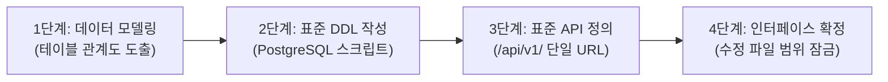

# [02단계] 명세 우선 아키텍처 및 DDL/API 설계 실무 가이드

> **단계 요약:** 코딩을 시작하기 전에 **데이터베이스 스키마(PostgreSQL DDL)와 표준 REST API 규격(OpenAPI/Swagger)**을 먼저 확정(명세 우선 개발)하여, 백엔드와 프론트엔드가 서로를 기다리지 않고 병렬로 작업할 수 있도록 인터페이스 계약을 수립합니다.

---

## 1. 단계 목적 및 대상

* **주요 담당자**: 시스템 아키텍트, 백엔드 리드 개발자, 데이터베이스 관리자(DBA)
* **협업 대상**: 프론트엔드 리드, 보안 관리자
* **예상 소요 시간**: 모듈당 30분 ~ 1시간 내외
* **활용 도구**: SyncVerse 스키마 스튜디오, PostgreSQL, OpenAPI/Swagger 에디터

---

## 2. 시작 전 점검 사항 (시작 기준)

본 단계를 시작하기 전에 아래 사항을 확인합니다:
- [01단계] 기능 명세서 및 완료 기준(인수 조건) 검토가 완료되었는가?
- 대상 시스템의 기존 테이블 구조 및 공통 엔티티(감사 필드, 공통 코드 등)를 확인하였는가?
- 도메인 접두사 규칙(예: CMS는 `cms_`, Shop은 `pms_`/`oms_`, 플랫폼 공통은 `sys_`)이 정해졌는가?

---

## 3. 실무 수행 4단계 절차



### 1단계: 데이터 모델링 및 테이블 관계도 도출
요구사항을 만족하는 테이블 구조를 설계하고 기존 테이블과의 관계(1:N, N:M)를 파악합니다. 기존 테이블이 변경되는 경우 컬럼 추가나 타입 변경으로 인한 영향을 미리 점검합니다.

### 2단계: PostgreSQL 표준 DDL 스크립트 작성
사내 표준인 `<서브프로젝트>/db/` 디렉터리 구성에 맞추어 스크립트를 작성합니다:
* `00_extensions.sql`: 필수 확장 모듈 선언
* `02_schema_domain.sql`: 업무 테이블 생성(DDL), 기본키(PK), 외래키(FK), 인덱스(INDEX)
* `04_seed_domain.sql`: 업무 메뉴 권한(`sys_permission`) 및 역할 매핑
* **작성 원칙**: 충돌 회피용 임시 구문(`ON CONFLICT DO NOTHING` 등)을 지양하고, 사전에 키 정합성을 검증한 순수 `INSERT INTO` 구문으로 작성합니다.

### 3단계: 표준 REST API 규격 정의
* **단일 매핑 원칙**: 하나의 기능에 다중 URL을 매핑하지 않고, 명확한 단일 Canonical URL만 정의합니다.
* **표준 접두사 준수**: 반드시 `/api/v1/{도메인}/{리소스}` 체계로 선언합니다.
* **OpenAPI 3.0 규격 확정**: 프론트엔드가 즉시 참조할 수 있도록 요청/응답 JSON 포맷을 선행 정의합니다.

### 4단계: 인터페이스 확정 및 작업 범위 잠금
확정된 DDL과 API 명세를 Git 저장소에 등록하여 인터페이스를 고정하고, 백엔드와 프론트엔드가 병렬로 코딩을 시작합니다.

---

## 4. 실무 프롬프트 예시 (복사하여 사용)

### 프롬프트 1: PostgreSQL DDL 스키마 생성
```markdown
[역할] 수석 데이터베이스 모델러 겸 DBA
[맥락]
- 데이터베이스: PostgreSQL 17
- 도메인: {{도메인명, 예: shop_coupon}}
- 기능 요구사항:
{{01단계에서 확정된 기능 명세서 내용}}

[작성 규칙]
1. 테이블명은 소문자 스네이크 케이스({{도메인_엔티티명}})로 명명해 주세요.
2. 기본키(id)는 BIGINT 표준을 적용해 주세요.
3. created_at, updated_at, created_by, updated_by, del_flag(삭제여부) 공통 감사 컬럼을 포함해 주세요.
4. 자주 조회되는 조건(회원ID, 상태값, 날짜)에 적절한 인덱스를 생성해 주세요.
5. 데이터 무결성을 위해 외래키(FK) 및 필수 제약조건을 명시해 주세요.
6. 충돌 회피용 구문(ON CONFLICT DO NOTHING 등) 대신 정합성이 보장된 순수 CREATE TABLE 및 INSERT 구문으로 작성해 주세요.

[출력 형식]
- Mermaid 테이블 관계도
- 02_schema_domain.sql 스크립트 (테이블 생성, 인덱스 생성)
- 테이블 및 컬럼 설명(COMMENT)
```

---

### 프롬프트 2: 표준 REST API 규격 및 OpenAPI 정의
```markdown
[역할] RESTful API 설계 엔지니어
[맥락] 앞서 도출된 데이터 모델을 기반으로 프론트엔드와 연동할 REST API 규격을 설계해 주세요.
[대상 리소스] {{리소스 경로, 예: /api/v1/shop/cart/coupon}}

[작성 규칙]
1. 단일 매핑 원칙: 오직 하나의 고유 URL만 부여해 주세요 (다중 URL 매핑 지양).
2. URL 경로는 `/api/v1/{제품}/{리소스}` 형식을 준수해 주세요.
3. HTTP 메서드(GET, POST, PUT, DELETE)를 성격에 맞게 분리해 주세요.
4. 공통 응답 구조(CommonResult: code, message, result, timestamp)를 적용해 주세요.
5. 페이징 조회 시 pageNo, pageSize, sortField를 표준 파라미터로 사용해 주세요.

[출력 형식]
1. API 엔드포인트 목록 표 (메서드, URL, 설명, 권한)
2. 엔드포인트별 요청/응답 JSON 예시 (정상 및 오류 상황)
3. OpenAPI 3.0 YAML 스펙 조각
```

---

### 프롬프트 3: 백엔드 DTO 및 엔티티 모델링 (Lombok 적용)
```markdown
[역할] Spring Boot 백엔드 개발 리드
[맥락] 위 DDL 및 API 명세에 대응하는 Java 엔티티와 요청/응답 DTO를 작성해 주세요.

[작성 규칙]
1. 수동 Getter/Setter 대신 Lombok 애너테이션을 적용해 주세요:
   - DTO: @Getter, @Setter, @Builder, @NoArgsConstructor, @AllArgsConstructor
   - Entity: @Getter, @NoArgsConstructor(access = AccessLevel.PROTECTED), @AllArgsConstructor, @Builder
2. 입력값 검증을 위해 DTO 필드에 Bean Validation 애너테이션(@NotNull, @NotBlank, @Min 등)을 부여해 주세요.
3. 엔티티와 DTO 간의 변환을 돕는 정적 메서드나 매퍼 형태를 제안해 주세요.
```

---

## 5. 자주 발생하는 실수 및 유의 사항

| 실수 유형 | 흔한 문제점 | 권장 대응 방안 |
| :--- | :--- | :--- |
| **다중 URL 매핑** | 하위 호환성을 이유로 `@RequestMapping({"/coupon", "/api/v1/coupon"})` 작성 | 단일 표준 URL 원칙을 적용하여 `/api/v1/{domain}/...` 하나로 통합합니다. |
| **순환 참조 발생** | 양방향 연관관계에 `@Data`를 무분별하게 적용하여 무한 루프 발생 | `@Data` 사용을 지양하고 `@Getter`, `@NoArgsConstructor`, `@Builder` 등을 개별 선언합니다. |
| **임시 구문 남발** | 키 충돌을 피하기 위해 `ON CONFLICT DO NOTHING`으로 넘김 | 사전에 ID 생성 규칙을 검증하여 중복 없이 실행되는 순수 INSERT 구문으로 관리합니다. |

---

## 6. 단계 완료 점검 체크리스트 (종료 기준)

다음 단계인 **[03단계: AI 협업 코딩 및 구현]**으로 넘어가기 위해 아래 항목을 확인합니다:
- [ ] DDL 스크립트가 로컬 데이터베이스에서 오류 없이 정상 실행되는가?
- [ ] API URL이 `/api/v1/{도메인}/...` 표준 접두사를 따르고 있는가?
- [ ] 프론트엔드 작업자가 참조할 수 있는 요청/응답 JSON 규격이 공유되었는가?
- [ ] DTO에 입력값 유효성 검증 규칙이 누락 없이 정의되었는가?
