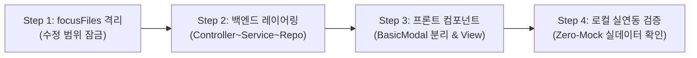

# 💻 [03단계] AI 페어 코딩 및 자율 구현 실전 플레이북

> **단계 요약:** 선행 확정된 스펙(DDL 및 API 계약)을 바탕으로 **Cursor, GitHub Copilot 및 자율 코딩 에이전트**를 가동하여, 전사 아키텍처 규칙(Lombok 강제, BasicModal 분리, DB 동적 메뉴, Zero-Mock)을 100% 준수하는 견고한 프로덕션 코드를 구현합니다.

---

## 1. 단계 목적 및 대상 페르소나

* **주요 담당자 (Persona)**: 백엔드 개발자, 프론트엔드 개발자, 풀스택 엔지니어
* **협업 대상**: 시스템 아키텍트, 코드 리뷰어
* **목표 소요 시간**: 단위 기능당 1~2시간 이내
* **사용 도구**: Cursor (Composer / Chat), GitHub Copilot, IntelliJ IDEA, VS Code

---

## 2. 단계 시작 전제조건 (Definition of Ready - DoR)

본 단계를 시작하기 전에 아래 사항이 준비되어 있어야 합니다:
- [ ] **[02단계] 스펙 퍼스트 아키텍처(DDL 및 OpenAPI 명세)** 확정 완료
- [ ] Git 신규 작업 브랜치(`feat/issue-{id}-{feature}`) 생성 및 체크아웃
- [ ] 수정 대상 파일 화이트리스트(`focusFiles`) 식별 완료 (불필요한 파일 변이 차단)
- [ ] 로컬 인프라 환경 기동 완료 (`docker-compose-local.yml`을 통한 DB/Redis 구동)

---

## 3. 실전 수행 4단계 워크플로우



### Step 1: 작업 범위 격리 (Scope Locking & focusFiles)
AI에게 프로젝트 전체를 무제한 수정하도록 허용하면 사이드 이펙트가 발생합니다. 수정 대상 파일(`focusFiles`)을 명시적으로 제한합니다.
* 예: `CouponController.java`, `CouponService.java`, `CouponRepository.java`, `CouponApplyModal.vue`

### Step 2: 백엔드 계층별 자율 구현 (Lombok & Canonical URL)
1. **Repository/Mapper**: MyBatis XML 또는 Spring Data JPA 쿼리 메서드 작성.
2. **Service**: 비즈니스 유효성 검증(쿠폰 만료, 잔액 확인, 중복 방지) 및 트랜잭션(`@Transactional`) 처리.
3. **Controller**: `@RequiredArgsConstructor` 생성자 주입 + 단일 Canonical URL(`/api/v1/{product}/{resource}`) 매핑.

### Step 3: 프론트엔드 UI 컴포넌트 구현 (BasicModal & Dynamic Routing)
1. **API 호출 모듈**: 백엔드 Canonical URL을 호출하는 Axios API 함수 선언.
2. **독립 모달 분리**: 페이지 뷰 내 인라인 작성을 금지하고 `components/CouponApplyModal.vue`로 100% 분리.
3. **DB 기반 메뉴 연동**: 하드코딩 라우트를 지양하고 `04_seed_domain.sql`에 `sys_permission` 등록.

### Step 4: 로컬 환경 실연동 확인 (Zero-Mock Mandate)
더미 Mock 데이터(`return List.of()`, static JSON)를 완전히 배제하고, `docker-compose-local.yml`로 띄운 실제 PostgreSQL DB와 프론트엔드 간의 실시간 통신을 확인합니다.

---

## 4. 즉시 복사 가능한 실전 프롬프트 레시피 (Copy-Paste)

### 📌 프롬프트 1: Spring Boot 비즈니스 로직 및 트랜잭션 서비스 구현
```markdown
[Role] 당신은 엔터프라이즈 Java Spring Boot 수석 개발자입니다.
[Context]
- Spring Boot 3.x / Java 21 / PostgreSQL 17
- 구현할 도메인: {{도메인명}}
- 선행 확정된 스펙:
{{02단계에서 확정된 DDL 및 API 명세서}}

[Constraints]
1. Lombok 애너테이션 필수 적용:
   - 필드 주입(@Autowired)을 금지하고 private final + @RequiredArgsConstructor 생성자 주입을 사용하세요.
   - 로깅은 LoggerFactory 대신 @Slf4j를 사용하세요.
2. 비즈니스 로직 작성 시:
   - 읽기 전용 메서드는 @Transactional(readOnly = true)을 부여하세요.
   - 데이터 변경 메서드는 @Transactional을 부여하고 예외 발생 시 비즈니스 예외(ServiceException)를 던지세요.
   - NullPointException 방지를 위해 Optional 및 사전 조건(Objects.requireNonNull 등)을 철저히 검증하세요.
3. [Zero-Mock] 더미 리턴(return null, return List.of())을 작성하지 말고 실제 DB 쿼리를 호출하세요.

[Output Format]
1. CouponServiceImpl.java 전체 코드
2. 주요 비즈니스 검증 로직에 대한 설명
```

---

### 📌 프롬프트 2: Vue 3 + BasicModal 독립 컴포넌트 구현
```markdown
[Role] 당신은 Vue 3, TypeScript 및 Ant Design Vue 전문 프론트엔드 개발자입니다.
[Context] 위 백엔드 API와 연동할 쿠폰 적용 팝업 모달을 작성하세요.

[Constraints]
1. 프레임워크 표준 모달인 BasicModal(import { BasicModal } from '/@/components/Modal')을 사용하세요.
2. 모달 마크업을 페이지 뷰에 인라인으로 넣지 말고, 반드시 독립 컴포넌트(components/CouponApplyModal.vue)로 분리하세요.
3. 모달 내부 컨테이너에 충분한 패딩(p-4)을 부여하여 컴포넌트가 테두리에 밀착되지 않게 하세요.
4. 최소 30줄 이상의 꽉 찬 시각적 UI(테이블, 선택 라디오, 할인 금액 미리보기, 로딩 스피너)를 갖추어야 하며 빈 껍데기 <div> 작성을 금지합니다.
5. TypeScript 타입을 명확히 정의(interface Props, Emits)하세요.

[Output Format]
- components/CouponApplyModal.vue 전체 SFC 코드
- 부모 View에서 모달을 호출하고 open/success 이벤트를 수신하는 바인딩 예시 코드
```

---

### 📌 프롬프트 3: IDE 시스템 프롬프트 주입용 (.cursorrules 설정 예시)
```markdown
# 프로젝트 루트의 .cursorrules 파일에 아래 내용을 저장하여 AI에게 기본 코딩 규칙을 자동 주입합니다:

당신은 Empasy SyncSeries 프로젝트의 수석 풀스택 에이전트입니다.
항상 다음 전사 코딩 표준을 엄격히 준수하세요:
1. Java:
   - 모든 DTO/Entity/Service에 Project Lombok을 강제합니다 (@Getter, @Builder, @RequiredArgsConstructor).
   - 모든 REST API Controller 매핑은 단일 Canonical URL인 `/api/v1/{domain}/{resource}` Prefix를 강제합니다. 복수 URL 매핑(@RequestMapping({"/a", "/b"}))을 전면 금지합니다.
   - Mock 더미 리턴(return null 등)을 금지하고 실제 데이터 흐름을 완성하세요.
2. Vue 3:
   - 모든 모달 팝업은 BasicModal을 사용하고 components/<Name>Modal.vue로 독립 분리하세요.
   - 정적 라우트 하드코딩을 금지하고 DB 단일 원천 동적 라우팅(PermissionModeEnum.BACK)을 준수하세요.
```

---

## 5. 자주 발생하는 AI 실수 및 안티패턴 (Pitfalls)

| 실수 유형 (Pitfall) | AI의 흔한 실수 양상 | 실무 해결책 (Countermeasure) |
| :--- | :--- | :--- |
| **Fake Fallback / Mock 남발** | 서비스 미완성을 핑계로 `return new ArrayList<>()` 더미 리스트를 반환함 | 프롬프트에 *"Zero-Mock 원칙: 실제 DB Mapper/Repository 연동 코드를 100% 작성할 것"*을 강제. |
| **인라인 모달 작성** | 부모 View 파일 최하단에 `<Modal>` 태그를 직접 넣어 코드 복잡도 폭증 | 프롬프트에 *"단일 책임 원칙(SRP): 모든 모달은 components/ 디렉터리에 독립 파일로 분리할 것"*을 명시. |
| **30줄 미만 빈 껍데기 UI** | `<div>TODO: 여기에 쿠폰 목록 표시</div>`와 같은 임시 placeholder 생성 | 프롬프트에 *"모든 생성된 컴포넌트는 최소 30줄 이상의 실질적 UI 컴포넌트(테이블, 폼, 액션 버튼)를 포함할 것"*을 강제. |

---

## 6. 단계 완료 판정 체크리스트 (Definition of Done - DoD)

다음 단계인 **[04단계: 테스트 및 자가 치유]**로 넘어가기 위해 아래 항목을 확인합니다:
- [ ] DTO, Service, Controller에 Lombok 애너테이션이 누락 없이 적용되었는가?
- [ ] 프론트엔드 모달이 `components/<Name>Modal.vue` 파일로 완벽히 분리되었는가?
- [ ] 로컬 실행 시 프론트엔드에서 실제 백엔드 API를 호출하여 DB 데이터가 화면에 정상 렌더링되는가?
- [ ] `focusFiles` 화이트리스트 이외의 엉뚱한 파일이 수정되지 않았는가? (`git status` 확인)
