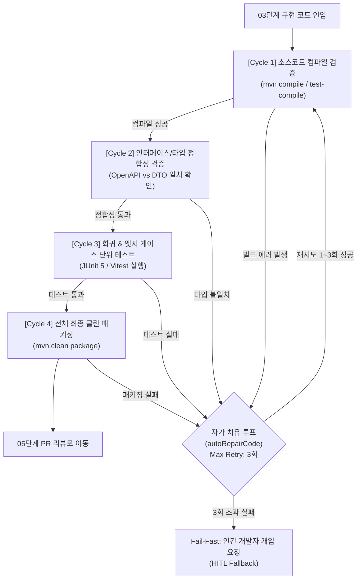

# 🧪 [04단계] 테스트 자동화 및 4-Cycle 자가 치유 실전 플레이북

> **단계 요약:** 작성된 코드에 대해 **단위·통합 테스트를 자동 생성**하고, 전사 표준인 **4-Cycle 회귀 무결성 검증(컴파일 ➔ 인터페이스 ➔ 로직 ➔ 클린 빌드)**을 수행하며, 빌드 실패 시 AI가 스스로 에러 로그를 분석하여 코드를 고치는 **무인 자가 치유(autoRepairCode)** 루프를 가동합니다.

---

## 1. 단계 목적 및 대상 페르소나

* **주요 담당자 (Persona)**: QA 엔지니어, 소프트웨어 테스트 엔지니어, 백엔드/프론트엔드 개발자
* **협업 대상**: 시스템 아키텍트, CI/CD 엔지니어
* **목표 소요 시간**: 기능당 30분 ~ 45분 이내
* **사용 도구**: Maven / Gradle, JUnit 5, MockMvc, Vitest, Playwright, AutoRepair Agent

---

## 2. 단계 시작 전제조건 (Definition of Ready - DoR)

본 단계를 시작하기 전에 아래 사항이 준비되어 있어야 합니다:
- [ ] **[03단계] 코드 구현** 완료 및 로컬 컴파일 1차 통과
- [ ] [01단계] 기능 명세서의 Given-When-Then 인수 조건 문서 확보
- [ ] 로컬 테스트 DB 또는 인메모리 테스트 환경 준비 완료

---

## 3. 실전 수행 4-Cycle 검증 및 자가 치유 워크플로우



### [Cycle 1] 소스코드 컴파일 및 타입 검증
* `mvn compile` 및 `mvn test-compile` (프론트엔드는 `npm run build` / `vue-tsc`)을 실행하여 문법 오류, 누락된 라이브러리, 제네릭 타입 불일치를 1차 검출합니다.

### [Cycle 2] 인터페이스 및 타입 일치성 검증
* 02단계에서 선행 정의된 OpenAPI JSON/YAML 명세와 실제 DTO 필드명, HTTP 응답 상태 코드, 필수 파라미터가 100% 일치하는지 자동 검증합니다.

### [Cycle 3] 회귀 테스트 및 가혹한 엣지 케이스 검증
* 단순 정상 케이스(Happy Path) 외에, 기획서의 예외 시나리오(쿠폰 만료, 잔액 부족, 중복 동시 호출)를 검증하는 단위/통합 테스트를 실행합니다.

### [Cycle 4] 전체 최종 Clean 빌드 및 패키징 확정
* 캐시를 초기화하고 `mvn clean package -DskipTests=false`를 수행하여 배포 아티팩트(JAR) 무결성을 최종 확인합니다.

### 무인 자가 치유 루프 (autoRepairCode)
* 위 1~4 사이클 중 어느 하나라도 실패할 경우, 시스템은 컴파일 에러 스택 트레이스를 파싱하여 AI에게 전달합니다.
* AI는 최대 3회까지 자율적으로 코드를 패치하고 재빌드합니다. 3회 재시도에도 해결되지 않을 경우 즉각 중단(Fail-Fast)하고 개발자에게 개입을 요청합니다.

---

## 4. 즉시 복사 가능한 실전 프롬프트 레시피 (Copy-Paste)

### 📌 프롬프트 1: 가혹한 엣지 케이스 단위 테스트(JUnit 5) 자동 생성
```markdown
[Role] 당신은 15년 차 시니어 QA 엔지니어이자 테스트 주도 개발(TDD) 전문가입니다.
[Context] 아래 비즈니스 서비스 코드에 대해 JUnit 5 및 Mockito 기반의 단위 테스트 클래스를 작성하세요.
[Target Code]
{{03단계에서 구현한 Service 또는 Controller 코드}}
[Acceptance Criteria]
{{01단계에서 도출한 Given-When-Then 인수 조건}}

[Constraints]
1. 단순 성공 케이스 외에 아래 엣지 케이스를 반드시 개별 @Test 메서드로 작성하세요:
   - 유효기간이 지난 쿠폰 적용 시도 ➔ CouponExpiredException 발생 검증
   - 최소 주문금액 미달 시도 ➔ InvalidMinimumOrderAmountException 발생 검증
   - 존재하지 않는 쿠폰 ID 전달 ➔ NotFoundException 발생 검증
   - 동일 회원이 동시에 2회 쿠폰 적용 시도 ➔ 동시성 충돌(DuplicateApplyException) 검증
2. AssertJ(assertThat, assertThatThrownBy)를 사용하여 가독성 높은 단언문을 작성하세요.
3. @DisplayName에 한글로 테스트 의도를 명확히 기술하세요.
```

---

### 📌 프롬프트 2: 빌드 에러 자가 치유 (autoRepairCode) 프롬프트
```markdown
[Role] 당신은 컴파일 에러 및 단위 테스트 실패 해결 전문 AI 자가치유(Self-Healing) 에이전트입니다.
[Context]
Maven 빌드 검증 도중 아래와 같은 오류가 발생했습니다. 기존 비즈니스 로직을 손상시키지 않고 버그를 수정하세요.

[Build Error Log]
{{BUILD_LOG_TRACE, 예: cannot find symbol, method not found, NullPointerException 등}}

[Failed Source File]
{{오류가 발생한 소스코드 전문}}

[Instructions]
1. 원인 분석: 에러의 근본 원인을 2줄 이내로 명확히 분석하세요.
2. 부작용 검토: 수정한 코드가 다른 레이어나 테스트에 미칠 영향을 검토하세요.
3. 수정 코드: 해당 파일 전체를 완벽한 Drop-in 교체 형태로 제시하세요.
   - [주의] 메서드 본문을 빈칸(// TODO)으로 비워두지 마세요.
   - [주의] 에러 해결을 위해 비즈니스 검증 로직을 삭제하거나 완화하지 마세요.
```

---

## 5. 자주 발생하는 AI 실수 및 안티패턴 (Pitfalls)

| 실수 유형 (Pitfall) | AI의 흔한 실수 양상 | 실무 해결책 (Countermeasure) |
| :--- | :--- | :--- |
| **테스트 단언문 누락 (No Assertion)** | 메서드만 호출하고 `assertThat()`이나 `verify()` 없이 테스트가 통과되도록 작성 | 프롬프트에 *"assert 없는 테스트 메서드는 금지하며, 최소 2개 이상의 상태 단언(State Assertion)을 포함할 것"*을 명시. |
| **에러 해결을 위해 검증 로직 삭제** | 테스트가 실패하자 서비스의 필수 if문(유효성 검증)을 지워서 테스트를 통과시킴 | 프롬프트에 *"자가 치유 시 기존 비즈니스 제약조건(if 검증문)을 절대로 삭제하거나 완화하지 말 것"*을 강제. |
| **무한 루프 자가 치유** | 동일한 오류를 반복해서 고치며 무한 빌드 시도 | 엔진 레벨에서 `Max Retry = 3회`로 제한하고 3회 초과 시 즉각 중단(HITL Fallback). |

---

## 6. 단계 완료 판정 체크리스트 (Definition of Done - DoD)

다음 단계인 **[05단계: 코드 리뷰 및 무인 배포]**로 넘어가기 위해 아래 항목을 확인합니다:
- [ ] 4-Cycle 회귀 검증(컴파일, 인터페이스, 단위테스트, 클린패키징)이 모두 100% 통과했는가?
- [ ] 핵심 비즈니스 예외에 대한 단위 테스트가 최소 3개 이상 작성되고 모두 성공했는가?
- [ ] 자가 치유(autoRepairCode)가 실행되었다면, 수정된 코드가 기존 비즈니스 규칙을 훼손하지 않았는가?
- [ ] 코드 커버리지(Test Coverage)가 프로젝트 기준치(최소 80% 이상)를 충족하는가?
