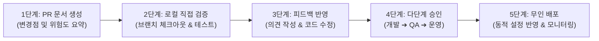

# [05단계] 코드 검토 및 무인 배포 실무 가이드

> **단계 요약:** 4단계 빌드 검증을 통과한 작업 브랜치에 대해 **AI가 변경 사유와 위험도를 요약한 검토 요청(PR)을 생성**하고, 담당 개발자가 **로컬 환경에서 직접 실행하여 확인(협업 개발)**한 후, **다단계 승인**을 거쳐 안전하게 배포합니다.

---

## 1. 단계 목적 및 대상

* **주요 담당자**: 코드 검토자, 시니어 개발자, 테크 리드, 인프라/배포 담당자
* **협업 대상**: 비즈니스 기획자, 보안 담당자
* **예상 소요 시간**: 건당 15분 ~ 30분 내외
* **활용 도구**: GitHub / GitLab, IntelliJ IDEA, Docker / K8s, CI/CD 배포 파이프라인

---

## 2. 시작 전 점검 사항 (시작 기준)

본 단계를 시작하기 전에 아래 사항을 확인합니다:
- [04단계] 4단계 회귀 검증 및 단위 테스트가 모두 통과되었는가?
- 작업 브랜치(`feat/xxx`)가 원격 저장소에 정상 푸시되었는가?
- 배포 대상 기준 브랜치(main 또는 dev)의 최신 소스코드가 반영되었는가?

---

## 3. 실무 수행 5단계 절차



### 1단계: 검토 요청(PR) 본문 자동 정리
작업 브랜치가 푸시되면 AI가 변경된 코드(Git Diff)를 분석하여 아래 내용을 마크다운으로 정리합니다:
* **작업 배경**: 기획 의도 및 관련 작업 티켓 번호
* **주요 변경 사항**: 추가되거나 수정된 파일 목록
* **데이터베이스 변경 유무**: 테이블 생성이나 컬럼 변경 여부
* **테스트 결과 요약**: 4단계 검증 통과 여부 및 신규 테스트 항목

### 2단계: 개발자의 로컬 직접 검증 (협업 개발 원칙)
단순히 웹 화면에서 코드 줄만 대충 훑어보고 승인하는 위험을 피하기 위해, 개발자가 로컬 터미널에서 작업 브랜치를 직접 체크아웃하여 구동합니다:
```bash
git fetch origin feat/issue-101-cart-coupon
git checkout feat/issue-101-cart-coupon
```
로컬 IDE에서 중단점을 걸고 실제 기능 동작과 화면 반응을 직접 확인합니다.

### 3단계: 피드백 반영 및 대화형 수정
* 수정이 필요한 부분이 있다면 검토 코멘트를 남깁니다 (예: *"이 반복문에서 쿼리가 중복 실행될 수 있으니 조인 쿼리로 변경해 주세요"*).
* AI 또는 담당 작업자가 해당 의견을 반영하여 추가 커밋을 등록합니다.

### 4단계: 다단계 승인 절차 (작업자 승인 통제)
데이터베이스 변경이나 핵심 비즈니스 로직 수정 등 위험도가 있는 작업은 사전에 정의된 권한 체계에 따라 순차 승인을 거칩니다:
1. `개발자 승인`: 코드 작성 규칙 및 비즈니스 로직 타당성 확인
2. `QA 승인`: 완료 기준 및 시나리오 충족 여부 확인
3. `운영자 승인`: 배포 시점 및 시스템 영향도 최종 인가

### 5단계: 무인 배포 및 실시간 모니터링
* 승인 완료 시 배포 파이프라인이 자동 실행되어 대상 서버에 반영됩니다.
* 시스템 환경설정 변경 건은 서버 재기동 없이 런타임 이벤트(`ConfigRefreshEvent`)를 통해 메모리에 즉시 반영됩니다.
* 배포 후 모니터링을 통해 이상 에러율이 감지되면 이전 정상 버전으로 신속하게 롤백합니다.

---

## 4. 실무 프롬프트 예시 (복사하여 사용)

### 프롬프트 1: 코드 변경점(Git Diff) 기반 PR 본문 정리
```markdown
[역할] 릴리즈 엔지니어링 테크니컬 라이터
[맥락] 작업 브랜치에서 생성된 Git Diff를 분석하여 검토자(Reviewer)가 읽기 쉬운 PR 본문을 마크다운으로 작성해 주세요.
[Git Diff 내용]
{{git diff 내용 붙여넣기}}

[작성 항목]
## 1. 작업 개요 (Why & What)
- 기능 추가 목적 및 배경 (2~3문장)
## 2. 주요 변경 내역 (Key Changes)
- 백엔드 / 프론트엔드 / DB 스키마별 변경 사항 요약
## 3. 유의 사항 및 위험도 점검 (Risk Check)
- 기존 기능에 미치는 영향(하위 호환성 여부)
- 쿼리 성능(조회 인덱스 활용 여부)
## 4. 테스트 결과 요약 (Verification)
- 4단계 검증 결과 및 실행된 단위 테스트 목록
```

---

### 프롬프트 2: 시니어 아키텍트 관점의 코드 검토 및 취약점 점검
```markdown
[역할] 수석 시스템 아키텍트 겸 보안 점검자
[맥락] 신규 작성된 PR 코드에 대해 심층 코드 검토를 수행해 주세요.
[대상 코드]
{{검토할 변경 소스코드}}

[점검 기준]
1. 동시성: 여러 사용자가 동시에 요청할 때 데이터 정합성이 깨질 위험이 없는가?
2. 쿼리 성능: 대용량 데이터 조회 시 N+1 문제나 과도한 풀 스캔이 발생하지 않는가?
3. 사내 표준 준수: Lombok 적용, 단일 표준 URL(/api/v1/...) 준수, 모달 컴포넌트 분리 여부
4. 보안: SQL 인젝션, 민감정보 로그 노출, 권한 검증 누락이 없는가?

[출력 형식]
- 종합 의견 (승인 권장 / 수정 필요)
- 파일명 및 라인별 구체적인 개선 제안 (개선 전/후 코드 예시 포함)
```

---

## 5. 자주 발생하는 실수 및 유의 사항

| 실수 유형 | 흔한 문제점 | 권장 대응 방안 |
| :--- | :--- | :--- |
| **눈으로만 보는 검토** | 마크다운 요약만 믿고 로컬 실행 없이 승인하여 런타임 버그 발생 | 개발자가 로컬에서 직접 소스를 받아 구동해보는 협업 검증 원칙을 지킵니다. |
| **하위 호환성 훼손** | 기존 API의 응답 필드명을 임의로 수정하여 연동 시스템 장애 유발 | 기존 API 스펙 변경 시 사전에 영향받는 클라이언트와 협의합니다. |
| **단독 독단 배포** | 중요한 데이터베이스 변경 작업을 한 사람이 승인하고 즉시 배포 | 다단계 승인 절차를 통해 복수의 담당자가 교차 확인할 수 있도록 합니다. |

---

## 6. 단계 완료 점검 체크리스트 (종료 기준)

본 AI-SDLC 사이클을 마치고 배포를 완료하기 위해 아래 항목을 확인합니다:
- [ ] 개발자가 로컬 환경에서 소스코드를 받아 직접 동작을 확인했는가?
- [ ] 코드 검토에서 제기된 개선 의견이 반영되었는가?
- [ ] 정해진 승인 결재선(개발, QA, 운영)의 승인이 모두 완료되었는가?
- [ ] 배포 후 시스템 에러율 및 응답 속도가 정상 범위를 유지하고 있는가?
- [ ] 관련 기능 명세 및 시스템 안내 문서가 최신 상태로 동기화되었는가?
