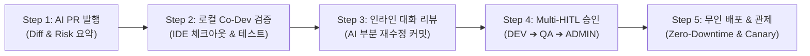

# 🚢 [05단계] AI PR 리뷰 및 무인 배포 실전 플레이북

> **단계 요약:** 4-Cycle 검증을 통과한 작업 브랜치에 대해 **AI가 변경 사유와 위험도를 요약한 PR을 자동 발행**하고, 인간 개발자가 **로컬 IDE에서 정밀 검증(Co-Dev)**한 후, **다자간 승인(Multi-HITL)**을 거쳐 프로덕션 환경에 무인 배포 및 지속 관제를 수행합니다.

---

## 1. 단계 목적 및 대상 페르소나

* **주요 담당자 (Persona)**: 코드 리뷰어, 시니어 개발자, 테크 리드, DevOps 엔지니어
* **협업 대상**: 비즈니스 PO, 보안 책임자
* **목표 소요 시간**: PR당 15분 ~ 30분 이내
* **사용 도구**: GitHub / GitLab, IntelliJ IDEA, Docker Compose / K8s, Jenkins / GitHub Actions

---

## 2. 단계 시작 전제조건 (Definition of Ready - DoR)

본 단계를 시작하기 전에 아래 사항이 준비되어 있어야 합니다:
- [ ] **[04단계] 4-Cycle 회귀 검증 및 단위 테스트** 100% 통과
- [ ] 작업 브랜치(`feat/xxx`)가 원격 Git 저장소에 정상 푸시 완료
- [ ] 대상 타겟 브랜치(`dev` 또는 `main`)의 최신 커밋 리베이스 완료

---

## 3. 실전 수행 5단계 워크플로우



### Step 1: AI의 PR 본문 자동 생성 (Unified Diff Analysis)
작업 브랜치가 푸시되면 AI가 변경된 Git Diff를 분석하여 아래 항목을 마크다운 PR 본문으로 자동 작성합니다:
* **비즈니스 목적**: 기획 의도 및 Jira 티켓 링크
* **핵심 변경 사항**: 새로 추가된 Controller/Service/DTO/Vue 파일 목록
* **DB DDL 변경 여부**: 테이블 추가, 인덱스 생성 내역
* **테스트 결과 요약**: 4-Cycle 통과 여부 및 신규 추가된 단위 테스트 목록

### Step 2: 사내 개발자의 로컬 Co-Development 검증
개발자는 웹 화면에서 단순 눈으로만 Diff를 훑어보는 위험한 리뷰를 지양하고, 로컬 터미널에서 작업 브랜치를 체크아웃하여 IDE에서 직접 구동합니다:
```bash
git fetch origin feat/issue-101-cart-coupon
git checkout feat/issue-101-cart-coupon
```
로컬 IDE에서 중단점(Breakpoint)을 걸고 복잡한 비즈니스 엣지 케이스를 직접 확인합니다.

### Step 3: 인라인 대화형 코드 리뷰 및 AI 재수정
* 수정이 필요한 라인이 발견되면, PR 화면에서 인라인 코멘트(예: *"이 루프에서 N+1 쿼리가 발생할 수 있으니 fetch join으로 수정해줘"*)를 남깁니다.
* AI 에이전트가 코멘트를 인식하여 해당 라인만 국소 수정한 뒤 동일 브랜치에 추가 커밋을 자동 발행합니다.

### Step 4: 다자간 순차 결재선 승인 (Multi-Party HITL)
고위험 작업(DB 마이그레이션, 코어 결제 로직 등)은 단일 승인으로 배포되지 않도록 전사 결재선을 가동합니다:
1. `ROLE_DEV`: 동료 개발자의 코드 무결성 승인
2. `ROLE_QA`: 인수 조건 및 E2E 시나리오 승인
3. `ROLE_ADMIN`: 운영 반영 최종 승인

### Step 5: 무인 CI/CD 배포 및 이상 감지 (Zero-Downtime)
* PR 머지 시 무인 배포 파이프라인이 자동 트리거됩니다.
* 시스템 설정 변경 건은 `ConfigRefreshEvent`를 통해 서버 무재기동(Zero-Restart)으로 런타임에 즉각 반영됩니다.
* 배포 후 10분간 APM 모니터링을 수행하여 5xx 에러 급증 시 즉각 1-클릭 카나리 롤백을 수행합니다.

---

## 4. 즉시 복사 가능한 실전 프롬프트 레시피 (Copy-Paste)

### 📌 프롬프트 1: Git Diff 기반 PR 본문 마크다운 자동 생성
```markdown
[Role] 당신은 소프트웨어 엔지니어링 릴리즈 테크니컬 라이터입니다.
[Context] 작업 브랜치에서 생성된 아래 Git Diff를 분석하여 GitHub/GitLab PR 본문을 마크다운으로 작성하세요.
[Git Diff Summary]
{{git diff origin/main...feat/xxx 내용 입력}}

[Instructions]
아래 섹션을 명확히 구분하여 작성하세요:
## 📌 작업 개요 (Why & What)
- 비즈니스 목적 및 변경 요약 (2문장 이내)
## 🛠️ 주요 변경 내역 (Key Changes)
- 백엔드 / 프론트엔드 / DB 스키마별 변경 목록 (불릿 포인트)
## ⚠️ 위험도 평가 및 주의사항 (Risk Assessment)
- 하위 호환성 여부 (Breaking Change 유무)
- 성능 영향도 (N+1 쿼리, 인덱스 활용 여부)
## ✅ 테스트 완료 내역 (Verification)
- 4-Cycle 회귀 검증 통과 결과 및 단위 테스트 명단
```

---

### 📌 프롬프트 2: 시니어 아키텍트 관점의 AI 코드 리뷰 및 취약점 진단
```markdown
[Role] 당신은 엄격한 20년 차 수석 시스템 아키텍트이자 보안 감사관입니다.
[Context] 신규 작성된 아래 PR 코드에 대해 심층 코드 리뷰를 수행하세요.
[Target Code]
{{리뷰 대상 파일들의 소스코드}}

[Review Checklist]
1. 동시성(Concurrency): 멀티스레드 환경에서 Race Condition이나 데드락 위험이 없는가?
2. 쿼리 성능(Performance): N+1 문제가 발생하거나 대용량 테이블 Full Scan 위험이 없는가?
3. 전사 코딩 표준(Standards): Lombok 애너테이션 필수 적용, 단일 Canonical URL(/api/v1/...) 준수, BasicModal 컴포넌트 분리 여부
4. 보안(Security): SQL 인젝션, 민감정보(PII) 로깅 노출, 권한 검증 누락이 없는가?

[Output Format]
- 종합 의견 (LGTM 또는 Changes Requested)
- 파일명 및 라인 번호별 구체적인 개선 피드백 (Before / After 코드 제안 포함)
```

---

## 5. 자주 발생하는 AI 실수 및 안티패턴 (Pitfalls)

| 실수 유형 (Pitfall) | AI의 흔한 실수 양상 | 실무 해결책 (Countermeasure) |
| :--- | :--- | :--- |
| **눈으로만 보는 'Stare Review'** | PR의 마크다운 요약만 믿고 로컬 검증 없이 'Approve' 클릭 | 개발자가 로컬에서 작업 브랜치를 직접 체크아웃하여 구동해보는 Co-Dev 원칙을 강제. |
| **Breaking Change 숨김** | 기존 API의 반환 JSON 필드명을 임의로 바꾸어 구버전 클라이언트 장애 유발 | PR 템플릿에 *"기존 API 스펙 변경 여부(Breaking Change) 체크박스를 필수 표기할 것"*을 요구. |
| **단일 권한자의 독단 배포** | DB 스키마 변경 건을 개발자 혼자 승인하고 즉시 프로덕션 배포 | Multi-HITL 승인 체인(`DEV` ➔ `QA` ➔ `ADMIN`)을 GitHub Branch Protection Rule로 강제. |

---

## 6. 단계 완료 판정 체크리스트 (Definition of Done - DoD)

본 AI-SDLC 사이클을 성공적으로 완결하고 릴리즈하기 위해 아래 항목을 확인합니다:
- [ ] 인간 개발자가 로컬 IDE에서 작업 브랜치를 체크아웃하여 실연동을 직접 검증했는가?
- [ ] AI 코드 리뷰에서 제기된 보안/성능 피드백이 모두 반영되었는가?
- [ ] Multi-Party HITL 결재 체인(`ROLE_DEV`, `ROLE_QA`, `ROLE_ADMIN`) 승인이 완료되었는가?
- [ ] 프로덕션 배포 후 10분간 에러율(5xx) 및 응답 지연(Latency)이 정상 범위를 유지하고 있는가?
- [ ] `walkthrough.md` 및 사내 API 문서가 최신 상태로 자동 동기화되었는가?
