# 사업 전 주기 단계별 실행 항목(Action Items) 및 실무 실행 가이드 (SOP)

> **개요:** 본 가이드는 영업 제안부터 프로젝트 오픈까지 **각 단계에서 담당자가 '무엇을(Action Item)', '어떤 도구를 사용하여', '어떤 순서로 실행하고', '어떻게 합격 여부를 판정하는지'**를 구체적으로 규정한 실무 표준 운영 절차(SOP: Standard Operating Procedures)입니다.

::: tip 관련 상위 및 실무 가이드 바로가기
* **[사업 전 주기 표준 문서 체계 및 납품·관리 실무 가이드](./enterprise-business-documents.md)**: 계약, 행정, 설계, 검수, 대금 청구 문서 표준
* **[사업 전 주기 운영 방법론 개요 (RFP to Go-Live)](./enterprise-project-lifecycle.md)**: 전 주기 운영 및 조직 협업 가이드
* **[영업 지원 및 제안 단계 실무 가이드 (Pre-sales)](./presales-ai-playbook.md)**: RFP 분석, 제안서 작성, PoC 데모 제작, 공수 산정
* **[개발 생명주기 개요 (AI-SDLC)](./ai-driven-development.md)**: 5단계 개발 프로세스 상세
* **[상황별 실전 프롬프트 모음집 (치트시트)](./ai-sdlc-prompt-recipes.md)**: 실무 단계별 즉시 복사 템플릿
:::

---

## 1. 6단계 전체 Action Items 한눈에 보기

```mermaid
flowchart TD
    subgraph Step1 ["1단계: 사전영업 & 제안 지원"]
        A10["1.0 입찰 타당성 심의 및 NDA 체결"]
        A11["1.1 RFP 요구사항 분해"]
        A12["1.2 기술 제안서 작성"]
        A13["1.3 영업 시연용 PoC 데모 및 결과보고서"]
        A14["1.4 공식 견적서 및 원가계산서 산정"]
        A15["1.5 입찰 참가 서류 준비 및 PT 방어"]
        A16["1.6 기술적 수행 가능성 사전 서명"]
    end
    subgraph Step2 ["2단계: 계약 체결 & 착수"]
        A20["2.0 용역계약 체결, 보증보험 및 착수계 제출"]
        A21["2.1 요구사항 추적 매트릭스(RTM) 확정"]
        A22["2.2 예외 정책 선제 발굴 및 인터뷰"]
        A23["2.3 WBS 및 개발 마일스톤 확정"]
        A24["2.4 요구사항 변경 관리(CR) 거버넌스"]
        A25["2.5 레거시 데이터 이관 조기 실증"]
        A26["2.6 요구사항 확정 합의서(Sign-off)"]
    end
    subgraph Step3 ["3단계: 설계 & 규격화"]
        A30["3.0 화면 설계서(UI 스토리보드) 고객 승인"]
        A31["3.1 PostgreSQL 표준 6단계 DDL 작성"]
        A32["3.2 Canonical REST API 규격 락 및 연계정의서"]
        A33["3.3 프로젝트 코딩 규칙 배포"]
        A34["3.4 외부 연계 시스템 가상화(Mock Server)"]
        A35["3.5 아키텍처설계서(SAD) 및 설계완료보고서"]
    end
    subgraph Step4 ["4단계: 협업 구현 & 공정관리"]
        A41["4.1 수정 파일 범위(focusFiles) 한정 코딩"]
        A42["4.2 백엔드 계층 표준 구현"]
        A43["4.3 프론트 모달 컴포넌트 분리 구현"]
        A44["4.4 주간/월간 공정보고 및 기성 검수 신청"]
    end
    subgraph Step5 ["5단계: 검증, 감리 & UAT"]
        A51["5.1 4단계 회귀 빌드 검증"]
        A52["5.2 빌드 에러 자동 수정(autoRepair)"]
        A53["5.3 시큐어 코딩 및 보안 감사 점검"]
        A54["5.4 고객 인수 검사(UAT) 시연 및 합격 확인서"]
        A55["5.5 성능 부하 테스트 및 감리 지적 조치"]
    end
    subgraph Step6 ["6단계: 오픈, 검수 & 정산"]
        A61["6.1 배포 계획 수립 및 무인 배포"]
        A62["6.2 런타임 핫스왑 및 실시간 모니터링"]
        A63["6.3 사용자/운영자 매뉴얼 및 런북 이관"]
        A64["6.4 고객사 교육 및 시스템 계정/권한 인계"]
        A65["6.5 최종 검수 확인서 서명 및 대금(잔금) 청구"]
        A66["6.6 하자보수보증보험 제출 및 유지보수(SLA) 협의"]
        A67["6.7 프로젝트 종료 회고 및 사후 원가 정산"]
    end

    Step1 --> Step2 --> Step3 --> Step4 --> Step5 --> Step6
```

---

## 2. 단계별 Action Item 실무 실행 상세 가이드

---

### [1단계] 사전영업 및 제안 지원 (Pre-sales & Proposal)

#### Action Item 1.0: 입찰 참여 타당성 심의 (Go / No-Go) 및 비밀유지협약서(NDA) 체결
* **목적**: 승률이 낮거나 적자 위험이 큰 부실 사업 입찰을 사전에 걸러내고, 고객사 내부 자료를 받기 전 법적 보안을 확립.
* **담당자**: 사업 본부장, 영업대표, 제안 기술 PM, 법무/계약 담당자
* **실행 절차**:
  1. 고객사 상세 자료나 원천 데이터를 수령하기 전, 양사 간 상호 비밀유지협약서(NDA)를 체결합니다.
  2. RFP 접수 즉시 기술 적합도(30점), 납기 현실성(20점), 사업 수익성(25점), 자산 재사용률(15점), 계약 리스크(10점)를 채점합니다.
  3. 총점 70점 이상인 경우 입찰 참여(Go)를 결정하고, 미달인 경우 불참(No-Go)을 검토합니다.
* **완료 산출물**: 체결 완료된 `비밀유지협약서(NDA).pdf`, `입찰_타당성_심의표.xlsx`
* **합격 판정 기준**: NDA 날인이 완료되고, 평가위원 과반수 찬성으로 공식 입찰 참여 승인이 났는가?

#### Action Item 1.1: RFP 요구사항 분해 및 구조화
* **목적**: 고객사의 수백 페이지 RFP에서 핵심 요구사항을 누락 없이 신속히 추출하여 분석표를 구성.
* **담당자**: 프리세일즈 엔지니어, 제안 기술 PM
* **준비물**: 고객사 RFP 문서 파일 (PDF, HWP, DOCX)
* **실행 절차**:
  1. RFP 문서를 분석하여 기능 요구사항(SFR), 데이터 요구사항(DAR), 비기능 요구사항(NFR)을 표로 분류합니다.
  2. 요구사항별로 난이도(상/중/하)와 기술적 검토 필요 사항(레거시 연계 등)을 기입합니다.
  3. 사내 지식 기반 자산과 대조하여 재사용 가능한 컴포넌트 목록을 매핑합니다.
* **완료 산출물**: `RFP_요구사항_분석표.xlsx`
* **합격 판정 기준**: RFP 원문의 모든 요구사항 항목이 고유 번호와 함께 누락 없이 분류되었는가?

#### Action Item 1.2: 기술 제안서 작성
* **목적**: 고객사 평가위원에게 시스템 안정성과 차별화된 기술 역량을 명확히 입증.
* **담당자**: 솔루션 아키텍트, 테크 리드
* **실행 절차**:
  1. 시스템 아키텍처 다이어그램을 생성하여 서비스 계층 구조와 망 구성을 시각화합니다.
  2. 고객사 제약 조건에 맞는 기술 스택 선정 사유와 성능/보안/이중화 전략을 서술합니다.
  3. 명세 우선 아키텍처 설계와 단계별 품질 검증 체계를 구체적인 품질 보증 방안으로 기술합니다.
* **완료 산출물**: 기술 제안서 문서 (PDF 또는 PPT)
* **합격 판정 기준**: 고객사 필수 제약 조건(OS, DBMS 등)을 충족하며 제안 목차 요구사항을 모두 포함하는가?

#### Action Item 1.3: 영업 시연용 PoC 데모 제작 및 기술검증 결과보고서
* **목적**: 제안 발표(PT) 시 실제 동작하는 데모를 보여주어 경쟁사 대비 신뢰도를 높임.
* **담당자**: 프로토타입 개발자, 프론트엔드 엔지니어
* **실행 절차**:
  1. 고객사가 가장 관심 있어 하는 핵심 화면 1~2개를 선정합니다.
  2. 사내 표준 컴포넌트(`BasicModal` 등)를 활용하여 동작 가능한 단일 화면 프로토타입을 제작합니다.
  3. 테스트 결과를 정리한 PoC 결과보고서를 작성하고 시연 URL을 영업대표에게 전달합니다.
* **완료 산출물**: 동작 가능한 웹 데모 URL, `PoC_기술검증_결과보고서.pdf`
* **합격 판정 기준**: 시연 세션에서 클릭과 데이터 조회가 오류 없이 정상 동작하는가?

#### Action Item 1.4: 공식 견적서 및 원가계산서 산정
* **목적**: 인건비와 부대비용을 현실적으로 계산하여 사업 마진을 확보하고 견적 오차를 줄임.
* **담당자**: 제안 PM, 영업대표, 개발 리드
* **실행 절차**:
  1. 기능별 난이도를 기준으로 개발 투입 공수(M/M)를 계산합니다.
  2. 클라우드 인프라, LLM API 토큰 비용, 상용 라이선스 비용, 외주 용역비를 통합 산출합니다.
  3. 적정 영업이익률을 반영하여 최종 투찰 금액을 확정하고 원가계산서를 작성합니다.
* **완료 산출물**: `공식_견적서.pdf`, `내부_원가계산서.xlsx`
* **합격 판정 기준**: 가용 인력과 일정 내에 수행 가능한 공수이며, 회사의 목표 마진율을 충족하는가?

#### Action Item 1.5: 입찰 참가 서류 준비 및 제안 PT 질의응답 방어 시나리오
* **목적**: 입찰 자격 결격을 방지하고, 심사위원의 날카로운 기술 질의에 논리적으로 대응.
* **담당자**: 경영지원팀, 프리세일즈 엔지니어, 제안 발표자
* **실행 절차**:
  1. 법인인감증명서, 사용인감계, 국세/지방세 완납증명서, 신용평가등급확인서, 사업실적증명원, 입찰보증보험증권을 발급받아 입찰 서류를 완비합니다.
  2. 심사위원의 예상 공격 질문 10선을 도출하고 [원칙 설명 ➔ 기술적 해결책 ➔ 검증 실적] 3단 논법의 방어 스크립트를 작성합니다.
* **완료 산출물**: 입찰 참가 자격 서류 일체, `제안_PT_예상_질의응답집.md`
* **합격 판정 기준**: 입찰 서류의 유효기간과 직인 누락이 없으며, 주요 리스크 질문에 대한 답변이 준비되었는가?

#### Action Item 1.6: 기술적 수행 가능성 사전 합의 (Technical Sign-off)
* **목적**: 개발 조직의 동의 없는 무리한 저가/단기 수주를 방지.
* **담당자**: 개발 리드, 사업 본부장
* **실행 절차**:
  1. 최종 입찰 투찰 전, 개발 리드가 공수, 납기, 기술 스펙을 최종 검토합니다.
  2. 기술적 실현 가능성을 확인한 후 제안 품의서에 서명을 날인합니다.
* **완료 산출물**: 개발 리드 서명이 날인된 `제안_승인_품의서.pdf`
* **합격 판정 기준**: 개발 리드의 공식 승인 서명이 확보되었는가?

---

### [2단계] 계약 체결 및 착수 (Contract, Initiation & Scope Locking)

#### Action Item 2.0: 용역 표준 계약 체결, 선금 신청, 계약이행보증보험 발급 및 착수계 제출
* **목적**: 법적 권리 의무를 확정하고, 초기 투입 비용(선금) 확보 및 공식 사업 착수일을 승인받음.
* **담당자**: 사업대표, 영업/법무, PM, 경영지원팀
* **실행 절차**:
  1. 대금 조건(선금, 중도금, 잔금), 지체상금율, 지재권 귀속, 하자보수 기간이 명시된 용역 표준 계약서를 체결합니다.
  2. 계약이행보증보험증권을 발행하여 고객사에 제출하고, 착수계를 접수합니다.
  3. 초기 인건비 및 인프라 비용 확보를 위해 계약금의 30~50%에 해당하는 선금 신청서, 사용계획서, 선금보증보험증권을 제출합니다.
  4. 외부 협력업체나 외주 인력을 투입하는 경우 소프트웨어 진흥법에 따라 하도급 사전승인 신청서를 함께 제출합니다.
* **완료 산출물**: 날인된 `용역_표준_계약서.pdf`, `계약이행보증보험증권.pdf`, `선금_신청서_및_보증보험.pdf`, `착수계.pdf`, `하도급_사전승인신청서.pdf(해당시)`
* **합격 판정 기준**: 계약서에 양사 직인이 날인되고, 보증보험증권과 착수계, 선금 신청이 정상 접수되었는가?

#### Action Item 2.1: 사업수행계획서(PMP) 수립 및 보안서약서 징구
* **목적**: 프로젝트 추진 체계를 공식화하고 고객사 보안 규정을 준수.
* **담당자**: PM, 투입 인력 전원
* **실행 절차**:
  1. 조직도, 투입 인력 이력서, 상세 추진 일정표, 산출물 제출 계획, 품질/보안 관리 계획을 포함한 사업수행계획서를 작성하여 착수 보고회를 진행합니다.
  2. 프로젝트 참여 인원 전원에게 보안서약서와 개인정보 수집 이용 동의서를 받아 고객사 보안 부서에 제출합니다.
* **완료 산출물**: `사업수행계획서.pdf`, 투입 인력 서명 완료된 `보안서약서_일체.pdf`
* **합격 판정 기준**: 착수 보고회가 승인 완료되고 전원 보안서약서가 제출되었는가?

#### Action Item 2.2: 고객 합의용 요구사항 추적 매트릭스(RTM) 확정
* **목적**: 제안 약속 사항과 실제 개발 범위를 고객사와 서면으로 일치시킴.
* **담당자**: PM, 시스템 분석가(BA), 고객사 현업 PM
* **실행 절차**:
  1. 제안 단계의 요구사항 분석표를 바탕으로 고객사 실무진과 요구사항 대조 회의를 진행합니다.
  2. 요구사항별 고유 ID를 부여하고 수용 여부, 우선순위, 구현 범위를 확정합니다.
* **완료 산출물**: `요구사항_추적_매트릭스(RTM).xlsx`
* **합격 판정 기준**: 모든 기능 요구사항에 고유 번호가 부여되고 고객사 실무진의 확인을 거쳤는가?

#### Action Item 2.3: 업무 예외 정책 선제 발굴 및 인터뷰
* **목적**: 개발 도중 발생하는 잦은 정책 변경과 기획 지연을 예방.
* **담당자**: 서비스 기획자, 업무 분석가
* **실행 절차**:
  1. 취소, 환불, 만료, 동시 주문 등 업무별 엣지 케이스 질의서를 작성합니다.
  2. 고객사 현업 담당자 인터뷰를 통해 비정상 예외 상황의 처리 기준을 서면 합의합니다.
* **완료 산출물**: `업무_예외정책_정의서.md`
* **합격 판정 기준**: 정상 흐름 외에 핵심 예외 상황 처리 정책이 사전에 명시되었는가?

#### Action Item 2.4: WBS 및 개발 마일스톤 확정
* **목적**: 프로젝트 전체 일정을 시각화하고 스프린트 계획을 수립.
* **담당자**: PM, 테크 리드
* **실행 절차**:
  1. RTM을 기반으로 스프린트 주기(2주), 중간 보고회, 테스트, 배포 일정을 수립합니다.
  2. 각 기능 요구사항을 작업 단위(티켓)로 쪼개어 일정표에 배치합니다.
* **완료 산출물**: `프로젝트_상세_WBS.xlsx`
* **합격 판정 기준**: 전체 개발 범위가 일정 내에 배정되고 고객사와 일정 합의가 되었는가?

#### Action Item 2.5: 고객사 요구사항 변경 관리(CR) 거버넌스 수립
* **목적**: 무분별한 추가 요구(Scope Creep)로 인한 일정 지연과 적자를 방지.
* **담당자**: PM, 고객사 PM
* **실행 절차**:
  1. 구두 요청을 금지하고 공식 서면 변경 요청서(CR Form) 제출 절차를 수립합니다.
  2. 변경 요청 발생 시 영향도 분석(공수, 일정, 비용)을 거쳐 3 M/D 초과 건은 납기 연장 또는 추가 계약을 전제로 승인하는 원칙을 합의합니다.
* **완료 산출물**: `요구사항_변경관리_절차서.md`, `표준_변경요청서(CR_Form).docx`
* **합격 판정 기준**: 서면 합의 없는 추가 요구는 소스코드에 반영하지 않는 원칙이 고객사와 서면 동의되었는가?

#### Action Item 2.6: 레거시 데이터 마이그레이션 조기 실증
* **목적**: 오픈 직전 데이터 정제 실패로 인한 시스템 오픈 연기 위험을 차단.
* **담당자**: 데이터 엔지니어, 백엔드 아키텍트
* **실행 절차**:
  1. 착수 2~3주 차에 기존 레거시 데이터베이스에서 샘플 데이터를 조기 추출합니다.
  2. 신규 스키마 매핑 스크립트를 실행하여 결측치와 포맷 불일치 항목을 식별합니다.
  3. 도출된 정제 요구 목록을 고객사 전산팀에 전달하여 개발 기간 동안 사전 정제를 유도합니다.
* **완료 산출물**: `데이터_이관_조기실증_보고서.md`, `데이터_매핑_정의서.xlsx`
* **합격 판정 기준**: 샘플 데이터 변환 테스트를 거쳐 오류 데이터 현황이 사전에 파악되었는가?

#### Action Item 2.7: 요구사항 확정 합의서 서명 (Scope Freeze Sign-off)
* **목적**: 1단계를 공식 종결하고 개발 대상 범위를 잠금.
* **담당자**: PM, 고객사 사업 책임자
* **실행 절차**:
  1. 확정된 RTM과 업무 예외정책 정의서를 첨부하여 요구사항 확정 품의를 진행합니다.
  2. 양사 총괄 책임자의 공식 서명을 획득합니다.
* **완료 산출물**: 양사 서명 완료된 `요구사항_확정_합의서.pdf`
* **합격 판정 기준**: 양사 책임자의 직인 또는 서명이 완료되었는가?

---

### [3단계] 설계 및 규격화 (Design & Spec-First Architecture)

#### Action Item 3.0: 화면 설계서 (UI/UX 스토리보드) 작성 및 고객 승인
* **목적**: 고객 현업 부서가 승인할 수 있는 시각적 UI 스펙을 선행 확정.
* **담당자**: UI/UX 기획자, 프론트엔드 리드, 고객사 현업 담당자
* **실행 절차**:
  1. 전체 메뉴 트리와 화면별 와이어프레임(또는 Figma 상세 디자인)을 작성합니다.
  2. 버튼 클릭 시의 동작, 입력 필드 유효성 검사, 에러 메시지 노출 규칙을 명시합니다.
  3. 고객사 현업 담당자 대상 화면 리뷰회를 진행하고 서면 승인을 획득합니다.
* **완료 산출물**: 승인 완료된 `화면_설계서_스토리보드.pdf`
* **합격 판정 기준**: 모든 메뉴 화면의 레이아웃과 동작 규칙이 명시되고 고객사 승인을 받았는가?

#### Action Item 3.1: 시스템 아키텍처 설계서 (SAD) 및 네트워크 구성도 수립
* **목적**: 하드웨어, 네트워크, 보안 장비 구성을 확정하여 전산실과 협의.
* **담당자**: 인프라 아키텍트, 고객사 전산팀
* **실행 절차**:
  1. 물리/논리 서버 구성도와 개발/검증/운영 환경별 서버 사양을 정의합니다.
  2. 네트워크 망분리 구간과 방화벽 포트 오픈 신청 목록(출발지/목적지 IP, 포트, 프로토콜)을 작성합니다.
* **완료 산출물**: `시스템_아키텍처_설계서(SAD).pdf`, `방화벽_오픈_신청서.xlsx`
* **합격 판정 기준**: 고객사 인프라/보안 담당자와 방화벽 및 서버 규격 합의가 완료되었는가?

#### Action Item 3.2: PostgreSQL 표준 6단계 DDL 스키마 작성 및 ERD 확정
* **목적**: 데이터 모델 무결성을 선행 확보하고 SQL 충돌 오류를 차단.
* **담당자**: 백엔드 아키텍트, DBA
* **실행 절차**:
  1. `00_extensions.sql`부터 `05_sample_dev.sql`까지 6단계 DDL 스크립트를 작성합니다.
  2. 임시 회피 구문(`ON CONFLICT`)을 배제하고, 고유키와 외래키를 명시한 순수 CREATE TABLE 및 INSERT 구문으로 구성합니다.
  3. 테이블 정의서와 ERD를 추출하여 고객사 전산팀의 검토를 받습니다.
* **완료 산출물**: 6단계 SQL 파일 세트, `테이블_정의서.xlsx`, `ERD_다이어그램.pdf`
* **합격 판정 기준**: 로컬 데이터베이스에서 스크립트 실행 시 1회에 오류 없이 테이블과 인덱스가 생성되는가?

#### Action Item 3.3: Canonical REST API 명세 및 인터페이스 정의서 확정
* **목적**: 백엔드와 프론트엔드가 병렬로 개발할 수 있도록 인터페이스 계약을 동결.
* **담당자**: 백엔드 리드, 프론트엔드 리드
* **실행 절차**:
  1. 모든 엔드포인트 URL을 `/api/v1/{domain}/{resource}` 표준 단일 매핑으로 정의합니다.
  2. OpenAPI 3.0 규격으로 요청/응답 JSON 포맷을 작성하고, 대외 연계 명세서를 정리합니다.
* **완료 산출물**: `openapi.yaml`, `인터페이스_정의서(연계명세서).xlsx`
* **합격 판정 기준**: 단일 표준 URL 체계로 작성되고 프론트엔드 팀과 인터페이스 리뷰가 완료되었는가?

#### Action Item 3.4: 프로젝트 코딩 규칙 배포
* **목적**: 팀원 및 AI 에이전트가 사내 표준 코딩 스타일을 일관되게 준수하도록 유도.
* **담당자**: 아키텍트
* **실행 절차**:
  1. Lombok 필수 사용, 모달 분리, 단일 URL 매핑 원칙을 명시한 `.cursorrules` 또는 규칙 파일을 작성합니다.
  2. 프로젝트 Git 저장소에 커밋하여 모든 개발 환경에 배포합니다.
* **완료 산출물**: 프로젝트 루트의 `.cursorrules`
* **합격 판정 기준**: 개발 도구에서 AI가 코드를 작성할 때 정해진 표준을 기본 준수하는가?

#### Action Item 3.5: 외부 연계 시스템 가상화(Mock Server) 사전 구축
* **목적**: 대외 기관이나 고객사 기간계 연계 지연으로 인한 개발 대기 병목을 해소.
* **담당자**: 백엔드 개발자
* **실행 절차**:
  1. 인터페이스 정의서를 바탕으로 Mock 서버(또는 WireMock)를 기동합니다.
  2. 정상 응답 및 타임아웃, 결제 실패 등의 다양한 예외 상황 응답을 구성합니다.
* **완료 산출물**: `mock-server` 설정 파일 및 가상화 엔드포인트
* **합격 판정 기준**: 외부 시스템 연결 없이도 내부 로직이 로컬에서 정상 구동되는가?

#### Action Item 3.6: 설계 단계 완료 보고서 및 승인서 체결
* **목적**: 2단계를 공식 종결하고 본격적인 소스코드 구현으로 진입.
* **담당자**: PM, 고객사 PM
* **실행 절차**:
  1. 화면 설계서, 테이블 정의서, 인터페이스 정의서를 묶어 설계 단계 완료 보고회를 진행합니다.
  2. 고객사 책임자로부터 설계 완료 승인서에 서명을 날인받습니다.
* **완료 산출물**: 서명 완료된 `설계_완료_보고서_및_승인서.pdf`
* **합격 판정 기준**: 고객사 총괄 책임자의 공식 승인이 완료되었는가?

---

### [4단계] 협업 구현 및 공정 관리 (Implementation & Progress Control)

#### Action Item 4.1: 수정 대상 파일 범위(`focusFiles`) 지정
* **목적**: 의도하지 않은 파일이나 타 도메인 코드가 변경되는 사이드이펙트를 방지.
* **담당자**: 개발자
* **실행 절차**:
  1. 단위 작업 착수 시 수정해야 할 파일 목록(Controller, Service, Modal 등)을 명시적으로 선별합니다.
  2. 지정된 파일들만 작업 컨텍스트로 제공하여 코딩을 진행합니다.
* **완료 산출물**: 작업 티켓별 수정 대상 파일 목록
* **합격 판정 기준**: 작업 완료 후 `git status` 확인 시 지정된 파일 외의 다른 코드가 변경되지 않았는가?

#### Action Item 4.2: 백엔드 계층별 표준 구현 (Zero-Mock 준수)
* **목적**: 가짜 데이터 없이 실제 데이터베이스와 통신하는 완전한 비즈니스 로직 작성.
* **담당자**: 백엔드 개발자
* **실행 절차**:
  1. DTO에는 Lombok 애너테이션을 부여하고 수동 Getter/Setter 작성을 배제합니다.
  2. Service에는 트랜잭션 관리와 업무 유효성 검증 로직을 구현합니다.
  3. Controller에는 단일 Canonical URL을 매핑하고 실제 DB 데이터를 반환합니다.
* **완료 산출물**: 표준 준수 Java 소스코드
* **합격 판정 기준**: 임시 더미 반환(`return null` 등) 없이 실제 DB 쿼리를 수행하는가?

#### Action Item 4.3: 프론트엔드 모달 팝업 컴포넌트 독립 분리
* **목적**: 화면 코드의 가독성을 높이고 유지보수성을 극대화.
* **담당자**: 프론트엔드 개발자
* **실행 절차**:
  1. 모달 팝업 코드를 부모 뷰에 넣지 않고, `components/XxxModal.vue` 파일로 분리합니다.
  2. 사내 표준 모달인 `BasicModal`을 임포트하고 적절한 내부 패딩을 부여합니다.
  3. `sys_permission` 테이블에 메뉴 및 화면 권한을 매핑합니다.
* **완료 산출물**: 독립 분리된 Modal 컴포넌트 및 부모 View 소스코드
* **합격 판정 기준**: 모달이 독립 파일로 분리되어 부모 화면과 정상적으로 이벤트를 주고받는가?

#### Action Item 4.4: 주간 및 월간 업무 보고서 작성 (공정률 관리)
* **목적**: 일정 지연을 조기에 감지하고 경영진 및 고객사와 진척률을 공유.
* **담당자**: PM
* **실행 절차**:
  1. WBS 기준 계획 공정률과 실제 완료 실적 공정률(Plan vs Actual)을 집계합니다.
  2. 금주 완료 내역, 차주 계획, 주요 이슈 사항을 정리하여 정례 보고합니다.
* **완료 산출물**: `주간_업무_보고서.pdf`, `월간_공정_현황표.xlsx`
* **합격 판정 기준**: 주간 단위로 고객사 PM에게 정례 보고가 접수 및 확인되었는가?

#### Action Item 4.5: 이슈 및 위험 관리대장 운영
* **목적**: 기술적 난제, 외부 연계 지연 등의 위험 요인을 체계적으로 관리.
* **담당자**: PM, 테크 리드
* **실행 절차**:
  1. 프로젝트 진행 중 발생한 모든 이슈를 위험 등급(High/Medium/Low)으로 분류하여 대장에 등록합니다.
  2. 조치 담당자, 해결 목표일, 대응 방안을 명시하고 주간 단위로 해결 여부를 추적합니다.
* **완료 산출물**: `이슈_및_위험_관리대장.xlsx`
* **합격 판정 기준**: 지연된 High 등급 이슈에 대해 대책이 수립되어 있는가?

#### Action Item 4.6: 요구사항 변경 요청서 (CR Form) 처리 및 공수 연동
* **목적**: 고객사의 추가 요구에 대한 일정 및 원가 변경을 공식 승인받음.
* **담당자**: PM, 고객사 PM
* **실행 절차**:
  1. 고객사 변경 요구 접수 시 영향받는 화면 수, API 수, DB 변경 여부를 분석하여 소요 공수를 산출합니다.
  2. 일정 연장이나 추가 비용 청구가 포함된 변경 요청서를 고객사에 제출하여 공식 승인을 받습니다.
* **완료 산출물**: 승인 완료된 `요구사항_변경_요청서(CR).pdf`, `변경_관리대장.xlsx`
* **합격 판정 기준**: 양사 PM의 서명 날인 후 개발 작업이 시작되었는가?

#### Action Item 4.7: 중간 보고서 제출 및 기성 검수 신청 (해당 시)
* **목적**: 계약서상 중도금 지급 마일스톤에 도달했을 때 대금을 청구.
* **담당자**: PM, 영업/경영지원팀
* **실행 절차**:
  1. 중간 마일스톤 달성 내역과 진척률 증빙 자료를 정리하여 중간 보고회를 진행합니다.
  2. 고객사 계약팀에 기성 검수 신청서를 제출하고 기성 확인을 획득합니다.
* **완료 산출물**: `중간_보고서.pdf`, `기성_검수_신청서_및_확인서.pdf`
* **합격 판정 기준**: 고객사 직인이 찍힌 기성 확인서를 수령하여 중도금 청구가 가능한가?

---

### [5단계] 품질 검증, 보안 및 감리 (Verification, Security & Audit)

#### Action Item 5.1: 4단계 무인 회귀 빌드 검증 수행
* **목적**: 컴파일 오류, 인터페이스 불일치, 비즈니스 결함을 릴리즈 전에 조기 검출.
* **담당자**: QA 엔지니어, 개발자
* **실행 절차**:
  1. [1단계] `mvn compile`을 통해 문법 및 타입 오류를 검출합니다.
  2. [2단계] OpenAPI 명세서와 백엔드/프론트엔드 모델의 일치성을 점검합니다.
  3. [3단계] 단위/통합 테스트를 실행하여 정상 및 예외 비즈니스 로직을 검증합니다.
  4. [4단계] `mvn clean package`를 실행하여 최종 아티팩트 패키징을 완료합니다.
* **완료 산출물**: `단위_통합_테스트_결과보고서.pdf`
* **합격 판정 기준**: 4단계 빌드 과정 전체가 에러 없이 성공하는가?

#### Action Item 5.2: 빌드 오류 발생 시 autoRepairCode 자동 수정
* **목적**: 반복적인 컴파일 에러를 수동 작업 없이 로그 기반으로 신속 복구.
* **담당자**: 개발자, AI 도구
* **실행 절차**:
  1. 빌드 실패 시 에러 로그를 파싱하여 자동 복구 도구에 전달합니다.
  2. 필수 비즈니스 로직을 손상시키지 않는 수정 코드를 생성하여 재빌드를 수행합니다 (최대 3회).
* **완료 산출물**: 자동 수정 패치 커밋
* **합격 판정 기준**: 수정 후 전체 빌드가 성공하고 기존 검증 정책이 유지되는가?

#### Action Item 5.3: 시큐어 코딩 및 보안 진단 점검
* **목적**: 고객사 보안 감사 불합격으로 인한 서비스 오픈 지연을 예방.
* **담당자**: 보안 담당자, 시니어 개발자
* **실행 절차**:
  1. 정적 코드 분석 도구를 가동하여 SQL 인젝션, XSS, 하드코딩된 암호키를 자동 검출합니다.
  2. 오픈소스 라이선스 검증 도구로 GPL 등 상용 부적합 라이선스 사용 여부를 확인합니다.
  3. 비밀번호 단방향 암호화 및 개인정보 마스킹 조치 여부를 최종 점검합니다.
* **완료 산출물**: `시큐어코딩_보안점검_결과서.pdf`
* **합격 판정 기준**: 중대 보안 취약점(Critical/High)이 0건인가?

#### Action Item 5.4: 성능 부하 테스트 수행
* **목적**: 목표 동시 접속자 수 및 응답 지연 임계치 충족 여부를 객관적으로 입증.
* **담당자**: 인프라 엔지니어, QA 리드
* **실행 절차**:
  1. 부하 발생 도구(JMeter, k6 등)를 활용하여 목표 TPS와 동시 사용자 부하를 인가합니다.
  2. APM 모니터링을 통해 응답 지연(P95, P99), CPU/메모리 사용률, DB 락 현황을 측정합니다.
* **완료 산출물**: `성능_부하_테스트_결과보고서.pdf`
* **합격 판정 기준**: 목표 트래픽 인가 시 평균 응답 시간이 기준치(예: 1초 이내)를 유지하는가?

#### Action Item 5.5: 사용자 인수 테스트(UAT) 시연 및 합격 확인서 서명
* **목적**: 고객 현업 사용자가 직접 시나리오를 수행하여 납품 합격을 서면으로 승인.
* **담당자**: 기획자(PO), QA 리드, 고객사 현업 담당자
* **실행 절차**:
  1. 사전 합의된 업무 시나리오(Given-When-Then)를 바탕으로 고객 현업 테스트 세션을 진행합니다.
  2. 고객이 직접 입력한 결과와 결함 조치 내역을 정리하여 인수 확인서 서명을 획득합니다.
* **완료 산출물**: 고객사 서명 완료된 `사용자_인수_테스트(UAT)_합격확인서.pdf`
* **합격 판정 기준**: UAT 시나리오 전체가 결함 없이 통과되고 고객 책임자의 서명이 날인되었는가?

#### Action Item 5.6: 3자 감리 지적사항 조치 및 완료 확인 (해당 시)
* **목적**: 공공 및 대형 프로젝트에서 전문 감리 법인의 적격 판정을 획득.
* **담당자**: PM, 테크 리드
* **실행 절차**:
  1. 3자 감리단으로부터 단계별 지적사항 목록을 수령합니다.
  2. 개선 조치를 완료하고 조치 전/후 증빙 자료를 작성하여 감리단에 제출합니다.
* **완료 산출물**: `감리_지적사항_조치결과서.pdf`
* **합격 판정 기준**: 감리단으로부터 '조치 완료(적격)' 판정 보고서를 수령하였는가?

---

### [6단계] 오픈, 검수, 인수인계 및 정산 (Go-Live, Handover & Close-out)

#### Action Item 6.1: 배포 계획 수립 및 무인 배포 실행
* **목적**: 서비스 오픈 당일의 혼선을 방지하고 무중단 배포를 안전하게 완료.
* **담당자**: DevOps 엔지니어, 시스템 운영자
* **실행 절차**:
  1. 오픈 당일 시간대별 작업 순서, 데이터 동기화, 비상 롤백 기준을 담은 배포 계획서를 작성합니다.
  2. 정해진 승인 체인의 승인 후 CI/CD 파이프라인을 통해 프로덕션 환경에 배포합니다.
* **완료 산출물**: `배포_계획서_및_비상롤백절차서.pdf`, 배포 완료 로그
* **합격 판정 기준**: 승인 결재선이 모두 충족된 후 무중단 배포가 완료되었는가?

#### Action Item 6.2: 런타임 환경설정 핫스왑 및 실시간 안정성 모니터링
* **목적**: 오픈 직후 이상 징후를 실시간 감지하고 설정 변경을 무중단으로 반영.
* **담당자**: 시스템 운영자, DevOps 엔지니어
* **실행 절차**:
  1. 시스템 설정 변경 건은 서버 재기동 없이 런타임 이벤트로 즉시 반영합니다.
  2. 오픈 직후 APM 모니터링을 가동하여 5xx 에러율 및 응답 지연을 집중 관찰합니다.
* **완료 산출물**: `오픈_직후_안정성_모니터링_보고서.pdf`
* **합격 판정 기준**: 에러율이 허용 임계치(0.1% 미만)를 유지하며 서비스가 정상 가동되는가?

#### Action Item 6.3: 사용자 및 관리자 매뉴얼 이관
* **목적**: 고객사 일반 직원과 전산 담당자가 시스템을 독립적으로 운영할 수 있도록 지원.
* **담당자**: 기획자, 테크니컬 라이터
* **실행 절차**:
  1. 일반 직원용 화면 조작 매뉴얼(스크린샷 포함)과 전산실용 시스템 관리자 매뉴얼을 분리하여 작성합니다.
  2. 전자 문서(PDF) 형태로 고객사에 전달합니다.
* **완료 산출물**: `사용자_매뉴얼.pdf`, `시스템_관리자_매뉴얼.pdf`
* **합격 판정 기준**: 매뉴얼 목차에 모든 주요 기능의 사용 및 설정 방법이 기술되었는가?

#### Action Item 6.4: 고객사 교육 실시 및 관리자 계정/권한 인계
* **목적**: 시스템 운영 권한을 고객사에 공식 이양하고 교육 증빙을 확보.
* **담당자**: PM, 교육 담당자, 고객사 운영팀
* **실행 절차**:
  1. 고객사 현업 및 전산 담당자 대상 집체/온라인 교육을 진행하고 교육 확인서에 참석자 서명을 받습니다.
  2. 최고 관리자 계정 및 비밀번호, SSL 인증서, 라이선스 키를 안전하게 이관합니다.
* **완료 산출물**: `교육_결과보고서(참석자서명부_포함).pdf`, `시스템_계정_및_자산_인계서.pdf`
* **합격 판정 기준**: 교육 참석자 서명과 계정 수령 확인 서명이 날인되었는가?

#### Action Item 6.5: 시스템 운영 런북 및 원클릭 온보딩 패키징
* **목적**: 향후 유지보수 인력이 신속히 환경을 띄우고 장애를 조치하도록 지원.
* **담당자**: 테크 리드
* **실행 절차**:
  1. 장애 조치 가이드, 일일 점검표, 백업 주기 안내가 포함된 운영 런북(`walkthrough.md`)을 최신화합니다.
  2. 신규 개발자가 로컬 인프라를 한 번에 띄울 수 있도록 `docker-compose-local.yml`과 온보딩 문서를 정리합니다.
* **완료 산출물**: `시스템_운영_런북.md`, 최신 `docker-compose-local.yml` 및 `ONBOARDING.md`
* **합격 판정 기준**: 신규 인력이 가이드만 보고 당일 내 로컬 빌드 및 운영 점검을 수행할 수 있는가?

#### Action Item 6.6: 사업 완료 보고서 제출 및 최종 검수 완료 확인서(Sign-off) 서명
* **목적**: 계약 이행을 공식 증빙하고 최종 대금(잔금) 수금의 법적 청구권을 확보.
* **담당자**: PM, 사업 본부장, 고객사 사업 책임자
* **실행 절차**:
  1. 계약 내용 대비 최종 추진 실적과 산출물 납품 목록을 정리한 사업 완료 보고서를 제출합니다.
  2. 고객사 최종 검수 부서의 검수 절차를 거쳐 고객사 법인 직인이 날인된 검수 완료 확인서를 획득합니다.
* **완료 산출물**: `사업_완료_보고서.pdf`, 고객사 직인 날인된 **`최종_검수_완료_확인서.pdf`**
* **합격 판정 기준**: 고객사 공식 직인이 찍힌 최종 검수 확인서를 원본으로 확보하였는가?

#### Action Item 6.7: 대금 청구 공문 제출, 세금계산서 발행 및 최종 대금(잔금) 수금
* **목적**: 회사의 매출을 회계상 확정하고 고객사 재무 부서의 자금 집행을 통과하여 현금을 안전하게 회수.
* **담당자**: 경영지원/회계팀, 영업대표
* **실행 절차**:
  1. 최종 검수 확인서 날짜를 기준으로 전자세금계산서를 발행합니다.
  2. 고객사 회계/재무팀에 대금 청구 공문, 국세/지방세/4대보험 완납증명서, 법인 통장사본, 검수 확인서 사본, 하자보수보증보험증권 사본을 첨부하여 공식 접수합니다.
  3. 계약서에 명시된 대금 지급 기일 내에 잔금이 법인 계좌로 입금되는지 확인합니다.
* **완료 산출물**: 대금 청구 공문 및 첨부 서류 일체, 전자세금계산서 승인번호, 은행 입금 확인증
* **합격 판정 기준**: 청구 서류가 고객사 회계팀에 승인되고 계약 잔금 전액이 법인 계좌로 오차 없이 입금되었는가?

#### Action Item 6.8: 하자보수 이행보증보험증권 발급 및 하자보수 계획서 제출
* **목적**: 1년간의 무상 하자보수 의무를 담보하고 사후 결함 처리 창구를 공식화.
* **담당자**: 경영지원팀, 유지보수팀
* **실행 절차**:
  1. 계약 금액의 5~10%에 해당하는 하자보수 이행보증보험증권을 보증보험사에서 발급받아 고객사에 제출합니다.
  2. 무상 하자보수 대상(버그 수정)과 처리 창구, 장애 등급별 처리 기준을 적시한 하자보수 계획서를 제출합니다.
* **완료 산출물**: `하자보수_이행보증보험증권.pdf`, `하자보수_계획서.pdf`
* **합격 판정 기준**: 보증보험증권이 고객사에 접수되고 하자보수 창구가 합의되었는가?

#### Action Item 6.9: 유지보수 계약서 초안 (SLA 정의서) 제안
* **목적**: 1년 무상 보증 이후 유상 운영 계약으로 원활히 전환하기 위한 기준 마련.
* **담당자**: 영업대표, 유지보수팀
* **실행 절차**:
  1. 무상 하자보수 범위를 벗어나는 기능 추가 및 정책 변경에 대비하여 유상 유지보수 계약서 초안을 작성합니다.
  2. 서비스 수준 협약(SLA: Service Level Agreement) 지표와 월 정액 유지보수 요율을 제안합니다.
* **완료 산출물**: `유지보수_계약서_초안.docx`, `SLA_정의서.pdf`
* **합격 판정 기준**: 무상 보증과 유상 계약의 업무 구분이 명확히 문서화되었는가?

#### Action Item 6.10: 프로젝트 종료 회고 및 사후 원가 정산 (P&L 결산)
* **목적**: 목표 마진 대비 실제 투입 비용을 결산하고 조직의 역량 자산으로 축적.
* **담당자**: PM, 개발 리드, 경영지원팀
* **실행 절차**:
  1. 당초 견적 대비 실제 투입된 인건비, 인프라 비용, 부대비용을 집계하여 최종 손익(P&L)을 결산합니다.
  2. 프로젝트 진행 중 발생했던 시행착오와 성공 요인을 회고 문서로 정리하여 사내 지식 허브에 등록합니다.
* **완료 산출물**: `프로젝트_사후_원가정산서(P&L).xlsx`, `프로젝트_종료_회고록.md`
* **합격 판정 기준**: 최종 사업 손익이 사내 경영진에 보고되고 개선 교훈이 등록되었는가?
