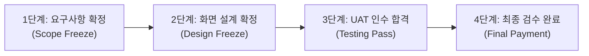

# 엠파시 사업 전 주기 표준 문서 체계 및 납품·관리 실무 가이드

소프트웨어 개발 프로젝트에서 소스코드는 실행의 주체이지만, 실제 회사를 운영하고 사업을 성립시키는 기반은 계약, 행정, 설계, 검수, 정산에 이르는 **공식 문서 체계**입니다.

본 가이드는 AI 에이전트를 활용한 개발 환경에서도 놓쳐서는 안 되는 실제 사업 관리 및 납품 문서의 전체 목록과 작성 요령, 그리고 법적 분쟁을 예방하기 위한 4대 서명(Sign-off) 관리 기준을 정리한 실무 지침서입니다.

::: tip 관련 상위 및 역할별 실무 가이드
* **[엠파시 사업 표준 서식 및 다운로드 센터](./enterprise-document-templates.md)**: 12대 필수 표준 서식 전문 및 마크다운 원본 파일 다운로드
* **[엠파시 사업 및 개발 방법론 개요](./enterprise-project-lifecycle.md)**: 사업 전 주기 6단계 라이프사이클 총괄
* **[8대 핵심 역할별 실무 책임 및 활용 가이드](./enterprise-project-lifecycle.md#41-8대-핵심-역할별-실무-책임-및-방법론-활용-가이드)**: 영업, 기획, 아키텍트, 개발, QA, 경영지원, 고객사별 필수 관리 가이드
* **[단계별 실행 항목 및 실무 실행 가이드 (SOP)](./enterprise-action-items-guide.md)**: 28대 세부 Action Item 및 절차
* **[영업 지원 및 제안 단계 실무 가이드 (Pre-sales)](./presales-ai-playbook.md)**: RFP 분석, 제안서 작성, PoC 데모 제작, 공수 산정
:::

---

## 1. 개발 결과물과 공식 납품 문서의 구분 원칙

실제 사업 현장에서는 프로그램 코드와 납품 문서를 명확히 구분해야 합니다.

* **개발 결과물 (Software Artifacts)**: 소스코드, 빌드 스크립트, 컨테이너 이미지, 로컬 테스트 로그 등 시스템을 구동하기 위한 기술 자산입니다.
* **납품 및 관리 문서 (Deliverables & Business Documents)**: 고객사 의사결정권자, 회계 부서, 외부 감리단, 그리고 법원에 프로젝트의 성립과 완결을 증명하는 공식 서류입니다.

고객사는 소스코드가 아무리 훌륭해도 직인이 찍힌 검수 확인서가 없으면 잔금을 지급하지 않으며, 감리단은 화면 설계서와 테스트 결과서가 없으면 적격 판정을 내리지 않습니다. 따라서 개발과 병행하여 단계별 필수 문서가 제때 생산되고 서명되어야 합니다.

---

## 2. 사업 전 주기 6단계 표준 문서 총괄표

| 사업 단계 | 구분 | 문서명 | 주요 목적 및 법적/실무적 효력 | 작성 주체 | 승인/수령 주체 |
| :--- | :--- | :--- | :--- | :--- | :--- |
| **0단계: 제안 및 수주** | 법률/영업 | 비밀유지협약서 (NDA) | RFP 분석 전 양사 영업비밀 및 데이터 보호 | 영업/법무 | 고객사/당사 |
| | 사업성 평가 | 입찰 타당성 심의표 (Go/No-Go) | 부실 수주 방지 및 내부 자원 투입 타당성 검토 | 영업/기술리드 | 사업부서장 |
| | 대외 제출 | 기술 제안서 | 시스템 구축 방안, 아키텍처, 수행 역량 제시 | 제안PM/프리세일즈 | 고객사 심사위원 |
| | 가격 증빙 | 공식 견적서 및 원가계산서 | 공수(M/M), 인프라비, 솔루션비, 적정 마진 산정 | 영업/제안PM | 고객사 구매팀 |
| | 행정 증빙 | 입찰 참가 적격 서류 일체 | 법인인감, 납세완납, 신용평가, 실적증명, 입찰보증보험 | 경영지원 | 고객사 계약부서 |
| | 기술 실증 | PoC 기술검증 결과보고서 | 핵심 기술 가능성 사전 입증 및 영업 데모 증빙 | 프리세일즈/개발 | 고객사 실무진 |
| | 내부 통제 | 기술 수행 승인서 (Sign-off) | 개발 리드가 납기와 스펙을 사전에 확인하고 서명 | 개발 리드 | 사업대표 |
| **1단계: 착수 및 분석** | 계약 | 용역 표준 계약서 및 계약 특약서 | 대금 조건, 지체상금, 지재권 귀속 확정 | 법무/영업 | 고객사/당사 |
| | 금융 보증 | 계약이행보증보험증권 | 계약 이행 담보 (통상 계약금의 10~15%) | 경영지원 | 고객사 계약팀 |
| | 자금 확보 | 선금(선급금) 신청서 및 선금보증보험 | 초기 투입 인건비 확보를 위한 선금 수령 (30~50%) | 경영지원 | 고객사 계약/재무팀 |
| | 행정 착수 | 착수계 (착수 신고서) | 공식 사업 착수일 확정 | PM | 고객사 사업부서 |
| | 사업 총괄 | 사업수행계획서 (PMP) | 조직도, 투입 인력 명단/이력서, 품질/보안 계획 | PM | 고객사 사업부서 |
| | 보안 준수 | 투입 인력 보안서약서 일체 | 개인정보보호, 소스코드 반출 금지 서약 | 투입 인력 전원 | 고객사 보안팀 |
| | 하도급 관리 | 하도급 사전승인 신청서 (해당 시) | SW진흥법 준수 및 협력업체 투입 승인 | PM/경영지원 | 고객사 사업부서 |
| | 개인정보 | 개인정보 처리위탁 계약서 (해당 시) | 고객사 개인정보 취급에 따른 법적 위탁 계약 | 법무/PM | 고객사 보안팀 |
| | 범위 정의 | 요구사항 정의서 및 추적표 (RTM) | 기능/비기능 요구사항 목록화 및 추적 번호 부여 | BA/기획자 | 고객사 실무진 |
| | 일정 관리 | WBS (작업 분류 체계도) | 상세 마일스톤 및 스프린트 공정 일정 확정 | PM/테크리드 | 고객사 PM |
| | 선제 검증 | 레거시 데이터 이관 조기 실증서 | 기존 데이터 결측치 및 포맷 불일치 사전 보고 | 데이터 엔지니어 | 고객사 전산팀 |
| | **핵심 승인** | **요구사항 확정 합의서 (Sign-off)** | 요구사항 분석 완료 및 범위 동결(Freeze) 선언 | 양사 PM | 양사 책임자 |
| **2단계: 설계 및 규격화** | 화면 설계 | 화면 설계서 (UI/UX 스토리보드) | 현업 승인용 전체 화면 레이아웃 및 동작 규칙 | UI/UX 기획자 | 고객사 현업부서 |
| | 인프라 | 시스템 아키텍처 설계서 (SAD) | 논리/물리 서버 구성도, 네트워크 망분리, 방화벽 포트 | 인프라/아키텍트 | 고객사 전산팀 |
| | 데이터 모델 | DDL 스키마 정의서 및 ERD | 테이블 명세서, 컬럼 속성, 인덱스 및 관계 정의 | DBA/백엔드 | 고객사 전산팀 |
| | API 계약 | 인터페이스 정의서 (API 명세서) | 송수신 주기, 전문 규격, 에러 코드, 연계 담당자 | 백엔드 리드 | 고객사/연계기관 |
| | **핵심 승인** | **설계 단계 완료 보고서 및 승인서** | 화면과 DB 설계를 잠그고 개발 진입 공식 합의 | 양사 PM | 양사 책임자 |
| **3단계: 구현 및 공정관리** | 진척 보고 | 주간 및 월간 업무 보고서 | 계획 대비 실적 공정률(S-Curve), 차주 계획 보고 | PM | 고객사 PM/경영진 |
| | 리스크 관리 | 이슈 및 위험 관리대장 | 일정 지연, 연계 지연 등의 요인과 대책 추적 | PM | 고객사 PM |
| | 변경 통제 | 요구사항 변경 요청서 (CR Form) | 범위 변경 시 공수/일정 재산정 및 서면 합의 | 요청자/PM | 양사 책임자 |
| | 계약 조정 | 과업변경 심의 청구서 (해당 시) | 공수 대폭 증가 시 계약금액 증액 및 기간 연장 청구 | PM/영업 | 고객사 계약부서 |
| | 대금 청구 | 중간 보고서 및 기성 검수 신청서 | 중도금 지급 조건 충족 증빙 및 기성금 청구 | PM/영업 | 고객사 계약팀 |
| **4단계: 검증 및 감리** | 시험 계획 | 테스트 계획서 | 단위/통합/시스템/성능 테스트 범위와 합격 기준 | QA 리드 | 고객사 QA/PM |
| | 시험 명세 | 테스트 시나리오 및 케이스 정의서 | 입력값, 정상 흐름, 예외 조건, 기대 결과 명시 | QA 엔지니어 | 고객사 실무진 |
| | 시험 결과 | 단위 및 통합 테스트 결과보고서 | 테스트 실행 결과, 커버리지, 결함 조치 내역 | QA 엔지니어 | 고객사 PM |
| | 성능/보안 | 성능 부하 테스트 결과보고서 | 동시 접속자 수, 목표 TPS, 응답 지연 측정 결과 | 인프라/QA | 고객사 전산팀 |
| | 보안 감사 | 시큐어 코딩 및 보안 진단 결과서 | 웹 취약점 진단, 개인정보 암호화, 소스코드 점검 | 보안 담당자 | 고객사 보안팀 |
| | 지재권 검증 | 오픈소스(OSS) 라이선스 검증서 | 사용된 OSS 목록, 라이선스 고지문 및 충돌 점검 | 보안/테크리드 | 고객사 보안/법무 |
| | 외부 평가 | 3자 감리 조치 결과서 (해당 시) | 공공/대형 프로젝트 전문 감리 지적사항 조치 증빙 | PM/개발팀 | 감리 법인 |
| | **핵심 승인** | **사용자 인수 테스트(UAT) 확인서** | 고객 현업이 직접 시나리오를 수행하고 합격 서명 | 고객사 현업 | 양사 책임자 |
| **5단계: 오픈 및 정산** | 배포 운영 | 배포 계획서 및 비상 롤백 절차서 | 오픈 당일 시간대별 작업 순서, 롤백 기준 정의 | DevOps/인프라 | 고객사 운영팀 |
| | 데이터 이관 | 최종 데이터 이관 완료 검증서 | 레거시 데이터 전체 정합성 검증 및 건수 일치 확인 | 데이터 엔지니어 | 고객사 전산팀 |
| | 사용자 지원 | 사용자 매뉴얼 및 관리자 매뉴얼 | 일반 직원용 사용법, 시스템 관리자용 설정법 분리 | 기획자/테크라이터 | 고객사 전 부서 |
| | 교육/인수인계 | 교육 결과보고서 및 인수인계서 | 교육 사진, 참석자 서명부, 관리자 계정/비밀번호 양도 | 교육 담당자 | 고객사 운영팀 |
| | 시스템 이관 | 시스템 운영 런북 (Operations Guide) | 장애 조치 매뉴얼, 일일 점검표, 백업 주기 안내 | 테크리드/운영팀 | 고객사 운영팀 |
| | **대금 회수** | **사업 완료 보고서 및 최종 검수 확인서** | **계약 이행 최종 증빙 및 잔금 청구(세금계산서 발행)** | 양사 PM | 양사 대표자 |
| | 대금 청구서류 | 대금 청구 공문 및 완납증명서 일체 | 세금계산서, 국세/지방세/4대보험 완납증명, 통장사본 | 경영지원 | 고객사 회계/재무팀 |
| | 사후 보증 | 하자보수 이행보증보험증권 | 1년 무상 하자보수 이행 담보 (계약금의 5~10%) | 경영지원 | 고객사 계약팀 |
| | 사후 관리 | 하자보수 계획서 | 무상 결함 처리 창구, 장애 등급별 처리 기준 명시 | 유지보수팀 | 고객사 운영팀 |
| | 장기 계약 | 유지보수 계약서 초안 (SLA 포함) | 1년 무상 보증 이후 유상 운영 계약 전환 준비 | 영업/유지보수 | 고객사 계약팀 |
| | 내부 결산 | 프로젝트 종료 회고록 및 원가 정산서 | 목표 마진 대비 실제 투입 원가(P&L) 분석 및 교훈 | PM/경영지원 | 회사 내부 경영진 |

---

## 3. 단계별 주요 문서 상세 해설 및 작성 기준

### 3.1. 사전영업 및 착수 단계 (Phase 0 ~ Phase 1)

#### 비밀유지협약서 (NDA: Non-Disclosure Agreement)
* **목적**: 고객사와의 본격적인 기술 논의 전, 서로의 영업비밀과 고객사 내부 데이터가 외부에 유출되지 않도록 법적으로 보호합니다.
* **필수 포함 항목**: 비밀정보의 정의, 정보 보호 의무 기간(통상 2~3년), 예외 조항, 위반 시 손해배상 책임, 자료의 반환 및 폐기 절차.
* **주의점**: 고객사에서 제공하는 일방적인 NDA 문안에는 과도한 배상 조항이 들어갈 수 있으므로, 상호 동등한 비밀유지 의무가 부여되어 있는지 법무 검토가 필요합니다.

#### 선금(선급금) 신청서 및 선금보증보험증권
* **목적**: 계약 체결 직후 계약금액의 30~50%를 조기 수령하여 프로젝트 초기 투입 인건비와 인프라 비용을 충당하고 회사의 현금 흐름을 안정화합니다.
* **필수 포함 항목**: 선금 신청 사유, 계약금액 대비 신청 금액 및 비율, 선금 사용 계획서(인건비, 자재비 등 용도 명시), 선금보증보험증권.
* **실무 유의점**: 선금은 정해진 목적(해당 프로젝트 투입 비용) 외의 타 용도 사용이 제한되므로, 사용 내역 영수증 및 증빙을 사내에 별도 보관해야 합니다.

#### 사업수행계획서 (Project Management Plan)
* **목적**: 프로젝트 착수 보고 시 고객사에 공식 제출하며, 계약된 기간 동안 사업을 어떻게 이끌어갈 것인지 밝히는 총괄 청사진입니다.
* **필수 포함 항목**:
  1. 사업 개요 및 목표 시스템 구성도
  2. 수행 조직도 및 투입 인력 명단 (역할, 이름, 등급, 담당 업무, 투입 기간)
  3. 상세 추진 일정표 (마일스톤 및 주요 보고 일정)
  4. 단계별 산출물 제출 목록 및 검토 주기
  5. 품질보증 및 테스트 계획
  6. 보안 관리 및 인력 이탈 시 대체 계획

#### 하도급 사전승인 신청서 (해당 시)
* **목적**: 소프트웨어 진흥법 제51조(하도급 제한)에 따라, 외부 협력업체나 외주 인력을 투입할 때 발주처(고객사)의 사전 서면 승인을 획득합니다.
* **실무 유의점**: 사전 승인 없는 무단 하도급은 부정당업자 제재나 계약 해지 사유가 되므로, 착수 시점에 하도급 계약서 및 대금 지급 보증 계획을 첨부하여 승인을 받아야 합니다.

#### 요구사항 정의서 및 요구사항 추적표 (RTM)
* **목적**: 고객의 요구사항을 고유 번호(예: REQ-001)로 구조화하고, 이 요구사항이 설계(화면, DB), 구현(소스코드), 테스트(테스트 케이스)의 어느 부분에 반영되었는지 끝까지 추적합니다.
* **필수 포함 항목**: 요구사항 ID, 요구사항 분류(기능, 비기능, 보안, 인터페이스), 상세 설명, 수용 기준, 담당 설계자/개발자, 테스트 케이스 ID, 수용 여부.

---

### 3.2. 설계 및 구현 단계 (Phase 2 ~ Phase 3)

#### 화면 설계서 (UI/UX 스토리보드)
* **목적**: 시스템의 모든 화면 배치, 입력 필드의 유효성 검사 규칙, 버튼 클릭 시의 동작 흐름을 시각적으로 명시합니다.
* **중요성**: 고객사 현업 사용자는 데이터베이스 테이블이나 API 문서를 이해하지 못합니다. 고객이 실제로 보고 만질 화면 설계서에 대해 서면 승인을 받아두어야 개발 완료 후 화면 배치가 마음에 들지 않는다는 이유로 재작업을 요구하는 사태를 방지할 수 있습니다.
* **필수 포함 항목**: 전체 화면 메뉴 트리, 화면별 와이어프레임 또는 고해상도 디자인, 버튼/입력창 인터랙션 규칙, 예외 안내 메시지 정의.

#### 시스템 아키텍처 설계서 (SAD) 및 네트워크 구성도
* **목적**: 시스템이 설치될 서버, 네트워크, 보안 장비의 구조를 확정합니다.
* **필수 포함 항목**: 논리/물리 구성도, 개발/검증/운영 환경별 서버 사양(vCPU, RAM, 디스크 용량), 방화벽 포트 오픈 신청 목록(출발지 IP, 목적지 IP, 포트 번호, 프로토콜), 망분리 연계 방식, 백업 및 이중화 구성.

#### 요구사항 변경 요청서 (CR Form: Change Request)
* **목적**: 프로젝트 진행 중 발생하는 고객사의 추가 요구나 사양 변경을 공식적으로 통제합니다.
* **운영 기준**:
  1. 구두 요청은 일체 인정하지 않으며 서면 양식 제출을 의무화합니다.
  2. 변경 요청 접수 시 영향도 분석(영향 화면 수, API 수, DB 변경 여부)을 거쳐 추가 소요 공수(M/D)를 산정합니다.
  3. 일정 범위(예: 3 M/D 초과) 이상의 작업은 납기 연장 또는 기존 기능 제외, 추가 계약 체결을 전제로만 승인합니다.

---

### 3.3. 검증 및 오픈 단계 (Phase 4 ~ Phase 5)

#### 사용자 인수 테스트(UAT) 계획서 및 결과 확인서
* **목적**: 개발팀 내부 테스트가 끝난 후, 고객사 현업 담당자가 실제 운영 환경과 유사한 조건에서 업무 시나리오를 직접 수행하고 시스템 수용 여부를 판정합니다.
* **진행 요령**:
  1. 사전 합의된 시나리오에 따라 정상 데이터 입력, 오류 데이터 입력, 결제/취소 흐름 등을 단계별로 수행합니다.
  2. 발생한 결함은 등급별(치명, 보통, 경미)로 분류하여 조치 계획을 수립합니다.
  3. 치명적인 결함이 0건이고 고객사 테스트 책임자가 "인수 검사 합격"에 서명해야 다음 오픈 단계로 진입할 수 있습니다.

#### 오픈소스 소프트웨어(OSS) 라이선스 검증서 및 고지문
* **목적**: 시스템에 사용된 오픈소스 컴포넌트의 라이선스(Apache, MIT, BSD, GPL 등)를 전수 점검하여 지식재산권 분쟁을 방지합니다.
* **필수 포함 항목**: 사용 라이선스 목록, 의무 이행 사항(저작권 고지, 소스코드 공개 의무 여부 확인), 배포 패키지 내 라이선스 고지문(NOTICE) 포함 여부.

#### 사업 완료 보고서 및 최종 검수 완료 확인서
* **목적**: 회사가 고객사로부터 **잔금을 받고 매출을 확정하기 위해 가장 중요한 법적 서류**입니다.
* **필수 포함 항목**:
  * 계약명, 계약 기간, 계약 금액
  * 사업 목표 대비 최종 달성 내역
  * 납품 산출물 일체 목록 및 제출 여부
  * 최종 검수 결과 (적격 판정)
  * 고객사 대표자 직인 및 날짜
* **실무 주의점**: 검수 확인서에 고객사 직인이 찍히는 날짜가 회계상의 '매출 인식일'이 되며, 세금계산서 발행과 대금 청구의 근거가 됩니다.

#### 대금 청구 필수 행정 첨부 서류
* **목적**: 고객사 회계 및 재무 부서의 자금 집행 검토를 통과하고 대금을 안전하게 입금받기 위함.
* **구비 서류 목록**:
  1. 대금 청구 공문
  2. 전자세금계산서
  3. 국세 완납증명서 (홈택스 발급)
  4. 지방세 완납증명서 (위택스 발급)
  5. 4대 사회보험료 완납증명서
  6. 법인 통장 사본
  7. 최종 검수 확인서 사본 및 하자보수 이행보증보험증권 사본

---

## 4. 분쟁 예방을 위한 4대 필수 서명(Sign-off) 관리 기준

프로젝트가 파행에 이르는 대부분의 원인은 "서로 말이 달랐다"는 데서 출발합니다. 다음 4개 마일스톤에서는 반드시 양사 책임자의 공식 서명을 서면으로 확보해야 합니다.

1. **요구사항 확정 서명 (1단계 종료 시)**:
   * 목적: 제안서에 약속된 기능과 실제 개발할 기능의 목록을 일치시키고 범위를 고정합니다.
   * 효과: 이후 발생하는 새로운 요구를 '하자'가 아닌 '추가 개발(과업 변경)'로 규정할 수 있습니다.
2. **화면 설계서 서명 (2단계 종료 시)**:
   * 목적: 현업이 사용할 화면 디자인과 기능 흐름에 대해 합의합니다.
   * 효과: 코딩이 한창 진행된 상태에서 화면의 레이아웃이나 업무 동선을 뒤엎는 행위를 방지합니다.
3. **사용자 인수 테스트(UAT) 합격 서명 (4단계 종료 시)**:
   * 목적: 고객이 직접 테스트하여 모든 기능이 정상 작동함을 승인받습니다.
   * 효과: 시스템 오픈 후 "동작하지 않는 기능이 있었다"는 사후 이의 제기를 차단합니다.
4. **최종 검수 완료 서명 (5단계 종료 시)**:
   * 목적: 계약된 모든 과업이 완료되었음을 공인받습니다.
   * 효과: 잔금 수금의 법적 청구권을 확보하고, 무상 하자보수 기간을 공식 시작합니다.

---

## 5. 하자보수와 유지보수의 명확한 경계 구분

시스템 오픈 후 고객사와의 갈등은 대부분 '하자보수'와 '유지보수'의 해석 차이에서 발생합니다. 계약서와 계획서에 아래 기준을 명확히 적시해야 합니다.

| 구분 | 무상 하자보수 (Warranty) | 유상 유지보수 (Maintenance / SLA) |
| :--- | :--- | :--- |
| **법적 성격** | 납품 당시 이미 존재했던 결함(오류)의 수정 의무 | 오픈 이후 변화하는 환경에 맞춘 관리 및 개선 계약 |
| **기간** | 검수 완료일로부터 통상 1년 | 하자보수 종료 후 1년 단위 갱신 계약 |
| **비용** | 무상 (원계약 금액에 포함) | 유상 (통상 순수 개발비의 연 8~15% 수준) |
| **포함 범위** | - 기존 요구사항대로 동작하지 않는 시스템 버그 - 데이터베이스 계산 오류, 비정상 서버 종료 - 설계서에 명시된 기능의 미작동 | - 새로운 업무 기능의 개발 및 화면 추가 - 고객사 정책 변경에 따른 프로세스 수정 - 신규 OS/브라우저 업그레이드 지원 - 상시 상주 운영 인력 지원 및 대외기관 신규 연계 |
| **처리 절차** | 버그 접수 ➔ 재현 및 수정 ➔ 패치 배포 | 변경 요청 접수 ➔ 공수 산정 ➔ 정기 점검 시 반영 |

---

## 6. 발주처 유형별 맞춤형 특수 규제 및 필수 문서 대응 지침

발주처의 성격(공공기관, 금융권, 민간 대기업)에 따라 요구되는 법적 감사 규제와 필수 행정 서식이 크게 다릅니다. 사전 영업 및 착수 단계에서 각 발주처 유형의 특성을 파악하고 선제적으로 문서를 준비해야 합니다.

### 6.1. 공공기관 (정부부처, 지자체, 공공기관)

공공 소프트웨어 사업은 **소프트웨어 진흥법**, **국가를 당사자로 하는 계약에 관한 법률(국가계약법)**, **전자정부법**의 엄격한 통제를 받습니다.

| 규제 및 점검 영역 | 핵심 준수 요건 및 규정 | 필수 구비 및 제출 문서 |
| :--- | :--- | :--- |
| **하도급 제한 및 통제** | - 소프트웨어 진흥법 제51조 준수 - 전체 계약금액의 50%를 초과하는 하도급 금지 - 재하도급(재하청) 전면 금지 원칙 | - 소프트웨어사업 하도급 사전승인 신청서 - 하도급 표준계약서 및 대금산출내역서 - 재하도급 금지 확약서 |
| **선금 지급 및 정산** | - 정부 입찰·계약 집행기준 제34조 - 계약금액의 최대 70%까지 선금 신청 가능 - 선금 수령 후 15일 이내 하도급 대금 지급 의무 | - 선금 신청서 및 사용계획서 - 선금급 지급보증서 (SGI/공제조합) - 하도급 선금 지급 증빙 (이체확인증) |
| **소프트웨어 개발보안** | - 행정안전부 「SW 개발보안 가이드」 49개 보안약점 진단 - SQL 인젝션, XSS, 취약한 인증 등 사전 차단 | - 시큐어 코딩 점검 결과보고서 - 소스코드 보안약점 진단 및 조치 내역서 |
| **3자 전문 감리 대응** | - 전자정부법 제57조(전자정부사업의 감리) - 공공 SW사업 필수 감리 (착수/중간/종료 감리) | - 감리 지적사항 조치계획서 - 감리 지적사항 조치결과 확인서 |
| **과업 변경 심의** | - 소프트웨어 진흥법 제50조(과업내용의 확정 등) - 과업 범위 변경 시 과업심의위원회 개최 요구 권리 | - 과업변경 심의 청구서 - 과업 변경 영향도 분석표 |

### 6.2. 금융권 (은행, 카드사, 증권사, 보험사, 핀테크)

금융권 프로젝트는 **전자금융감독규정**, **신용정보법**, **개인정보보호법**의 규제를 받으며, 금융보안원의 보안 검수가 프로젝트 오픈의 절대적인 전제 조건입니다.

| 규제 및 점검 영역 | 핵심 준수 요건 및 규정 | 필수 구비 및 제출 문서 |
| :--- | :--- | :--- |
| **물리적·논리적 망분리** | - 전자금융감독규정 제15조(고유식별정보 등의 처리) - 내부 업무망과 외부 인터넷망의 완전 분리 - 소스코드 및 개발 노트북 반입·반출 통제 | - 개발 장비 반출입 신청서 및 보안 점검표 - 외부 소스코드 반입 신청서 및 승인서 - 보조기억매체(USB) 통제 및 봉인 기록부 |
| **개인신용정보 보호** | - 신용정보의 이용 및 보호에 관한 법률 - 개발 및 테스트 환경에서 실제 개인정보 사용 전면 금지 - 가명정보 또는 비식별화 합성 데이터 사용 의무 | - 테스트 데이터 비식별화 처리 확인서 - 개인신용정보 취급 서약서 및 교육일지 - 데이터베이스 접근 제어 감사 로그 |
| **금융보안원 취약점 진단** | - 금융보안원 웹/모바일 앱 취약점 가이드 - 모의해킹(Penetration Testing) 및 결함 0건 요건 | - 취약점 진단 결과서 및 모의해킹 보고서 - 보안 패치 조치 결과 확인서 |
| **외부 연계 종단간 암호화**| - 금융결제원, KFTC 등 금융 대외계 전문 연계 - 전송 구간 암호화(mTLS) 및 데이터 필드 암호화 | - 인터페이스 보안 규격서 - 암호화 키 관리 대장 및 키 이관 확인서 |

### 6.3. 민간 대기업 (제조, 유통, 통신, 엔터프라이즈)

민간 대기업은 **그룹사 표준 IT 거버넌스**, **지식재산권(IP) 귀속 조항**, **공급망 품질 기준**에 민감합니다.

| 규제 및 점검 영역 | 핵심 준수 요건 및 규정 | 필수 구비 및 제출 문서 |
| :--- | :--- | :--- |
| **지식재산권(IP) 귀속** | - 산출물 저작권의 귀속 주체 (고객 단독 vs 상호 공유) - 당사 코어 솔루션(SyncSeries/Verse) 라이선스 보호 | - 소프트웨어 라이선스 공급 계약서 - 지식재산권 귀속 및 비독점적 사용권 특약서 |
| **그룹사 보안/인프라 표준**| - 그룹사 사내 인증(SSO, 사내 포털 연동) - 승인된 표준 클라우드(CSP) 및 인프라 정책 준수 | - 시스템 아키텍처 적합성 검토서 - 그룹 통합 인증(SSO) 연동 확인서 |
| **대금 지급 조건 및 담보**| - 기성 단계별 대금 지급 (착수금 30%, 중도금 40%, 잔금 30%) - 전자어음, 상생결제, 구매카드 결제 조건 확인 | - 기성고 확인서 및 세금계산서 - 계약이행보증 및 하자보수보증보험증권 |
| **오픈소스(OSS) 컴플라이언스**| - 상용 라이선스 오염(GPL, AGPL) 전면 금지 - 사내 오픈소스 검증 도구(FOSSID, Black Duck) 통과 | - OSS 라이선스 검증 확인서 및 SBOM - 오픈소스 고지문(NOTICE) |

---

## 7. AI 에이전트 및 LLM 토큰 비용(FinOps) 정산 및 과금 기준

AI 기반 시스템(Agent-to-Agent 협업, RAG, 자율 실행 등)을 도입하는 프로젝트에서는 기존 SI 프로젝트와 달리 **매월 지속적으로 발생하는 API 호출 토큰 및 GPU 인프라 비용**에 대한 정산 기준을 사전에 확립하지 않으면 분쟁의 원인이 됩니다.

### 7.1. 비용 귀속 주체 및 원가 처리 원칙

| 비용 항목 | 귀속 주체 | 정산 및 과금 방식 | 실무 유의점 |
| :--- | :---: | :--- | :--- |
| **외부 상용 LLM API 토큰** (OpenAI, Anthropic, Google 등) | **고객사 부담 (실비)** | - **고객사 직접 결제 계정 등록 원칙** - 당사 대행 결제 시 실비 청구(Pass-through) + 수수료(5~10%) | 계약서 특약에 "LLM 호출 비용은 순수 시스템 용역비와 별개의 고객사 실비 부담금"임을 명시. |
| **온프레미스 GPU 서버** (NVIDIA H100, L40S 등) | **고객사 자산 / 임대** | - 고객사가 하드웨어 직접 구매 또는 IDC 호스팅 임대 - 당사는 사양 가이드 및 드라이버/vLLM 환경 구성만 수행 | GPU 장비 납품 지연으로 인한 개발 지연 리스크를 일정 관리대장에 면책 사유로 등록. |
| **AI RAG 벡터 DB 리인덱싱** (데이터 갱신에 따른 재임베딩) | **운영 유지보수 포함** | - 정기 데이터 갱신 시 소요되는 컴퓨팅 파워 - 대규모 데이터 전면 재임베딩은 별도 공수 산정 | 데이터가 100만 건 이상 폭증할 경우 임베딩 API 비용 예산을 사전에 고객사와 협의. |
| **프롬프트 고도화 및 튜닝** | **유상 유지보수 대상** | - 오픈 이후 비즈니스 룰 변경에 따른 프롬프트 수정 - **1년 무상 하자보수 범위에서 명시적 제외** | 단순 버그 수정과 구분하여 유상 기능 개선 또는 별도 SLA 공수로 정산. |

### 7.2. 토큰 비용 폭증 방지 4대 통제 장치 (FinOps Rule)

1. **사용자/에이전트별 토큰 쿼터(Quota) 할당**:
   - 일일/월간 최대 토큰 사용량 상한선(예: 사용자당 일 50,000 토큰)을 애플리케이션 레벨에서 강제하여 무한 루프나 악의적 프롬프트 인젝션으로 인한 과금을 차단합니다.
2. **시맨틱 캐싱(Semantic Caching) 도입**:
   - 유사 질문에 대해 동일한 LLM 호출을 반복하지 않고, Redis 벡터 캐시에서 즉각 응답을 반환하여 외부 API 호출 비용을 40~60% 절감합니다.
3. **토큰 소모량 실시간 모니터링 및 알림**:
   - 일일 예산의 80% 도달 시 담당 PM 및 고객사 운영자에게 슬랙/이메일 자동 알림을 발송하고, 100% 도달 시 모델을 경량 모델(Flash/Mini)로 자동 폴백합니다.
4. **월간 FinOps 정산 보고서 정례화**:
   - 매월 초 전월의 모델별(GPT-4o, Claude 3.5 Sonnet 등) 호출 건수, 입/출력 토큰 소비량, 부서별 사용량 통계를 정리한 리포트를 고객사에 제출하여 비용 투명성을 확보합니다.

---

---

## 8. 외주 협력사 및 프리랜서 인력 관리 시 4대 법적·재무적 리스크 통제 수칙

프로젝트 수행 중 특정 전문 분야(데이터 엔지니어링, 퍼블리싱 등)나 일시적인 인력 피크를 해결하기 위해 **외주 개발사(법인/개인사업자)** 또는 **개인 프리랜서(3.3% 사업소득자)**를 투입할 때, 계약서 작성 미흡으로 인해 발생하는 법적·재무적 리스크를 사전에 차단해야 합니다.

### 8.1. 위장도급 및 근로기준법상 '근로자성' 소송 방지 (프리랜서 필수)

소프트웨어 프리랜서와 계약할 때 가장 빈번하게 발생하는 문제는 퇴사 후 노동청 진정을 통한 **"주휴수당, 퇴직금, 4대보험 소급 청구 소송"**입니다.
* **리스크 요인**: 프리랜서 계약서에 "출근 시간 09:00, 퇴근 시간 18:00", "회사의 지휘·명령에 복종한다", "연차 휴가 부여" 등 근로계약서 문구를 그대로 차용할 경우, 실질적인 근로자로 판정되어 회사가 패소합니다.
* **대응 원칙**:
  1. 계약서 명칭을 반드시 **「소프트웨어 프리랜서 업무위탁 용역계약서」**로 명시합니다.
  2. "수탁자는 독자적인 전문성에 기초하여 과업을 완성하는 독립된 개인 사업소득자이며, 출퇴근 시간 및 작업 장소는 과업 일정에 차질이 없는 한 수탁자의 자율적 재량에 따른다"는 조항을 명문화합니다.
  3. 근태 관리(지각, 조퇴 체크) 대신 **과업내용서(SOW)에 명시된 기능의 단위테스트 통과율 및 완성물 납품 여부로만 검수**합니다.

### 8.2. 하자담보책임 및 지체상금 1:1 백투백(Back-to-Back) 연동

원청(당사)이 고객사에게 지는 법적 의무를 외주 계약서에도 대등하게 반영하지 않으면, 외주사의 귀책으로 발생한 모든 손해를 당사가 독박 쓰게 됩니다.
* **대응 원칙**:
  1. **하자담보책임 일치**: 고객사 계약 조건과 동일하게 **"외주 산출물의 최종 검수 완료일로부터 1년간 무상 하자보수 의무"**를 외주사 계약서에 필수 명시합니다.
  2. **지체상금 연동**: 외주사의 납품 지연으로 전체 프로젝트 납기가 지연될 경우를 대비하여, **"지체 1일당 외주 계약금액의 0.075%"**를 지체상금으로 공제하는 조항을 강제합니다.

### 8.3. 지식재산권(IP) 및 소스코드 완전 양도 조항 의무화

저작권법상 별도의 명문 약정이 없으면 소프트웨어의 원시 저작권은 코드를 작성한 외주 개발자에게 귀속됩니다.
* **대응 원칙**:
  1. **저작재산권 전속 양도**: "본 계약에 따라 개발된 모든 소스코드, 설계서, 알고리즘의 저작재산권(2차적저작물작성권 및 편집저작물작성권 포함)은 용역 대금 완납과 동시에 당사에 확정적으로 귀속된다"는 문구를 명시합니다.
  2. **저작인격권 불행사**: 외주사나 프리랜서가 향후 저작인격권(성명표시권, 동일성유지권)을 주장하여 소스코드의 수정이나 타 프로젝트 재사용을 방해하지 못하도록 불행사 특약을 둡니다.

### 8.4. 소프트웨어 진흥법상 재하도급(재하청) 전면 차단

외주사가 당사의 승인 없이 또 다른 개인이나 영세 개발사에 하청을 주는 '재하도급'은 소프트웨어 진흥법 제51조 위반으로, 적발 시 발주처로부터 **부정당업자 제재 및 계약 해지**를 당하게 됩니다.
* **대응 원칙**:
  1. 외주 계약서에 **"당사 및 발주처의 사전 서면 승인 없는 일체의 재하도급(재하청) 전면 금지"** 조항을 포함합니다.
  2. 계약 체결 시 외주사 대표자 명의의 **「재하도급 금지 확약서」**를 필수로 징구하고, 실제 작업자가 계약서에 명시된 인력인지 형상관리(Git 커밋 계정)로 상시 감독합니다.

---

## 9. 사업 수행 및 운영 중 5대 돌발 위기 상황과 표준 대응 절차 (SOP)

실제 프로젝트 현장에서는 개발 외적인 요인(발주처 내부 사정, 인프라 개방 지연, 인력 이탈, 장애, 침해 사고)으로 인해 회사가 존립의 위기에 처할 수 있습니다. 다음 5대 위기 상황에 대한 표준 대응 절차를 사전에 숙지하고 대응해야 합니다.

### 9.1. 발주처 귀책 지연 시 공기 연장(EOT) 및 지체상금 면제 절차

* **위기 상황**: 발주처의 네트워크 방화벽 오픈 지연, 타 연계기관 인터페이스 규격 미확정, 레거시 DB 이관 데이터 미제공 등으로 인해 개발이 2~4주간 중단되었으나, 발주처 계약부서는 원래 계약 납기대로 준공하지 못했다며 1일당 0.075%의 지체상금을 부과하려는 경우.
* **대응 절차 (SOP)**:
  1. **지연 발생 즉시 공식 공문 발송**: 구두 항의나 메신저는 효력이 없습니다. 지연 발생 3영업일 이내에 **「외부 요인에 따른 개발 공정 일시 중단 안내 및 협조 요청 공문」**을 발송합니다.
  2. **지연 영향도 및 일수 산정**: 방화벽 미개방으로 인해 영향받은 작업(API 20건, 테스트 5일)을 WBS 상에서 산출합니다.
  3. **공기 연장 신청서(EOT) 및 면책 사유서 제출**: 국가계약법 시행령 제74조에 의거하여 **「납기 연장 신청서 및 면책사유 입증서」**를 제출하고 공식 변경 계약을 요구합니다. (공식 증빙이 누적되어 있으면 발주처 감사실에서도 지체상금을 부과할 수 없습니다.)

### 9.2. 핵심 투입 인력 이탈(퇴사/질병) 시 합법적 교체 승인 절차

* **위기 상황**: 제안서나 착수계에 명시된 핵심 PL이나 아키텍트가 질병, 이직, 퇴사 등으로 인해 현장을 떠나게 된 경우.
* **대응 절차 (SOP)**:
  1. **무단 교체 절대 금지**: 발주처 승인 없이 인력을 교체했다가 적발되면 계약 위반으로 입찰 참가 자격 제한(부정당업자 제재)을 받습니다.
  2. **동급 이상 자격 요건 확보**: 한국소프트웨어산업협회(KOSA) SW기술자 경력증명서 상으로 기존 인력과 **동등하거나 더 높은 기술 등급(예: 고급 ➔ 특급)**의 대체 인력을 선임합니다.
  3. **투입 인력 변경 승인 신청서 제출**: 인력 교체 14일 전에 **「투입 인력 변경(교체) 승인 신청서」**와 최소 5영업일 이상의 합동 인수인계 계획서를 제출하여 사전 서면 승인을 획득합니다.

### 9.3. 시스템 장애(P1/P2) 발생 시 5-Whys 근본 원인 분석 및 Post-Mortem 절차

* **위기 상황**: 시스템 오픈 직후 결제 모듈이 중단되거나 DB 커넥션 풀 고갈로 전사 서비스가 마비된 경우.
* **대응 절차 (SOP)**:
  1. **최초 30분 이내 상황 전파**: 원인 파악 전이라도 장애 발생 사실, 비상 온콜 가동, 예상 우회 조치 시간을 고객사 핫라인으로 즉각 통보합니다.
  2. **임시 우회 조치(2시간 이내)**: 트래픽 스위칭, 인스턴스 재기동, 롤백 등 서비스를 먼저 살려 비즈니스 피해를 최소화합니다.
  3. **24시간 이내 공식 장애보고서(Incident Report) 제출**: 5-Whys 기법을 적용하여 단순 현상이 아닌 근본 원인(Root Cause: 쿼리 인덱스 누락, 동시성 락 등)을 밝히고, 재발 방지 대책(APM 실시간 경보, 서킷 브레이커 도입)을 명시한 정식 보고서를 제출하여 고객사 경영진의 신뢰를 회복합니다.

### 9.4. 보안 침해 및 개인정보 유출 시 72시간 골든타임 신고 절차

* **위기 상황**: 개발/운영 서버가 랜섬웨어에 감염되거나, 고객 개인정보가 외부로 유출된 징후를 발견한 경우.
* **대응 절차 (SOP)**:
  1. **외부 통신 즉각 차단**: 감염된 인스턴스의 네트워크 랜선을 뽑거나 방화벽 인/아웃바운드를 즉시 격리합니다.
  2. **72시간 이내 법정 신고 의무**: 개인정보보호법 제34조에 따라 유출 사실을 인지한 시점부터 **72시간 이내에 개인정보보호위원회 또는 한국인터넷진흥원(KISA)에 공식 신고**해야 합니다. (기한 초과 시 대표이사 형사처벌 및 최대 수십억 원의 과징금 부과 대상).
  3. **정보주체 개별 통지**: 유출된 항목, 시점, 이용자 조치 요령(비밀번호 변경 등)을 담아 이메일 및 문자로 정보주체에게 통지합니다.

### 9.5. 사업 중도 해지(타절) 시 기성고 확정 및 분쟁 종결 절차

* **위기 상황**: 고객사의 내부 경영 악화로 사업이 취소되거나, 요구사항 이견이 좁혀지지 않아 불가피하게 프로젝트를 중도 타절(계약 해제)해야 하는 경우.
* **대응 절차 (SOP)**:
  1. **객관적 기성고(S-Curve) 실적 증빙**: 해지 시점까지 작성된 산출물(SRS 요구사항 수, API 수, DB 테이블 수, 프론트 화면 수)을 WBS 계획과 대조하여 객관적인 진척률(예: 55%)을 산출합니다.
  2. **기성 정산 합의서 체결**: 기성 인정 금액(55%)에서 기 수령한 선금(30%)을 차감한 잔액(25%)을 발주처가 정산 지급하도록 명문화합니다.
  3. **부제소 합의(분쟁의 종결)**: 산출물 인도 조건부로 "본 합의 체결 및 정산금 지급 완료와 동시에 상대방에 대한 일체의 추가 손해배상 청구 및 소송을 제기하지 아니한다"는 조항을 포함하여 소송 리스크를 영구히 종결짓습니다.

---

## 10. 결론: 안전한 회사 운영을 위한 문서 관리 3대 원칙

1. **말이 아닌 문서로 남깁니다**: 회의에서 구두로 나눈 대화나 메신저 쪽지는 법적 효력이 취약합니다. 중요한 결정은 반드시 회의록에 기록하여 참석자 확인 메일을 발송하고, 범위 변경은 서면 양식(CR Form)으로 서명을 남겨야 합니다.
2. **개발 단계와 문서 단계를 동기화합니다**: 코딩이 다 끝난 뒤 몰아서 문서를 작성하려고 하면 이미 지나간 결정의 맥락을 잃어버리고 문서 부채가 발생합니다. AI 에이전트를 활용하여 코드가 나올 때 API 명세서, 테스트 결과서, 테이블 정의서가 동시에 갱신되도록 운영해야 합니다.
3. **정산 문서를 최우선으로 관리합니다**: 회사의 생존은 현금 흐름에 달려 있습니다. 기성 검수 신청서, 최종 검수 확인서, 하자보수보증보험 등 대금 지급과 직결되는 행정 문서는 프로젝트 초기부터 일정에 배정하여 마감일에 차질이 없도록 관리해야 합니다.

---

## 11. 관련 서식 템플릿 다운로드 바로가기

실무에서 즉시 활용할 수 있는 단계별 40여 종의 오피스 문서 및 비상 위기관리 계약 서식은 아래 페이지에서 원본 파일 및 일괄 ZIP 패키지로 다운로드할 수 있습니다.

* **[엠파시 사업 표준 서식 및 다운로드 센터 바로가기](./enterprise-document-templates.md)**
  - 납기 연장 신청서 및 면책사유 입증서(EOT), 투입 인력 변경 승인 신청서
  - 시스템 장애 보고서(Incident Report / Post-Mortem), 월간 정기점검 운영보고서
  - 보안 침해사고 및 개인정보 유출 신고서, 사업 중도 해지(타절) 합의 및 기성정산서
  - 외주 용역 표준도급계약서, 프리랜서 업무위탁 용역계약서, 외주 보안서약서, 외주 SOW, 외주 검수평가표
  - 상호 비밀유지협약서(NDA), 입찰 타당성 심의서(Go/No-Go), 3개년 TCO 원가계산서, 사업 제안서 및 PT
  - 소프트웨어 용역 표준계약서, 착수계, 사업수행계획서, 선금 신청서, Scope Freeze 합의서
  - 화면 UI/UX 스토리보드, 시스템 아키텍처 설계서(SAD), ERD 테이블 정의서, API 명세서
  - 주간/월간 진척보고서, 이슈/리스크 관리대장, CR Form, UAT 확인서, 시큐어코딩 49개 점검표
  - 시스템 배포 런북, 데이터 이관 대사표, 최종 검수 확인서, 준공 대금 청구 공문, SLA 협약서
  - **전체 템플릿 통합 압축팩 (`Empasy_Methodology_All_Templates.zip`) 일괄 다운로드**

