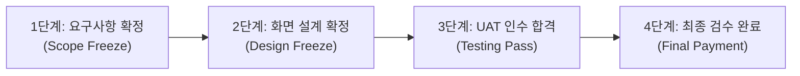

# 사업 전 주기 표준 문서 체계 및 납품·관리 실무 가이드

소프트웨어 개발 프로젝트에서 소스코드는 실행의 주체이지만, 실제 회사를 운영하고 사업을 성립시키는 기반은 계약, 행정, 설계, 검수, 정산에 이르는 **공식 문서 체계**입니다.

본 가이드는 AI 에이전트를 활용한 개발 환경에서도 놓쳐서는 안 되는 실제 사업 관리 및 납품 문서의 전체 목록과 작성 요령, 그리고 법적 분쟁을 예방하기 위한 4대 서명(Sign-off) 관리 기준을 정리한 실무 지침서입니다.

---

## 1. 개발 결과물과 공식 납품 문서의 구분 원칙

실제 사업 현장에서는 프로그램 코드와 납품 문서를 명확히 구분해야 합니다.

* **개발 결과물 (Software Artifacts)**: 소스코드, 빌드 스크립트, 컨테이너 이미지, 로컬 테스트 로그 등 시스템을 구동하기 위한 기술 자산입니다.
* **납품 및 관리 문서 (Deliverables & Business Documents)**: 고객사 의사결정권자, 회계 부서, 외부 감리단, 그리고 법원에 프로젝트의 성립과 완결을 증명하는 공식 서류입니다.

고객사는 소스코드가 아무리 훌륭해도 직인이 찍힌 검수 확인서가 없으면 잔금을 지급하지 않으며, 감리단은 화면 설계서와 테스트 결과서가 없으면 적격 판정을 내리지 않습니다. 따라서 개발과 병행하여 단계별 필수 문서가 제때 생산되고 서명되어야 합니다.

---

## 2. 사업 전 주기 6단계 표준 문서 총괄표

| 사업 단계 | 구분 | 문서명 | 주요 목적 및 법적/실무적 효력 | 작성 주체 | 승인/수령 주체 |
| :--- | :--- | :--- | :--- | :--- | :--- |
| **0단계: 제안 및 수주** | 법률/영업 | 비밀유지협약서 (NDA) | RFP 분석 전 양사 영업비밀 및 데이터 보호 | 영업/법무 | 고객사/당사 |
| | 사업성 평가 | 입찰 타당성 심의표 (Go/No-Go) | 부실 수주 방지 및 내부 자원 투입 타당성 검토 | 영업/기술리드 | 사업부서장 |
| | 대외 제출 | 기술 제안서 | 시스템 구축 방안, 아키텍처, 수행 역량 제시 | 제안PM/프리세일즈 | 고객사 심사위원 |
| | 가격 증빙 | 공식 견적서 및 원가계산서 | 공수(M/M), 인프라비, 솔루션비, 적정 마진 산정 | 영업/제안PM | 고객사 구매팀 |
| | 행정 증빙 | 입찰 참가 적격 서류 일체 | 법인인감, 납세완납, 신용평가, 실적증명, 입찰보증보험 | 경영지원 | 고객사 계약부서 |
| | 기술 실증 | PoC 기술검증 결과보고서 | 핵심 기술 가능성 사전 입증 및 영업 데모 증빙 | 프리세일즈/개발 | 고객사 실무진 |
| | 내부 통제 | 기술 수행 승인서 (Sign-off) | 개발 리드가 납기와 스펙을 사전에 확인하고 서명 | 개발 리드 | 사업대표 |
| **1단계: 착수 및 분석** | 계약 | 용역 표준 계약서 및 계약 특약서 | 대금 조건, 지체상금, 지재권 귀속 확정 | 법무/영업 | 고객사/당사 |
| | 금융 보증 | 계약이행보증보험증권 | 계약 이행 담보 (통상 계약금의 10~15%) | 경영지원 | 고객사 계약팀 |
| | 자금 확보 | 선금(선급금) 신청서 및 선금보증보험 | 초기 투입 인건비 확보를 위한 선금 수령 (30~50%) | 경영지원 | 고객사 계약/재무팀 |
| | 행정 착수 | 착수계 (착수 신고서) | 공식 사업 착수일 확정 | PM | 고객사 사업부서 |
| | 사업 총괄 | 사업수행계획서 (PMP) | 조직도, 투입 인력 명단/이력서, 품질/보안 계획 | PM | 고객사 사업부서 |
| | 보안 준수 | 투입 인력 보안서약서 일체 | 개인정보보호, 소스코드 반출 금지 서약 | 투입 인력 전원 | 고객사 보안팀 |
| | 하도급 관리 | 하도급 사전승인 신청서 (해당 시) | SW진흥법 준수 및 협력업체 투입 승인 | PM/경영지원 | 고객사 사업부서 |
| | 개인정보 | 개인정보 처리위탁 계약서 (해당 시) | 고객사 개인정보 취급에 따른 법적 위탁 계약 | 법무/PM | 고객사 보안팀 |
| | 범위 정의 | 요구사항 정의서 및 추적표 (RTM) | 기능/비기능 요구사항 목록화 및 추적 번호 부여 | BA/기획자 | 고객사 실무진 |
| | 일정 관리 | WBS (작업 분류 체계도) | 상세 마일스톤 및 스프린트 공정 일정 확정 | PM/테크리드 | 고객사 PM |
| | 선제 검증 | 레거시 데이터 이관 조기 실증서 | 기존 데이터 결측치 및 포맷 불일치 사전 보고 | 데이터 엔지니어 | 고객사 전산팀 |
| | **핵심 승인** | **요구사항 확정 합의서 (Sign-off)** | 요구사항 분석 완료 및 범위 동결(Freeze) 선언 | 양사 PM | 양사 책임자 |
| **2단계: 설계 및 규격화** | 화면 설계 | 화면 설계서 (UI/UX 스토리보드) | 현업 승인용 전체 화면 레이아웃 및 동작 규칙 | UI/UX 기획자 | 고객사 현업부서 |
| | 인프라 | 시스템 아키텍처 설계서 (SAD) | 논리/물리 서버 구성도, 네트워크 망분리, 방화벽 포트 | 인프라/아키텍트 | 고객사 전산팀 |
| | 데이터 모델 | DDL 스키마 정의서 및 ERD | 테이블 명세서, 컬럼 속성, 인덱스 및 관계 정의 | DBA/백엔드 | 고객사 전산팀 |
| | API 계약 | 인터페이스 정의서 (API 명세서) | 송수신 주기, 전문 규격, 에러 코드, 연계 담당자 | 백엔드 리드 | 고객사/연계기관 |
| | **핵심 승인** | **설계 단계 완료 보고서 및 승인서** | 화면과 DB 설계를 잠그고 개발 진입 공식 합의 | 양사 PM | 양사 책임자 |
| **3단계: 구현 및 공정관리** | 진척 보고 | 주간 및 월간 업무 보고서 | 계획 대비 실적 공정률(S-Curve), 차주 계획 보고 | PM | 고객사 PM/경영진 |
| | 리스크 관리 | 이슈 및 위험 관리대장 | 일정 지연, 연계 지연 등의 요인과 대책 추적 | PM | 고객사 PM |
| | 변경 통제 | 요구사항 변경 요청서 (CR Form) | 범위 변경 시 공수/일정 재산정 및 서면 합의 | 요청자/PM | 양사 책임자 |
| | 계약 조정 | 과업변경 심의 청구서 (해당 시) | 공수 대폭 증가 시 계약금액 증액 및 기간 연장 청구 | PM/영업 | 고객사 계약부서 |
| | 대금 청구 | 중간 보고서 및 기성 검수 신청서 | 중도금 지급 조건 충족 증빙 및 기성금 청구 | PM/영업 | 고객사 계약팀 |
| **4단계: 검증 및 감리** | 시험 계획 | 테스트 계획서 | 단위/통합/시스템/성능 테스트 범위와 합격 기준 | QA 리드 | 고객사 QA/PM |
| | 시험 명세 | 테스트 시나리오 및 케이스 정의서 | 입력값, 정상 흐름, 예외 조건, 기대 결과 명시 | QA 엔지니어 | 고객사 실무진 |
| | 시험 결과 | 단위 및 통합 테스트 결과보고서 | 테스트 실행 결과, 커버리지, 결함 조치 내역 | QA 엔지니어 | 고객사 PM |
| | 성능/보안 | 성능 부하 테스트 결과보고서 | 동시 접속자 수, 목표 TPS, 응답 지연 측정 결과 | 인프라/QA | 고객사 전산팀 |
| | 보안 감사 | 시큐어 코딩 및 보안 진단 결과서 | 웹 취약점 진단, 개인정보 암호화, 소스코드 점검 | 보안 담당자 | 고객사 보안팀 |
| | 지재권 검증 | 오픈소스(OSS) 라이선스 검증서 | 사용된 OSS 목록, 라이선스 고지문 및 충돌 점검 | 보안/테크리드 | 고객사 보안/법무 |
| | 외부 평가 | 3자 감리 조치 결과서 (해당 시) | 공공/대형 프로젝트 전문 감리 지적사항 조치 증빙 | PM/개발팀 | 감리 법인 |
| | **핵심 승인** | **사용자 인수 테스트(UAT) 확인서** | 고객 현업이 직접 시나리오를 수행하고 합격 서명 | 고객사 현업 | 양사 책임자 |
| **5단계: 오픈 및 정산** | 배포 운영 | 배포 계획서 및 비상 롤백 절차서 | 오픈 당일 시간대별 작업 순서, 롤백 기준 정의 | DevOps/인프라 | 고객사 운영팀 |
| | 데이터 이관 | 최종 데이터 이관 완료 검증서 | 레거시 데이터 전체 정합성 검증 및 건수 일치 확인 | 데이터 엔지니어 | 고객사 전산팀 |
| | 사용자 지원 | 사용자 매뉴얼 및 관리자 매뉴얼 | 일반 직원용 사용법, 시스템 관리자용 설정법 분리 | 기획자/테크라이터 | 고객사 전 부서 |
| | 교육/인수인계 | 교육 결과보고서 및 인수인계서 | 교육 사진, 참석자 서명부, 관리자 계정/비밀번호 양도 | 교육 담당자 | 고객사 운영팀 |
| | 시스템 이관 | 시스템 운영 런북 (Operations Guide) | 장애 조치 매뉴얼, 일일 점검표, 백업 주기 안내 | 테크리드/운영팀 | 고객사 운영팀 |
| | **대금 회수** | **사업 완료 보고서 및 최종 검수 확인서** | **계약 이행 최종 증빙 및 잔금 청구(세금계산서 발행)** | 양사 PM | 양사 대표자 |
| | 대금 청구서류 | 대금 청구 공문 및 완납증명서 일체 | 세금계산서, 국세/지방세/4대보험 완납증명, 통장사본 | 경영지원 | 고객사 회계/재무팀 |
| | 사후 보증 | 하자보수 이행보증보험증권 | 1년 무상 하자보수 이행 담보 (계약금의 5~10%) | 경영지원 | 고객사 계약팀 |
| | 사후 관리 | 하자보수 계획서 | 무상 결함 처리 창구, 장애 등급별 처리 기준 명시 | 유지보수팀 | 고객사 운영팀 |
| | 장기 계약 | 유지보수 계약서 초안 (SLA 포함) | 1년 무상 보증 이후 유상 운영 계약 전환 준비 | 영업/유지보수 | 고객사 계약팀 |
| | 내부 결산 | 프로젝트 종료 회고록 및 원가 정산서 | 목표 마진 대비 실제 투입 원가(P&L) 분석 및 교훈 | PM/경영지원 | 회사 내부 경영진 |

---

## 3. 단계별 주요 문서 상세 해설 및 작성 기준

### 3.1. 사전영업 및 착수 단계 (Phase 0 ~ Phase 1)

#### 비밀유지협약서 (NDA: Non-Disclosure Agreement)
* **목적**: 고객사와의 본격적인 기술 논의 전, 서로의 영업비밀과 고객사 내부 데이터가 외부에 유출되지 않도록 법적으로 보호합니다.
* **필수 포함 항목**: 비밀정보의 정의, 정보 보호 의무 기간(통상 2~3년), 예외 조항, 위반 시 손해배상 책임, 자료의 반환 및 폐기 절차.
* **주의점**: 고객사에서 제공하는 일방적인 NDA 문안에는 과도한 배상 조항이 들어갈 수 있으므로, 상호 동등한 비밀유지 의무가 부여되어 있는지 법무 검토가 필요합니다.

#### 선금(선급금) 신청서 및 선금보증보험증권
* **목적**: 계약 체결 직후 계약금액의 30~50%를 조기 수령하여 프로젝트 초기 투입 인건비와 인프라 비용을 충당하고 회사의 현금 흐름을 안정화합니다.
* **필수 포함 항목**: 선금 신청 사유, 계약금액 대비 신청 금액 및 비율, 선금 사용 계획서(인건비, 자재비 등 용도 명시), 선금보증보험증권.
* **실무 유의점**: 선금은 정해진 목적(해당 프로젝트 투입 비용) 외의 타 용도 사용이 제한되므로, 사용 내역 영수증 및 증빙을 사내에 별도 보관해야 합니다.

#### 사업수행계획서 (Project Management Plan)
* **목적**: 프로젝트 착수 보고 시 고객사에 공식 제출하며, 계약된 기간 동안 사업을 어떻게 이끌어갈 것인지 밝히는 총괄 청사진입니다.
* **필수 포함 항목**:
  1. 사업 개요 및 목표 시스템 구성도
  2. 수행 조직도 및 투입 인력 명단 (역할, 이름, 등급, 담당 업무, 투입 기간)
  3. 상세 추진 일정표 (마일스톤 및 주요 보고 일정)
  4. 단계별 산출물 제출 목록 및 검토 주기
  5. 품질보증 및 테스트 계획
  6. 보안 관리 및 인력 이탈 시 대체 계획

#### 하도급 사전승인 신청서 (해당 시)
* **목적**: 소프트웨어 진흥법 제51조(하도급 제한)에 따라, 외부 협력업체나 외주 인력을 투입할 때 발주처(고객사)의 사전 서면 승인을 획득합니다.
* **실무 유의점**: 사전 승인 없는 무단 하도급은 부정당업자 제재나 계약 해지 사유가 되므로, 착수 시점에 하도급 계약서 및 대금 지급 보증 계획을 첨부하여 승인을 받아야 합니다.

#### 요구사항 정의서 및 요구사항 추적표 (RTM)
* **목적**: 고객의 요구사항을 고유 번호(예: REQ-001)로 구조화하고, 이 요구사항이 설계(화면, DB), 구현(소스코드), 테스트(테스트 케이스)의 어느 부분에 반영되었는지 끝까지 추적합니다.
* **필수 포함 항목**: 요구사항 ID, 요구사항 분류(기능, 비기능, 보안, 인터페이스), 상세 설명, 수용 기준, 담당 설계자/개발자, 테스트 케이스 ID, 수용 여부.

---

### 3.2. 설계 및 구현 단계 (Phase 2 ~ Phase 3)

#### 화면 설계서 (UI/UX 스토리보드)
* **목적**: 시스템의 모든 화면 배치, 입력 필드의 유효성 검사 규칙, 버튼 클릭 시의 동작 흐름을 시각적으로 명시합니다.
* **중요성**: 고객사 현업 사용자는 데이터베이스 테이블이나 API 문서를 이해하지 못합니다. 고객이 실제로 보고 만질 화면 설계서에 대해 서면 승인을 받아두어야 개발 완료 후 화면 배치가 마음에 들지 않는다는 이유로 재작업을 요구하는 사태를 방지할 수 있습니다.
* **필수 포함 항목**: 전체 화면 메뉴 트리, 화면별 와이어프레임 또는 고해상도 디자인, 버튼/입력창 인터랙션 규칙, 예외 안내 메시지 정의.

#### 시스템 아키텍처 설계서 (SAD) 및 네트워크 구성도
* **목적**: 시스템이 설치될 서버, 네트워크, 보안 장비의 구조를 확정합니다.
* **필수 포함 항목**: 논리/물리 구성도, 개발/검증/운영 환경별 서버 사양(vCPU, RAM, 디스크 용량), 방화벽 포트 오픈 신청 목록(출발지 IP, 목적지 IP, 포트 번호, 프로토콜), 망분리 연계 방식, 백업 및 이중화 구성.

#### 요구사항 변경 요청서 (CR Form: Change Request)
* **목적**: 프로젝트 진행 중 발생하는 고객사의 추가 요구나 사양 변경을 공식적으로 통제합니다.
* **운영 기준**:
  1. 구두 요청은 일체 인정하지 않으며 서면 양식 제출을 의무화합니다.
  2. 변경 요청 접수 시 영향도 분석(영향 화면 수, API 수, DB 변경 여부)을 거쳐 추가 소요 공수(M/D)를 산정합니다.
  3. 일정 범위(예: 3 M/D 초과) 이상의 작업은 납기 연장 또는 기존 기능 제외, 추가 계약 체결을 전제로만 승인합니다.

---

### 3.3. 검증 및 오픈 단계 (Phase 4 ~ Phase 5)

#### 사용자 인수 테스트(UAT) 계획서 및 결과 확인서
* **목적**: 개발팀 내부 테스트가 끝난 후, 고객사 현업 담당자가 실제 운영 환경과 유사한 조건에서 업무 시나리오를 직접 수행하고 시스템 수용 여부를 판정합니다.
* **진행 요령**:
  1. 사전 합의된 시나리오에 따라 정상 데이터 입력, 오류 데이터 입력, 결제/취소 흐름 등을 단계별로 수행합니다.
  2. 발생한 결함은 등급별(치명, 보통, 경미)로 분류하여 조치 계획을 수립합니다.
  3. 치명적인 결함이 0건이고 고객사 테스트 책임자가 "인수 검사 합격"에 서명해야 다음 오픈 단계로 진입할 수 있습니다.

#### 오픈소스 소프트웨어(OSS) 라이선스 검증서 및 고지문
* **목적**: 시스템에 사용된 오픈소스 컴포넌트의 라이선스(Apache, MIT, BSD, GPL 등)를 전수 점검하여 지식재산권 분쟁을 방지합니다.
* **필수 포함 항목**: 사용 라이선스 목록, 의무 이행 사항(저작권 고지, 소스코드 공개 의무 여부 확인), 배포 패키지 내 라이선스 고지문(NOTICE) 포함 여부.

#### 사업 완료 보고서 및 최종 검수 완료 확인서
* **목적**: 회사가 고객사로부터 **잔금을 받고 매출을 확정하기 위해 가장 중요한 법적 서류**입니다.
* **필수 포함 항목**:
  * 계약명, 계약 기간, 계약 금액
  * 사업 목표 대비 최종 달성 내역
  * 납품 산출물 일체 목록 및 제출 여부
  * 최종 검수 결과 (적격 판정)
  * 고객사 대표자 직인 및 날짜
* **실무 주의점**: 검수 확인서에 고객사 직인이 찍히는 날짜가 회계상의 '매출 인식일'이 되며, 세금계산서 발행과 대금 청구의 근거가 됩니다.

#### 대금 청구 필수 행정 첨부 서류
* **목적**: 고객사 회계 및 재무 부서의 자금 집행 검토를 통과하고 대금을 안전하게 입금받기 위함.
* **구비 서류 목록**:
  1. 대금 청구 공문
  2. 전자세금계산서
  3. 국세 완납증명서 (홈택스 발급)
  4. 지방세 완납증명서 (위택스 발급)
  5. 4대 사회보험료 완납증명서
  6. 법인 통장 사본
  7. 최종 검수 확인서 사본 및 하자보수 이행보증보험증권 사본

---

## 4. 분쟁 예방을 위한 4대 필수 서명(Sign-off) 관리 기준

프로젝트가 파행에 이르는 대부분의 원인은 "서로 말이 달랐다"는 데서 출발합니다. 다음 4개 마일스톤에서는 반드시 양사 책임자의 공식 서명을 서면으로 확보해야 합니다.

1. **요구사항 확정 서명 (1단계 종료 시)**:
   * 목적: 제안서에 약속된 기능과 실제 개발할 기능의 목록을 일치시키고 범위를 고정합니다.
   * 효과: 이후 발생하는 새로운 요구를 '하자'가 아닌 '추가 개발(과업 변경)'로 규정할 수 있습니다.
2. **화면 설계서 서명 (2단계 종료 시)**:
   * 목적: 현업이 사용할 화면 디자인과 기능 흐름에 대해 합의합니다.
   * 효과: 코딩이 한창 진행된 상태에서 화면의 레이아웃이나 업무 동선을 뒤엎는 행위를 방지합니다.
3. **사용자 인수 테스트(UAT) 합격 서명 (4단계 종료 시)**:
   * 목적: 고객이 직접 테스트하여 모든 기능이 정상 작동함을 승인받습니다.
   * 효과: 시스템 오픈 후 "동작하지 않는 기능이 있었다"는 사후 이의 제기를 차단합니다.
4. **최종 검수 완료 서명 (5단계 종료 시)**:
   * 목적: 계약된 모든 과업이 완료되었음을 공인받습니다.
   * 효과: 잔금 수금의 법적 청구권을 확보하고, 무상 하자보수 기간을 공식 시작합니다.

---

## 5. 하자보수와 유지보수의 명확한 경계 구분

시스템 오픈 후 고객사와의 갈등은 대부분 '하자보수'와 '유지보수'의 해석 차이에서 발생합니다. 계약서와 계획서에 아래 기준을 명확히 적시해야 합니다.

| 구분 | 무상 하자보수 (Warranty) | 유상 유지보수 (Maintenance / SLA) |
| :--- | :--- | :--- |
| **법적 성격** | 납품 당시 이미 존재했던 결함(오류)의 수정 의무 | 오픈 이후 변화하는 환경에 맞춘 관리 및 개선 계약 |
| **기간** | 검수 완료일로부터 통상 1년 | 하자보수 종료 후 1년 단위 갱신 계약 |
| **비용** | 무상 (원계약 금액에 포함) | 유상 (통상 순수 개발비의 연 8~15% 수준) |
| **포함 범위** | - 기존 요구사항대로 동작하지 않는 시스템 버그 - 데이터베이스 계산 오류, 비정상 서버 종료 - 설계서에 명시된 기능의 미작동 | - 새로운 업무 기능의 개발 및 화면 추가 - 고객사 정책 변경에 따른 프로세스 수정 - 신규 OS/브라우저 업그레이드 지원 - 상시 상주 운영 인력 지원 및 대외기관 신규 연계 |
| **처리 절차** | 버그 접수 ➔ 재현 및 수정 ➔ 패치 배포 | 변경 요청 접수 ➔ 공수 산정 ➔ 정기 점검 시 반영 |

---

## 6. 결론: 안전한 회사 운영을 위한 문서 관리 3대 원칙

1. **말이 아닌 문서로 남깁니다**: 회의에서 구두로 나눈 대화나 메신저 쪽지는 법적 효력이 취약합니다. 중요한 결정은 반드시 회의록에 기록하여 참석자 확인 메일을 발송하고, 범위 변경은 서면 양식(CR Form)으로 서명을 남겨야 합니다.
2. **개발 단계와 문서 단계를 동기화합니다**: 코딩이 다 끝난 뒤 몰아서 문서를 작성하려고 하면 이미 지나간 결정의 맥락을 잃어버리고 문서 부채가 발생합니다. AI 에이전트를 활용하여 코드가 나올 때 API 명세서, 테스트 결과서, 테이블 정의서가 동시에 갱신되도록 운영해야 합니다.
3. **정산 문서를 최우선으로 관리합니다**: 회사의 생존은 현금 흐름에 달려 있습니다. 기성 검수 신청서, 최종 검수 확인서, 하자보수보증보험 등 대금 지급과 직결되는 행정 문서는 프로젝트 초기부터 일정에 배정하여 마감일에 차질이 없도록 관리해야 합니다.
