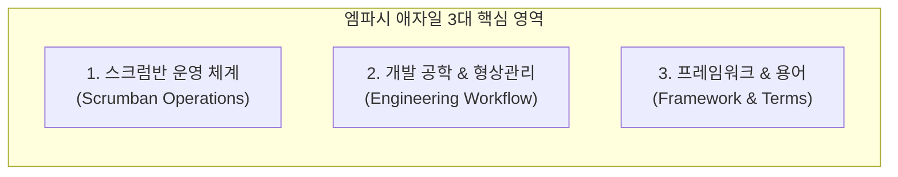
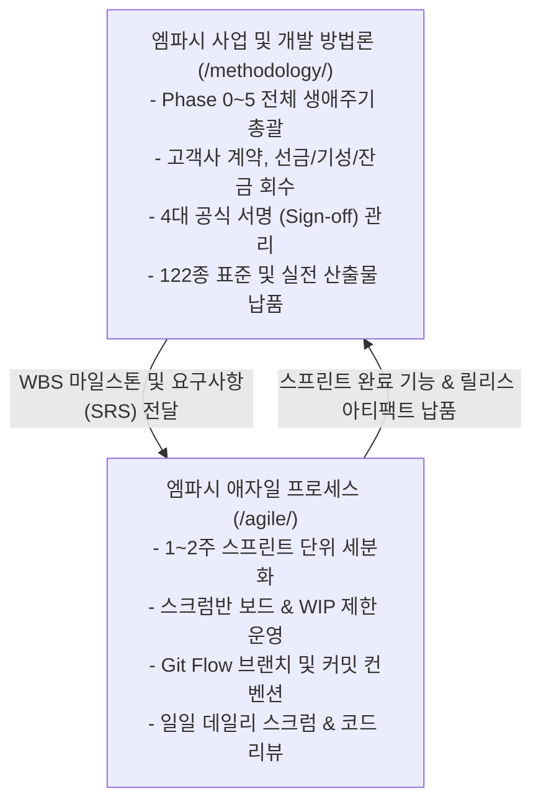

# 엠파시 애자일 프로세스 및 엔지니어링 포털

**엠파시 애자일 프로세스 및 엔지니어링 (Empasy Agile & Engineering Process)**은 프로젝트 현장에서 개발팀이 매일 소통하고, 코드를 작성하며, 형상을 관리하고, 이슈를 추적하는 **일상적 개발 공학 표준 및 협업 문화 지침서**입니다.

본 포털은 거시적인 사업 관리 및 납품 체계([엠파시 사업 및 개발 방법론](/methodology/))에서 수립된 WBS 마일스톤을 실무 개발팀의 1~2주 스프린트로 세분화하여, **병목 없는 작업 흐름(Flow)**과 **엄격한 코드 품질(Quality Gate)**을 달성할 수 있도록 돕습니다.

---

## 1. 엠파시 애자일 공학 3대 핵심 체계

### 1) 스크럼반(Scrumban) 운영 체계
스프린트의 계획성(역할, 백로그, 회고)과 칸반의 유연성(WIP 제한, 풀 시스템)을 결합하여, 긴급 운영 작업과 신규 기능 개발이 혼재된 엔터프라이즈 환경에서 병목을 최소화합니다.
* **[스크럼반 하이브리드 운영 개요](./scrumban.md)**: 스크럼과 칸반의 차이, 풀(Pull) 기반 작업 방식, 보드 레이아웃
* **[스크럼반 실무 가이드](./guide.md)**: 보드 칼럼 세팅, WIP(진행 중 작업) 한도 설정 기준
* **[정기 활동 및 세레모니](./activity.md)**: 스프린트 플래닝, 백로그 리필, 스프린트 리뷰 및 회고
* **[데일리 스크럼 가이드](./dailyScrum.md)**: 15분 스탠드업 미팅 운영 요령, 3대 표준 질문
* **[스토리 포인트 산정 가이드](./storyPointGuide.md)**: 피보나치 수열 기반 공수 산정 및 플래닝 포커
* **[스프린트 운영 체크리스트](./checklistAndProcedure.md)**: 스프린트 시작 전/종료 후 필수 점검표

---

### 2) 개발 공학 & 형상관리 워크플로우
모든 엔지니어가 동일한 브랜치 전략과 커밋 규칙, 이슈 라이프사이클을 준수하여 코드의 이력 추적성과 유지보수성을 극대화합니다.
* **[Git Flow 브랜치 전략](./gitFlow.md)**: `main`, `develop`, `feature/*`, `release/*`, `hotfix/*` 표준 운영 규칙
* **[Git 커밋 로그 컨벤션](./gitCommitLog.md)**: `feat:`, `fix:`, `docs:`, `refactor:`, `test:`, `chore:` 접두사 및 커밋 메시지 본문 작성 표준
* **[이슈 생성 규칙 및 템플릿](./createIssue.md)**: 버그 리포트, 신규 기능, 작업 태스크 템플릿 및 라벨 규칙
* **[이슈 라이프사이클 관리 원칙](./PrinciplesForIssueUsage.md)**: Todo ➔ In Progress ➔ Review ➔ Done 상태 전환 규칙

---

### 3) 프레임워크 비교 및 표준 용어사전
* **[방법론 비교 분석 (XP vs Scrum vs Kanban)](./xp_scrum_kanban.md)**: 익스트림 프로그래밍, 스크럼, 칸반, 스크럼반의 상세 비교 및 적합한 프로젝트 유형 분석
* **[애자일 및 공학 용어사전](./glossaryOfTerms.md)**: 번다운 차트, WIP, 벨로시티, DoR(준비 완료 정의), DoD(완료 정의) 등 필수 용어집

---

## 2. 거시적 사업 방법론과의 상호 연계

엠파시의 소프트웨어 생태계는 **거시적 사업 관리**와 **미시적 애자일 실행**이 완벽히 맞물려 동작합니다.

* **수주 및 계약, 4대 서명, 122종 공식 산출물 및 AI-SDLC**: **[엠파시 사업 및 개발 방법론 종합 포털](/methodology/)**을 확인하십시오.
* **일상적 개발팀 협업, 코드 형상 관리 및 스프린트 운영**: 본 **애자일 프로세스** 가이드를 준수하십시오.
