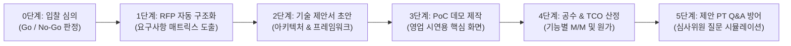

# 엠파시 사전영업 및 제안 단계 실무 가이드 (Pre-sales Playbook)

> **개요:** 본 가이드는 고객사의 제안요청서(RFP)가 접수되었을 때, 개발 및 기술지원 조직이 영업 조직을 신속히 뒷받침하여 **비밀유지협약(NDA) 체결, 입찰 타당성 심의(Go/No-Go), RFP 요구사항 분석, 기술 제안서 작성, 영업 데모용 프로토타입(PoC) 제작, 제안 발표(PT) Q&A 방어, 공식 견적 및 원가 산정**을 체계적으로 수행하기 위한 실무 지침서입니다.

::: tip 관련 상위 및 실무 가이드
* **[엠파시 사업 및 개발 방법론 개요](./enterprise-project-lifecycle.md)**: 사업 전 주기 6단계 라이프사이클 총괄
* **[엠파시 사업 전 주기 표준 문서 체계 및 납품·관리 실무 가이드](./enterprise-business-documents.md)**: 계약, 행정, 설계, 검수, 대금 청구 문서 표준
* **[엠파시 단계별 실행 항목 및 실무 실행 가이드 (SOP)](./enterprise-action-items-guide.md)**: 단계별 구체적 Action Item 및 절차
* **[상황별 실전 프롬프트 모음집](./ai-sdlc-prompt-recipes.md)**: 실무 단계별 즉시 복사 템플릿
:::

---

## 1. 단계 목적 및 대상

* **주요 담당자**: 프리세일즈(Pre-sales) 엔지니어, 제안 기술 PM, 솔루션 아키텍트
* **협업 대상**: 영업 대표(Account Executive), 사업 본부장, 견적 산정 담당자
* **목표 소요 시간**: RFP 접수 후 4시간 ~ 8시간 이내
* **활용 도구**: 사내 RAG 문서 인입 도구, SyncVerse 컴포넌트 템플릿, Claude/Cursor

---

## 2. 시작 전 점검 사항 (시작 기준)

본 단계를 시작하기 전에 아래 사항을 확인합니다:
- 고객사 RFP 문서 파일(PDF, HWP, DOCX 등)이 확보되었는가?
- 제안서 제출 마감일 및 제안 발표(PT) 일정이 확인되었는가?
- 고객사의 핵심 요구 도메인(이커머스, 콘텐츠 관리, 인프라 등)이 식별되었는가?

---

## 3. 실무 수행 6단계 워크플로우



### 0단계: 비밀유지협약(NDA) 체결 및 입찰 참여 타당성 심의 (Go / No-Go Gate)
고객사 제안요청서 상세 자료나 원천 데이터를 수령하기 전 법적 분쟁을 방지하고, 무분별한 입찰로 인한 리소스 낭비와 적자 수주를 예방하기 위해 평가와 행정 절차를 선행합니다:
1. **상호 비밀유지협약서(NDA) 체결**: 영업비밀 및 고객사 데이터 보호를 위한 서면 계약 완료.
2. **기술 적합도 (30점)**: 자사 표준 프레임워크(Spring Boot, PostgreSQL, Vue 등)와의 일치율
3. **납기 현실성 (20점)**: 고객 요구 일정 대비 개발 공수의 적정성
4. **사업 수익성 (25점)**: 추정 예산 대비 투입 원가 및 예상 마진율
5. **자사 자산 재사용률 (15점)**: 기존 컴포넌트 및 솔루션 재활용 가능 범위
6. **리스크 요인 (10점)**: 불합리한 독소 조항(위약금, 과도한 하자보수) 유무
7. **입찰 참가 행정서류 사전 발급**: 법인인감, 국세/지방세 완납증명서, 신용평가등급서, 사업실적증명원, 입찰보증보험증권 발급.
* **판정 기준**: 70점 이상 시 **Go(입찰 참여)** 결정, 미달 시 **No-Go(불참)** 검토.

### 1단계: RFP 자동 구조화 및 요구사항 매트릭스(RTM) 도출
수백 페이지의 제안요청서를 AI에게 인입하여 다음 항목을 표 형태로 신속히 추출합니다:
* **기능 요구사항 (SFR)**: 시스템이 구현해야 할 필수 비즈니스 기능
* **데이터 요구사항 (DAR)**: 기존 시스템 데이터 이관 및 연계 요구사항
* **비기능 요구사항 (NFR)**: 성능, 보안, 가용성, 개인정보 마스킹 기준
* **제약사항**: 고객사가 지정한 필수 OS, DBMS, 클라우드 환경

### 2단계: 기술 제안서 초안 작성
영업 대표가 작성하는 사업 관리 섹션을 제외한 **'기술 및 방법론'** 섹션을 신속히 작성합니다:
* 사내 표준 프레임워크 기반의 시스템 구성도 및 계층별 역할 정의
* 타 솔루션 대비 차별화 포인트 (명세 우선 설계, 4단계 자가 치유 무결성 검증 체계)
* 보안, 고가용성(HA), 대용량 트래픽 대응 방안

### 3단계: 영업 데모용 핵심 화면 프로토타입(PoC) 신속 제작
고객사 제안 발표(PT)에서 경쟁사 대비 신뢰를 확보하기 위해, 고객이 가장 관심 있어 하는 핵심 화면 1~2개를 사내 표준 컴포넌트로 빠르게 빌드합니다.
* 예시: *"고객사 요청 기능인 AI 기반 자동 상품 추천 및 쿠폰 적용 화면"*을 반나절 만에 동작하는 형태로 구현하여 시연용 URL 제공.

### 4단계: 객관적 공수 및 총 소유 비용(TCO) 통합 산정
* **기능별 공수 (M/M)**: 요구사항 난이도(상/중/하)에 기반한 객관적 투입 공수 산출.
* **TCO 통합 원가**: 인건비 외에 클라우드 인프라 비용, LLM API 토큰 비용, 서드파티 라이선스 비용을 통합 계산하여 견적에 반영.
* **기술적 수행 가능성 사전 합의 (Technical Sign-off)**: 제안서 제출 전 개발 리드가 "이 일정과 공수로 실제 구현이 가능하다"고 공식 확인 서명한 후 최종 투찰합니다.

### 5단계: 제안 발표(PT) 질의응답(Q&A) 방어 시나리오 준비
심사위원들의 날카로운 기술 질의나 약점 공격에 대응하기 위해, 예상 질문 10선과 기술적 방어 논리를 사전에 시뮬레이션하여 발표자(영업/PM)에게 제공합니다.

---

## 4. 실무 프롬프트 예시 (복사하여 사용)

### 프롬프트 1: 입찰 타당성 심의(Go / No-Go) 평가표 생성
```markdown
[역할] IT 사업 수주 심의위원회 기술 평가위원
[맥락] 아래 고객사 RFP 요약본을 검토하여 입찰 참여 여부(Go / No-Go)를 객관적으로 평가해 주세요.
[RFP 개요]
- 사업명: {{사업명}}
- 고객사 예산: {{예산 금액}}
- 사업 기간: {{수행 기간, 예: 착수 후 5개월}}
- 핵심 요구 기술: {{요구 기술 스택 및 연계 대상}}

[평가 기준]
1. 기술 적합도 (30점): 자사 스택(Java/Spring Boot, PostgreSQL, Vue 3)과의 일치율
2. 납기 현실성 (20점): 기간 내 안정적 납품 가능성
3. 사업 수익성 (25점): 예산 대비 투입 공수의 적정성
4. 자사 솔루션 재사용률 (15점): 보유 컴포넌트 재활용 비율
5. 계약/보안 리스크 (10점): 불합리한 페널티 조항 유무

[출력 형식]
- 항목별 점수 및 감점 사유
- 종합 점수 및 최종 권고 판정 (Go / No-Go / 조건부 Go)
- 입찰 참여 시 필수 사전 조율 조건 3가지
```

---

### 프롬프트 2: RFP 요구사항 매트릭스 자동 분해
```markdown
[역할] 15년 차 엔터프라이즈 공공/금융 SI 수석 제안 PM
[맥락] 아래 고객사 제안요청서(RFP) 내용을 분석하여 기술 제안서 작성을 위한 요구사항 매트릭스를 표 형태로 정리해 주세요.
[RFP 원문 발췌]
{{RFP 문서의 요구사항 섹션 내용 붙여넣기}}

[작성 규칙]
1. 기능 요구사항(SFR), 데이터/연계 요구사항(DAR), 비기능 요구사항(NFR)으로 명확히 분류해 주세요.
2. 각 요구사항마다 고유 ID(REQ-01 등), 요구사항 명칭, 상세 설명, 난이도(상/중/하)를 부여해 주세요.
3. 고객사가 명시하지 않았으나 시스템 구축 시 반드시 확인해야 할 기술적 쟁점(예: 기존 DB 버전 연동, 동시성 트랜잭션 등)을 '검토 필요 사항' 열에 추가해 주세요.
```

---

### 프롬프트 3: 기술 제안서 아키텍처 섹션 초안 작성
```markdown
[역할] 수석 소프트웨어 아키텍트
[맥락] 위 요구사항 매트릭스를 만족하는 시스템 아키텍처 제안서를 작성합니다.
[제안 시스템명] {{시스템명, 예: 차세대 지능형 이커머스 플랫폼}}
[기본 스택] Java 21, Spring Boot 3.x, PostgreSQL 17, Vue 3, SyncVerse 오케스트레이터

[요청 사항]
고객사 평가위원에게 기술적 우수성과 안정성을 어필할 수 있도록 아래 항목을 마크다운으로 작성해 주세요:
1. 시스템 아키텍처 구성도 (Mermaid 블록 다이어그램)
2. 적용 기술 프레임워크 선정 사유 및 기대 효과
3. 장애 예방 및 고가용성(HA) 대응 방안
4. 당사 고유의 4단계 소프트웨어 품질 검증 체계 소개
```

---

### 프롬프트 4: 제안 발표(PT) 예상 공격 질문 및 방어 논리 생성
```markdown
[역할] 외부 기술 심사위원(공공/학계/동종업계 시니어 아키텍트)
[맥락] 당사 제안서 내용 중 약점으로 지적될 수 있는 부분을 날카롭게 공격하고, 발표자가 이를 기술적으로 방어할 수 있는 모범 답변을 구성해 주세요.
[제안 요약]
- 시스템 구성: {{제안서 아키텍처 요약}}
- 데이터 이관: {{레거시 DB 이관 방식}}
- 일정 및 공수: {{개발 일정 및 투입 M/M}}

[요청 사항]
심사위원이 던질 만한 예상 공격 질문 5개와 각 질문에 대한 기술적 방어 논리를 짝지어 작성해 주세요:
- 질문 예시: "대용량 트래픽 급증 시 동시성 결함 대응책은?", "레거시 데이터 마이그레이션 실패 시 다운타임 복구 계획은?"
- 답변 형식: 1) 공감 및 원칙 설명 ➔ 2) 구체적인 기술적 해결책(아키텍처/캐시/롤백) ➔ 3) 사내 검증 실적
```

---

### 프롬프트 5: 기능별 공수(Man-Month) 및 TCO 통합 산출
```markdown
[역할] SI 사업 견적 및 WBS 설계 전문가
[입력 데이터] {{앞서 도출된 요구사항 매트릭스}}
[프로젝트 기간] {{목표 기간, 예: 4개월}}

[산정 기준]
- 1 Man-Month = 22 Man-Day 기준
- 분석/설계(20%), 구현(50%), 테스트/검증(20%), 이관/안정화(10%) 표준 비율 적용
- 기능별 난이도: 상(10 M/D), 중(5 M/D), 하(2 M/D)

[출력 형식]
1. WBS 단계별 소요 공수 요약표 (대분류, 중분류, 소요 M/M, 담당 역할)
2. 총 소유 비용(TCO) 견적: 개발 인건비 + 클라우드 인프라(월 추정) + LLM API 토큰 비용 + 솔루션 라이선스 비용
3. 위험 요소에 따른 버퍼(예비비) 권장 비율 제시
```

---

## 5. 자주 발생하는 실수 및 유의 사항

| 실수 유형 | 흔한 문제점 | 권장 대응 방안 |
| :--- | :--- | :--- |
| **타당성 심의 없는 무조건 입찰** | 승률이 낮거나 마진이 없는 사업에 리소스를 낭비하여 주력 사업 부실화 | 0단계 Go/No-Go 점수표를 의무화하여 70점 이상 사업에만 제안서를 제출합니다. |
| **제안 발표(PT) Q&A 방어 부재** | 제안서는 잘 썼으나 심사위원의 돌발 기술 질문에 답변하지 못해 탈락 | 프롬프트 4를 통해 예상 공격 질문 5~10개를 사전 시뮬레이션하고 발표장에 들어갑니다. |
| **개발팀 확인 없는 독단 견적** | 영업이 단독으로 공수를 깎아 투찰하여 수주 후 개발팀 일정 파행 유발 | 개발 리드의 기술 수행 가능성 서명(Technical Sign-off)을 입찰 필수 승인 절차로 강제합니다. |
| **비기능 요구사항 간과** | 기능 구현에만 집중하고 동시 접속 트래픽, 백업 주기, 보안 인증 요건을 누락 | RFP 분석 단계에서 비기능 요구사항(NFR) 체크리스트를 별도로 분리하여 점검합니다. |

---

## 6. 제안 단계 완료 점검 체크리스트 (종료 기준)

제안서 제출 및 영업 지원을 완료하기 위해 아래 항목을 확인합니다:
- [ ] 고객사 자료 열람 전 비밀유지협약서(NDA) 체결이 완료되었는가?
- [ ] 0단계 Go/No-Go 심의를 거쳐 입찰 참여가 공식 승인되었는가?
- [ ] 법인인감, 완납증명, 신용평가, 실적증명, 입찰보증보험 등 입찰 참가 서류가 구비되었는가?
- [ ] RFP의 모든 기능/비기능 요구사항이 매트릭스에 빠짐없이 매핑되었는가?
- [ ] 제안서의 시스템 구성도와 기술 스택이 사내 표준과 일치하는가?
- [ ] 시연 가능한 데모 프로토타입(PoC)과 결과보고서가 준비되어 영업 대표에게 인계되었는가?
- [ ] 제안 발표(PT) 예상 공격 질문에 대한 기술 방어 논리가 정리되었는가?
- [ ] 산정된 공식 견적 및 원가에 대해 개발 리드의 기술 수행 가능성 서명(Technical Sign-off)이 완료되었는가?
