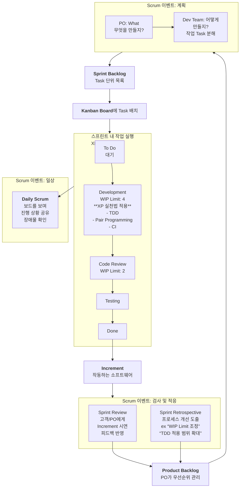

## XP, Scrum, Kanban 통합 가이드: 애자일 개발 방법론 비교와 실무 적용 전략

### 서론: 애자일의 본질과 진화

애자일(Agile)은 "민첩한"이라는 뜻 그대로, 변화하는 요구사항에 빠르게 대응하고 지속적으로 가치를 전달하기 위한 소프트웨어 개발 철학과 프레임워크의 집합체입니다. 2001년에 발표된 '애자일 소프트웨어 개발 선언문'은 프로세스와 도구보다 **개인과 상호작용**을, 포괄적인 문서보다 **작동하는 소프트웨어**를, 계약 협상보다 **고객과의 협력**을, 계획 따르기보다 **변화에 대응하기**를 더 가치 있게 여깁니다.

본 가이드는 애자일을 실현하는 대표적인 세 가지 방법론인 eXtreme Programming(XP), Scrum, Kanban을 비교 분석하고, 이들의 상호 관계를 설명하며, 이를 통합적으로 활용하는 방법론을 제시합니다.

---

### 1. XP, Scrum, Kanban 비교

#### **1.1 eXtreme Programming (XP) - 엔지니어링 실천법**

XP는 소프트웨어 품질을 높이고 개발팀의 생산성과 응대 능력을 극대화하는 데 초점을 맞춘 **개발 프레임워크**입니다. 고객의 빠르게 변화하는 요구사항에 대응하는 것을 핵심 목표로 합니다.

- **철학:** "만약 이것이 좋은 것이라면, 극단적으로 하는 것이 더 좋을 것이다."
- **적용 범위:** 주로 소프트웨어 **코드 개발 단계**에 깊게 관여합니다.
- **주기:** **Iteration(반복)** 이라는 짧은 주기(보통 1~2주)로 개발을 진행합니다.
- **핵심 실천법 (Practices):**
- **짝 프로그래밍 (Pair Programming):** 두 명의 개발자가 한 컴퓨터에서 작업하며 코드를 실시간으로 리뷰하고 지식 공유합니다.
- **테스트 주도 개발 (TDD - Test Driven Development):** 작성할 코드에 대한 **실패하는 테스트 코드를 먼저 작성**하고, 그 후에 해당 테스트를 통과할 만큼의 최소 코드를 작성합니다. 이를 반복하여 코드의 신뢰성을 높입니다.
- **계속적인 통합 (CI - Continuous Integration):** 하루에 여러 번 코드를 메인 저장소에 통합하고 자동화된 테스트를 실행하여 문제를 조기에 발견합니다.
- **리팩토링 (Refactoring):** 기능 변경 없이 코드의 내부 구조를 개선하여 가독성과 유지보수성을 높입니다.
- **단순한 설계 (Simple Design):** 현재 요구사항을 만족하는 가장 단순한 시스템을 설계합니다.
- **집단 코드 소유권 (Collective Code Ownership):** 누구나 시스템의 어떤 부분이든 수정할 수 있습니다.
- **온사이트 고객 (On-Site Customer):** 개발 현장에 고객이 상주하거나 매우 쉽게 접근할 수 있어야 합니다.

- **장점:** 높은 코드 품질, 버그 감소, 기술적 부채 최소화, 변화에 대한 두려움 감소.
- **단점:** 실천법 도입에 대한 높은 학습 곡선과 집중력 요구, 짝 프로그래밍에 대한 거부감, 온사이트 고객 확보의 어려움.

#### **1.2 Scrum - 프로젝트 관리 프레임워크**

Scrum은 복잡한 제품을 개발하고 관리하기 위한 **프로젝트 관리 프레임워크**입니다.누가, 무엇을, 언제 할지에 대한 역할, 의사결정 구조, 이벤트를 명확히 정의합니다.

- **철학:** 경험주의(Empiricism)에 기반하여 **투명성, 검사, 적응**의 사이클을 통해 복잡한 문제를 해결합니다.
- **적용 범위:** 프로젝트 **관리 및 협업 프로세스** 전반에 걸쳐 적용됩니다.
- **주기:** **Sprint(스프린트)** 라는 고정된 길이(보통 2~4주)의 시간 박스(Time-box)로 작업을 진행합니다.
- **핵심 역할 (Roles):**
  - **Product Owner (PO - 제품 책임자):** 제품의 가치를 최대화하는 책임을 지며, 요구사항을 **제품 백로그(Product Backlog)** 로 관리하고 우선순위를 지정합니다.
  - **Scrum Master (SM - 스크럼 마스터):** 팀이 Scrum을 효과적으로 따라가도록 코치하고 장애물을 제거합니다. 관리자가 아닌 **서번트 리더**의 역할입니다.
  - **Development Team (개발팀):** 실제로 제품을 만드는 크로스-기능적(cross-functional)이고 자기-조직화(self-organizing)된 팀입니다.
- **핵심 산출물 (Artifacts):**
  - **Product Backlog:** 제품에 필요한 모든 기능, 개선사항, 수정사항의 우선순위 목록.
  - **Sprint Backlog:** 현재 스프린트에서 수행하기로 한 Product Backlog 항목들과 이를 완료하기 위한 계획.
  - **Increment (증분):** 스프린트 종료 시점에 나온 '작동하는 제품'의 결과물.
- **핵심 이벤트 (Events):** (모두 Time-boxed)

  - **Sprint Planning (스프린트 계획 수립):** 무엇을, 어떻게 할지 계획합니다.
  - **Daily Scrum (일일 스크럼):** 15분 동안 진행 상황을 공유하고 장애물을 확인합니다.
  - **Sprint Review (스프린트 리뷰):** 결과물을 고객/이해관계자에게 보여주고 피드백을 받습니다.
  - **Sprint Retrospective (스프린트 회고):** 팀의 프로세스를 검토하고 개선점을 도출합니다.

- **장점:** 명확한 역할과 책임, 주기적인 피드백과 적응, 투명한 진행 상황, 팀의 자기 조직화 유도.
- **단점:** 엔지니어링 실천법에 대한 직접적인 지침 없음(품질은 팀에 의존), 스프린트 내 변경 금지로 인한 경직성(변경은 다음 스프린트까지 대기).

#### **1.3 Kanban - 지속적인 흐름 개선 시스템**

Kanban은 **작업의 흐름(Flow)** 을 시각화하고, 진행 중인 작업(WIP - Work In Progress)을 제한하여 효율성을 극대화하는 **연속적인 흐름(Continuous Flow) 시스템**입니다. 점진적인 프로세스 개선에 초점을 맞춥니다.

- **철학:** "현재 프로세스를 시작점으로 인정하고, 점진적인 변화를 통해 연속적인 개선을追求한다."
- **적용 범위:** **어떤 프로세스에도 적용 가능**합니다. (개발, 유지보수, 마케팅, 인사 등)
- **주기:** **연속적(Continuous)** 입니다. 시간 박스 개념이 없으며, 작업이 완료되면 바로 다음 작업을 시작합니다.
- **핵심 실천법 (Practices):**

  - **시각화 (Visualize):** **Kanban Board**를 사용해 작업의 흐름과 상태(예: To Do, In Progress, Done)를 한눈에 보여줍니다.
  - **진행 중인 작업 제한 (WIP Limit):** 각 단계(특히 'In Progress')에서 동시에 진행할 수 있는 작업의 최대 개수를 제한합니다. 이는 병목 현상을 찾아내고 해결하며, 팀의 집중력을 높입니다.
  - **흐름 관리 (Manage Flow):** 작업이 보드에서 어떻게 흘러가는지 관찰하고, 대기, 지연, 병목을 측정하여 지속적으로 흐름을 원활하게 만듭니다.
  - **명확한 프로세스 수칙 (Explicit Policies):** 각 작업 단계의 정의와 완료(DoD - Definition of Done) 기준을 명확히 합니다.
  - **피드백 루프 (Feedback Loops):** 운영 회의, 배송 회의 등을 정기적으로 개최하여 흐름과 품질을 검토합니다.

- **장점:** 매우 유연하고 변경에 즉시 대응 가능, 도입 장벽이 낮음, 병목 현상 파악 및 처리 시간(Cycle Time) 단축에 탁월.
- **단점:** 역할과 데드라인이 명확하지 않아 팀의 규율 없이는 난항, 장기 계획 수립이 어려움, 변화의 속도가 느릴 수 있음.

#### **1.4 비교 요약 표**

| 특징            | **eXtreme Programming (XP)**              | **Scrum**                        | **Kanban**                             |
| :-------------- | :---------------------------------------- | :------------------------------- | :------------------------------------- |
| **본질**        | **엔지니어링 실천법 집합**                | **프로젝트 관리 프레임워크**     | **지속적 흐름 개선 시스템**            |
| **초점**        | 코드 품질, 기술적 탁월성                  | 팀 협업, 가치 전달, 적응         | 작업 흐름 효율화, 대기 시간 단축       |
| **주기**        | Iteration (1-2주)                         | Sprint (2-4주, 고정)             | 연속적 (Time-box 없음)                 |
| **변화 대응**   | Iteration 내에서도 가능                   | Sprint 중에는 변경 금지          | 언제든지 가능 (매우 유연)              |
| **역할**        | 코치, 고객, 개발자                        | PO, SM, 개발팀                   | 특정 역할 강요하지 않음                |
| **핵심 도구**   | TDD, Pair Programming, CI                 | Sprint Backlog, Burndown Chart   | **Kanban Board, WIP Limit**            |
| **측정 지표**   | 단위 테스트 커버리지 등                   | 스프린트 속도(Velocity)          | **Cycle Time, 처리량(Throughput)**     |
| **적합한 상황** | 요구사항이 매우 자주 변경, 높은 품질 요구 | 명확한 목표와 빠른 결과交付 필요 | 유지보수, 불규칙한 업무량, 점진적 개선 |

---

### 2. 세 방법론의 관계: 상호 보완적이며 진화적인 관계

XP, Scrum, Kanban은 서로 경쟁하는 방법론이 아닙니다.它们은 서로 다른 문제를 해결하며, **상호 보완적**이고 **진화적인 관계**에 있습니다.

1.  **Scrum + XP: 가장 일반적인 강력한 조합**

- Scrum은 **'무엇을 할지(What)'** 와 **'언제 할지(When)'** 에 대한 관리 프레임워크를 제공합니다.
- XP는 **'어떻게 잘 할지(How)'** 에 대한 엔지니어링 실천법을 제공합니다.
- 즉, Scrum 팀이 스프린트에서 약속한 Increment를 **높은 품질**로, **지속 가능한** 속도로 생산하기 위해 XP의 실천법(TDD, CI, 리팩토링)을 도입하는 것은 매우 자연스러운 일입니다. Scrum은 뼈대를, XP는 살을 채운다고 볼 수 있습니다.

2.  **Kanban -> Scrum: 점진적인 애자일 도입의 길**

- Kanban은 기존 프로세스를 부수지 않고 시각화와 WIP 제한부터 시작해 점진적으로 개선합니다.
- 따라서 애자일/스크럼을 처음 도입하는 조직은 Kanban으로 현재 상태를 시각화하고 흐름을 개선한 후, 점차 Scrum의 역할(Roles), 이벤트(Events), 산출물(Artifacts)을 도입하는 **진화적인 접근**을 취할 수 있습니다.

3.  **Scrum -> Kanban: 스크럼의 유연성 확장 (Scrumban)**

- Scrum 팀이 스프린트 경계 없이 더 유연한 작업 흐름을 필요로 할 때(예: 유지보수 팀), Kanban의 흐름 중심 접근법을 접목합니다.
- 이는 **Scrumban**이라고 불리며, 스프린트 계획/리뷰/회고 같은 Scrum의 규율은 유지하되, 일일 스크럼과 작업 실행은 Kanban 보드와 WIP 제한을 사용해 연속적인 흐름으로 진행하는 방식입니다.

---

### 3. Scrum, XP, Kanban 실전 통합

이상적인 팀은 세 방법론의 강점을 조화롭게 혼합합니다. 아래는 이를 체계적으로 적용하는 방법입니다.

#### **3.1 통합 원칙**

1.  **Scrum을 기본 뼈대(Backbone)로 사용:** 프로젝트 관리와 협업의 틀은 Scrum의 역할, 이벤트, 산출물을 따릅니다.
2.  **XP의 실천법으로 품질(Quality)을 보장:** 개발 단계에서 코드 품질과 지속 가능한 속도를 위해 XP 실천법을 적극 도입합니다.
3.  **Kanban의 흐름(Flow)으로 과정을 개선:** 스프린트 내부의 작업 흐름을 관리하고 병목 현상을 찾아내기 위해 Kanban 보드와 WIP 제한을 활용합니다.

#### **3.2 단계별 체크리스트 (통합 적용 로드맵)**

**🔹 Phase 1: 준비 및 도입 (1-2개월)**

- [ ] **관련자 교육:** 모든 구성원(개발자, 관리자, 고객)이 Scrum, XP, Kanban의 기본 개념과 통합 목적을 이해하도록 합니다.
- [ ] **Scrum 틀 구축:**
- [ ] **Product Owner**를 지정하고, **Product Backlog**를 초기 작성합니다.
- [ ] **Scrum Master**를 지정합니다.
- [ ] **개발팀**을 구성합니다 (가능한 크로스-기능적으로).
- [ ] **스프린트 주기**(예: 2주)를 결정합니다.
- [ ] **도구 설정:** Jira, Trello, Azure Boards 등 **Kanban Board** 기능이 있는 협업 도구를 설정합니다. (Physical Board도 가능)

**🔹 Phase 2: 첫 번째 스프린트 실행 및 XP 실천법 도입 (3-6개월)**

- [ ] **Scrum 이벤트 수행:**
- [ ] **Sprint Planning:** PO와 함께 Sprint Backlog를 수립합니다.
- [ ] **Daily Scrum:** Kanban Board를 보며 진행 상황을 공유합니다. ("보드에 말 걸기")
- [ ] **Sprint Review & Retrospective:** 첫 스프린트 결과를 검토하고 개선점을 논의합니다.
- [ ] **Kanban Board 활용:**
- [ ] Sprint Backlog 항목을 Kanban Board의 'To Do'에貼ります.
- [ ] 칸반 보드의 단계를 팀 상황에 맞게 설정합니다. (예: `To Do` -> `Development` -> `Code Review` -> `Testing` -> `Done`)
- [ ] **WIP Limit을 'Development' 단계부터 적용 시작**합니다. (예: 개발자 수 \* 1.5)
- [ ] **XP 실천법 도입 (한 가지씩 단계적으로):**
- [ ] **CI(지속적인 통합) 도입:** 자동화된 빌드/테스트 환경을 구축합니다. (**가장 우선시**)
- [ ] **TDD 도입:** 핵심 모듈부터 시작해 테스트 케이스를 먼저 작성하는 문화를 훈련합니다.
- [ ] **리팩토링 시간 확보:** 스프린트 계획 시 리팩토링 작업을 Task로 명시적으로 포함시킵니다.

**🔹 Phase 3: 성숙 및 고도화(6개월 이상)**

- [ ] **프로세스 정량화 및 개선:**
- [ ] **Cycle Time/Throughput 측정:** Kanban의 지표를 통해 팀의 평균 처리 속도를 측정합니다.
- [ ] **Velocity 측정:** Scrum의 속도(Velocity)를 측정하여 예측 정확도를 높입니다.
- [ ] **WIP Limit 조정:** 데이터와 팀의 느낌을 바탕으로 WIP Limit을 최적화합니다.
- [ ] **XP 실천법 심화:**
- [ ] **짝 프로그래밍 시도:** 어려운 버그 수리나 신입사원 온보딩에 시도해 봅니다.
- [ ] **간단한 설계:** 회고에서 설계의 복잡성을 주기적으로 논의합니다.
- [ ] **문화 정착:**
- [ ] **실패에 대한 두려움 제거:** TDD와 회고를 통해 실수를 배움의 기회로 만드는 문화를 정착시킵니다.
- [ ] **팀 자기 조직화 장려:** Scrum Master는 명령이 아닌 코칭으로 팀이 스스로 문제를 해결하도록 유도합니다.

#### **3.3 통합 운영 다이어그램: "한 스프린트의 흐름"**

---

### 결론: 상황에 맞는 최적의 조합을 찾아라

'만능 해결사'라는 방법론은 존재하지 않습니다. XP, Scrum, Kanban은 각각의 뚜렷한 강점과 초점을 가진 도구입니다.

- **새로운 제품을 빠른 속도로 개발해야 하는 팀**은 **Scrum**의 구조를 뼈대로 삼고, **XP**의 실천법으로 품질을 담보하며, **Kanban** 보드로 스프린트 내 작업 흐름을 원활하게 만드는 '통합 접근법'이 매우 효과적입니다.
- **주로 유지보수를 담당하는 팀**은 **Kanban**을 주력으로 사용하되, 정기적인 **회고(Scrum)** 를 통해 개선하고, 중요한 버그 수리에는 **TDD(XP)** 를 적용할 수 있습니다.

가장 중요한 것은 팀이 스스로의 상황과 문제점을 인지하고, 이러한 방법론들의 원리와 가치를 이해한 후, **지속적으로 실험하고 개선해 나가는** 것입니다. 이 가이드는 그 여정을 시작하는 출발점이 되었으면 합니다.

---

## 🧠 AI 시대의 소프트웨어 개발 속도와 그 한계(GeekNews Chatgpt 요약)

- 출처 : [AI 시대에 익스트림 프로그래밍(XP)을 다시 돌아봐야 할까?](https://news.hada.io/topic?id=23013)

* AI 도구와 플랫폼 혁신으로 코드 생성 속도가 비약적으로 향상되었지만, 프로젝트 성공률은 여전히 낮고 실패율이 높음.
* 문제는 속도가 아니라 검증과 정렬의 부재이며, XP는 의도적 제약을 통해 학습, 정렬, 품질 향상을 유도함.

---

## ⚖️ XP의 역할: 속도에 대한 카운터웨이트

- 무제한적인 가속은 학습, 실수 발견, 방향 수정의 기회를 박탈하는 문제를 유발함.
- XP는 의도적 마찰·제약을 도입해 팀이 올바른 방향으로 움직이도록 설계됨.
- 대표적 실천: 페어 프로그래밍은 일부러 산출량을 절반으로 줄임.
- 페어 프로그래밍은 산출물은 절반으로 줄일 수 있지만 공유 이해도, 신뢰, 품질, 팀 내 역량 향상 등 긍정적 효과를 두 배로 제공함.

---

## 🤖 AI와 함께 더 심화되는 XP의 문제 인식

- AI가 코드 생성을 무 effort로 만들어줌에 따라, 제대로 검증되지 않은 소프트웨어의 대량 생산 위험이 커짐.
- 제약 없는 자동화 시스템이 미검증 로직을 다층적으로 쌓아 복잡성과 취약성 악화.
- 최근 연구에선 LLM의 컨텍스트 창이 길어질수록 정확도가 악화됨을 증명.
- 결과적으로 유지보수 비용이 높고 쉽게 깨지는 코드로 이어지며, XP는 이러한 무질서한 엔트로피를 방지하기 위해 태동함.

---

## 🧑‍💻 소프트웨어는 여전히 사람의 영역

- AI가 발전해도 소프트웨어는 사람이 사람을 위해, 조직 내 소통과 문화 속에서 만드는 본질 변하지 않음.
- 주요한 전달 장애 요소는 자동화도가 아니라 정렬, 공유 맥락, 명확한 결과, 사용자 검증 등 인간 기반 요소임.
- XP의 핵심 가치: Simplicity(단순성), Communication(의사소통), Feedback(피드백), Respect(존중), Courage(용기).

---

## 🚀 기능공장(feature factory)에서 진짜 가치 전달로

- 성공적인 팀은 속도 그 자체보다 흐름(flow)과 피드백 우선.
- XP의 소규모 배치, 지속적 통합, 자동 테스트, 공동 소유 등 실천이 적응성과 사용자 중심성에 기여.
- 앞으로 코드 생산이 더 빨라질수록 이러한 방법들이 품질, 리스크, 의도 관리에 필수적.

---

## 📉 과거의 교훈

- CHAOS 보고서 통계:

  - 1994년: 정시에 예산 내로 성공한 프로젝트 16%.
  - 2012년: 37%로 개선.
  - 2020년: 다시 31%로 하락.

- 20년 넘는 혁신과 변화(agile, DevOps, 클라우드 네이티브, AI 등) 이후에도 전반적 신뢰도는 단 14%포인트 상승.
- 툴체인만으로는 문제 해결 불가.
- 올바른 방법론의 중요성 재확인.

---

## 🔮 앞으로 무엇이 필요한가

1. 출력이 더는 제약이 아님: 코드 생산력은 검증·정렬 속도를 앞지름.
2. 성과 중심 역량 강화: 피드백, 명확한 제품 방향, 강한 협업, 우수한 설계 등이 필수.
3. 더 인간적인 프로세스 필요: AI가 발전해도 지속적 전달은 협업에 의존.

- 실제로 효과적인 Product Operating Model은 사람—협업, 명확성, 흐름—중심의 운영에서 나온다는 점 강조.
- 기술적 혁신(플랫폼)보다 팀 전략, 운영 리듬, 엔지니어링 관행을 빈틈없이 정렬할 때, AI 시대의 지속가능한 소프트웨어 제공 환경 구성 가능.

---

## ✅ 결론: AI 시대, XP는 필요한가?

- 그렇다.
- 더 강력해지는 도구 속에서 사람-중심적 실천을 고정시켜줄 프레임워크 필요.
- XP는 팀 중심, 공감능력, 공유 이해, 올바른 목표 지향을 동시에 제공.
- 단순 출력 속도가 아닌 의미 있는 방향성과 팀 내 정렬에 집중.
- AI의 가속과 제한 없는 생산 시대에, XP는 소프트웨어는 사람의 일임을 상기시켜주는 드문 방법론임.
