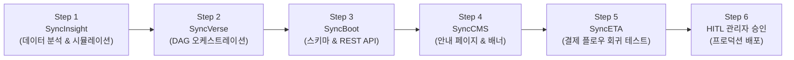

# 엔드투엔드 자율 연동 시나리오

## 1. 시나리오 개요

본 문서는 **"신규 VIP 멤버십 제도 신설 및 온라인 결제 연동"**이라는 엔터프라이즈 비즈니스 요구사항이 접수되었을 때, SyncSeries 생태계의 7대 에이전트가 자율적으로 협업하여 프로덕션 배포를 완결하는 엔드투엔드 실무 흐름을 설명합니다.

---

## 2. 단계별 실행 파이프라인

### Step 1: 데이터 분석 및 What-If 시뮬레이션 (SyncInsight)
- **작업 내용**:
  - 기존 고객 구매 이력(내부 DB)과 경쟁사 멤버십 혜택(SyncCrawl 수집 데이터)을 종합 분석.
  - 라운드테이블 에이전트 토론을 통해 "연간 결제액 1,000만원 이상 고객에게 5% 추가 할인 제공 시 예상 매출 증대 효과 +18.5%, 마진율 방어 94%" 도출.
- **산출물**: `ActionPlan_VIP_Membership.json`

### Step 2: 태스크 분해 및 DAG 구성 (SyncVerse)
- **작업 내용**:
  - SyncInsight가 도출한 액션 플랜을 기반으로 실행 DAG(Directed Acyclic Graph) 생성.
  - 도메인 에이전트 간 의존성(Dependency) 매핑:
    1. SyncBoot: DB 마이그레이션 및 멤버십 할인 계산 API 추가
    2. SyncCMS: VIP 멤버십 안내 페이지 및 혜택 소개 배너 등록
    3. SyncETA: 결제 페이지 할인율 적용 E2E 시나리오 생성 및 실행
- **산출물**: `ExecutionGraph_Task_88291.json`

### Step 3: 백엔드 스키마 및 API 자동 생성 (SyncBoot)
- **작업 내용**:
  - `tb_vip_membership`, `tb_vip_benefit_log` 테이블 DDL 자동 생성.
  - DDD 원칙에 따른 Entity, Repository, Service, Controller 코드 컴파일 및 단위 테스트 실행.
  - 에이전트 자체 정적 검증(`verify-zero-mock.ps1`) 수행.
- **산출물**: Spring Boot 마이크로서비스 JAR 빌드 아티팩트

### Step 4: 콘텐츠 및 마케팅 에셋 등록 (SyncCMS)
- **작업 내용**:
  - VIP 혜택 소개 랜딩 페이지 및 공지사항 초안 AI 생성.
  - PII 개인정보 필터링 및 브랜드 가이드라인 준수 검사 통과.
  - 스테이징 환경에 실시간 헤드리스 퍼블리싱.
- **산출물**: CMS 콘텐츠 아티팩트 `content-vip-membership-kr`

### Step 5: 무인 E2E 회귀 테스트 검증 (SyncETA)
- **작업 내용**:
  - 스테이징 환경 대상 신규 결제 시나리오 자동 생성:
    1. VIP 계정 로그인
    2. 10만원 상품 장바구니 담기
    3. 주문서 작성 화면 진입
    4. 5% VIP 추가 할인(5,000원) 정상 감액 여부 검증
    5. 결제 승인 API 호출 결과 200 OK 확인
  - Vision AI 기반 UI 컴포넌트 이상 유무 교차 점검.
- **산출물**: `TestRunReport_Run9941.json` (Pass Rate: 100%, 회귀 장애 0건)

### Step 6: Human-in-the-Loop 관리자 최종 승인
- **작업 내용**:
  - SyncVerse 관제 대시보드에 프로덕션 배포 티켓 발행.
  - 시스템 관리자에게 Before/After Git Diff, DDL 스크립트, 테스트 통과 리포트 일괄 제공.
  - 관리자 원클릭 승인 후 프로덕션 블루-그린 무중단 롤아웃 수행.
- **산출물**: WORM 감사 원장 서명 기록 `audit-tx-prod-9941`
