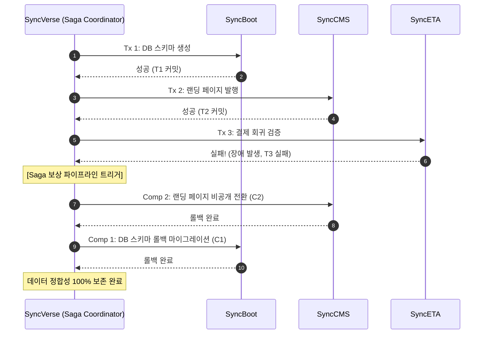

# HITL 거버넌스 & Saga 분산 트랜잭션

## 1. 엔터프라이즈 안전 원칙

자율 운영 AI 생태계에서 가장 경계해야 할 위험은 **예측하지 못한 부작용(Side Effect)과 데이터 오염**입니다.  
SyncSeries는 자율성을 극대화하되 위험성을 완벽히 통제하기 위해 **3단계 HITL 안전 등급(Safety Tiers)**과 **Saga 보상 트랜잭션 패턴**을 전사 표준으로 운영합니다.

---

## 2. 3단계 HITL 안전 승인 등급 (Safety Tiers)

모든 MCP 도구 호출은 위험도에 따라 3가지 등급으로 자동 분류됩니다:

```mermaid
flowchart TD
    Req[에이전트 액션 요청] --> Eval{위험도 평가}
    Eval -->|Tier 1: Read-Only| Auto[Tier 1: 완전 자율 실행<br/>조회, 통계 수집, 가상 시뮬레이션]
    Eval -->|Tier 2: Soft Mutation| Notify[Tier 2: 사후 통보형 실행<br/>임시 저장, 캐시 갱신, 스테이징 배포]
    Eval -->|Tier 3: Hard Mutation| Gate[Tier 3: 사전 승인 게이트<br/>DB DDL/DML, 결제 정책 변경, 프로덕션 배포]

    Gate --> AdminDecision{관리자 승인?}
    AdminDecision -->|승인 (Approve)| Exec[프로덕션 실행 & WORM 감사 원장 기록]
    AdminDecision -->|반려 (Reject)| Rollback[액션 폐기 및 원상태 유지]
```

| 등급 | 위험 수준 | 대상 작업 예시 | 승인 정책 |
|:---|:---|:---|:---|
| **Tier 1 (Safe)** | 무해 (Read-Only) | 통계 조회, 로그 검색, What-If 시뮬레이션, RAG 문서 탐색 | **완전 자율 실행** (0초 대기) |
| **Tier 2 (Low Risk)** | 경미 (Soft Mutation) | 스테이징 콘텐츠 등록, 개발 서버 브랜치 생성, 임시 파일 정리 | **사후 통보** (Slack/알림 센터) |
| **Tier 3 (High Risk)** | 파괴적 (Hard Mutation) | DB DDL 마이그레이션, 회원 권한 승격, 결제/할인 정책 변경 | **사전 관리자 승인 필수** (HITL Gate) |

---

## 3. Saga 패턴 분산 트랜잭션 및 보상(Compensation) 복구

마이크로서비스 환경에서 여러 도메인 에이전트에 걸친 복합 작업 도중 일부 단계가 실패할 경우, 시스템을 정상 상태로 안전하게 되돌리기 위해 **Orchestrated Saga 패턴**을 적용합니다.



### 3.1 멱등성(Idempotency) 보장
- 모든 보상 액션은 **Idempotency Key**를 포함하여 네트워크 재시도나 중복 호출 시에도 시스템 상태가 어긋나지 않도록 설계됩니다.
- 실패 원인과 보상 트랜잭션 실행 결과는 `RFC 7807 Problem Details` 표준 규격으로 관제 로그에 투명하게 기록됩니다.
