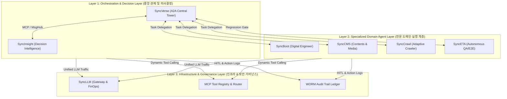
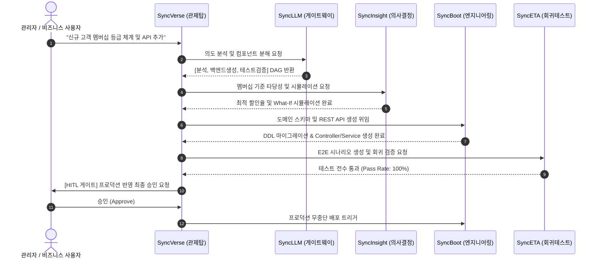

# SyncSeries AI 자율 운영 생태계

## 1. 비전 및 패러다임 전환

**SyncSeries**는 개별 소프트웨어가 사일로(Silo) 형태로 분리되어 운영되던 전통적인 IT 환경을 탈피하여, 각 도메인 영역을 전담하는 전문 AI 에이전트들이 표준 프로토콜을 통해 상호 통신하며 엔터프라이즈 시스템을 자율적으로 기획, 구현, 검증, 운영하는 **A2A(Agent-to-Agent) 자율 운영 생태계**입니다.

과거의 자동화가 사람이 정의한 정적 규칙(Rule-based)과 수동 트리거에 의존했다면, SyncSeries 생태계는 다음과 같은 세 가지 핵심 원칙을 기반으로 동작합니다:

1. **지능형 자율 오케스트레이션 (Autonomous Orchestration)**: 중앙 관제탑인 **SyncVerse**가 사용자의 고차원 비즈니스 의도(Goal)를 분석하고, 최적의 하위 도메인 에이전트에게 작업을 분할·위임합니다.
2. **표준 도구 상호운용성 (Universal Tool Interoperability)**: 모든 에이전트는 Anthropic의 오픈 표준인 **Model Context Protocol (MCP)**를 통해 도구를 공개하고 호출합니다.
3. **엄격한 엔터프라이즈 안전성 (Guaranteed Safety & HITL)**: 데이터 변경, 코드 배포 등 파괴적 행위는 반드시 **Human-in-the-Loop(HITL)** 관리자 승인 게이트와 **Saga 패턴 기반 보상 트랜잭션**을 거쳐 데이터 정합성과 롤백 가용성을 보장합니다.

---

## 2. 3-Layer 전사 아키텍처

SyncSeries 생태계는 역할과 책임에 따라 명확히 분리된 3개의 계층으로 구성됩니다.

### Layer 1: 중앙 관제 및 의사결정 계층 (Orchestration & Decision)
- **SyncVerse (A2A Central Tower)**: 생태계의 중앙 신경망 역할을 담당합니다. 복합적인 비즈니스 요청을 수신하여 서브태스크 DAG(Directed Acyclic Graph)를 빌드하고, 도메인 에이전트들의 실행 상태를 실시간 관측합니다.
- **SyncInsight (Decision Intelligence)**: 내외부 이기종 데이터를 실시간 수집·분석하고, 상반된 관점의 멀티 에이전트 라운드테이블 토론을 통해 검증된 비즈니스 실행 대안(Action Plan)을 도출합니다.

### Layer 2: 전문 도메인 실행 계층 (Domain Agents)
- **SyncBoot (엔지니어링 에이전트)**: Clean Architecture 및 DDD 기반으로 데이터베이스 스키마와 Spring Boot CRUD RESTful API 코드를 자율 생성하고 검증합니다.
- **SyncCMS (콘텐츠 관리 에이전트)**: 멀티테넌트 미디어 에셋, 다국어 블로그 포스트, UI 컴포넌트의 초안 작성부터 팩트체크 및 배포를 담당합니다.
- **SyncCrawl (적응형 수집 에이전트)**: 웹 사이트의 DOM 변경에 실시간 적응하고, 봇 탐지를 자율 우회하여 엔터프라이즈 RAG 벡터 스토어에 고품질 비정형 지식을 적재합니다.
- **SyncETA (테스트 자동화 에이전트)**: AI Vision과 자가 치유(Self-Healing) 알고리즘으로 웹/모바일 UI 회귀 검증을 무인 실행하고 CI/CD 파이프라인의 안전망을 완성합니다.

### Layer 3: 인프라 및 보안 거버넌스 계층 (Infra & Governance)
- **SyncLLM (AI 게이트웨이 & FinOps)**: 상용 LLM과 사내 온프레미스 SLM 간의 가중치 라우팅, 실시간 PII 개인정보 마스킹, 시맨틱 캐시를 통한 토큰 비용 40% 이상 절감을 담당합니다.
- **MCP Tool Registry**: 생태계 내 모든 에이전트의 툴 명세를 실시간 카탈로그화하고 라우팅합니다.
- **WORM Audit Trail**: 모든 HITL 승인 이력과 에이전트 액션을 위변조 방지 원장에 기록합니다.

---

## 3. 에이전트 협업 생명주기 (Agent Collaboration Loop)

SyncSeries 내에서 하나의 비즈니스 요구사항이 처리되는 표준 흐름은 다음과 같습니다:

---

## 4. 도입 효과 및 정량적 지표

| 영역 | 전통적인 수동 개발·운영 방식 | SyncSeries AI 자율 운영 생태계 |
|:---|:---|:---|
| **신규 API/도메인 론칭** | 3 ~ 5 영업일 (기획·설계·구현·테스트) | **15분 이내 (자율 파이프라인 완성)** |
| **API 장애 복구 (MTTR)** | 평균 4시간 (로그 분석 및 핫픽스 배포) | **3분 이내 (자가치유 및 보상 롤백)** |
| **LLM 토큰 운영 비용** | 매월 지속 증가 (중복 프롬프트 호출) | **35% ~ 48% 절감 (시맨틱 캐시 & FinOps)** |
| **회귀 결함 검출률** | 수동 QA 일정 압박으로 70% 수준 | **99.5% 이상 (SyncETA 무인 검증)** |
| **보안 및 규제 준수** | 수동 코드 리뷰 및 누락 위험 | **100% PII 마스킹 & WORM 감사 원장** |

---

## 5. 다음 단계

- **[표준 MCP 프로토콜 명세](/ecosystem/mcp-protocol)**: 에이전트 간 도구 호출 및 메시징 규격 학습
- **[AgentScope Java 표준 가이드](/ecosystem/agentscope-guide)**: Spring Boot 백엔드 에이전트 개발 표준
- **[엔드투엔드 워크플로우 실무](/ecosystem/e2e-workflow)**: 실제 시나리오 기반 협업 과정 확인
- **[HITL 거버넌스 & Saga](/ecosystem/hitl-governance)**: 관리자 안전 승인 및 분산 롤백 메커니즘
