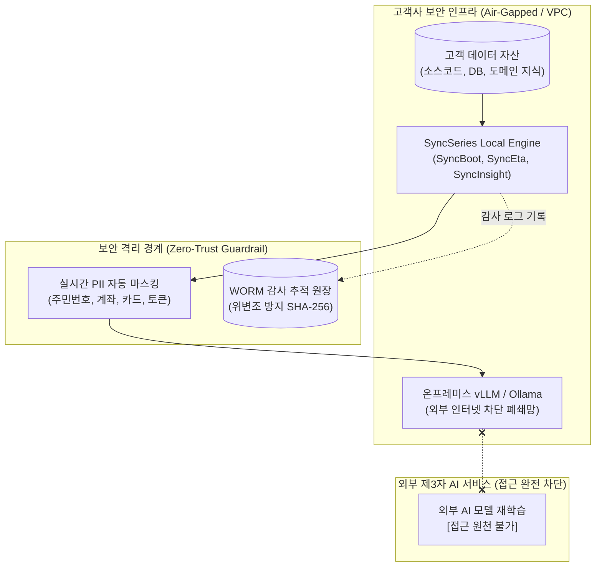

# 엔터프라이즈 보안 백서 및 컴플라이언스 가이드

엠파시(Empasy)는 금융, 공공, 제조, 대형 플랫폼 등 엄격한 정보보안 및 규제 준수를 요구하는 엔터프라이즈 환경을 위해 **SyncSeries AI 자율 운영 생태계** 전반에 걸쳐 최고 수준의 데이터 보호 및 보안 거버넌스 아키텍처를 적용하고 있습니다.

---

## 1. 핵심 데이터 보호 원칙 (Data Privacy Pillars)



### 1.1 Zero Data Retention (데이터 미학습 보증)
* **원칙**: 고객사의 소스 코드, 프롬프트, API 트랜잭션 페이로드, 비즈니스 룰, DB 스키마는 **회사의 공용 AI 모델 파인튜닝 또는 외부 제3자 모델 학습에 일절 활용되지 않습니다.**
* **인라인 휘발성 처리**: 모든 LLM 추론 요청 및 도구 호출 데이터는 인메모리(RAM) 세션에서만 임시 처리되며, 응답 반환 즉시 메모리 버퍼에서 안전하게 덮어쓰기 파기됩니다.
* **데이터 격리 보장**: 멀티테넌트 환경에서도 고객사별 암호화 테넌트 ID(`tenant_id`) 기반의 논리적/물리적 분리를 적용하여 타 조직과의 데이터 혼재를 원천 방지합니다.

### 1.2 온프레미스 망분리(Air-Gapped) 지원
* **완전 폐쇄망 배포**: 금융망 및 공공망과 같이 외부 인터넷 연결이 물리적으로 차단된 환경에서 완벽히 독립 구동됩니다.
* **로컬 LLM 런타임 호환**: vLLM, Ollama, TensorRT-LLM 기반의 오픈소스 파운데이션 모델(Llama 3, Qwen 2.5, DeepSeek R1 등)과 온프레미스 서버(NVIDIA H100/A100, RTX 6000 등)에서 100% 로컬 오프라인 추론을 수행합니다.
* **자체 임베딩 & 벡터 스토어**: 사내 Milvus, Qdrant, OpenSearch 클러스터에 완전 온프레미스 RAG 지식베이스를 구성하여 데이터 외부 유출을 원천 차단합니다.

---

## 2. 암호화 및 네트워크 전송 규격 (Cryptographic Standards)

| 영역 | 적용 기술 표준 | 세부 운영 정책 |
|:---|:---|:---|
| **전송 구간 암호화** | TLS 1.3 (RFC 8446) | 취약 암호군(DES, 3DES, RC4) 전면 비활성화, Perfect Forward Secrecy(PFS) 강제 |
| **저장 데이터 암호화** | AES-256-GCM | DB 볼륨 및 파일 스토리지 전면 암호화, 고객사 보유 키(BYOK / KMS) 연동 지원 |
| **토큰 및 비밀키 보관** | HashiCorp Vault / AWS KMS | 설정 파일 내 평문 하드코딩 금지, 동적 1회용 토큰 및 90일 주기 자동 순환 |
| **감사 로그 무결성** | HMAC-SHA256 & WORM | 수정 및 삭제가 불가능한 Write-Once-Read-Many 저장소 보관, 로그 체이닝 검증 |

---

## 3. 다계층 접근 통제 (Identity & Access Governance)

### 3.1 세분화된 RBAC & ABAC
* **RBAC (역할 기반 제어)**: 시스템 관리자(`ROLE_ADMIN`), 보안 감사관(`ROLE_AUDITOR`), 솔루션 운영자(`ROLE_OPERATOR`), API 서비스 계정(`ROLE_SERVICE`)으로 권한 분리.
* **ABAC (속성 기반 제어)**: IP 대역, 부서 코드, 작업 시간대, 요청 위험도에 따른 동적 정책 평가를 통해 비인가 접근을 실시간 차단.

### 3.2 개인정보(PII) 실시간 자동 마스킹 엔진
SyncSeries 인라인 프록시 및 SyncLLM 게이트웨이는 요청/응답 페이로드 내 민감 정보 패턴을 정규표현식 및 Named Entity Recognition(NER) 기반으로 실시간 감지하여 자동 난독화 처리합니다:
* **주민등록번호 / 외국인등록번호**: `700101-1******`
* **신용카드 번호**: `5424-****-****-1234`
* **은행 계좌번호**: 끝 4자리를 제외한 전 구역 마스킹
* **비밀키 및 토큰 패턴**: `eyJhbGci... [REDACTED_JWT]`, `sk-proj-... [REDACTED_API_KEY]`

---

## 4. 컴플라이언스 준수 및 보안 인증 프레임워크

```
┌─────────────────────────────────────────────────────────────┐
│                    SyncSeries 보안 거버넌스 프레임워크                   │
├─────────────────┬─────────────────┬─────────────────────────┤
│  ISMS-P (KISA)  │ ISO/IEC 27001   │ 금융보안원 AI 가이드라인   │
├─────────────────┼─────────────────┼─────────────────────────┤
│ • 102개 보안통제항목│ • 정보보안 관리체계│ • AI 생성물 편향/오류 통제│
│ • 개인정보 라이프사이클│ • 위험 평가 및 처리│ • 모델 설명가능성(XAI)   │
│ • 접근기록 2년 보존 │ • 비즈니스 연속성(BCP)│ • 분산 Saga 보상 트랜잭션 │
└─────────────────┴─────────────────┴─────────────────────────┘
```

1. **감사 추적(Audit Trail) 보존**: 모든 A2A(Agent-to-Agent) 호출, MCP 도구 실행 내역, 관리자 승인 이력을 RFC 5424 규격의 구조화 로그(JSON)로 최소 2년간 영구 보존합니다.
2. **소프트웨어 공급망 보안 (SBOM)**: 모든 배포 이미지 및 아티팩트는 CycloneDX / SPDX 규격의 SBOM을 제공하며, OWASP Dependency-Check 및 Trivy 정기 취약점 스캔을 100% 통과한 빌드만 출하합니다.
3. **비밀유지계약(NDA) 선체결 절차**: 고객사의 기술 심의 및 PoC 착수 전, 양사 간 표준 엔터프라이즈 상호 비밀유지계약을 선제적으로 체결하여 기술 자산과 비즈니스 정보를 보호합니다.
