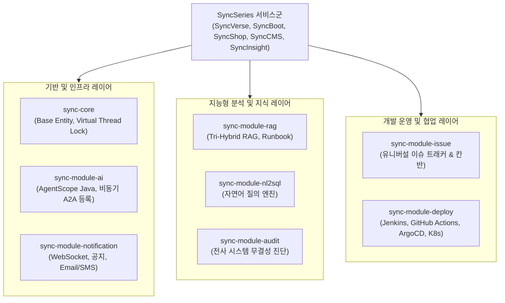
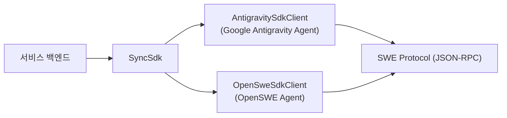

# 전사 공유 모듈 및 AI 코딩 SDK 아키텍처

SyncSeries는 개별 마이크로서비스와 에이전트 간의 중복 코드를 제거하고 전사 일관된 아키텍처 원칙을 적용하기 위해 **8대 공통 비즈니스 모듈(`sync-module-*`)**과 **AI 코딩 엔지니어링 SDK(`SyncSdk`)**를 표준화하여 운용합니다.

---

## 1. 전사 8대 공유 모듈 구성 체계

### 1.1 기반 및 인프라 모듈
* **`sync-core`**:
  * 전사 도메인 엔티티 공통 규격(`BaseEntity`, 트랙킹 메타데이터).
  * Java 21 가상 스레드(Virtual Threads) 환경에서 OS 스레드 점유(Carrier Pinning)를 방지하기 위해 `synchronized` 블록을 `ReentrantLock`으로 전면 전환하여 고성능 동시성 보장.
* **`sync-module-ai`**:
  * 전사 표준 AI 프레임워크인 **`AgentScope Java` (`io.agentscope:agentscope-harness`)** 통합.
  * `AgentSelfRegistrationClient`: 백엔드 부팅 시 SyncVerse 중앙 관제탑으로의 에이전트 자기 등록을 `CompletableFuture.runAsync` 비동기로 처리하며, 3초 타임아웃을 적용하여 중앙 관제탑 오프라인 상태에서도 서버 부팅 지연(0ms)을 보장.
  * `SyncDomainA2aExporter`, `SyncVerseA2aProxyService`: 표준 REST 및 SSE 기반 양방향 A2A 메시징 프록시.
* **`sync-module-notification`**:
  * WebSocket 핸들러 기반 실시간 브로드캐스팅 및 사용자 맞춤 푸시.
  * 공지사항(`SysAnnouncement`), 알림 템플릿(`SysMessageTemplate`), 이메일/SMS 발송 파이프라인 통합.

### 1.2 지능형 분석 및 지식 모듈
* **`sync-module-rag`**:
  * **Tri-Hybrid RAG 엔진**: Dense 벡터 검색 + Sparse 키워드 검색(BM25) + Cross-Encoder Reranker 결합으로 도메인 지식 검색 정확도 극대화.
  * `ContextAwareMarkdownSplitter`: 마크다운 헤더 계층 구조와 코드 블록 맥락을 온전히 보존하는 지능형 청킹.
  * `IncidentRunbookService`: 시스템 장애 발생 시 과거 인시던트 해결 절차를 실시간 자동 매핑.
* **`sync-module-nl2sql`**:
  * 비개발자의 자연어 질의를 스키마 인지형 SQL 쿼리로 자동 변환하고 안전 실행 가드레일 제공.
* **`sync-module-audit`**:
  * `AuditOrchestratorService`: 전사 마이크로서비스의 DB 연결, API 계약, 모듈 상태를 실시간 진단하고 ASCII 포맷의 표준 구조화 브리핑 제공.

### 1.3 개발 운영 및 협업 모듈
* **`sync-module-issue`**:
  * **유니버설 이슈 어댑터**: GitHub Issues, GitLab, Jira Cloud, Linear, Redmine 및 SyncVerse 네이티브 백로그를 단일 인터페이스(`IssueTrackerAdapter`)로 추상화.
  * 다차원 포트폴리오 칸반 보드 및 마일스톤 진척도 실시간 동기화.
* **`sync-module-deploy`**:
  * 멀티 CI/CD 파이프라인 어댑터(`JenkinsPipelineAdapter`, `GitHubActionsAdapter`, `ArgoCdPipelineAdapter`).
  * K8s Pod 실시간 헬스체크 및 롤백 오케스트레이션.

---

## 2. SyncSdk (AI 코딩 엔지니어링 SDK)

SyncSdk는 자율 코딩 에이전트와의 프로그래밍 연동을 위한 자바 SDK 라이브러리입니다.

* **Mock-Free 프로덕션 보장**: 프로덕션 런타임 클래스 내 하드코딩된 mock 분기를 전면 제거하고 실제 프로세스 실행 및 CLI 프로토콜 바인딩.
* **표준 로깅 및 인터페이스**: Lombok `@Slf4j` 기반 구조화 로깅 및 Ant Design 시맨틱 태그를 적용하여 관측성 확보.
