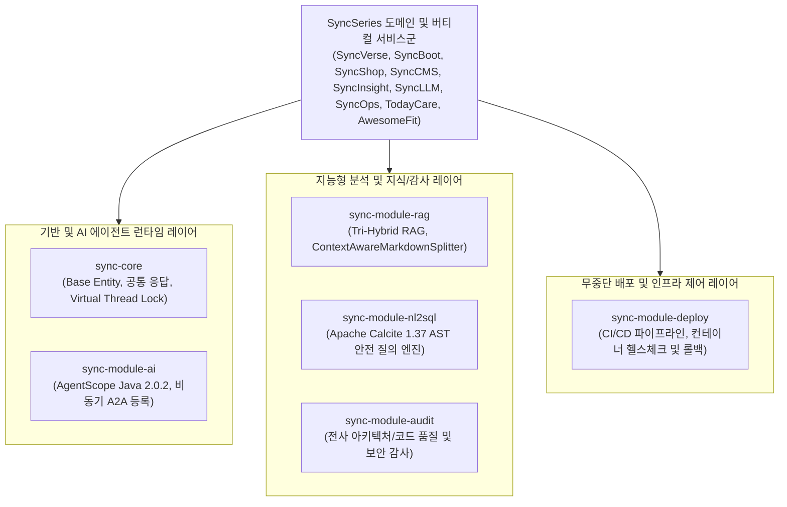
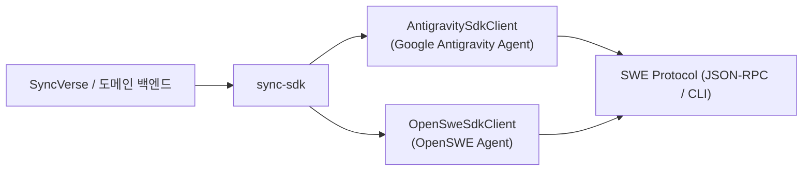

# 전사 공유 모듈 및 AI 코딩 SDK 아키텍처

SyncSeries는 루트 `pom.xml` 멀티모듈 체계 아래 개별 도메인 서비스와 에이전트 간의 중복 코드를 제거하고 전사 일관된 아키텍처 원칙(Java 25, Spring Boot 3.5.16, AgentScope Java 2.0.2, PostgreSQL 17)을 적용하기 위해 **6대 공통 기반 모듈(`sync-core`, `sync-module-*`)**과 **AI 코딩 엔지니어링 SDK(`sync-sdk`)**를 표준화하여 운용합니다.

---

## 1. 전사 6대 공유 모듈 구성 체계

```mermaid
graph TD
    App["SyncSeries 도메인 및 버티컬 서비스군\n(SyncVerse, SyncBoot, SyncShop, SyncCMS, SyncInsight, SyncLLM, SyncOps, TodayCare, AwesomeFit)"]
    
    subgraph CoreFoundation ["기반 및 AI 에이전트 런타임 레이어"]
        Core["sync-core\n(Base Entity, 공통 응답, Virtual Thread Lock)"]
        Ai["sync-module-ai\n(AgentScope Java 2.0.2, 비동기 A2A 등록)"]
    end

    subgraph IntelligenceLayer ["지능형 분석 및 지식/감사 레이어"]
        Rag["sync-module-rag\n(Tri-Hybrid RAG, ContextAwareMarkdownSplitter)"]
        Nl2Sql["sync-module-nl2sql\n(Apache Calcite 1.37 AST 안전 질의 엔진)"]
        Audit["sync-module-audit\n(전사 아키텍처/코드 품질 및 보안 감사)"]
    end

    subgraph DeliveryLayer ["무중단 배포 및 인프라 제어 레이어"]
        Deploy["sync-module-deploy\n(CI/CD 파이프라인, 컨테이너 헬스체크 및 롤백)"]
    end

    App --> CoreFoundation
    App --> IntelligenceLayer
    App --> DeliveryLayer
```

### 1.1 기반 및 AI 에이전트 런타임 모듈
* **`sync-core` (`com.empasy.sync:sync-core`)**:
  * 전사 도메인 엔티티 공통 규격(`BaseEntity`), 표준 API 응답 래퍼, 전역 예외 처리 및 암호화 유틸리티 제공.
  * **Java 25** 가상 스레드(Virtual Threads) 환경에서 OS 스레드 점유(Carrier Pinning)를 방지하기 위해 `ReentrantLock` 기반 고성능 동시성 제어 제공.
* **`sync-module-ai` (`com.empasy.sync:sync-module-ai`)**:
  * 전사 유일의 표준 AI 프레임워크인 **`AgentScope Java` (`io.agentscope:agentscope-harness:2.0.2`)** 통합 (`ReActAgent`, `MsgHub`, `@Tool` 자동 디스커버리).
  * `AgentSelfRegistrationClient`: 백엔드 부팅 시 SyncVerse 중앙 관제탑(`/api/v1/verse/agent/register-manifest`)으로의 에이전트 자기 등록을 비동기로 처리하며, 3초 타임아웃을 적용하여 중앙 관제탑 오프라인 상태에서도 서버 부팅 지연(0ms)을 보장.
  * `SyncDomainA2aExporter`, `SyncVerseA2aProxyService`: 표준 REST 및 SSE 기반 양방향 A2A 메시징 프록시.

### 1.2 지능형 분석 및 지식/감사 모듈
* **`sync-module-rag` (`com.empasy.sync:sync-module-rag`)**:
  * **Tri-Hybrid RAG 엔진**: PostgreSQL 17 `pgvector` HNSW Dense 벡터 검색 + `pg_trgm` 키워드 검색 + 지식 그래프 결합으로 도메인 지식 검색 정확도 극대화.
  * `ContextAwareMarkdownSplitter`: 마크다운 헤더 계층 구조와 코드 블록 맥락을 온전히 보존하는 지능형 청킹 엔진.
  * `IncidentRunbookService`: 시스템 장애 발생 시 과거 인시던트 해결 절차를 실시간 자동 매핑.
* **`sync-module-nl2sql` (`com.empasy.sync:sync-module-nl2sql`)**:
  * **Apache Calcite 1.37.0** 및 **JSqlParser 4.9** 기반 관계 대수 AST 최적화 및 다계층 SQL 보안 가드레일(`SELECT` 전용 강제, 테넌트 격리 조건 자동 주입, `LIMIT` 강제) 제공.
* **`sync-module-audit` (`com.empasy.sync:sync-module-audit`)**:
  * `AuditOrchestratorService`: 전사 마이크로서비스의 DB 연결, API 계약(`/api/v1/{product}/...`), Zero-Mock 준수 여부를 실시간 진단하고 구조화 브리핑 제공.

### 1.3 무중단 배포 및 인프라 제어 모듈
* **`sync-module-deploy` (`com.empasy.sync:sync-module-deploy`)**:
  * 멀티 CI/CD 파이프라인 어댑터(`JenkinsPipelineAdapter`, `GitHubActionsAdapter`, `ArgoCdPipelineAdapter`).
  * 컨테이너 및 K8s Pod 실시간 헬스체크 및 자동 롤백 오케스트레이션.

---

## 2. SyncSDK (`com.empasy.sync.sdk:sync-sdk`)

`sync-sdk`는 5-Step Spec Studio 및 자율 코딩 에이전트와의 프로그래밍 연동을 위한 전사 표준 SDK 모듈입니다.

```mermaid
graph LR
    App["SyncVerse / 도메인 백엔드"] --> Sdk["sync-sdk"]
    Sdk --> Antigravity["AntigravitySdkClient\n(Google Antigravity Agent)"]
    Sdk --> OpenSwe["OpenSweSdkClient\n(OpenSWE Agent)"]
    
    Antigravity --> SWE["SWE Protocol (JSON-RPC / CLI)"]
    OpenSwe --> SWE
```

* **멀티 코딩 엔진 핫스왑 SPI (`ICodingAgentClient`)**: 런타임에 Google Antigravity 엔진과 OpenSWE 엔진을 무중단 스위칭.
* **4-Cycle 빌드 자가치유**: 코드 패치 적용 후 `mvn test-compile` 및 `vue-tsc` 검증을 수행하고, 컴파일 오류 발생 시 에러 로그를 역주입하여 최대 4회까지 자율 수정.
* **Zero-Mock 프로덕션 보장**: 프로덕션 런타임 클래스 내 하드코딩된 더미 응답을 전면 배제하고 실제 Git 워크스페이스 및 프로세스 실행과 바인딩.
