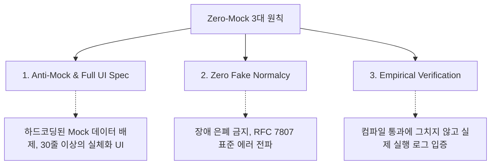

# Zero-Mock 엔터프라이즈 품질 하네스 및 검증 프로토콜

SyncSeries는 상용 소프트웨어의 신뢰성을 보장하기 위해 하드코딩된 가짜 응답을 전면 배제하고, 실제 DB 및 네트워크 연동을 강제하는 **Zero-Mock 원칙**과 **4-Cycle 품질 검증 프로토콜**을 엄격히 준수합니다.

---

## 1. Zero-Mock 및 상용 품질 3대 원칙

### 1.1 Anti-Mock & Full UI Spec Mandate
* 명시적인 단위 테스트 격리 목적 외에 백엔드와 프론트엔드 실제 로직에 하드코딩된 Mock 객체, 더미 래퍼, 빈 리턴 메서드 작성을 엄격히 금지합니다.
* 모든 REST API와 프론트엔드 컴포넌트는 실제 데이터베이스 쿼리 및 서비스 인터페이스와 100% 연동되어야 합니다.
* 모든 화면 컴포넌트는 30줄 이상의 실체화된 UI 요소(테이블, 폼, 필터 등)를 갖추어야 하며, 빈 껍데기나 임시 텍스트 작성을 금지합니다.

### 1.2 Zero Fake Normalcy (가짜 정상 위장 금지)
* 네트워크 장애, HTTP 호출 실패, DB 쿼리 오류 발생 시 `catch` 블록에서 예외를 묵살하거나 임의의 가짜 성공 상태(`status: SUCCESS`)를 생성하여 정상 동작하는 것처럼 위장하는 행위를 차단합니다.
* 모든 예외는 RFC 7807 Problem Details 표준에 따라 정확한 HTTP 상태 코드와 구조화된 진단 필드를 담아 클라이언트 및 상위 관제 시스템으로 전파되어야 합니다.

### 1.3 Empirical Verification (실행 검증 필수)
* 단순 소스코드 수정이나 컴파일 성공에 안주하지 않고, 실제 DB 실행 로그, REST API 호출 응답, 프론트엔드 빌드 실행 결과를 콘솔에 출력하여 실증해야 합니다.

---

## 2. 4-Cycle 품질 검증 프로토콜

코드 변경이 발생한 후에는 다음 4단계 회귀 검증 과정을 반복하여 빌드 무결성을 확정합니다.

| 검증 단계 | 주요 검증 항목 | 도구 및 명령어 | 합격 기준 |
|:---|:---|:---|:---|
| **[Cycle 1] 전체 빌드 및 1차 검증** | 전사 모듈 컴파일 및 타입 검증 | `mvn compile`, `pnpm build` | 전체 빌드 성공 (BUILD SUCCESS) |
| **[Cycle 2] 수정 및 2차 교차 검증** | 인터페이스/타입 정합성 확인 | `mvn test-compile` | 모듈 간 의존성/타입 오류 0건 |
| **[Cycle 3] 회귀 테스트 및 3차 검증** | 단위/통합 테스트 및 정적 감사 | `mvn test`, `verify-zero-mock.ps1` | 단위 테스트 통과, Mock 위반 0건 |
| **[Cycle 4] 최종 회귀 빌드 및 감사** | 클린 빌드 및 독립 QA 교차 감사 | Subagent Audit (`QA_Auditor`) | 최종 승인 판정 (APPROVED) |

---

## 3. 전사 자동화 감사 스크립트 체계

개발 산출물의 무결성을 검증하기 위해 전사 16개 서브프로젝트를 대상으로 3종의 전용 감사 스크립트를 운용합니다.

* **`verify-zero-mock.ps1`**:
  * Java, Vue, TypeScript 소스코드 내 하드코딩된 mock 변수, 임의의 더미 컬렉션 반환, 가짜 분기 로직을 정적 패턴 분석으로 검출.
* **`verify-security-leaks.ps1`**:
  * 소스코드 및 설정 파일 내 평문 하드코딩된 API Key, 비밀번호, 프라이빗 인증 토큰 유출 여부 전수 스캔 (10,000+ 파일 검사).
* **`verify-api-contracts.ps1`**:
  * 백엔드 Controller 엔드포인트와 프론트엔드 API 호출 명세 간 URL, HTTP 메서드, 파라미터 1:1 일치 여부 정합성 감사.
