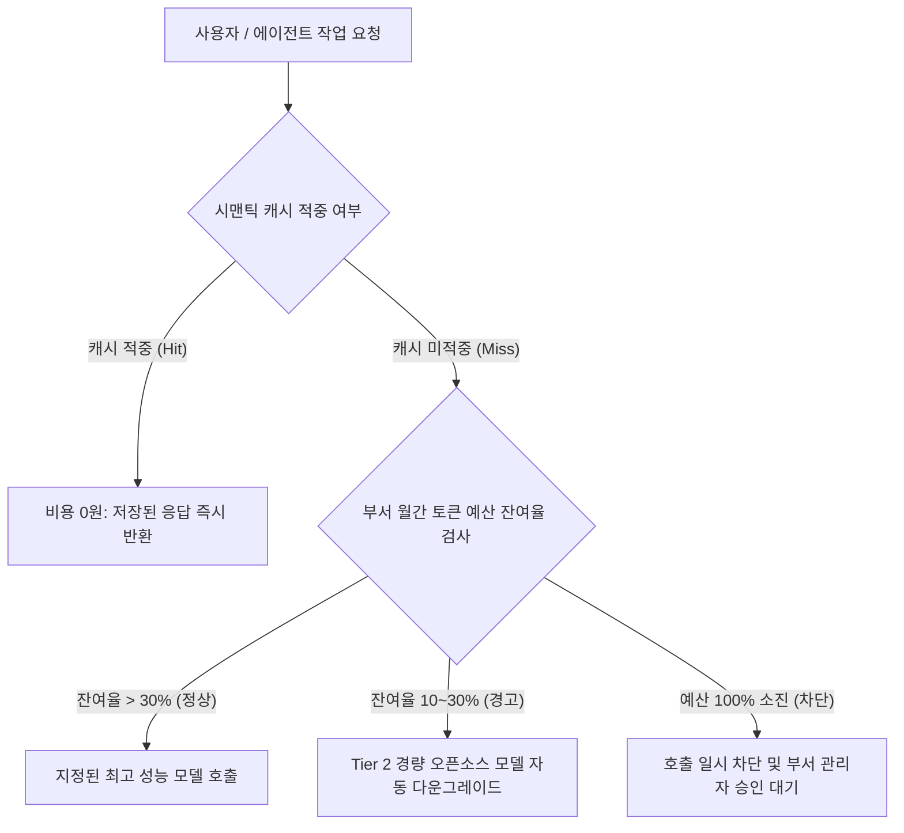

# 부서별 토큰 예산 관리 및 비용 최적화 가이드

## 1. 개요 및 FinOps 관리 목적

생성형 AI 모델 및 자율 에이전트의 활용이 확대됨에 따라, 특정 부서의 과도한 프롬프트 호출이나 무한 루프로 인해 예상치 못한 클라우드 API 청구 비용이 발생하는 위험을 통제해야 합니다.

SyncSeries의 FinOps 모듈은 **조직(부서/프로젝트) 단위의 세분화된 토큰 지출 쿼터 관리**와 **지능형 다계층 모델 라우팅**을 통해 AI 운영 비용을 사전에 예측하고 계획된 예산 범위 내로 통제할 수 있도록 지원합니다.

---

## 2. 3단계 예산 임계치 알림 및 제어 정책

부서별로 설정된 월간 예산(예: 월 200만 원 또는 월 5천만 토큰)의 소진율에 따라 다음과 같은 자동화된 거버넌스 규칙이 동작합니다.

| 소진율 단계 | 시스템 조치 및 제어 정책 | 사용자/관리자 통보 |
| :---: | :--- | :--- |
| **1단계: 정상 (0 ~ 70%)** | 모든 요청에 대해 기본 설정된 상위 모델(Tier 3~4) 정상 제공 | 통보 없음 (대시보드 실시간 집계) |
| **2단계: 주의 (70 ~ 90%)** | 단순 분류나 정보 추출 작업은 사내 경량 모델(Tier 1)로 우선 전환 | 부서 담당자에게 이메일/슬랙 안내 알림 발송 |
| **3단계: 경고 (90 ~ 100%)** | 대규모 배치 작업 일시 보류, 고비용 프론티어 모델 호출 제한 | 부서장 및 재무 담당자에게 긴급 경고 발송 |
| **4단계: 초과 (100% 도달)** | 일반 질의 차단, 사내 폐쇄망 온프레미스 모델로 강제 폴백 | 예산 증액 승인 신청서 자동 발급 |

---

## 3. 비용 최적화를 위한 2대 핵심 엔진

### 1) 역량 기반 4단계 모델 티어링 (Model Tiering)
모든 작업을 고비용 상용 모델로 처리하지 않고, 작업 복잡도에 따라 최적의 단가 모델로 자동 분기합니다:

- **Tier 1 (초경량 / 사내 배포)**: 단순 의도 분류, 정규식 검증, 개체명 인식 ➔ *호출 비용 0원 (사내 GPU 활용)*.
- **Tier 2 (중형 / 오픈소스)**: 일반 Q&A, 문서 요약, 단순 SQL 질의 ➔ *Qwen2.5-7B, Llama-3.1-8B*.
- **Tier 3 (대형 / 고성능)**: 복잡한 비즈니스 기획, 아키텍처 명세 도출 ➔ *Qwen2.5-72B, Claude 3.5 Haiku*.
- **Tier 4 (최상위 추론)**: 복잡한 알고리즘 설계, 다자간 토론 합의 ➔ *Claude 3.5 Sonnet, DeepSeek-R1*.

### 2) 시맨틱 캐시 (Semantic Cache) 활용
- 완전히 동일한 텍스트뿐만 아니라, 의미론적 유사도(Cosine Similarity 0.95 이상)가 높은 유사 질의에 대해 데이터베이스에 캐싱된 검증 응답을 즉시 반환합니다.
- 사내 고객 문의나 자주 묻는 질문(FAQ)의 경우 중복 API 호출을 줄여 토큰 소비량을 실질적으로 절감할 수 있습니다.

---

## 4. 월간 비용 정산 및 보고서 확인

- 관리자 콘솔의 **[FinOps > 부서별 통계]** 메뉴에서 부서별, 프로젝트별, 에이전트별 일간/월간 토큰 소비 추이 그래프를 조회할 수 있습니다.
- CSV 및 PDF 리포트 다운로드를 지원하여 사내 IT 비용 정산 및 회계 전표 처리에 즉시 활용할 수 있습니다.
