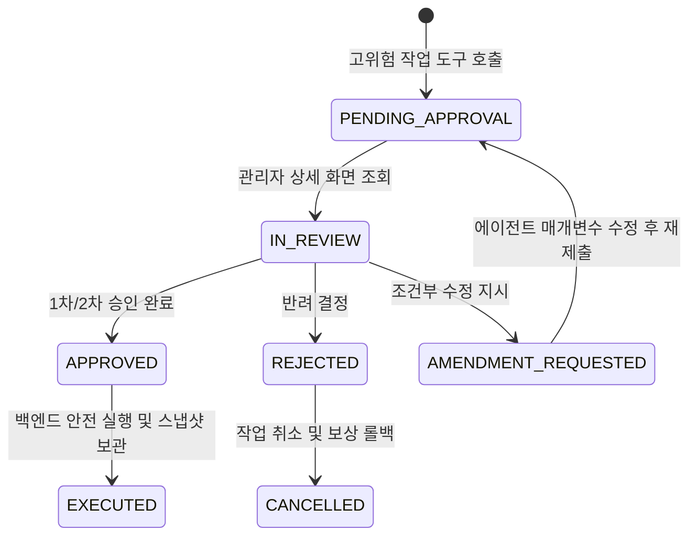

# 고위험 작업 다단계 결재 및 감사 추적 가이드

## 1. 작업 위험도 분류 기준 (Risk Levels)

에이전트가 호출하는 모든 도구(Tool) 및 비즈니스 액션은 시스템에 미치는 영향도에 따라 4단계의 위험 등급으로 사전 분류되어 관리됩니다.

| 등급 | 작업 유형 | 대상 작업 예시 | 승인 정책 |
| :---: | :--- | :--- | :--- |
| **Level 1 (안전)** | 단순 조회 및 리포팅 | 주문 현황 조회, 로그 검색, RAG 문서 탐색 | **무승인 자율 실행** (실행 이력 자동 기록) |
| **Level 2 (주의)** | 가역적 설정 변경 | 크롤링 주기 변경, 캐시 만료, 알림 채널 설정 | **단일 담당자 승인** (1인 승인) |
| **Level 3 (경고)** | 데이터 변경 및 삭제 | 회원 정보 수정, 상품 가격 일괄 변경, DB 레코드 삭제 | **2단계 순차 결재** (담당자 ➔ 부서장) |
| **Level 4 (위험)** | 시스템 전반 영향 | 프로덕션 신규 버전 배포, DDL 스키마 변경, 대량 환불 | **3단계 다자간 결재** (담당자 ➔ CISO ➔ 책임자) |

---

## 2. 웹 콘솔 결재 승인 화면 조작 절차

Level 2 이상의 작업이 감지되면 에이전트의 실행이 즉시 일시 중단(PAUSED)되고, 관리자 포털의 결재 대기 목록에 카드가 등록됩니다.

### 단계별 검토 항목
1. **영향 범위(Blast Radius) 확인**:
   - 변경 대상 테이블 명칭, 변경 예상 레코드 수량(Row Count)을 확인합니다.
   - 단일 레코드가 아닌 1,000건 이상의 대량 변경 건인 경우 사유가 타당한지 검토합니다.
2. **사전-사후 Diff 대조**:
   - 변경 전(Current State)과 변경 후(Proposed State)의 JSON/SQL 데이터 차이점이 정확한지 확인합니다.
3. **롤백 스냅샷 가용성 검증**:
   - 시스템 장애 발생 시 이전 상태로 되돌릴 수 있는 스냅샷 ID가 정상 생성되었는지 표시기를 점검합니다.

---

## 3. 관리자 의사결정 액션 가이드

- **승인 (Approve)**:
  - 검토 결과 작업 내용에 이상이 없는 경우 '승인' 버튼을 클릭합니다.
  - 다자간 결재 건인 경우 다음 승인권자에게 결재선이 순차 인계되며, 최종 승인 시 실제 트랜잭션이 커밋됩니다.
- **반려 (Reject)**:
  - 비즈니스 정책에 위배되거나 데이터 오염 우려가 있는 경우 구체적인 반려 사유를 입력하고 작업을 거절합니다.
  - 에이전트는 즉시 작업을 중단하고 관련 리소스를 해제합니다.
- **수정 지시 (Amend)**:
  - 방향성은 타당하나 매개변수(예: 가격 할인율, 대상 사용자 범위 등)의 미세 조정이 필요한 경우, 수정 피드백을 작성하여 에이전트에게 재작업을 지시할 수 있습니다.

---

## 4. 감사 로그 추적 및 위변조 방지

모든 승인/반려 의사결정 내역은 내부 감사 장부(Audit Ledger)에 영구 저장됩니다:

- **기록 항목**: 요청 일시, 실행 에이전트 ID, 승인자 사번 및 IP 주소, 요청 원본 프롬프트, 도구 파라미터 해시값, 최종 실행 결과.
- **무결성 보증**: 감사 로그는 타임스탬프 기반의 암호화 해시 체인(SHA-256)으로 상호 결합되어 있어, 데이터베이스 관리자라 할지라도 과거 이력을 임의로 조작하거나 삭제할 수 없습니다.
