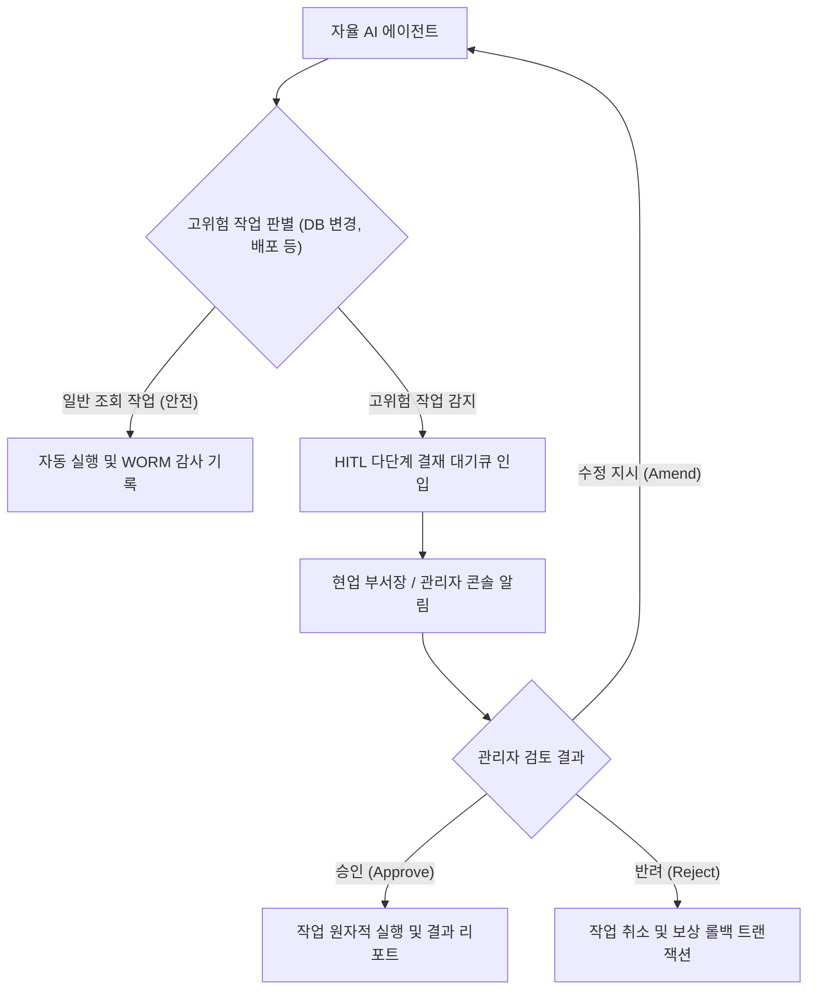

# 현업 관리자 실무 거버넌스 가이드

## 1. 개요 및 대상 독자

SyncSeries는 엔지니어링 개발자뿐만 아니라 **실제 비즈니스 부서의 관리자, 기획자, 보안 심사역**이 안전하게 AI 에이전트를 통제하고 운영할 수 있도록 웹 기반 관리 콘솔과 거버넌스 도구를 제공합니다.

본 가이드는 다음과 같은 역할을 수행하는 실무자를 위해 작성되었습니다:
- **부서장 및 승인권자**: 에이전트가 요청한 고위험 작업(대량 데이터 변경, 프로덕션 배포 등)에 대한 승인/반려 의사결정.
- **FinOps 및 재무 담당자**: 부서별/프로젝트별 월간 AI 모델 호출 비용 추적 및 예산 한도 관리.
- **컴플라이언스 및 감사 담당자**: 과거 에이전트가 수행한 작업 이력, 판단 근거, 프롬프트 로그에 대한 위변조 방지 감사.

---

## 2. 거버넌스 핵심 원칙

1. **최소 권한의 원칙 (Least Privilege)**:
   - 각 에이전트와 사용자는 부여된 역할(`sys_role`)에 매핑된 도구 및 화면 권한만 실행할 수 있습니다.
2. **다단계 인적 개입 (Multi-Party HITL)**:
   - 파괴적 행위나 일정 금액 이상의 결제 변경 건은 단일 관리자가 아닌 2인 이상의 다자간 순차 승인을 거쳐야만 최종 집행됩니다.
3. **불가역 감사 추적 (Tamper-Proof Audit)**:
   - 모든 결재 승인 내역과 에이전트의 실행 로그는 타임스탬프 암호화 해시 체인으로 봉인되어 사후 임의 수정이나 삭제가 불가능합니다.

---

## 3. 세부 실무 매뉴얼 안내

- **고위험 작업 다단계 결재 및 감사 추적 가이드**: 웹 콘솔에서의 결재 요청 수신, 상세 Diff 및 영향도 검토, 승인/반려/수정 지시 조작 절차.
- **부서별 토큰 예산 관리 및 비용 최적화 가이드**: 조직 단위 월간 예산 할당, 임계치 도달 시의 알림 정책 및 초과 방지 운영 방안.
