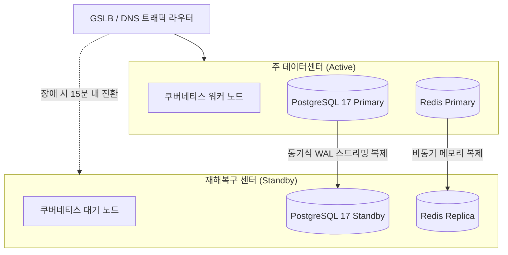

# 재해 복구(DR) 및 고가용성 설계

## 1. 개요 및 복구 목표 기준

SyncSeries는 데이터 손실이 치명적인 금융, 제조, 공공 서비스를 안정적으로 지원하기 위해 명확한 복구 목표 지표(RPO, RTO)를 정의하고 다중 리전 및 이중화 인프라를 운영합니다.

- **RPO (Recovery Point Objective - 목표 복구 시점)**: **0분** (동기식 복제 환경 기준) / 최대 1분 이내 (비동기 교차 리전 복제 기준).
- **RTO (Recovery Time Objective - 목표 복구 시간)**: **15분 이내** (주 센터 장애 시 보조 센터로의 트래픽 전환 완료 기준).



---

## 2. 데이터 계층 고가용성 및 복제 아키텍처

### 1) PostgreSQL 17 (pgvector) WAL 스트리밍 복제
- 비즈니스 테이블 및 AI 임베딩 벡터 데이터의 일관성을 유지하기 위해 PostgreSQL 17의 물리 스트리밍 복제(Physical Streaming Replication)를 적용합니다.
- `synchronous_commit = on` 설정을 통해 트랜잭션 커밋 신호가 보조 노드의 WAL(Write-Ahead Log)에 기록된 후 최종 클라이언트 응답을 반환하여 장애 시 커밋 유실을 방지합니다.

```ini
# postgresql.conf (Primary)
wal_level = replica
max_wal_senders = 10
wal_keep_size = 4096MB
synchronous_commit = on
synchronous_standby_names = 'FIRST 1 (dr_standby_node)'
```

### 2) 시점 복구(PITR: Point-In-Time Recovery) 파이프라인
- 매일 02:00에 기본 전체 백업(Base Backup)을 MinIO 오브젝트 스토리지에 압축 암호화 적재합니다.
- 지속적으로 생성되는 WAL 아카이브 파일은 60초 주기로 보조 스토리지로 동기화되어, 관리자 실수로 인한 데이터 오염 발생 시 특정 분/초 단위로 데이터베이스를 정밀하게 복원할 수 있는 PITR 환경을 제공합니다.

---

## 3. Redis 분산 락 및 세션 복제

- 에이전트 간 동시 작업 충돌을 방지하는 분산 락(Redlock)과 활성 사용자 세션은 Redis Sentinel 기반의 3노드 자동 페일오버 클러스터로 구성됩니다.
- 마스터 노드에 심각한 하드웨어 장애가 발생할 경우 Sentinel 정족수(Quorum) 합의를 통해 3초 이내에 보조 노드가 새로운 마스터로 자동 승격됩니다.

---

## 4. 재해 발생 시 단계별 페일오버 절차

주 데이터센터의 물리적 침수, 전력 단전 또는 통신망 단절 사고 발생 시 아래의 표준 운영 절차(SOP)에 따라 대기 센터로 전환합니다.

1. **상태 감지 및 장애 선언 (0 ~ 3분)**:
   - 외부 헬스체크 프로브 3곳에서 주 센터의 5xx 에러 또는 응답 무응답이 180초 이상 지속될 경우 인프라 위기 경보를 발령합니다.
2. **보조 데이터베이스 승격 (3 ~ 7분)**:
   - 재해복구 센터의 PostgreSQL Standby 노드에서 승격 명령을 실행하여 읽기/쓰기 모드로 전환합니다:
     ```bash
     pg_ctl promote -D /var/lib/postgresql/data
     ```
3. **쿠버네티스 파드 스케일아웃 및 기동 (7 ~ 10분)**:
   - 보조 클러스터의 도메인 에이전트 Deployment 복제본 수를 평시 대기 상태(1대)에서 운영 사양(최소 3대 이상)으로 즉시 스케일아웃합니다.
4. **GSLB 트래픽 전환 (10 ~ 15분)**:
   - 글로벌 서버 로드 밸런서(GSLB)의 가중치를 주 센터 0%, 보조 센터 100%로 전환하고 DNS TTL(60초) 만료를 기다립니다.
   - 서비스 정상 유입 및 인가 토큰 세션의 정상 검증 여부를 최종 확인합니다.

---

## 5. 정기 모의 훈련 및 복구 검증

- **훈련 주기**: 분기 1회 정기 DR 모의 훈련을 실시합니다.
- **검증 항목**:
  - 실제 주 센터 네트워크 인터페이스 강제 차단 후 트래픽 전환 완료 시간 측정.
  - 전환 완료 후 에이전트 작업 히스토리 및 RAG 벡터 색인의 데이터 누락(0건) 전수 대조.
  - 모의 훈련 결과 리포트를 작성하여 엔터프라이즈 컴플라이언스 감사 증적으로 보관.
