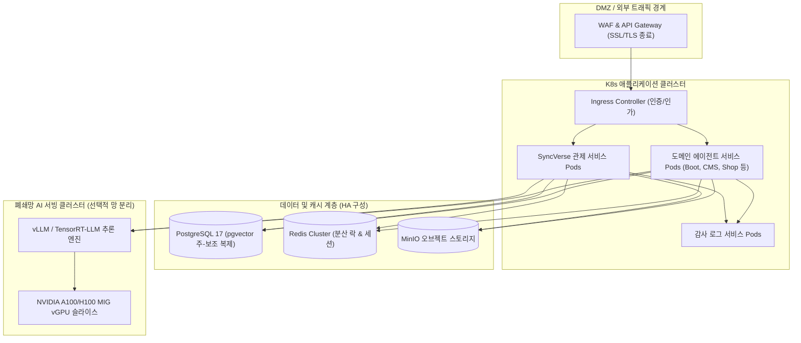

# 엔터프라이즈 인프라 및 보안 아키텍처

## 1. 인프라 설계 원칙

SyncSeries는 금융, 공공, 제조 등 엄격한 망 분리 규정과 보안 컴플라이언스를 요구하는 엔터프라이즈 환경을 지원하도록 설계되었습니다.

플랫폼 인프라는 다음 세 가지 공학 원칙을 중심으로 구축됩니다:
1. **격리 및 다중 방어 (Defense-in-Depth)**: 공용 클라우드뿐만 아니라 외부 인터넷 연결이 차단된 물리 폐쇄망(On-Premise) 환경에서도 독립적으로 완전 기동할 수 있는 컨테이너화 아키텍처.
2. **선언적 GitOps 배포**: 모든 쿠버네티스 매니페스트와 환경 설정은 Git 저장소를 단일 원천(Single Source of Truth)으로 관리하며 ArgoCD를 통해 추적 및 자동 동기화.
3. **엄격한 데이터 주권 및 개인정보 보호**: 외부 LLM API 통신 시 실시간 PII(개인식별정보) 자동 마스킹 및 전사 감사 로그(Audit Trail)의 변조 방지 보관.

---

## 2. 모듈별 물리 계층 구성

전사 플랫폼은 서비스 안정성과 성능 병목 방지를 위해 기능별로 독립된 노드 풀(Node Pool)을 구성하여 운영합니다.

| 계층 | 주요 컴포넌트 | 권장 하드웨어 사양 | 네트워크 정책 |
| :--- | :--- | :--- | :--- |
| **API & 오케스트레이션** | `SyncVerse`, API Gateway, Nacos | 범용 컴퓨팅 노드 (8 vCPU, 32GB RAM) | 외부 인바운드 허용, mTLS 통신 |
| **도메인 비즈니스 서비스** | `SyncBoot`, `SyncCMS`, `SyncShop` | 메모리 최적화 노드 (16 vCPU, 64GB RAM) | 내부 사설망 전용, 클러스터 내부 통신 |
| **데이터 및 RAG 벡터 저장소** | PostgreSQL 17, Redis, MinIO | NVMe SSD 탑재 스토리지 노드 | 내부 격리망, 데이터 암호화(LUKS/TLS) |
| **로컬 AI 서빙 (온프레미스)** | vLLM, TensorRT-LLM, 임베딩 모델 | GPU 가속 노드 (NVIDIA L40S, A100, H100) | 추론 전용 격리 VLAN, 외부망 차단 |

---

## 3. 엔터프라이즈 운영 문서 로드맵

인프라 및 보안 관리자가 환경 구성과 장애 대응에 즉시 참조할 수 있도록 세부 운영 가이드를 제공합니다:

- **폐쇄망 로컬 LLM 서빙 및 vGPU 자원 분할**: 외부 연결 없는 사내 GPU 서버 구성 및 vLLM 서빙 최적화.
- **AI 보안 가드레일 및 PII 마스킹**: 프롬프트 인젝션 방어, 유해 출력 차단 및 실시간 개인정보 익명화.
- **쿠버네티스 배포 및 GitOps 파이프라인**: Helm 차트 구조, ArgoCD 지속적 배포 및 HPA 오토스케일링.
- **장애 복구(DR) 및 고가용성 설계**: 액티브-스탠바이 이중화, 시점 복구(PITR) 및 RTO 15분 달성 절차.
