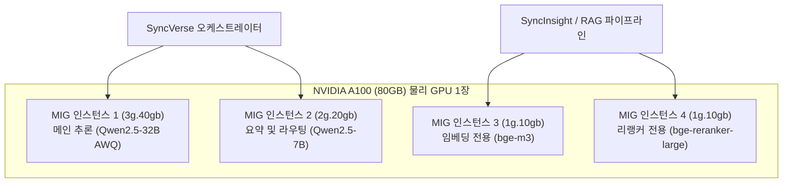

# 폐쇄망 로컬 LLM 서빙 및 vGPU 자원 분할

## 1. 개요 및 배경

기업의 핵심 비즈니스 로직, 금융 거래 내역, 개인정보 또는 소스코드가 외부 상용 API(예: OpenAI, Anthropic 등)로 전송되는 것을 차단하기 위해, SyncSeries는 물리적으로 격리된 사내 프라이빗 클라우드 및 온프레미스 GPU 서버 환경에서 자체 오픈소스 모델(Qwen2.5, Llama 3.3, DeepSeek-R1 등)을 서빙하는 아키텍처를 지원합니다.

본 가이드는 사내 데이터센터 환경에서 고성능 추론 엔진인 **vLLM**과 NVIDIA 하드웨어 가상화 기술인 **MIG(Multi-Instance GPU)**를 활용하여 가용 GPU 자원을 분할하고 서빙 안정성을 확보하는 절차를 다룹니다.



---

## 2. NVIDIA MIG 기반 하드웨어 가상화 설정

단일 고성능 GPU(예: A100 80GB, H100 80GB)에 단일 모델만 적재할 경우 메모리와 연산 유닛의 낭비가 발생합니다. MIG 기술을 적용하면 물리 GPU를 하드웨어 수준에서 완전 격리된 독립 인스턴스로 분할할 수 있습니다.

### MIG 활성화 및 인스턴스 생성
```bash
# 1. GPU에서 MIG 모드 활성화 (재부팅 불필요)
sudo nvidia-smi -i 0 -mig 1

# 2. 지원되는 프로파일 확인
nvidia-smi mig -lgip

# 3. 인스턴스 분할 생성 (예: 40GB 1개, 20GB 1개, 10GB 2개)
# 프로파일 ID 9 (3g.40gb), 14 (2g.20gb), 19 (1g.10gb) 기준
sudo nvidia-smi mig -cgi 9,14,19,19 -C

# 4. 생성된 MIG 디바이스 UUID 확인
nvidia-smi -L
```

---

## 3. vLLM 추론 엔진 쿠버네티스 배포 매니페스트

분할된 MIG 인스턴스 각각에 대해 쿠버네티스 Pod를 1:1로 매핑하여 배포합니다. 메모리 단편화를 방지하고 Throughput을 극대화하기 위해 PagedAttention과 양자화(AWQ) 옵션을 적용합니다.

```yaml
apiVersion: apps/v1
kind: Deployment
metadata:
  name: vllm-qwen-32b
  namespace: sync-ai
spec:
  replicas: 1
  selector:
    matchLabels:
      app: vllm-qwen-32b
  template:
    metadata:
      labels:
        app: vllm-qwen-32b
    spec:
      containers:
      - name: vllm-server
        image: vllm/vllm-openai:v0.6.3
        args:
        - "--model=/models/Qwen2.5-32B-Instruct-AWQ"
        - "--quantization=awq"
        - "--max-model-len=16384"
        - "--gpu-memory-utilization=0.92"
        - "--enforce-eager"
        - "--port=8000"
        env:
        - name: NVIDIA_VISIBLE_DEVICES
          value: "MIG-GPU-xxxx-xxxx" # 대상 MIG 인스턴스 UUID
        ports:
        - containerPort: 8000
        resources:
          limits:
            nvidia.com/mig-3g.40gb: 1
            memory: 48Gi
            cpu: "8"
          requests:
            nvidia.com/mig-3g.40gb: 1
            memory: 32Gi
            cpu: "4"
        volumeMounts:
        - name: model-storage
          mountPath: /models
          readOnly: true
      volumes:
      - name: model-storage
        persistentVolumeClaim:
          claimName: nfs-ai-models-pvc
```

---

## 4. 모델 서빙 튜닝 및 성능 최적화 가이드

### 1) AWQ 4-Bit 양자화 적용
- 32B 이상 모델의 경우 16비트(FP16) 가중치 로드 시 약 65GB 이상의 VRAM이 필요하여 40GB MIG 슬라이스에 적재할 수 없습니다.
- AWQ(Activation-aware Weight Quantization) 4-bit 모델을 채택하면 모델 가중치 용량을 약 20GB 수준으로 압축하면서도 인과적 추론 성능 손실을 1% 미만으로 억제할 수 있어 3g.40gb 슬라이스에 여유 있게 상주합니다.

### 2) PagedAttention 메모리 최적화
- `gpu-memory-utilization` 값을 0.90~0.92로 설정하여 KV 캐시용 메모리를 최대 확보합니다.
- 동시 접속 요청이 몰리는 환경에서도 OOM(Out of Memory) 크래시 없이 대기 큐(Continuous Batching)에서 안정적으로 처리됩니다.

### 3) 헬스체크 및 Failover 설정
- vLLM의 `/health` 엔드포인트를 쿠버네티스 `livenessProbe` 및 `readinessProbe`에 연결합니다.
- 추론 엔진에 일시적 부하가 발생할 경우 트래픽 유입을 즉시 차단하고 대기 중인 보조 인스턴스로 자동 분산합니다.
