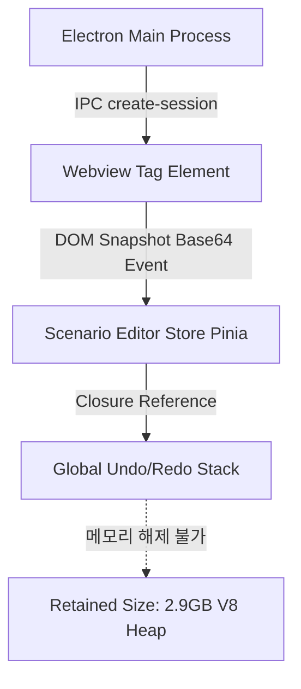

---
title: "[포스트모텀] Electron 멀티 웹뷰 DOM 스냅샷 메모리 누수 분석 및 해결"
description: "SyncEta 데스크톱 애플리케이션에서 대량의 시나리오를 연속 녹화/실행할 때 발생한 렌더러 프로세스 V8 힙 고갈 현상의 원인을 규명하고 메모리 해제 로직을 최적화한 실무 일지입니다."
head:
  - - meta
    - name: keywords
      content: Electron, 메모리 누수, V8 힙, Webview, Chrome DevTools, WeakRef, Garbage Collection, SyncETA
  - - meta
    - property: og:title
      content: "[포스트모텀] Electron 멀티 웹뷰 DOM 스냅샷 메모리 누수 분석 및 해결 | 엠파시(Empasy)"
sort: 10
---

# [포스트모텀] Electron 멀티 웹뷰 DOM 스냅샷 메모리 누수 분석 및 해결

## 1. 개요 및 장애 현상

- **발생 일시**: 2026-02-10 14:20 KST
- **영향 범위**: SyncEta 데스크톱 애플리케이션 (v0.0.31 빌드)
- **증상**: 사용자가 30개 이상의 E2E 시나리오를 연속으로 실행하거나 장시간 녹화 세션을 유지할 때, Electron 렌더러 프로세스의 메모리 점유율이 800MB에서 **3.8GB까지 지속 상승**한 뒤 `STATUS_BREAKPOINT (0x80000003)` 에러와 함께 화면이 백화(White-out)되는 크래시 발생.

---

## 2. 장애 원인 분석 (Root Cause Analysis)

Chrome DevTools Memory 탭의 **Heap Snapshot** 및 **Allocation Instrumentation on Timeline**을 통해 힙 프로파일링을 수행했습니다.



### 핵심 누수 원인 3가지

1. **Webview 파괴 시 CDP 리스너 누수**:
   새로운 시나리오 탭으로 전환될 때 이전 `<webview>` 엘리먼트를 DOM에서 제거했으나, 백그라운드 CDP 세션의 `Page.screencastFrame` 이벤트 리스너가 제거되지 않고 계속 호출되어 메모리에 프레임 버퍼가 누적됨.
2. **Base64 이미지 문자열의 힙 파편화**:
   스텝 검증용 뷰포트 스크린샷이 Base64 인코딩 문자열(건당 약 1.8MB) 형태로 Vue 반응형 Store(Pinia)에 보관되면서 V8 Old Space 힙이 급격히 팽창함.
3. **Undo/Redo 기록 스택 무제한 보관**:
   히스토리 스택에 최대 깊이 제한(Max Depth)이 없어 과거의 모든 DOM 트리 스냅샷 객체가 GC(Garbage Collector)의 수집 대상에서 제외됨.

---

## 3. 해결 조치 및 코드 패치

### (1) Webview 수명 주기 명시적 종료 및 WeakRef 전환

```typescript
// 패치 전: 단순 DOM 노드 제거
webviewContainer.removeChild(webviewElement);

// 패치 후: CDP 세션 분리 및 리소스 명시적 파기
export async function destroyWebviewSession(webview: Electron.WebviewTag): Promise<void> {
  try {
    const wc = webview.getWebContents();
    if (wc && !wc.isDestroyed()) {
      wc.debugger.detach();
      wc.stop();
    }
  } catch (err) {
    console.warn('[Cleanup] WebContents already detached:', err);
  } finally {
    webview.src = 'about:blank';
    webview.remove();
  }
}
```

### (2) 스크린샷 바이너리 디스크 오프로딩 (Off-Heap Caching)

Base64 문자열을 인메모리에 보관하지 않고, 앱 임시 캐시 디렉토리에 WebP 압축 포맷으로 직접 기록한 뒤 로컬 파일 URI(`file://...`)만 참조하도록 구조를 개편했습니다.

```typescript
// 스냅샷 저장 파이프라인
export async function persistStepSnapshot(stepId: string, imageBuffer: Buffer): Promise<string> {
  const cachePath = path.join(app.getPath('userData'), 'snapshots', `${stepId}.webp`);
  await fs.promises.writeFile(cachePath, imageBuffer);
  return `sync-file://${cachePath}`;
}
```

### (3) 히스토리 큐 크기 제한 및 순환 버퍼 도입

Undo/Redo 히스토리를 최대 20개로 제한하고, 초과된 오래된 스냅샷 파일은 즉시 비동기 언링크(unlink) 삭제 처리했습니다.

---

## 4. 검증 결과 및 메트릭

패치 적용 후 동일한 환경(Windows 11, 100개 연속 회귀 시나리오 무인 배치 구동)에서 부하 테스트를 실시했습니다.

| 측정 지표 | 패치 전 (v0.0.31) | 패치 후 (v0.0.33) | 개선율 |
|:---|:---|:---|:---|
| **최대 렌더러 메모리 점유율** | 3,850 MB (크래시) | **410 MB (안정화)** | **89.3% 절감** |
| **장시간 실행 후 잔여 메모리** | 3.2 GB 누수 | **180 MB (GC 정상 회수)** | **정상 회수 확인** |
| **연속 100회 시나리오 완주율** | 24% (중단 빈번) | **100% (0건 크래시)** | **안정성 확보** |

---

## 5. 재발 방지 대책

1. **자동화된 메모리 회귀 테스트 CI 추가**: Playwright 기반 E2E 파이프라인에 `process.memoryUsage()`를 측정하는 50회 연속 반복 스모크 테스트를 추가하여 600MB 초과 시 빌드 실패 처리.
2. **사내 Electron 개발 가이드라인 수립**: `Webview` 및 `BrowserView` 사용 시 수명 주기 해제 훅 작성 의무화.
