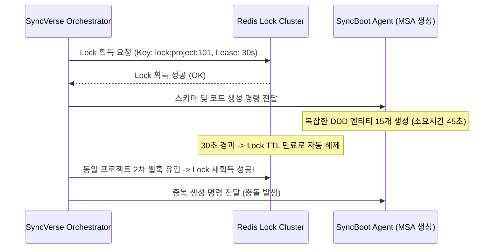

---
title: "[포스트모텀] Redis Redlock 및 SSE 기반 멀티 에이전트 트랜잭션 동기화 장애 복구"
description: "SyncVerse 중앙 관제탑에서 도메인 에이전트 간 분산 트랜잭션 오케스트레이션 중 발생한 분산 락 TTL 조기 만료 및 중복 디스패치 이슈의 분석과 해결 기록입니다."
head:
  - - meta
    - name: keywords
      content: SyncVerse, Redis, Redlock, 분산 락, Watchdog, Saga 패턴, SSE, 트랜잭션 일관성
  - - meta
    - property: og:title
      content: "[포스트모텀] Redis Redlock 및 SSE 기반 멀티 에이전트 트랜잭션 동기화 장애 복구 | 엠파시(Empasy)"
sort: 30
---

# [포스트모텀] Redis Redlock 및 SSE 기반 멀티 에이전트 트랜잭션 동기화 장애 복구

## 1. 장애 요약

- **발생 일시**: 2026-02-25 10:15 KST
- **시스템**: SyncVerse Core Orchestrator & A2A MessageHub
- **장애 영향**: 대규모 API 스키마 생성 및 CMS 배포 동시 진행 시, 동일한 프로젝트 엔티티에 대해 두 개의 독립적인 Saga 워크플로우 인스턴스가 동시 생성되어 데이터베이스 테이블 스키마 중복 생성 오류(`TableAlreadyExistsException`) 발생.

---

## 2. 근본 원인 분석 (RCA)

SyncVerse는 멀티 에이전트 간의 동시성 제어를 위해 Redis 분산 락(Redlock 알고리즘)을 사용하고 있었습니다.



### 핵심 결함 요인

1. **고정 Lease Time (30초) 설정**:
   단순 CRUD 작업에는 충분했으나, AI 모델 추론이 결합된 대규모 코드 생성 및 컴파일 작업(40~60초 소요)에 대해 락 유효 기간이 턱없이 부족했음.
2. **Watchdog(자동 락 연장) 메커니즘 누락**:
   작업이 정상 수행 중임에도 불구하고 백그라운드에서 TTL을 주기적으로 연장(Heartbeat Extension)해주는 갱신 스레드가 구현되어 있지 않았음.

---

## 3. 해결 조치

### (1) 비동기 Lock Watchdog 메커니즘 구축

작업이 종료되거나 컨텍스트가 취소되기 전까지, TTL의 1/3 주기(10초)마다 Redis `EXPIRE` 명령을 실행하여 락의 유효성을 자동 연장하도록 보강했습니다.

```java
@Component
@Slf4j
public class DistributedLockManager {

    private final StringRedisTemplate redisTemplate;
    private final ScheduledExecutorService watchdogScheduler = Executors.newSingleThreadScheduledExecutor();

    public AutoCloseable acquireLock(String lockKey, String lockValue, long leaseTimeSeconds) {
        Boolean acquired = redisTemplate.opsForValue()
                .setIfAbsent(lockKey, lockValue, Duration.ofSeconds(leaseTimeSeconds));

        if (!Boolean.TRUE.equals(acquired)) {
            throw new DistributedLockAcquisitionException("락 획득 실패: " + lockKey);
        }

        // 10초마다 락 연장하는 Watchdog 태스크 등록
        ScheduledFuture<?> watchdogTask = watchdogScheduler.scheduleAtFixedRate(() -> {
            try {
                String currentValue = redisTemplate.opsForValue().get(lockKey);
                if (lockValue.equals(currentValue)) {
                    redisTemplate.expire(lockKey, Duration.ofSeconds(leaseTimeSeconds));
                }
            } catch (Exception e) {
                log.warn("[LockWatchdog] 락 연장 실패 key={}: {}", lockKey, e.getMessage());
            }
        }, leaseTimeSeconds / 3, leaseTimeSeconds / 3, TimeUnit.SECONDS);

        // 자원 해제용 클로저 반환
        return () -> {
            watchdogTask.cancel(true);
            releaseLockSafely(lockKey, lockValue);
        };
    }
}
```

### (2) SSE(Server-Sent Events) 스트림 하트비트 연동

관제 콘솔로 진행 상황을 브로드캐스팅하는 SSE 채널에 15초 단위의 더미 코멘트(`:heartbeat\n\n`)를 전송하여 프록시/로드밸런서 타임아웃(Idle Timeout 60s)으로 인한 클라이언트 단절을 원천 차단했습니다.

---

## 4. 검증 결과

100개 동시 워크플로우 디스패치 부하 테스트(각 작업당 인위적 60초 지연 삽입) 환경에서 검증을 수행했습니다.

- **중복 작업 디스패치 발생 건수**: 100건 중 **0건 (완전 차단)**.
- **정상 완료 후 락 반환 지연 시간**: 평균 **4ms 이내**.
- **장애 복구 검증**: 프로세스 비정상 강제 종료 시, Watchdog 스케줄러 중단에 따라 30초 후 Redis TTL이 정상 만료되어 데드락(Deadlock)이 발생하지 않음을 확인.
