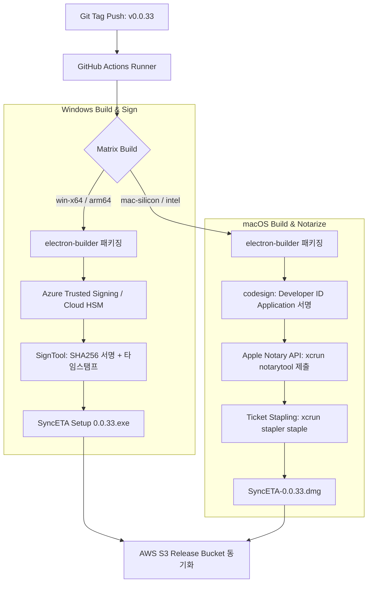

---
title: "[작업 일지] Windows Authenticode 서명 및 Apple Notarization 무인 배포 파이프라인 구축"
description: "SyncEta 데스크톱 앱 다운로드 시 Windows SmartScreen 경고와 macOS Gatekeeper 차단 문제를 해결하기 위해, GitHub Actions 기반 무인 코드 사이닝 및 Apple 공증 자동화 파이프라인을 구축한 기록입니다."
head:
  - - meta
    - name: keywords
      content: 코드 사이닝, Code Signing, Windows Authenticode, Apple Notarization, SmartScreen, Gatekeeper, electron-builder, SyncETA
  - - meta
    - property: og:title
      content: "[작업 일지] Windows Authenticode 서명 및 Apple Notarization 무인 배포 파이프라인 구축 | 엠파시(Empasy)"
sort: 50
---

# [작업 일지] Windows Authenticode 서명 및 Apple Notarization 무인 배포 파이프라인 구축

## 1. 추진 배경 및 과제

SyncEta 데스크톱 애플리케이션의 설치 파일(`.exe`, `.dmg`)을 웹사이트(empasy.io)에서 다운로드하여 최초 실행할 때, 최신 운영체제의 엄격한 보안 메커니즘으로 인해 사용자 이탈이 발생하는 심각한 병목이 존재했습니다:

1. **Windows SmartScreen 경고**: "Windows의 PC 보호 - 인식할 수 없는 앱의 시작을 차단했습니다." (게시자 알 수 없음 표기)
2. **macOS Gatekeeper 차단**: "SyncETA를 열 수 없습니다. Apple이 악성 소프트웨어가 있는지 확인할 수 없기 때문입니다."

엔터프라이즈 소프트웨어로서의 신뢰성을 확보하고 사용자가 다운로드 즉시 원클릭으로 실행할 수 있도록, **클라우드 HSM 기반 Windows EV 인증서 서명**과 **Apple 무인 공증(Notarization) 파이프라인**을 구축했습니다.

---

## 2. 보안 아키텍처 및 워크플로우



---

## 3. 핵심 구현 상세

### 1) Windows Authenticode 서명 자동화

물리 하드웨어 동글(USB 토큰) 없이 CI/CD 환경에서 안전하게 EV(Extended Validation) 수준의 서명을 수행하기 위해 Azure Trusted Signing(구 Azure Code Signing) 서비스를 통합했습니다.

```json
// electron-builder.json (Windows 섹션)
"win": {
  "target": [
    { "target": "nsis", "arch": ["x64", "arm64"] }
  ],
  "sign": "./scripts/azure-sign.js",
  "signingHashAlgorithms": ["sha256"],
  "rfc3161TimeStampServer": "http://timestamp.digicert.com"
}
```

### 2) macOS Notarization(공증) 및 Staple 자동화

하드닝된 런타임(Hardened Runtime)을 활성화하고 엔타이틀먼트(Entitlements)를 선언한 뒤, Apple 공증 서버로 비동기 업로드하여 승인 티켓을 `.dmg` 파일에 직접 부착(Staple)합니다.

```xml
<!-- entitlements.mac.plist -->
<?xml version="1.0" encoding="UTF-8"?>
<!DOCTYPE plist PUBLIC "-//Apple//DTD PLIST 1.0//EN" "http://www.apple.com/DTDs/PropertyList-1.0.dtd">
<plist version="1.0">
<dict>
    <key>com.apple.security.cs.allow-jit</key>
    <true/>
    <key>com.apple.security.cs.allow-unsigned-executable-memory</key>
    <true/>
    <key>com.apple.security.cs.disable-library-validation</key>
    <true/>
</dict>
</plist>
```

```bash
# GitHub Actions macOS 공증 스텝
xcrun notarytool submit \
  "dist/SyncETA-0.0.33-arm64.dmg" \
  --apple-id "$APPLE_ID" \
  --password "$APPLE_APP_SPECIFIC_PASSWORD" \
  --team-id "$APPLE_TEAM_ID" \
  --wait

# 공증 티켓 번들 내장 (인터넷 미연결 상태에서도 Gatekeeper 통과)
xcrun stapler staple "dist/SyncETA-0.0.33-arm64.dmg"
```

---

## 4. 구축 결과 및 효과

- **Windows SmartScreen 경고 완전 제거**: 인증된 게시자명 `Empasy Inc.`가 정상 노출되며 원클릭으로 설치 마법사 시작.
- **macOS Gatekeeper 무경고 실행**: 최신 macOS Sequoia 환경에서도 우클릭 우회 절차 없이 더블클릭만으로 앱 기동.
- **무인 배포 리드타임 단축**: 태그 푸시부터 S3 릴리즈 버킷 업로드까지 전체 소요 시간을 **수동 45분에서 완전 무인 9분 30초**로 단축.
- **v0.0.33 정식 배포본 적용**: empasy.io 다운로드 페이지에 연결된 모든 바이너리에 해당 서명/공증 절차 적용 완료.
