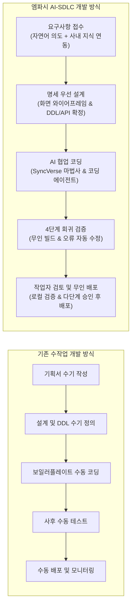
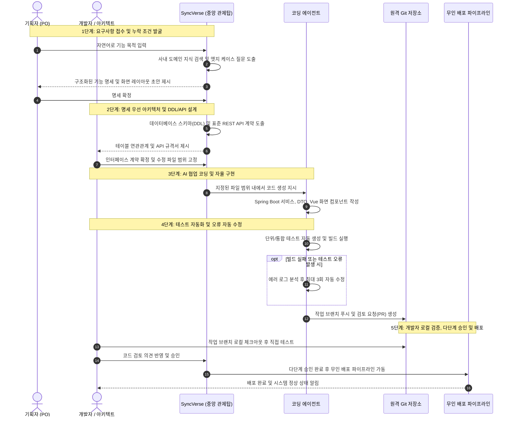

# 엠파시 AI 개발 생명주기 (Empasy AI-SDLC)

> **요약:** 엠파시 AI 개발 생명주기(Empasy AI-SDLC)는 비즈니스 요구사항 접수부터 아키텍처 설계, 코드 구현, 자동화 테스트, 작업자 승인 및 무인 배포에 이르는 전체 소프트웨어 개발 생명주기(SDLC)를 엔터프라이즈 오케스트레이션 도구인 **SyncVerse**와 **AI 에이전트**를 통해 체계적으로 조율하고 검증하는 실무 엔지니어링 방법론입니다.

::: tip 실전 단계별 가이드 바로가기
프로젝트 진행 시 필요한 단계의 실전 가이드와 프롬프트 예시를 바로 확인하실 수 있습니다:
* **[사업 전 주기 운영 방법론 (RFP to Go-Live)](./enterprise-project-lifecycle.md)**: 제안부터 오픈까지 엔드투엔드 조직 운영
* **[단계별 실행 항목 및 실무 실행 가이드 (SOP)](./enterprise-action-items-guide.md)**: 단계별 구체적 Action Item 및 절차
* **[영업 지원 및 제안 단계 실무 가이드 (Pre-sales)](./presales-ai-playbook.md)**: RFP 분석, PoC 데모 제작, 공수 산정
* **[01단계: 기획 및 요구사항 구체화 가이드](./ai-sdlc-01-requirements.md)** (기획자 / PO용)
* **[02단계: 명세 우선 아키텍처 및 DDL/API 설계 가이드](./ai-sdlc-02-architecture.md)** (아키텍트 / 리드 개발자용)
* **[03단계: AI 협업 코딩 및 자율 구현 가이드](./ai-sdlc-03-implementation.md)** (개발자용)
* **[04단계: 테스트 자동화 및 4단계 오류 자동 수정 가이드](./ai-sdlc-04-testing.md)** (QA / 개발자용)
* **[05단계: 코드 검토 및 무인 배포 가이드](./ai-sdlc-05-review-deploy.md)** (리뷰어 / 운영자용)
* **[부록: 상황별 실전 프롬프트 모음집](./ai-sdlc-prompt-recipes.md)** (전체 공통)
:::

---

## 1. 개요 및 정의

### 1.1. AI 기반 개발의 배경 및 필요성

#### 기존 소프트웨어 개발 방식의 한계
전통적인 폭포수(Waterfall) 및 애자일(Agile) 방식은 작업자의 수기 입력과 기억력에 크게 의존했습니다.
* **반복 작업의 피로도**: 데이터 모델 변환, 기본 CRUD 구현, 설정 파일 작성, 기초 단위 테스트 등 정형화된 작업에 많은 개발 시간이 쓰였습니다.
* **의사소통 과정의 의미 왜곡**: 기획자의 의도가 문서와 티켓을 거쳐 개발자에게 전달되는 과정에서 해석의 차이가 생겨 재작업이 발생하기 쉬웠습니다.
* **뒤늦은 결함 발견**: 개발 후반부나 배포 직전에야 인터페이스 불일치, 회귀 오류가 발견되어 수정 비용이 컸습니다.
* **문서와 코드의 불일치**: 릴리즈 일정을 맞추느라 코드는 바뀌지만 문서가 제때 갱신되지 못해 시스템 히스토리 파악이 어려워졌습니다.

#### 엠파시 AI-SDLC 도입 효과와 패러다임 전환
엠파시 AI-SDLC는 단순한 챗봇 도구를 넘어, 전체 개발 공정을 중앙에서 지휘하고 단계별 산출물을 교차 검증합니다. 중앙 오케스트레이션 도구인 SyncVerse를 활용하여, 개발자는 단순 반복 코딩에서 벗어나 시스템 구조 설계와 핵심 비즈니스 로직 검증에 집중할 수 있습니다.

| 비교 항목 | 기존 개발 방식 | 엠파시 AI-SDLC | 실무 기대 효과 |
| :--- | :--- | :--- | :--- |
| **요구사항 정의** | 수십 페이지의 정적 문서 작성 | 대화형 요구사항 구체화 및 명세 자동 정리 | 의사소통 해석 차이 축소 |
| **설계 방식** | 구현 도중 점진적 인터페이스 수정 | 데이터 모델(DDL) 및 API 계약 선행 확정 | 화면-서버 간 정합성 확보 |
| **코드 구현** | 개발자가 처음부터 수기로 파일 작성 | 프레임워크 표준 코드 자동 생성 및 AI 협업 | 기본 기능 개발 속도 향상 |
| **품질 검증** | 개발 완료 후 사후 수동 테스트 | 4단계 반복 빌드 검증 및 오류 자동 수정 루프 | 조기 결함 발견 및 안정성 증대 |
| **배포 및 관리** | 개발자 수동 배포 및 장애 추적 | 작업자 다단계 승인 후 무인 배포 및 롤백 | 배포 안정성 및 이력 통제 |

---

### 1.2. 목표 및 적용 범위

#### 핵심 목표
1. **개발 리드타임 단축**: 기획 단계의 아이디어를 프로덕션 배포 가능한 코드로 구현하는 전체 시간을 실질적으로 줄입니다.
2. **소프트웨어 품질 확보**: 코딩 전 명세를 선행 확정하고 4단계 회귀 검증을 거쳐 런타임 오류를 최소화합니다.
3. **표준 아키텍처 준수**: 사내 표준 라이브러리(Lombok, AgentScope Java 등)와 공통 프레임워크 규격을 일관되게 적용합니다.

#### 단계별 적용 범위
* **1단계 (도구 보조)**: 개발자가 IDE에서 코드 자동완성 및 단순 리팩토링 도구로 활용.
* **2단계 (기능 단위 자율화)**: SyncVerse 4단계 마법사를 활용하여 개별 기능의 명세 도출, 코드 변이, 빌드 검증을 통합 수행.
* **3단계 (전사 협업 생태계)**: 기획자, 개발자, QA, 운영자가 관제탑 아래에서 승인 결재선과 함께 전체 개발 공정을 운영.

---

### 1.3. 핵심 용어 정리

* **SyncVerse**: 전체 개발 및 운영 작업을 총괄 지휘하는 엠파시의 중앙 오케스트레이터 및 관제 시스템입니다.
* **AI 에이전트**: 주어진 목표를 달성하기 위해 파일 탐색, 코드 작성, 터미널 명령어 실행 등 필요한 도구를 순차적으로 실행하는 작업 주체입니다.
* **도메인 에이전트**: 각 업무 영역을 전담하는 전문 에이전트입니다 (SyncCMS: 콘텐츠, SyncShop: 이커머스, SyncBoot: 공통 백엔드, SyncLLM: AI 게이트웨이).
* **명세 우선 개발 (Spec-First)**: 코드를 작성하기 전에 데이터베이스 스키마와 API 입출력 규격을 먼저 확정하고 코딩을 시작하는 방식입니다.
* **인수 조건 (Acceptance Criteria)**: 기획한 기능이 정상적으로 구현되었는지 판단하는 구체적인 완료 기준입니다.
* **오류 자동 수정 (Auto Repair / Self-Healing)**: 빌드나 테스트 중 에러가 발생했을 때 에러 로그를 분석하여 AI가 코드를 스스로 고치고 다시 빌드하는 절차입니다.
* **작업자 승인 (Human-in-the-Loop)**: 데이터베이스 변경, 권한 변경, 운영 배포 등 위험도가 높은 작업에 대해 사람이 직접 내용을 확인하고 승인하도록 하는 안전 제어 장치입니다.

---

## 2. 엠파시 AI 개발 생명주기 5단계 흐름

엠파시 AI-SDLC 기반 개발 흐름은 **요구사항 접수 ➔ 명세 우선 설계 ➔ 구현 ➔ 4단계 검증 ➔ 검토 및 배포**로 이어집니다.

---

### 2.1. 1단계: 요구사항 분석 및 기획
* **목적**: 기획 의도를 명확히 정리하고 놓치기 쉬운 예외 상황을 사전에 발굴합니다.
* **주요 활동**:
  * 기획자가 기능의 배경과 목적을 자연어로 입력합니다.
  * SyncVerse가 사내 지식 기반(RAG)을 참조하여 누락된 예외 케이스(만료, 잔액 부족, 중복 요청 등)를 기획자에게 질문합니다.
  * 사용자 관점의 행동 완료 기준(Given-When-Then 형식)과 화면 와이어프레임을 확정합니다.
* **상세 실전 가이드**: [01단계: 기획 및 요구사항 구체화 가이드](./ai-sdlc-01-requirements.md)

---

### 2.2. 2단계: 명세 우선 아키텍처 설계
* **목적**: 코딩을 시작하기 전에 데이터 모델과 API 입출력 규격을 먼저 확정하여 서버와 화면 간의 불일치를 줄입니다.
* **주요 활동**:
  * PostgreSQL 17 기준의 6단계 DDL 스키마(`00_extensions.sql` ~ `05_sample_dev.sql`)를 작성합니다.
  * 임시 충돌 회피 구문(`ON CONFLICT`)을 배제하고 정확한 제약조건과 인덱스를 선언합니다.
  * 단일 매핑 원칙을 준수하는 표준 REST API 엔드포인트(`/api/v1/{domain}/{resource}`)를 선행 정의합니다.
* **상세 실전 가이드**: [02단계: 명세 우선 아키텍처 및 DDL/API 설계 가이드](./ai-sdlc-02-architecture.md)

---

### 2.3. 3단계: AI 협업 코딩 및 자율 구현
* **목적**: 전사 아키텍처 표준을 지키면서 신속하고 안전하게 소스코드를 작성합니다.
* **주요 활동**:
  * 수정할 파일 범위(`focusFiles`)를 명시하여 다른 소스코드에 부작용이 생기지 않도록 격리합니다.
  * 백엔드: Lombok 애너테이션 필수 적용, 단일 Canonical URL 매핑, AgentScope Java 도구 연동.
  * 프론트엔드: `BasicModal` 컴포넌트 분리, 데이터베이스 기반 동적 메뉴 라우팅 준수.
  * 가짜 더미 응답(Mock)을 배제하고 실제 데이터베이스와 정상 연동되도록 작성합니다.
* **상세 실전 가이드**: [03단계: AI 협업 코딩 및 자율 구현 가이드](./ai-sdlc-03-implementation.md)

---

### 2.4. 4단계: 테스트 자동화 및 4단계 회귀 검증
* **목적**: 작성된 코드가 문법, 인터페이스, 비즈니스 로직 측면에서 결함이 없는지 확인하고 오류 발생 시 스스로 수정합니다.
* **주요 활동**:
  * 예외 케이스를 포함한 단위 테스트(JUnit 5, Vitest)를 자동 생성합니다.
  * **4단계 검증 반복**:
    1. 소스코드 컴파일 검증
    2. API 및 DTO 인터페이스 일치성 검증
    3. 비즈니스 로직 단위/통합 테스트 검증
    4. 최종 클린 패키징 빌드 검증
  * 빌드 에러 발생 시 `autoRepairCode`를 통해 최대 3회까지 코드를 자동 수정합니다.
* **상세 실전 가이드**: [04단계: 테스트 자동화 및 4단계 오류 자동 수정 가이드](./ai-sdlc-04-testing.md)

---

### 2.5. 5단계: 코드 검토 및 안전한 배포
* **목적**: 사람이 직접 코드를 검증하고 다단계 승인 절차를 거쳐 안정적으로 배포합니다.
* **주요 활동**:
  * AI가 변경점(Git Diff)을 요약한 PR(Pull Request) 문서를 자동 작성합니다.
  * 개발자가 로컬 IDE에서 작업 브랜치를 체크아웃하여 직접 테스트하고 필요한 경우 인라인 피드백을 전달합니다.
  * 위험 작업에 대한 다단계 승인(`개발자` ➔ `QA` ➔ `관리자`)을 거칩니다.
  * 무인 배포를 진행하고, 설정 변경 건은 서버 재기동 없이 런타임에 동적으로 반영합니다.
* **상세 실전 가이드**: [05단계: 코드 검토 및 무인 배포 가이드](./ai-sdlc-05-review-deploy.md)

---

## 3. 실전 개발 도구 및 프롬프트 활용

개발 현장에서 바로 활용할 수 있는 프롬프트와 규칙 설정 파일은 별도 문서로 제공됩니다:
* **[상황별 실전 프롬프트 모음집 (치트시트)](./ai-sdlc-prompt-recipes.md)**: 기획, DDL 설계, 백엔드 서비스, 프론트엔드 모달, 단위 테스트, 디버깅 등 즉시 복사하여 사용할 수 있는 완성형 템플릿 제공.
* **IDE 공통 규칙 주입**: Cursor의 `.cursorrules` 및 GitHub Copilot의 `copilot-instructions.md` 파일에 전사 표준 규칙(Lombok 강제, 단일 URL 매핑, 모달 분리 등)을 설정하여 일관성을 유지합니다.

---

## 4. 도입 단계 및 성과 관리

### 단계별 도입 절차
1. **파일럿 운영 (1~2개월)**: 특정 개발팀을 선정하여 명세 우선 설계와 AI 페어 코딩을 시범 적용.
2. **프로세스 표준화 (3~4개월)**: 4단계 빌드 검증 및 오류 자동 수정 루프를 CI 환경에 결합.
3. **도메인 에이전트 연동 (5~6개월)**: SyncCMS, SyncShop 등 도메인별 전담 에이전트 활용 확장.
4. **전사 안착 (7개월 이후)**: 기획자부터 운영자까지 SyncVerse 기반으로 소통하는 자율 협업 프로세스 정착.

### 주요 측정 지표
* **개발 소요 시간**: 기능 기획부터 배포까지 걸리는 전체 리드타임 변화 추적.
* **초기 결함 발생률**: 배포 후 24시간 이내에 긴급 수정이 필요한 결함 수 측정.
* **테스트 커버리지**: 핵심 비즈니스 로직에 대한 자동화 테스트 코드 비율 점검.
* **재작업 비율**: 사양 불일치로 인해 설계를 다시 해야 하는 빈도 점검.
