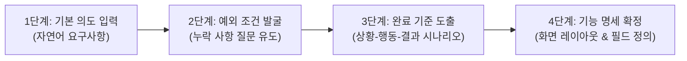

# [01단계] 기획 및 요구사항 구체화 실무 가이드

> **단계 요약:** 단순한 아이디어나 비즈니스 요청사항을 바탕으로, SyncVerse와 AI의 대화형 질의응답을 거쳐 **놓치기 쉬운 예외 상황, 명확한 완료 기준(인수 조건), 화면 레이아웃 와이어프레임이 정리된 '기능 명세서'**를 작성합니다.

---

## 1. 단계 목적 및 대상

* **주요 담당자**: 서비스 기획자, 제품 책임자(PO), 비즈니스 분석가
* **협업 대상**: 리드 개발자, UI/UX 디자이너
* **예상 소요 시간**: 기능당 30분 ~ 1시간 내외
* **활용 도구**: SyncVerse 요구사항 분석 마법사, 사내 도메인 지식 허브, AI 챗 도구

---

## 2. 시작 전 점검 사항 (시작 기준)

본 단계를 시작하기 전에 아래 사항을 확인합니다:
- 해결하고자 하는 문제나 고객의 불편 사항이 1~2문장으로 정리되어 있는가?
- 해당 기능이 속한 업무 영역(도메인)이 확인되었는가? (예: 주문, 결제, 회원, 콘텐츠 관리 등)
- 참고할 만한 사내 기존 화면이나 정책 문서가 준비되었는가?

---

## 3. 실무 수행 4단계 절차



### 1단계: 기본 의도 입력
기획자는 복잡한 양식 대신 만들고자 하는 기능의 목적과 핵심 흐름을 자연어로 간단히 입력합니다.
> 예시: *"우리 쇼핑몰 장바구니에 연말 할인 쿠폰 적용 기능을 넣고 싶습니다. 회원이 보유한 쿠폰 중 1개를 선택하여 주문 금액을 할인받는 방식입니다."*

### 2단계: 예외 조건 및 누락 사항 역질문
기획자가 미처 고려하지 못했을 수 있는 비즈니스 및 기술적 예외 상황을 AI가 먼저 질문하도록 유도합니다.
* 예: *"쿠폰 할인 금액이 장바구니 결제 총액보다 클 때 남은 차액은 소멸되나요, 아니면 다음 주문에 쓸 수 있나요?"*
* 예: *"결제 진행 도중 취소했을 때 해당 쿠폰은 즉시 복구되어 다시 쓸 수 있어야 하나요?"*

### 3단계: 상황별 완료 기준(인수 조건) 도출
질문과 답변을 바탕으로 기획자, 개발자, QA가 공통으로 이해할 수 있는 행동 기준(Given-When-Then: 사전조건-사용자행동-시스템반응)을 작성합니다.

### 4단계: 기능 명세서 및 화면 레이아웃 확정
입출력 데이터 항목, 유효성 검증 규칙, 텍스트 형태의 화면 배치도를 마크다운 문서로 정리하여 Jira 티켓이나 작업 관리 도구에 첨부합니다.

---

## 4. 실무 프롬프트 예시 (복사하여 사용)

### 프롬프트 1: 예외 상황 및 누락 조건 발굴
```markdown
[역할] IT 서비스 수석 기획자이자 비즈니스 분석가
[맥락] 전자상거래 플랫폼에서 신규 기능의 요구사항을 정의하고 있습니다.
[기획 아이디어]
"{{기획하고자 하는 기능의 핵심 내용을 2~3줄로 입력하세요}}"

[요청 사항]
위 아이디어를 바탕으로, 개발 착수 전에 사전에 결정해야 하는 예외 상황과 엣지 케이스 5가지를 질문 형식으로 제시해 주세요.
- 결제/취소/환불 시 정책
- 최소 주문 금액 및 최대 할인 한도 경계 조건
- 유효기간 만료 및 다중 기기 중복 사용 시도
- 다른 혜택(포인트, 제휴 할인 등)과의 중복 적용 규칙
```

---

### 프롬프트 2: 상황별 완료 기준(인수 조건) 작성
```markdown
[역할] 요구사항 분석 및 테스트 설계 전문가
[맥락] 아래 기능 개요와 결정 사항을 바탕으로 QA 검증이 가능한 완료 기준(Acceptance Criteria)을 작성해 주세요.
[기능 개요]
- 기능명: {{기능명}}
- 확정된 정책: {{사전 질문을 통해 결정된 핵심 정책 내용}}

[출력 형식]
사용자 시나리오별로 아래 형식을 적용해 주세요:
- 시나리오 1: 정상 흐름 (정상적인 쿠폰 적용)
  - 사전 조건 (Given):
  - 사용자 행동 (When):
  - 시스템 반응 (Then):
- 시나리오 2: 유효하지 않은 입력값 (조건 미달)
- 시나리오 3: 잔액 부족 또는 유효기간 만료
- 시나리오 4: 중복 요청 및 동시성 오류 처리
```

---

### 프롬프트 3: 마크다운 기능 명세서 및 화면 배치도 정리
```markdown
[역할] 개발팀과 협업하는 테크니컬 기획자
[입력 데이터]
{{앞서 확정된 사용자 시나리오 및 완료 기준 내용}}

[요청 사항]
개발팀과 디자이너가 즉시 참조할 수 있도록 아래 마크다운 서식으로 기능 명세서를 완성해 주세요:
1. 기능 개요 및 목적
2. 화면 배치 와이어프레임 (마크다운 표 또는 텍스트 배치도)
3. 화면 입력 필드 정의 (필드명, 데이터 형태, 필수 여부, 안내 문구)
4. 백엔드 연동에 필요한 데이터 항목 목록
```

---

## 5. 자주 발생하는 실수 및 유의 사항

| 실수 유형 | 흔한 문제점 | 권장 대응 방안 |
| :--- | :--- | :--- |
| **모호한 형용사 사용** | "빠르게 로딩된다", "적절한 오류 메시지를 보여준다" 등 측정하기 어려운 표현 작성 | 구체적인 수치(200ms 이내)나 확정된 안내 문구("유효기간이 만료된 쿠폰입니다")를 명시합니다. |
| **기획 단계에서 인프라 강제** | "Redis에 캐시하고 Kafka로 토픽 발행" 등 구현 기술을 기획서에 선언 | 특정 기술 이름 대신 '사용자가 겪는 화면 반응과 비즈니스 결과'에 집중하여 서술합니다. |
| **보안 및 예외 기준 누락** | 정상 작동 흐름만 작성하고 개인정보 노출, 동시 요청 처리 누락 | 개인정보 마스킹 기준, 중복 클릭 방지 규칙을 필수 항목으로 함께 점검합니다. |

---

## 6. 단계 완료 점검 체크리스트 (종료 기준)

다음 단계인 **[02단계: 명세 우선 아키텍처 설계]**로 넘어가기 위해 아래 항목을 확인합니다:
- [ ] 핵심 사용자 시나리오와 완료 기준이 정리되었는가?
- [ ] 만료, 잔액 부족, 중복 호출 등 주요 예외 상황에 대한 처리가 정의되었는가?
- [ ] 사용자에게 노출될 오류 안내 문구가 정해졌는가?
- [ ] 기획자와 개발 리드가 기능 명세 내용에 대해 상호 검토를 마쳤는가?
