# [04단계] 테스트 자동화 및 4단계 오류 자동 수정 실무 가이드

> **단계 요약:** 작성된 코드에 대해 **단위 및 통합 테스트를 자동 생성**하고, 사내 표준인 **4단계 회귀 검증(컴파일 ➔ 인터페이스 ➔ 로직 ➔ 클린 빌드)**을 수행하며, 오류 발생 시 AI가 에러 로그를 분석해 코드를 고치는 **오류 자동 수정(autoRepairCode)**을 진행합니다.

---

## 1. 단계 목적 및 대상

* **주요 담당자**: QA 엔지니어, 소프트웨어 테스트 담당자, 백엔드/프론트엔드 개발자
* **협업 대상**: 시스템 아키텍트, 배포 관리자
* **예상 소요 시간**: 기능당 30분 ~ 45분 내외
* **활용 도구**: Maven / Gradle, JUnit 5, MockMvc, Vitest, SyncVerse 자가 치유 엔진

---

## 2. 시작 전 점검 사항 (시작 기준)

본 단계를 시작하기 전에 아래 사항을 확인합니다:
- [03단계] 코드 구현이 완료되고 로컬 컴파일이 1차 통과되었는가?
- [01단계] 기능 명세서의 시나리오별 완료 기준(인수 조건)이 확인되었는가?
- 테스트용 데이터베이스 또는 테스트 컨테이너 환경이 준비되었는가?

---

## 3. 실무 수행 4단계 검증 및 오류 자동 수정 절차

```mermaid
flowchart TD
    Start["03단계 구현 코드 인입"] --> C1["[1단계] 소스코드 컴파일 검증<br/>(mvn compile / test-compile)"]
    
    C1 -->|컴파일 성공| C2["[2단계] 인터페이스 일치성 검증<br/>(OpenAPI 명세 vs DTO 일치 확인)"]
    C2 -->|정합성 확인| C3["[3단계] 예외 케이스 단위 테스트<br/>(JUnit 5 / Vitest 실행)"]
    C3 -->|테스트 통과| C4["[4단계] 최종 클린 패키징 검증<br/>(mvn clean package)"]
    C4 --> Done["05단계 코드 검토로 이동"]

    C1 -->|빌드 에러 발생| Repair{"오류 자동 수정<br/>(autoRepairCode)<br/>최대 재시도: 3회"}
    C2 -->|인터페이스 불일치| Repair
    C3 -->|테스트 실패| Repair
    C4 -->|패키징 실패| Repair

    Repair -->|수정 성공 시 재검증| C1
    Repair -->|3회 초과 실패 시| HITL["작업자 직접 개입 안내<br/>(개발자 직접 확인)"]
```



### [1단계] 소스코드 컴파일 검증
* `mvn compile` 및 `mvn test-compile` (프론트엔드는 `npm run build` / 타입 점검)을 실행하여 기본 문법 오류와 타입 불일치를 1차 확인합니다.

### [2단계] 인터페이스 일치성 검증
* 02단계에서 선행 정의된 OpenAPI 규격과 실제 DTO 필드명, HTTP 응답 구조가 일치하는지 점검합니다.

### [3단계] 예외 케이스 및 회귀 단위 테스트
* 정상 작동 케이스 외에, 기획서에 명시된 예외 상황(유효기간 만료, 잔액 부족, 중복 요청 등)에 대해 단위 테스트를 수행합니다.

### [4단계] 최종 클린 패키징 검증
* 이전 빌드 캐시를 지우고 `mvn clean package`를 실행하여 배포 파일(JAR)이 정상적으로 묶이는지 확인합니다.

### 오류 자동 수정 루프 (autoRepairCode)
* 검증 중 에러가 발생하면, 시스템이 에러 로그를 분석하여 원인을 파악하고 코드를 스스로 수정합니다.
* 무한 루프를 방지하기 위해 최대 3회까지 자동 수정을 시도하며, 3회 초과 시 작업을 안전하게 멈추고 개발자에게 확인을 요청합니다.

---

## 4. 실무 프롬프트 예시 (복사하여 사용)

### 프롬프트 1: 예외 케이스 단위 테스트(JUnit 5) 자동 생성
```markdown
[역할] 시니어 QA 엔지니어 겸 백엔드 테스트 전문가
[맥락] 아래 비즈니스 서비스 코드에 대해 JUnit 5 기반의 단위 테스트 클래스를 작성해 주세요.
[테스트 대상 코드]
{{03단계에서 작성한 Service 또는 Controller 소스코드}}
[완료 기준]
{{01단계에서 도출한 상황-행동-결과 시나리오}}

[작성 규칙]
1. 정상 작동 케이스 외에 아래 예외 상황을 개별 @Test 메서드로 작성해 주세요:
   - 만료된 쿠폰 적용 시도 ➔ 적절한 비즈니스 예외 발생 검증
   - 최소 주문 금액 미달 시도 ➔ 검증 실패 예외 발생 확인
   - 존재하지 않는 ID 전달 시 ➔ 리소스 없음 예외 확인
   - 동일 회원의 동시 중복 적용 시도 ➔ 중복 차단 검증
2. AssertJ(assertThat, assertThatThrownBy)를 사용하여 가독성 높은 단언문을 작성해 주세요.
3. @DisplayName에 한글로 테스트 목적을 명확히 적어주세요.
```

---

### 프롬프트 2: 빌드 에러 자동 수정 (autoRepairCode)
```markdown
[역할] 소프트웨어 디버깅 및 오류 수정 에이전트
[맥락]
빌드 검증 도중 아래와 같은 컴파일 또는 테스트 오류가 발생했습니다. 기존 비즈니스 정책을 유지하면서 오류를 수정해 주세요.

[오류 로그]
{{빌드 에러 스택 트레이스 내용}}

[오류 발생 소스코드]
{{해당 파일 소스코드 내용}}

[작성 규칙]
1. 원인 분석: 에러의 핵심 원인을 2줄 이내로 요약해 주세요.
2. 부작용 점검: 수정으로 인해 다른 부분에 영향이 없는지 확인해 주세요.
3. 교체 코드: 해당 소스코드 전체를 바로 교체할 수 있는 형태로 작성해 주세요.
   - [주의] 에러 해결을 위해 필수 유효성 검증문(if문)을 임의로 삭제하지 마세요.
   - [주의] 메서드 내부를 빈칸(// TODO)으로 남겨두지 마세요.
```

---

## 5. 자주 발생하는 실수 및 유의 사항

| 실수 유형 | 흔한 문제점 | 권장 대응 방안 |
| :--- | :--- | :--- |
| **단언문(assert) 없는 테스트** | 메서드만 실행하고 결과 검증이 없어 무조건 성공하는 가짜 테스트 작성 | 테스트 메서드마다 최소 2개 이상의 결과 단언문(assertThat)을 포함하도록 합니다. |
| **검증 로직 임의 삭제** | 테스트 통과만을 위해 서비스의 필수 유효성 검사문을 지워버림 | 오류 수정 시 비즈니스 검증문은 유지한 채 타입이나 파라미터를 맞추도록 안내합니다. |
| **무한 수정 시도** | 오류가 계속 발생하는데도 무한정 재빌드를 시도하여 시간 낭비 | 최대 재시도 횟수를 3회로 제한하고, 초과 시 개발자가 직접 개입하도록 합니다. |

---

## 6. 단계 완료 점검 체크리스트 (종료 기준)

다음 단계인 **[05단계: 코드 검토 및 배포]**로 넘어가기 위해 아래 항목을 확인합니다:
- [ ] 4단계 검증(컴파일, 인터페이스, 단위테스트, 클린패키징)이 모두 정상 통과되었는가?
- [ ] 주요 예외 상황에 대한 단위 테스트가 작성되고 정상 실행되는가?
- [ ] 오류 자동 수정이 동작했다면, 수정된 코드가 원래 기획 의도를 해치지 않았는가?
- [ ] 빌드된 산출물(JAR 등)이 정상적으로 패키징되는가?
