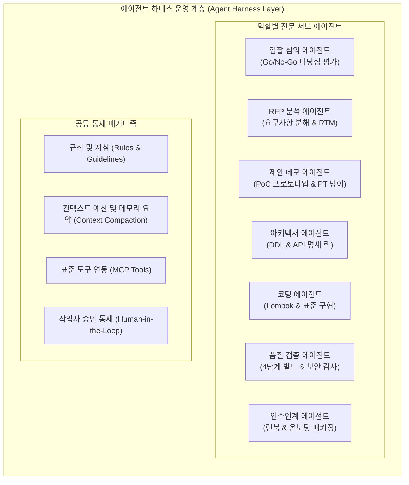
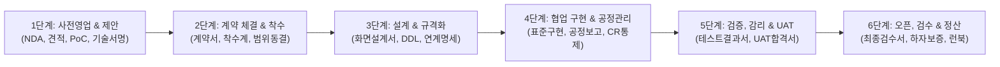
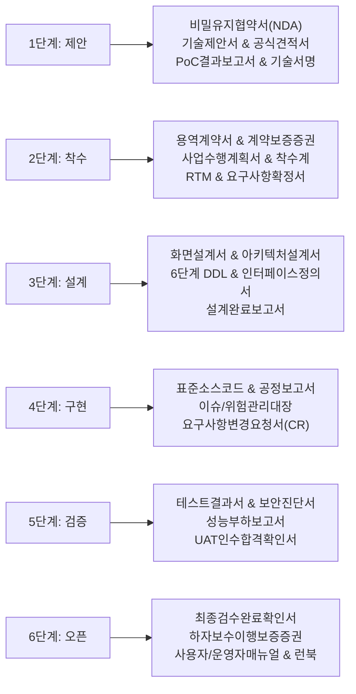

# 엠파시 사업 및 개발 방법론

> **개요:** 본 방법론은 소프트웨어 사업의 출발점인 **제안요청서(RFP) 분석 및 영업 지원(Pre-sales)**부터 **계약 체결, 프로젝트 착수, 명세 우선 아키텍처 설계, 에이전트 협업 구현, 품질 검증 및 감리, 프로덕션 오픈, 최종 검수 서명, 잔금 회수 및 하자보수**에 이르는 전 생애주기를 체계화한 엠파시 표준 엔터프라이즈 사업 운영 및 개발 방법론입니다.

::: tip 관련 실무 가이드 바로가기
* **[엠파시 사업 및 프로젝트 관리 표준 문서 양식 통합 다운로드 센터](./enterprise-document-templates.md)**: 엠파시 표준 서식 46종 및 실전 프로젝트 관리 스위트(PM Suite) 76종 등 총 122종 템플릿 및 통합 다운로드
* **[사업 전 주기 표준 문서 체계 및 납품·관리 실무 가이드](./enterprise-business-documents.md)**: 계약, 행정, 설계, 검수, 대금 청구 문서 표준
* **[단계별 실행 항목 및 실무 실행 가이드 (SOP)](./enterprise-action-items-guide.md)**: 단계별 구체적 Action Item 및 절차
* **[영업 지원 및 제안 단계 실무 가이드 (Pre-sales)](./presales-ai-playbook.md)**: RFP 분석, 제안서 작성, PoC 데모 제작, 공수 산정
* **[SyncVerse 기반 AI 개발 생명주기 개요 (AI-SDLC)](./ai-driven-development.md)**: 5단계 개발 프로세스 상세
* **[상황별 실전 프롬프트 모음집](./ai-sdlc-prompt-recipes.md)**: 실무 단계별 즉시 복사 템플릿
:::

---

## 1. 배경 및 조직 운영의 지향점

### 1.1. 기존 소프트웨어 사업 운영의 한계
전통적인 IT 서비스 및 SI(시스템 통합) 환경에서는 영업 조직과 개발 조직 사이에 구조적인 병목이 반복되어 왔습니다:
1. **영업 지원 단계의 개발 리소스 소진**:
   - 수백 페이지 분량의 RFP가 접수되면, 기술 제안서 작성과 공수 견적을 산정하기 위해 시니어 개발자가 차출되어 기존 프로젝트 일정에 차질이 발생했습니다.
2. **부정확한 공수 산정과 프로젝트 부실화**:
   - 제안 마감 일정에 쫓겨 경험에 의존한 대략적인 공수(Man-Month)를 산정하면서, 수주 후 개발 단계에서 추가 요구사항과 잦은 설계 변경으로 적자가 발생하기 쉬웠습니다.
3. **제안과 실제 구현의 괴리**:
   - 제안서에 명시된 아키텍처와 실제 프로젝트 투입 인력의 구현 방식이 달라, 프로젝트 초기 수주 후 1~2개월 동안 사양을 다시 정의하느라 시간을 낭비했습니다.
4. **오픈 단계의 문서 부채와 인수인계 혼선**:
   - 개발 납기를 맞추느라 소스코드만 변경되고 아키텍처 문서와 테이블 정의서가 갱신되지 못해, 고객사 운영 이관 시 불필요한 마찰이 발생했습니다.

### 1.2. 목표: 개발과 영업의 상호 시너지 극대화
본 방법론의 핵심 목표는 두 가지입니다:
* **효율적인 영업 지원**: 개발 조직이 과도한 수작업 부담 없이, AI 하네스를 활용하여 RFP를 1시간 내에 분석하고 핵심 데모 프로토타입(PoC)을 신속히 만들어 수주 경쟁력을 높입니다.
* **높은 생산성과 품질 확보**: 제안 단계에서 도출된 기술 스펙을 개발 단계로 유기적으로 연계하고, 명세 우선 개발과 4단계 무인 회귀 검증을 통해 프로젝트를 안정적으로 오픈합니다.

---

## 2. 에이전트 하네스(Agent Harness) 아키텍처의 접목 원리

본 방법론은 오픈소스 **ECC(Everything Claude Code)** 및 **SyncVerse 4-Tier 아키텍처**의 핵심 설계 원리를 조직 운영에 맞게 응용합니다.

### 핵심 접목 요소
1. **역할별 전문 서브 에이전트 분업**:
   - 한 에이전트에게 전체 사업을 맡기지 않고, 입찰 심의, 제안 지원, 명세 도출, 단위 코딩, 보안 감사, 인수인계 등 단계별 전담 에이전트를 지정하여 업무 정확도를 높입니다.
2. **컨텍스트 예산 관리 (Context Budgeting & Compaction)**:
   - 방대한 RFP 문서나 프로젝트 전체 코드를 무작정 주입하여 발생하는 기억 공간 초과 및 환각(Hallucination)을 막기 위해, 단계별 요약본(Summary)과 수정 대상 파일(`focusFiles`)만 선별하여 처리합니다.
3. **규칙(Rules)과 사전 검증의 자동화**:
   - 개발 단계마다 정해진 전사 표준(단일 Canonical URL, Lombok 적용, 순수 INSERT 구문 준수 등)을 프로젝트 규칙으로 주입하여 사람이 일일이 감시하지 않아도 일관된 코드가 나오도록 유도합니다.
4. **표준 도구 연동 (MCP Protocols)**:
   - Git 저장소, 사내 지식 기반 RAG, 데이터베이스 스키마 조회, Jira 일감 관리 등을 에이전트가 직접 호출하여 작업 단계를 신속하게 처리합니다.

---

## 3. 사업 전 주기 6단계 라이프사이클

사업 수주부터 최종 대금 정산 및 유지보수에 이르는 전 과정을 6개 단계로 구분하여 운영합니다:

---

### 1단계: 사전영업 및 제안 지원 (Pre-sales & Proposal)
* **목표**: 고객사 내부 정보 유출을 차단한 상태에서 기술 제안서의 완성도를 높이고 실증 데모(PoC)와 원가 산정을 통해 수주 경쟁력을 확보합니다.
* **주요 활동**:
  * **비밀유지협약서(NDA) 선행 체결**: 고객사 제안요청서 상세 자료나 원천 데이터를 수령하기 전, 양사 간 비밀유지 계약을 체결하여 법적 리스크를 예방합니다.
  * **입찰 참여 타당성 심의 (Go / No-Go)**: 기술 적합도, 납기, 수익성, 리스크를 사전에 평가하여 승산과 마진이 있는 사업에 리소스를 집중합니다.
  * **RFP 자동 분석 및 기술 제안서 작성**: 수백 페이지의 고객사 제안요청서를 분석하여 아키텍처 구성도, 보안 전략, 수행 계획을 수립합니다.
  * **영업 시연용 PoC 데모 제작 및 결과보고서 작성**: 핵심 요구 화면 1~2개를 동작 가능한 프로토타입으로 제작하고 기술검증 결과보고서를 정리합니다.
  * **공식 견적서 및 원가계산서 산정**: M/M 공수 외에 인프라, 솔루션 라이선스, 토큰 비용을 통합 산정하고 적정 마진을 반영합니다.
  * **입찰 참가 서류 준비**: 법인인감, 국세/지방세 완납증명서, 신용평가등급서, 실적증명원, 입찰보증보험증권을 발급받습니다.
  * **기술적 수행 가능성 사전 서명 (Technical Sign-off)**: 제안서 제출 전 개발 리드가 기술적 실현 가능성을 최종 확인하고 서명합니다.
* **핵심 산출물**: 비밀유지협약서(NDA), 입찰 타당성 심의표, 기술 제안서, 공식 견적서 및 원가계산서, PoC 결과보고서, 입찰 참가 자격 서류 일체, 기술 서명서
* **상세 가이드**: [영업 지원 및 제안 단계 실무 가이드](./presales-ai-playbook.md), [사업 전 주기 표준 문서 체계 가이드](./enterprise-business-documents.md)

---

### 2단계: 계약 체결 및 착수 (Contract, Initiation & Scope Locking)
* **목표**: 공식 계약을 체결하고 수행 조직을 구성하며, 고객사와 사업 범위를 명확히 합의하여 향후 분쟁을 사전에 방지합니다.
* **주요 활동**:
  * **용역 표준 계약 체결 및 보증보험 발급**: 대금 조건(선금, 중도금, 잔금), 지체상금율, 하자보수 기간을 명시한 본계약을 체결하고 계약이행보증보험증권을 발행합니다.
  * **사업수행계획서(PMP) 및 착수계 제출**: 투입 인력 명단, 조직도, 추진 일정표, 보안 관리 계획을 수립하여 착수 보고회를 진행합니다.
  * **투입 인력 보안서약서 징구**: 프로젝트 참여 인원 전원의 보안서약서 및 개인정보 수집 동의서를 고객사에 제출합니다.
  * **요구사항 추적 매트릭스(RTM) 확정**: 제안 기능 목록을 구조화하여 수용 기준을 정의합니다.
  * **업무 예외 정책 선제 발굴**: 누락되기 쉬운 업무 정책과 예외 조건을 사전에 인터뷰하여 문서화합니다.
  * **요구사항 변경 관리(CR) 거버넌스 수립**: 추가 요구 발생 시 공수/일정 연동 절차를 고객사와 사전 합의합니다.
  * **레거시 데이터 마이그레이션 조기 실증**: 착수 초기에 기존 DB 샘플 데이터를 변환하여 결측치와 정제 요구를 조기에 파악합니다.
  * **요구사항 확정 합의서 서명 (Sign-off)**: 분석 완료 시점에 양사 책임자 서명으로 개발 범위를 동결(Freeze)합니다.
* **핵심 산출물**: 용역 표준 계약서, 계약이행보증보험증권, 사업수행계획서, 착수계, 보안서약서 일체, 요구사항 정의서 및 RTM, WBS 일정표, 레거시 데이터 이관 조기 실증서, **요구사항 확정 합의서 (Sign-off)**

---

### 3단계: 명세 및 화면 설계 (Design & Spec-First Architecture)
* **목표**: 현업 승인용 화면 설계서와 백엔드 DB/API 명세를 선행 확정하여 서버와 화면 개발의 병목을 없앱니다.
* **주요 활동**:
  * **화면 설계서 (UI/UX 스토리보드) 작성 및 고객 승인**: 전체 메뉴 구조, 와이어프레임, 인터랙션 규칙을 작성하여 현업 부서의 공식 승인을 받습니다.
  * **시스템 아키텍처 설계서 (SAD) 및 네트워크 구성도 수립**: 서버 사양, 망분리 구간, 방화벽 포트 오픈 목록을 고객사 인프라팀과 합의합니다.
  * **PostgreSQL 표준 DDL 스키마 작성**: 6단계 스키마 구조(`00_extensions.sql`~`05_sample_dev.sql`)로 테이블, 인덱스, 외래키를 정의합니다.
  * **단일 Canonical REST API 규격 확정**: OpenAPI 3.0 규격을 선행 정의하고 `/api/v1/{domain}/{resource}` 표준 경로로 통일합니다.
  * **외부 연계 시스템 가상화(Mock Server) 선행 구축**: 대외계 연동망이 열리기 전까지 내부 개발이 중단되지 않도록 가상화 연계 서버를 기동합니다.
  * **설계 단계 완료 보고서 및 승인서 체결**: 화면과 아키텍처 설계를 잠그고 구현 단계 진입을 합의합니다.
* **핵심 산출물**: **화면 설계서 (UI/UX 스토리보드)**, 시스템 아키텍처 설계서(SAD) 및 구성도, 6단계 DDL 스키마 정의서 및 ERD, 인터페이스 정의서(API 명세서), 외부 연계 Mock 서버, **설계 단계 완료 보고서 및 승인서**
* **상세 가이드**: [02단계: 명세 우선 아키텍처 가이드](./ai-sdlc-02-architecture.md)

---

### 4단계: 협업 구현 및 공정 관리 (Implementation & Progress Control)
* **목표**: 표준 코드를 신속히 구현하면서, 정례 공정 보고와 변경 통제를 통해 일정과 예산을 관리합니다.
* **주요 활동**:
  * **작업 범위 한정 (`focusFiles`) 기반 표준 코딩**: 단위 작업마다 수정 파일 목록을 명시적으로 잠가 사이드이펙트를 차단하고 Lombok 및 프론트 모달 분리 표준을 준수합니다.
  * **실제 데이터베이스 연동 구현**: 임시 Mock 데이터를 배제하고 실제 로컬 데이터베이스와 통신하는 완전한 코드를 구현합니다.
  * **주간 및 월간 업무 보고**: 계획 대비 실적 공정률(Plan vs Actual), 금주 완료 및 차주 계획을 정기 보고합니다.
  * **이슈 및 위험 관리대장 운영**: 외부 연계 지연이나 의사결정 지연 이슈를 추적하고 대책을 수립합니다.
  * **요구사항 변경 요청서 (CR Form) 관리**: 추가 요구 발생 시 AI 영향도 분석을 거쳐 공수 추가 또는 납기 연장을 서면 승인받습니다.
  * **중간 보고서 및 기성 검수 신청 (해당 시)**: 중도금 지급 조건 도래 시 중간 성과를 검수받고 기성금을 청구합니다.
* **핵심 산출물**: 표준 준수 소스코드, 주간/월간 업무 보고서, 공정률 현황표, 이슈 및 위험 관리대장, 요구사항 변경 요청서(CR Form) 및 관리대장, 기성 검수 신청서
* **상세 가이드**: [03단계: AI 협업 코딩 가이드](./ai-sdlc-03-implementation.md)

---

### 5단계: 품질 검증, 보안 및 감리 (Verification, Security & Audit)
* **목표**: 4단계 회귀 검증과 보안 감사를 거치고 고객 사용자 인수 테스트(UAT) 및 외부 감리를 합격으로 마칩니다.
* **주요 활동**:
  * **4단계 무인 회귀 검증**: 컴파일 ➔ 인터페이스 일치 ➔ 단위/통합 테스트 ➔ 패키징 검증을 반복하며 빌드 오류를 자동 수정합니다.
  * **시큐어 코딩 및 보안 감사 통과**: 정적 코드 분석, 웹 취약점 진단, 오픈소스 라이선스 검증, 개인정보 암호화 점검을 완료합니다.
  * **성능 부하 테스트 수행**: 목표 동시 접속자 수 및 응답 지연 임계치 충족 여부를 측정하고 APM 보고서를 작성합니다.
  * **사용자 인수 테스트(UAT) 시연 및 승인**: 고객 현업 담당자가 실제 업무 시나리오를 수행하여 결함 여부를 확인하고 합격 서명을 날인합니다.
  * **3자 감리 지적사항 조치 (해당 시)**: 공공 및 대형 사업의 필수 절차인 외부 전문 감리단의 지적사항을 조치 완료합니다.
* **핵심 산출물**: 테스트 계획서 및 시나리오 명세서, 단위/통합 테스트 결과보고서, 결함 조치 대장, 성능 부하 테스트 결과보고서, 시큐어 코딩/보안 진단 결과서, **사용자 인수 테스트(UAT) 합격 확인서**, 3자 감리 조치 결과서
* **상세 가이드**: [04단계: 테스트 및 자동 수정 가이드](./ai-sdlc-04-testing.md)

---

### 6단계: 오픈, 인수인계 및 정산 (Go-Live, Handover & Close-out)
* **목표**: 안정적으로 서비스를 오픈하고 운영 권한을 인계하며, 최종 검수를 통해 대금 회수와 하자보수 체계를 확립합니다.
* **주요 활동**:
  * **배포 계획 수립 및 롤백 절차 준비**: 오픈 당일 시간대별 작업 순서, 데이터 동기화, 비상 롤백 기준을 마련하여 무인 배포를 실행합니다.
  * **최종 데이터 이관 및 검증**: 레거시 데이터 전체 정합성을 실증하고 건수 일치 여부를 고객사와 교차 검증합니다.
  * **사용자 및 관리자 매뉴얼 이관**: 일반 사용자용 매뉴얼과 시스템 운영자용 관리 매뉴얼을 분리하여 제공합니다.
  * **고객사 교육 및 인수인계 완료**: 현업 및 운영팀 대상 교육을 실시하고 관리자 계정/비밀번호와 시스템 권한을 인계합니다.
  * **사업 완료 보고서 및 최종 검수 요청**: 전체 사업 수행 결과를 보고하고 고객사 공식 직인이 날인된 **검수 완료 확인서**를 획득합니다.
  * **세금계산서 발행 및 잔금 회수**: 검수 완료 확인서를 근거로 최종 대금을 청구합니다.
  * **하자보수 이행보증보험증권 발급 및 계획서 제출**: 1년간의 무상 하자보수 의무를 담보하는 보증서를 제출하고 접수 창구를 안내합니다.
  * **유지보수 계약서 초안 (SLA) 제안**: 1년 무상 보증 이후 유상 운영 계약으로 전환하기 위한 SLA 조건을 협의합니다.
  * **프로젝트 종료 회고 및 원가 정산**: 당초 예산 대비 실제 투입 비용과 마진을 결산(P&L)하고 차기 프로젝트를 위한 교훈을 정리합니다.
* **핵심 산출물**: 배포 계획서 및 비상 롤백 절차서, 최종 데이터 이관 검증서, 사용자 매뉴얼, 관리자 매뉴얼, 교육 결과보고서 및 인수인계 확인서, 시스템 운영 런북, **사업 완료 보고서 및 최종 검수 완료 확인서**, **하자보수 이행보증보험증권**, 하자보수 계획서, 유지보수 계약서 초안, 프로젝트 종료 회고록 및 원가 정산서
* **상세 가이드**: [05단계: 코드 검토 및 배포 가이드](./ai-sdlc-05-review-deploy.md), [사업 전 주기 표준 문서 체계 가이드](./enterprise-business-documents.md)

---

## 4. 조직 간 역할 분담 (RACI 매트릭스)

사업 단계별 주요 조직의 책임과 역할을 명확히 규정합니다:

| 사업 단계 | 영업 / 경영지원 | 프리세일즈 (기술지원) | 아키텍트 / 리드 개발자 | 개발 / QA 팀 | 고객사 / 현업 |
| :--- | :---: | :---: | :---: | :---: | :---: |
| **0. 사전영업 & 제안** | **A (수주/견적 책임)** | **R (제안/PoC 작성)** | **A (기술 서명)** | C (공수 자문) | I (RFP 발행) |
| **1. 계약 & 착수** | **A (계약/보증보험)** | I | **A (범위 승인)** | **R (수행계획/RTM)** | **A (계약/착수 승인)** |
| **2. 설계 & 규격화** | I | I | **A / R (화면/DDL/API 확정)** | R (Mock 구축) | **A (화면/설계 승인)** |
| **3. 구현 & 공정관리** | C (기성 청구) | I | C (코드/설계 검토) | **A / R (구현/보고서)** | C (주간보고 수령) |
| **4. 검증 & UAT** | I | I | C (보안/감리 점검) | **R (테스트 수행)** | **A (UAT 합격 서명)** |
| **5. 오픈 & 검수/정산** | **A (검수/수금/보증)** | I | **A (배포/런북 승인)** | **R (인수인계/교육)** | **A (최종 검수 서명)** |

*(R: 실제 수행, A: 최종 승인 및 책임, C: 자문 및 검토, I: 진행 상황 통보)*

---

### 4.1. 8대 핵심 역할별 실무 책임 및 방법론 활용 가이드

본 방법론은 특정 개발 부서에만 국한되지 않고, 사업에 참여하는 8대 핵심 역할이 각자의 자리에서 리스크를 방어하고 성과를 달성할 수 있도록 구체적인 실무 무기를 제공합니다.

#### 1) 영업대표 및 사업본부장 (Sales & Business Leadership)
* **주요 고민**: "승산 없는 사업에 헛힘 쓰지 않는가?", "무리하게 수주했다가 적자가 발생하지 않는가?", "계약 대금(선금/잔금)은 제때 안전하게 회수되는가?"
* **방법론이 제공하는 무기**:
  * **0단계 Go/No-Go 심의표**: 마진율, 납기, 기술 적합도를 사전에 점수화하여 들러리 입찰이나 적자 수주를 공식적으로 걸러냅니다.
  * **개발 리드 사전 기술 서명 (Technical Sign-off)**: 개발팀의 사전 서명 없이 영업 독단으로 견적을 깎아 투찰하는 관행을 차단하여, 수주 후 개발팀과의 갈등을 방지합니다.
  * **선금 및 잔금 회수 절차 완비**: 계약 직후 30~50% 선금을 조기 청구하는 서식과 최종 검수 후 잔금을 회수하는 행정 절차가 명시되어 회사의 현금 흐름을 보호합니다.
* **필수 관리 문서**: 비밀유지협약서(NDA), 입찰 타당성 심의표, 공식 견적서 및 원가계산서, 용역 표준 계약서, 선금 신청서, 최종 검수 확인서, 대금 청구 공문.

#### 2) 프리세일즈 및 제안 기술 PM (Pre-sales & Technical Proposal Lead)
* **주요 고민**: "수백 페이지 RFP를 어떻게 신속히 분석하는가?", "제안서에 넣을 아키텍처와 데모를 단기간에 어떻게 만드는가?", "제안 발표(PT) 심사위원의 공격 질문을 어떻게 방어하는가?"
* **방법론이 제공하는 무기**:
  * **RFP 자동 구조화 (Action Item 1.1)**: 기능(SFR), 비기능(NFR), 데이터(DAR) 요구사항을 누락 없이 신속히 표로 분해하는 프롬프트와 절차를 제공합니다.
  * **당일 동작 PoC 데모 제작 (Action Item 1.3)**: 사내 표준 컴포넌트(`BasicModal` 등)를 활용해 핵심 요구 화면 1~2개를 동작 가능한 프로토타입으로 제작하고 결과보고서를 제출하여 고객 신뢰를 확보합니다.
  * **제안 PT 공격 질문 10선 방어 (Action Item 1.5)**: 환각, 트래픽 병목, 데이터 이관 실패 대책 등 단골 공격 질문에 대해 [원칙 ➔ 해결책 ➔ 실적] 3단 논법의 방어 스크립트를 제공합니다.
* **필수 관리 문서**: RFP 요구사항 분석표, 기술 제안서, PoC 기술검증 결과보고서, 제안 PT 예상 질의응답집, 개발 리드 기술 서명서.

#### 3) 프로젝트 관리자(PM) 및 서비스 기획자(PO / BA)
* **주요 고민**: "고객의 끝없는 요구사항 변경(말 바꾸기)을 어떻게 통제하는가?", "일정 지연을 어떻게 방지하는가?", "현업이 화면 설계를 뒤엎지 않게 하려면 어떻게 해야 하는가?"
* **방법론이 제공하는 무기**:
  * **4대 필수 서명(Sign-off) 관리**: 요구사항 확정, 화면 설계서 확정, UAT 합격, 최종 검수 등 4대 분기점마다 양사 서면 서명을 의무화하여 법적 기준선을 확립합니다.
  * **화면 설계서(UI 스토리보드) 사전 승인 (Action Item 3.0)**: 현업이 유일하게 이해하고 판정할 수 있는 화면 설계서를 코딩 전에 서면 승인받아, 개발 중 화면 전면 재작업을 원천 차단합니다.
  * **요구사항 변경 요청서(CR Form) 거버넌스 (Action Item 2.4, 4.6)**: 구두 요구를 금지하고, 3 M/D 초과 변경 시 납기 연장이나 계약금액 증액(과업심의 청구)을 공식 연동합니다.
* **필수 관리 문서**: 사업수행계획서(PMP), 착수계, 요구사항 정의서 및 RTM, WBS 일정표, 화면 설계서, 요구사항 확정 합의서, 주간/월간 업무 보고서, 요구사항 변경 요청서(CR Form).

#### 4) 시스템 아키텍트 및 테크 리드 (Architect & Tech Lead)
* **주요 고민**: "데이터 모델과 API 규격이 개발 중에 계속 바뀌면 어쩌나?", "대외 연계 시스템이 늦게 열려 개발이 중단되면 어쩌나?", "오픈 직전 데이터 정제 실패를 어떻게 막나?"
* **방법론이 제공하는 무기**:
  * **명세 선행(Spec-First) 및 6단계 DDL 확정 (Action Item 3.1, 3.2)**: `00_extensions.sql`부터 `05_sample_dev.sql`까지 DDL과 Canonical REST API 계약을 사전에 잠급니다.
  * **외부 연계 가상화 Mock 서버 조기 기동 (Action Item 3.4)**: 대외 기관이나 PG사 연동망이 늦게 열리더라도 내부 개발과 테스트를 독립적으로 100% 완료할 수 있습니다.
  * **레거시 데이터 조기 실증 (Action Item 2.5)**: 착수 2~3주 차에 레거시 DB 샘플을 변환하여 결측치와 정제 요구를 조기에 전산실에 통보합니다.
* **필수 관리 문서**: 시스템 아키텍처 설계서(SAD), 네트워크 및 방화벽 구성도, 6단계 DDL 스키마 정의서 및 ERD, 인터페이스 정의서(API 명세서), 레거시 데이터 이관 조기 실증서, 설계 완료 보고서.

#### 5) 개발자 (Backend & Frontend Developers)
* **주요 고민**: "AI가 엉뚱한 코드를 건드려서 버그가 나지 않는가?", "더미 코드(Mock)를 짰다가 나중에 다시 짜야 하는가?", "모달이나 라우팅 코딩이 번거롭다."
* **방법론이 제공하는 무기**:
  * **수정 파일 화이트리스트(`focusFiles`) 지정 (Action Item 4.1)**: 단위 작업마다 작업할 파일만 컨텍스트로 제공하여 의도치 않은 소스코드 훼손을 차단합니다.
  * **Zero-Mock 실제 DB 연동 원칙 (Action Item 4.2)**: 가짜 응답 없이 실제 로컬 PostgreSQL과 통신하는 완전한 코드를 작성합니다.
  * **전사 코딩 표준 준수 (Lombok, BasicModal 분리, DB 동적 라우팅)**: 보일러플레이트 코드를 줄이고 프론트엔드 모달을 독립 컴포넌트로 분리하여 가독성과 유지보수성을 확보합니다.
  * **원클릭 로컬 온보딩 (Action Item 6.5)**: 신규 투입 개발자도 `docker-compose-local.yml`로 30분 만에 로컬 인프라를 띄우고 개발에 투입될 수 있습니다.
* **필수 관리 문서**: 작업 티켓별 focusFiles 목록, 표준 소스코드, 모달 컴포넌트 분리 소스, 최신 `docker-compose-local.yml` 및 `ONBOARDING.md`.

#### 6) 품질 검증(QA) 및 보안 담당자 (QA & Security Engineers)
* **주요 고민**: "오픈 직전에 버그가 쏟아지지 않는가?", "고객사 보안 감사에서 불합격되어 오픈이 연기되면 어쩌나?", "오픈소스 라이선스 위반 분쟁은 없는가?"
* **방법론이 제공하는 무기**:
  * **4단계 무인 회귀 빌드 검증 (Action Item 5.1)**: 컴파일 ➔ 인터페이스 일치 ➔ 단위/통합 테스트 ➔ 패키징 검증을 반복하며 빌드 결함을 조기에 잡습니다.
  * **자가 치유 루프(`autoRepairCode`) (Action Item 5.2)**: 단순 컴파일 에러는 AI가 로그를 분석해 스스로 수정합니다 (최대 3회).
  * **시큐어 코딩 및 보안 감사 통과 (Action Item 5.3)**: SQL 인젝션, XSS, 하드코딩 인증정보, 개인정보 암호화를 사전에 점검하여 보안 감사를 대비합니다.
  * **오픈소스(OSS) 라이선스 검증서 (Action Item 5.4)**: GPL 등 상용 배포에 부적합한 라이선스를 사전에 확인하고 법적 고지문(NOTICE)을 패키징합니다.
* **필수 관리 문서**: 테스트 계획서 및 시나리오 정의서, 단위/통합 테스트 결과보고서, 결함 조치 대장, 시큐어코딩 보안점검 결과서, 오픈소스(OSS) 라이선스 검증서, 성능 부하 테스트 결과보고서.

#### 7) 경영지원, 계약/법무 및 재무/회계팀 (Operations, Legal & Accounting)
* **주요 고민**: "하도급법 위반으로 관공서 제재를 받지 않는가?", "고객사 회계팀이 서류 미비로 입금을 지연시키지 않는가?", "하자보수보증은 제대로 체결되었는가?"
* **방법론이 제공하는 무기**:
  * **비밀유지협약서(NDA) 선행 체결 (Action Item 1.0)**: 자료 유출 및 기술 탈취 리스크를 사전에 법적으로 차단합니다.
  * **하도급 사전승인 절차 준수 (Action Item 2.0)**: 소프트웨어 진흥법에 따른 하도급 사전 승인을 받아 외주 투입에 따른 법적 하자를 예방합니다.
  * **대금 청구 필수 행정 서류 완비 (Action Item 6.7)**: 세금계산서 외에 국세/지방세/4대보험 완납증명서, 통장사본, 검수 확인서를 세트로 구비하여 자금 집행 지연을 방지합니다.
  * **하자보수와 유지보수의 명확한 경계 (표준 문서 가이드 5절)**: 1년 무상 하자보수(버그 수정)와 유상 유지보수(기능 추가)의 범위를 계약서에 못 박아, 1년 내내 공짜 개발을 해주는 경영 손실을 원천 차단합니다.
* **필수 관리 문서**: 용역 표준 계약서, 계약이행보증보험증권, 선금 신청서 및 보증보험, 하도급 사전승인 신청서, 대금 청구 공문 및 완납증명서 일체, 하자보수 이행보증보험증권, 유지보수 계약서 초안.

#### 8) 고객사(발주처) 의사결정권자, 현업 및 외부 감리단 (Client & Auditors)
* **주요 고민**: "우리가 요구한 대로 시스템이 만들어졌는가?", "운영팀 인수인계는 제대로 되는가?", "감리 지적사항은 처리되었는가?"
* **방법론이 제공하는 무기**:
  * **사용자 인수 테스트(UAT) 시연 및 확인서 (Action Item 5.5)**: 고객 현업이 직접 Given-When-Then 업무 흐름을 입력하고 검수할 수 있는 시연 환경을 제공합니다.
  * **3자 감리 지적사항 조치결과서 (Action Item 5.6)**: 전문 감리 법인의 지적사항에 대한 조치 전/후 증빙을 제공하여 감리 적격 판정을 획득합니다.
  * **완전한 인수인계 패키지 (Action Item 6.3, 6.4)**: 일반 사용자 매뉴얼, 전산실 관리자 매뉴얼, 운영 런북, 교육 결과보고서를 공식 이양합니다.
* **필수 관리 문서**: 요구사항 확정 합의서, 화면 설계서 승인서, 사용자 인수 테스트(UAT) 합격확인서, 감리 지적사항 조치결과서, 교육 결과보고서 및 인수인계서, 최종 검수 완료 확인서.

---

## 5. 단계별 표준 산출물 및 공식 문서 체계

개발 과정에서 생성되는 모든 산출물은 계약과 검수를 뒷받침하는 공식 문서로 체계화됩니다:

---

## 6. 기대 효과 및 도입 성과 관리

1. **영업 지원 소요 시간 단축 및 수주 경쟁력 제고**:
   - RFP 분석 및 기술 제안서 작성 시간을 단축하고, 당일 동작하는 PoC 데모를 통해 고객 신뢰를 확보합니다.
2. **부실 입찰 차단 및 프로젝트 마진 보호**:
   - 사전 Go/No-Go 심의와 개발 리드의 기술 서명(Technical Sign-off)을 통해 적자 가능성이 높은 무리한 입찰을 예방합니다.
3. **요구사항 변경(Scope Creep) 공식 통제**:
   - 1단계 요구사항 확정 서명과 서면 변경 요청서(CR Form) 거버넌스를 통해 고객사의 무분별한 추가 요구로 인한 일정 파행을 방지합니다.
4. **오픈 직전 데이터 정제 및 보안 병목 해소**:
   - 착수 초기 데이터 이관 조기 실증과 시큐어 코딩 사전 점검을 통해 서비스 오픈 지연 위험을 줄입니다.
5. **완벽한 대금 회수와 안전한 하자보수 체계 확립**:
   - UAT 합격서와 최종 검수 확인서를 바탕으로 제때 잔금을 회수하고, 무상 하자보수와 유상 유지보수의 경계를 사전에 명문화하여 사후 운영 갈등을 차단합니다.

