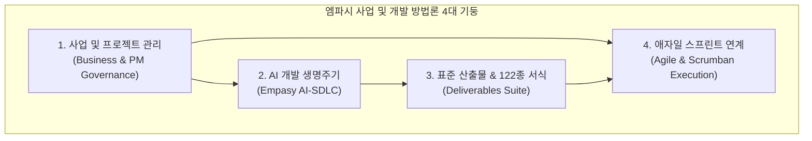
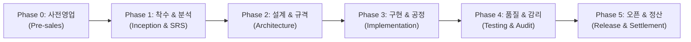

# 엠파시 사업 및 개발 방법론 종합 포털

**엠파시 사업 및 개발 방법론 (Empasy Business & Development Methodology)**은 소프트웨어 사업의 출발점인 **제안요청서(RFP) 분석 및 사전영업(Pre-sales)**부터 **계약 체결, 착수, 명세 우선 아키텍처 설계, 에이전트 협업 구현, 품질 검증 및 감리, 상용 오픈, 최종 검수 서명, 잔금 회수 및 1년 무상 하자보수**에 이르는 전 생애주기를 체계화한 전사 표준 엔터프라이즈 사업 운영 및 개발 방법론입니다.

본 포털은 회사 경영진, 영업대표, 총괄PM, 아키텍트, 개발자, QA 엔지니어, 경영지원 부서, 그리고 고객사(발주처) 의사결정권자에 이르기까지 프로젝트에 참여하는 모든 이해관계자가 자신의 책임을 명확히 인지하고 즉시 실무에 투입될 수 있도록 구성된 종합 실무 허브입니다.

---

## 1. 방법론 4대 핵심 체계

1. **사업 및 프로젝트 관리 (Business & PM Governance)**:
   - 부실 수주 차단(Go/No-Go), 선금 50% 확보, 4대 서명(Sign-off) 관리, 지체상금 및 외주 위장도급 리스크 차단, 100% 잔금 회수 행정 체계.
2. **AI 개발 생명주기 (Empasy AI-SDLC)**:
   - 기획부터 배포까지 5단계(요구사항 구체화 ➔ 명세 우선 아키텍처 ➔ 에이전트 협업 구현 ➔ 4단계 회귀 검증 ➔ 무인 배포) 엔지니어링 표준.
3. **표준 산출물 & 122종 실전 문서 스위트 (Deliverables Suite)**:
   - 공공기관, 금융권, 대기업 감사를 무결함으로 통과할 수 있는 122종의 오피스(Word, PPT, Excel, PDF) 및 마크다운 원본 템플릿.
4. **애자일 스프린트 연계 (Agile & Scrumban Execution)**:
   - 거시적 마일스톤(WBS)을 일상적인 1~2주 스프린트로 세분화하고, Git Flow 및 이슈 트래킹 기반으로 매일 유기적으로 구동되는 실행 문화.

---

## 2. 8대 핵심 역할별 원클릭 퀵 점프 매트릭스

자신의 역할에 맞추어 필수 가이드와 양식을 즉시 확인하십시오.

| 역할 | 담당 직무 | 필수 확인 가이드 | 작성 및 관리 필수 서식 (122종 템플릿) |
| :--- | :--- | :--- | :--- |
| **영업 / 사업대표** | 수주 타당성 검토, RFP 분석, 견적 산출, 계약 체결, 잔금 회수 | [사전영업 플레이북](./presales-ai-playbook.md) [라이프사이클 총괄](./enterprise-project-lifecycle.md) | NDA, Go/No-Go 심의표, TCO 원가계산서, 표준계약서, 기성/준공 대금청구 공문 |
| **총괄 PM / PO** | 일정 통제(WBS), 마일스톤, 4대 서명 확보, 변경 통제, 감리 대응 | [28대 실행 가이드(SOP)](./enterprise-action-items-guide.md) [표준 문서 체계 가이드](./enterprise-business-documents.md) | 사업수행계획서, WBS 마스터, Scope Freeze 합의서, 주간/월간보고, CR Form, 최종 검수확인서 |
| **시스템 아키텍트** | 시스템 구조 설계, 네트워크/망분리, 표준 DDL/API 규격 확정 | [명세 우선 아키텍처 가이드](./ai-sdlc-02-architecture.md) [AI-SDLC 총괄](./ai-driven-development.md) | 시스템 아키텍처 설계서(SAD), 개발 표준 정의서, 개발 환경 정의서, 컴포넌트 설계서 |
| **백엔드 / 프론트 개발** | 에이전트 협업 코딩, 인터페이스 구현, 단위 테스트, 무인 빌드 | [에이전트 협업 구현 가이드](./ai-sdlc-03-implementation.md) [실전 프롬프트 치트시트](./ai-sdlc-prompt-recipes.md) | 테이블 정의서(ERD), Canonical API 명세서, 단위 테스트 시나리오 및 디버깅리스트 |
| **QA / 테스트 엔지니어** | 4단계 피라미드 테스트, BDD 검증, 시큐어코딩 진단, UAT 검증 | [테스트 자동화 가이드](./ai-sdlc-04-testing.md) [기획 및 요구사항 가이드](./ai-sdlc-01-requirements.md) | 통합 테스트 계획서/시나리오, SW 개발보안 49개 점검표, 사용자 인수 테스트(UAT) 확인서 |
| **DevOps / 보안 관리** | 인프라 구성, CI/CD 무인 배포, 카나리 롤아웃, 보안 침해사고 대응 | [코드 검토 및 배포 가이드](./ai-sdlc-05-review-deploy.md) [표준 문서 체계 가이드](./enterprise-business-documents.md) | 시스템 배포 및 롤백 런북, 컷오버 이행계획서, 시스템 설치계획서, 개인정보 유출 신고서 |
| **경영지원 / 법무** | 입찰 서류, 선금/계약 보증보험 발행, 하도급 승인, 외주/프리랜서 계약 | [표준 문서 체계 가이드](./enterprise-business-documents.md) [서식 다운로드 센터](./enterprise-document-templates.md) | 선금 신청서, 하도급 사전승인 신청서, 외주 도급계약서, 프리랜서 용역계약서 |
| **발주처 / 고객사 현업** | 요구사항 확정, 중간 점검, UAT 인수 검사, 최종 준공 검사 | [라이프사이클 총괄](./enterprise-project-lifecycle.md) [표준 문서 체계 가이드](./enterprise-business-documents.md) | Scope Freeze 합의서, 화면설계 승인서, UAT 확인서, 최종 검수 완료 확인서 및 인수증 |

---

## 3. 사업 전 주기 6단계 라이프사이클 로드맵

### [Phase 0] 사전영업 및 제안 지원 (Pre-sales)
* **목표**: 부실 수주를 원천 차단하고 수주 성공률과 마진율을 극대화합니다.
* **핵심 활동**: Go/No-Go 심의(70점 기준), NDA 체결, RFP 요구사항 분해, 3개년 TCO 원가 계산, 기술 제안서 작성, PoC 실증, 심사위원 Q&A 방어.
* **바로가기**: [영업 지원 및 제안 단계 실무 플레이북](./presales-ai-playbook.md)

### [Phase 1] 프로젝트 착수 및 요구사항 분석 (Inception & Analysis)
* **목표**: 과업 범위를 동결하고 초기 자금을 안전하게 확보합니다.
* **핵심 활동**: 착수계 및 사업수행계획서 제출, 착수보고회, 선금(30~50%) 신청 및 보증보험, 하도급 사전승인, SRS v1.0 및 RTM 확정, **과업 범위 확정 합의서(Scope Freeze Sign-off)**.
* **바로가기**: [01단계 기획 및 요구사항 구체화 실무 가이드](./ai-sdlc-01-requirements.md)

### [Phase 2] 명세 우선 아키텍처 및 상세 설계 (Design & Spec)
* **목표**: 코딩 시작 전 데이터 모델과 API 계약을 확정하여 프론트-백엔드 병목을 제거합니다.
* **핵심 활동**: 화면 UI/UX 상세 스토리보드, 메뉴 정보구조도(IA), 시스템 아키텍처(SAD), PostgreSQL 표준 DDL, Canonical API 명세서, **화면 UI 설계 승인서(Design Freeze Sign-off)**.
* **바로가기**: [02단계 명세 우선 아키텍처 및 DDL/API 설계 가이드](./ai-sdlc-02-architecture.md)

### [Phase 3] AI 협업 코딩 및 공정 통제 (Implementation & Control)
* **목표**: 계획 대비 실적 공정률을 엄격히 통제하고 사양 변경을 공식적으로 제어합니다.
* **핵심 활동**: 주간/월간 진척 보고, WBS 마스터 및 마일스톤 추적, 비용 관리대장, 요구사항 변경 통제(CR Form), 기성금(중도금 40%) 검수 신청.
* **바로가기**: [03단계 에이전트 협업 코딩 및 자율 구현 가이드](./ai-sdlc-03-implementation.md)

### [Phase 4] 품질 검증, 보안 및 감리 대응 (Testing & Audit)
* **목표**: 공인 감리 적격 판정을 획득하고 고객사의 공식 인수 서명을 이끌어냅니다.
* **핵심 활동**: 단위/통합 테스트 계획 및 시나리오 수행, 결함 추적 디버깅리스트, 행안부 SW 개발보안 49개 점검, 오픈소스(OSS) 라이선스 검증, 3자 감리 지적사항 조치, **사용자 인수 테스트(UAT Sign-off)**.
* **바로가기**: [04단계 테스트 자동화 및 4단계 오류 자동 수정 가이드](./ai-sdlc-04-testing.md)

### [Phase 5] 시스템 오픈, 최종 검수 및 정산 (Release & Settlement)
* **목표**: 무중단 컷오버를 완수하고 최종 잔금(30%)을 100% 회수하며 1년 무상 보증을 개시합니다.
* **핵심 활동**: 컷오버 배포 계획서 및 롤백 런북, 데이터 이관 대사표(오차 0원), 사용자/운영자 매뉴얼, 교육훈련 실시, **최종 검수 완료 확인서(Acceptance Sign-off)**, 준공 대금 청구 공문, 하자보수보증보험증권 발행, 유지보수 SLA 협약.
* **바로가기**: [05단계 코드 검토 및 무인 배포 가이드](./ai-sdlc-05-review-deploy.md)

---

## 4. 공식 산출물 및 서식 다운로드 센터 (122종)

프로젝트 현장에서 즉시 편집하여 사용할 수 있는 122종의 오피스 원본 서식과 마크다운 템플릿을 제공합니다.

::: tip 122종 통합 다운로드 센터 안내
* **[표준 문서 양식 통합 다운로드 센터 바로가기](./enterprise-document-templates.md)**
* **제공 패키지 옵션**:
  1. **전체 통합 마스터팩 (`Empasy_Total_Master_Pack.zip`, 약 51.6 MB)**: 엠파시 표준 서식 46종 + 실전 PM Suite 76종 등 전 122종 총괄 패키지
  2. **실전 프로젝트 관리 스위트 (`Empasy_PM_Suite_Templates.zip`, 약 50.4 MB)**: PMBOK 기반 76종 실무 서식 및 관리자 교육 교재 전용팩
  3. **핵심 표준 서식팩 (`Empasy_Methodology_All_Templates.zip`, 약 925 KB)**: 단계별 계약·행정 46종 초경량 고속 다운로드팩
:::

---

## 5. 단계별 실행 항목 가이드 (28대 Action Items SOP)

프로젝트 실무자가 단계마다 '무엇을, 어떤 순서로, 어떤 도구로 실행하고, 어떻게 통과 판정하는지'를 명시한 표준 운영 절차서입니다.

* **[단계별 실행 항목 및 실무 실행 가이드 (SOP) 전문 보기](./enterprise-action-items-guide.md)**
  - 1단계(사전영업): A1.0 ~ A1.6 (7개 실행 항목)
  - 2단계(착수/분석): A2.1 ~ A2.5 (5개 실행 항목)
  - 3단계(설계/규격): A3.1 ~ A3.4 (4개 실행 항목)
  - 4단계(구현/개발): A4.1 ~ A4.4 (4개 실행 항목)
  - 5단계(품질/감리): A5.1 ~ A5.4 (4개 실행 항목)
  - 6단계(배포/정산): A6.1 ~ A6.4 (4개 실행 항목)

---

## 6. 애자일 프로세스 및 공학 워크플로우와의 연계

본 사업 방법론의 거시적 마일스톤(WBS)을 일상적인 개발팀 단위에서 매주 기동하기 위한 구체적인 스프린트 운영 및 엔지니어링 문화는 독립된 **[애자일 프로세스](/agile/)** 메뉴를 통해 관리됩니다:

* **[애자일 & 스크럼반 운영](/agile/scrumban)**: 스크럼반 하이브리드 보드 운영, WIP 제한, 데일리 스크럼, 스토리 포인트 산정
* **[개발 공학 워크플로우](/agile/gitFlow)**: Git Flow 브랜치 모델, Git 커밋 로그 컨벤션, 이슈 작성 규칙
* **[방법론 비교 및 용어사전](/agile/xp_scrum_kanban)**: XP, 스크럼, 칸반 비교 및 애자일 표준 용어집
